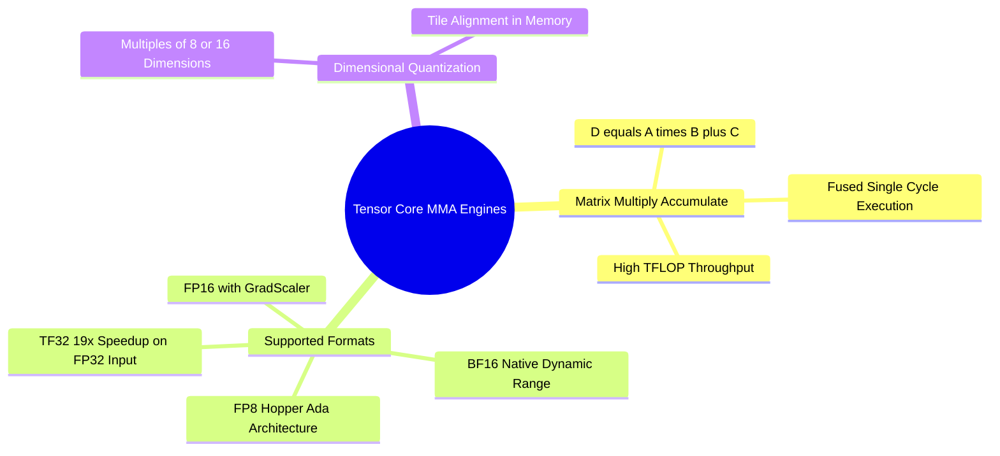

## 14.2. 4th-Generation Tensor Cores and Accelerated Matrix Arithmetic
```text
File: SynPath-3D AI Systems Knowledge System/14. GPU Hardware Architecture and CUDA Mechanics/14.2. 4th-Generation Tensor Cores and Accelerated Matrix Arithmetic.md
Tags: #hardware/tensor-cores #cuda/mma #performance
```

### 1. Concept Definition & Mechanics
A **Tensor Core** is an execution unit that executes fused matrix-multiply-accumulate operations in hardware:
$$\mathbf{D} = \mathbf{A} \times \mathbf{B} + \mathbf{C}$$
In a single clock cycle, a Tensor Core performs a matrix multiply over $4\times4$, $8\times8$, or $16\times16$ matrix tiles.



### 2. Peak Hardware Throughput Comparison (RTX 6000 Ada)
* **Standard FP32 CUDA Cores**: $\approx 91.1\text{ TFLOPs}$
* **Tensor Core TF32 (TensorFloat-32)**: $\approx 182.2\text{ TFLOPs}$ ($2\times$ acceleration)
* **Tensor Core FP16 / BF16**: $\approx 364.4\text{ TFLOPs}$ ($4\times$ acceleration)
* **Tensor Core FP8**: $\approx 728.8\text{ TFLOPs}$ ($8\times$ acceleration)

To activate Tensor Cores, matrix dimensions ($M, K, N$) in linear layers should be **multiples of 8 or 16**. Projections using dimensions like $d=255$ fall back to slower CUDA core execution paths; setting $d=256$ activates full Tensor Core hardware acceleration.