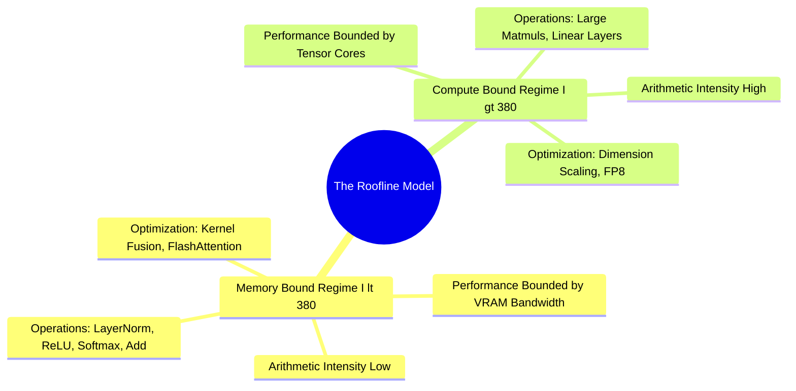

## 14.3. Compute-Bound versus Memory-Bound Workloads: The Roofline Model
```text
File: SynPath-3D AI Systems Knowledge System/14. GPU Hardware Architecture and CUDA Mechanics/14.3. Compute Bound versus Memory Bound Workloads The Roofline Model.md
Tags: #performance/roofline #hardware/profiling #systems
```

### 1. Concept Definition & Operational Arithmetic Intensity
The **Roofline Model (Williams, Waterman, Patterson, 2009)** characterizes whether a workload is bound by GPU raw compute throughput or memory bandwidth:
$$\text{Arithmetic Intensity } (I) = \frac{\text{FLOPs Executed}}{\text{Bytes Transferred from VRAM}} \quad \left( \frac{\text{FLOPs}}{\text{Byte}} \right)$$

On the RTX 6000 Ada:
$$\text{Peak Compute } (P_{\text{peak}}) \approx 364.4\text{ TFLOPs (BF16)}, \quad \text{Peak Bandwidth } (B_{\text{peak}}) \approx 960\text{ GB/s}$$
$$\text{The Knee Point } (I^*) = \frac{P_{\text{peak}}}{B_{\text{peak}}} = \frac{364.4 \times 10^{12}\text{ FLOPs/s}}{960 \times 10^9\text{ Bytes/s}} \approx \mathbf{379.6\text{ FLOPs/Byte}}$$



```text
The Roofline Model Curve:
Attainable Performance (TFLOPs)
   ▲
364│                             ╭────────────────────────── Compute-Bound Ceiling
   │                            ╱  (Attainable = 364 TFLOPs)
   │                           ╱
   │                          ╱
   │  Memory-Bound Slope     ╱
   │  (Performance = I · B) ╱
   │                       ╱
  0└───────────────────────┴──────────────────────────────► Arithmetic Intensity (FLOPs/Byte)
   0                      I* ≈ 380
```

### 2. Operational Profiles in SynPath-3D
* **Memory-Bound Operations ($I \ll I^*$ )**: Element-wise additions, LayerNorm, Dropout, SiLU activations, and coordinate distance evaluations ($\mathbf{X}_i - \mathbf{X}_j$). Moving data across the internal bus takes longer than performing the arithmetic.
* **Compute-Bound Operations ($I \ge I^*$)**: Dense matrix multiplications, such as the 75,000-synthon tied dot-product scoring head ($[64 \times 256] \times [256 \times 75000]$). Once loaded into cache, data is reused across thousands of arithmetic operations, achieving peak Tensor Core utilization.

---

# 15. GPU VRAM Memory Anatomy and OOM Diagnostics