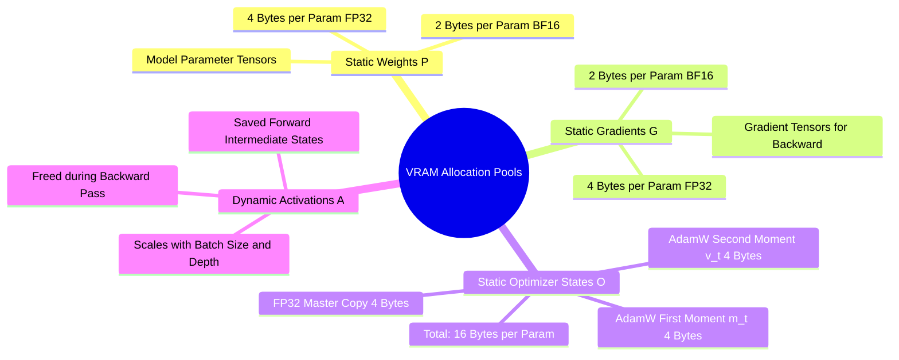

## 15.1. The Four VRAM Consumers: Parameters, Gradients, Optimizer, Activations
```text
File: SynPath-3D AI Systems Knowledge System/15. GPU VRAM Memory Anatomy and OOM Diagnostics/15.1. The Four VRAM Consumers Parameters Gradients Optimizer Activations.md
Tags: #memory/vram-breakdown #systems/sizing #deep-learning
```

### 1. Systematic Breakdown
GPU memory allocated during training falls into four primary pools:



Let a model have $P$ trainable parameters:
1. **Model Parameters**: Memory to store weights.
   * In full `FP32`: $M_{\text{params}} = 4 \times P\text{ bytes}$.
   * In mixed-precision `BF16`: $M_{\text{params}} = 2 \times P\text{ bytes}$.
2. **Gradients**: Memory to store $\nabla_{\mathbf{W}}\mathcal{L}$ for each parameter.
   * In `FP32`: $M_{\text{grads}} = 4 \times P\text{ bytes}$.
   * In `BF16`: $M_{\text{grads}} = 2 \times P\text{ bytes}$.
3. **Optimizer States (AdamW)**:
   AdamW tracks two moment vectors per parameter, maintained in full `FP32` precision to avoid underflow:
   * First moment $\mathbf{m}_t$: $4 \times P\text{ bytes}$.
   * Second moment $\mathbf{v}_t$: $4 \times P\text{ bytes}$.
   * When training in mixed precision, AdamW also maintains an `FP32` master copy of the weights ($4 \times P\text{ bytes}$) to accumulate small gradient steps without quantization error.
   $$\text{Total AdamW Memory} = (4 + 4 + 4 + 4) \times P = \mathbf{16 \times P\text{ bytes}}$$
4. **Activations**: Intermediate tensors saved by the forward pass for backward autodiff. This scales with batch size $B$, sequence length / atom count $N$, layer count $L$, and hidden dimension $D$:
   $$M_{\text{activations}} \propto \mathcal{O}(B \cdot N \cdot L \cdot D)$$