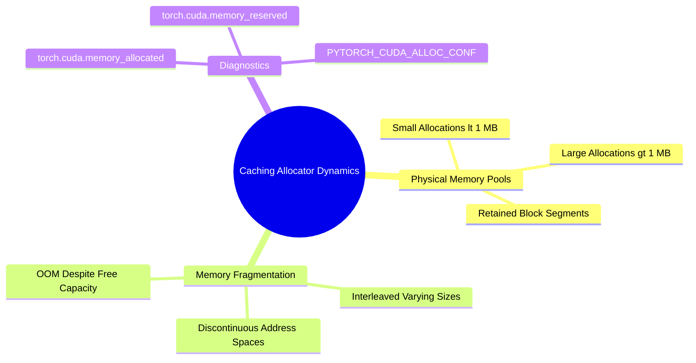

## 15.3. CUDA Memory Allocator Mechanics, Fragmentation, and OOM Debugging
```text
File: SynPath-3D AI Systems Knowledge System/15. GPU VRAM Memory Anatomy and OOM Diagnostics/15.3. CUDA Memory Allocator Mechanics Fragmentation and OOM Debugging.md
Tags: #memory/caching-allocator #debugging/oom #systems
```

### 1. The PyTorch Caching Allocator
Calling `cudaMalloc` and `cudaFree` directly incurs synchronization penalties across the host CPU. To minimize this overhead, PyTorch uses an internal **Caching Allocator**:
1. When memory is freed in Python (e.g., intermediate tensors deleted at the end of a forward step), PyTorch does not immediately return the physical VRAM to the operating system kernel.
2. It retains the allocated memory in a private pool for reuse by subsequent tensors of matching shape.



### 2. Physical Memory Fragmentation
If a training loop alternates between small variable-sized allocations (e.g., variable pocket graphs of varying atom counts) and large allocations, the allocator's memory blocks can become **fragmented**.

```text
Visualizing VRAM Memory Fragmentation:
Physical VRAM Address Space:
┌────────┬────────┬────────┬────────┬────────┬────────┬────────┐
│ BlockA │ FREE   │ BlockB │ FREE   │ BlockC │ FREE   │ BlockD │
│ 500 MB │ 300 MB │ 500 MB │ 400 MB │ 500 MB │ 300 MB │ 500 MB │
└────────┴────────┴────────┴────────┴────────┴────────┴────────┘
Total Free Memory: 300 + 400 + 300 = 1,000 MB (1.0 GB)
Attempting to allocate a single 800 MB contiguous activation tensor:
CRASH: torch.cuda.OutOfMemoryError!
(No single contiguous block of 800 MB exists, despite 1.0 GB total free memory).
```

### 3. Systematic OOM Debugging Protocol
When an Out-Of-Memory error occurs:
1. **Differentiate True OOM from Fragmentation OOM**:
   ```python
   allocated = torch.cuda.memory_allocated() / (1024**3)
   reserved = torch.cuda.memory_reserved() / (1024**3)
   print(f"Allocated: {allocated:.2f} GB | Reserved: {reserved:.2f} GB")
   ```
   * If `Allocated ≈ Reserved ≈ 96 GB`: **True OOM**. Batch size is too large or too many activations are stored.
   * If `Allocated (35 GB) << Reserved (94 GB)`: **Fragmentation OOM**. Memory is broken into non-contiguous blocks.
2. **Mitigate Fragmentation via Environment Flags**:
   Set PyTorch's memory allocator configuration to use memory splitting:
   ```bash
   export PYTORCH_CUDA_ALLOC_CONF=expandable_segments:True
   ```
   This allows PyTorch to allocate dynamic virtual memory addresses that stitch discontinuous physical blocks together without reallocation.

---

# 16. Numerical Precision: FP32, TF32, FP16, BF16, and FP8