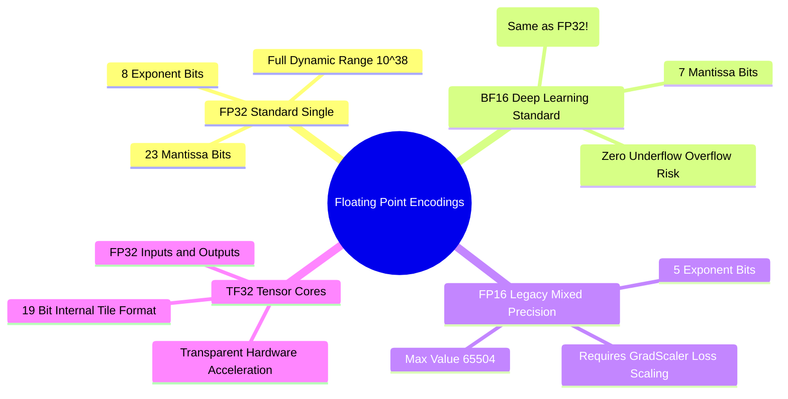

## 16.1. Bit-Level IEEE 754 Floating-Point Anatomy and Dynamic Range
```text
File: SynPath-3D AI Systems Knowledge System/16. Numerical Precision: FP32, TF32, FP16, BF16, and FP8/16.1. Bit Level IEEE 754 Floating Point Anatomy and Dynamic Range.md
Tags: #precision/floating-point #math/ieee754 #hardware
```

### 1. Concept Definition & Bit Allocation
Digital floating-point formats represent real numbers in scientific notation:
$$x = (-1)^{\text{sign}} \times 2^{\text{exponent} - \text{bias}} \times \left( 1 + \frac{\text{mantissa}}{2^{M}} \right)$$
* **Sign Bit**: Determines whether the value is positive or negative.
* **Exponent Bits ($E$)**: Dictates the **dynamic range** (the smallest and largest representable numbers before underflow or overflow).
* **Mantissa / Fraction Bits ($M$)**: Dictates the **precision** (the number of significant decimal digits preserved).

```text
Bit Layout Comparison Across Precision Formats:
Format       Total  Sign  Exponent  Mantissa  Dynamic Range (Magnitude)           Precision
─────────────────────────────────────────────────────────────────────────────────────────────
FP32 (IEEE)   32     1       8         23     10⁻³⁸ to 10⁺³⁸                      ~7 digits
TF32 (Nvidia) 19     1       8         10     10⁻³⁸ to 10⁺³⁸ (Matches FP32 Range) ~3 digits
BF16 (Google) 16     1       8          7     10⁻³⁸ to 10⁺³⁸ (Matches FP32 Range) ~2 digits
FP16 (IEEE)   16     1       5         10     10⁻⁵  to 65,504 (Tiny Range!)       ~3 digits
FP8 (E4M3)     8     1       4          3     10⁻⁴  to 448                        ~1 digit
FP8 (E5M2)     8     1       5          2     10⁻⁵  to 57,344                     ~1 digit
```

