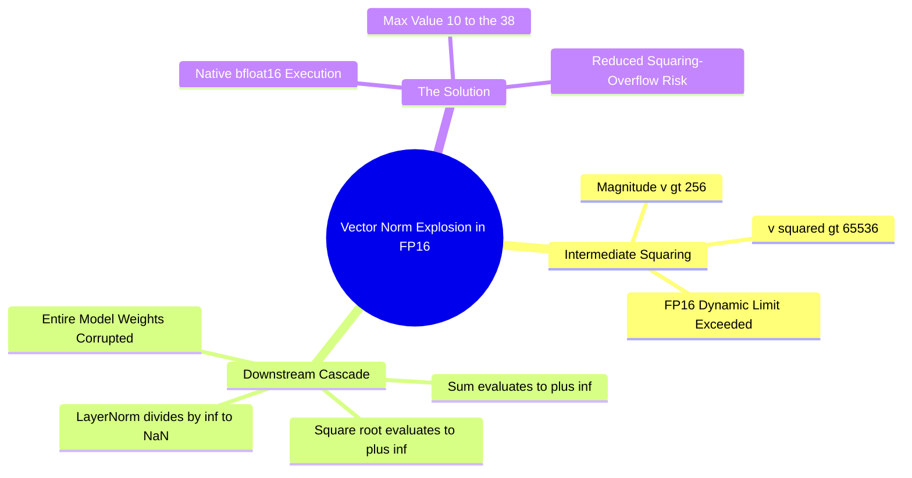

## 16.3. Vector Norm Divergence and FP16 Overflows in Geometric GNNs
```text
File: SynPath-3D AI Systems Knowledge System/16. Numerical Precision: FP32, TF32, FP16, BF16, and FP8/16.3. Vector Norm Divergence and FP16 Overflows in Geometric GNNs.md
Tags: #precision/overflow #geometry/vector-norms #debugging
```

### 1. The Vector Norm Squaring Trap
In SE(3)-equivariant networks (such as PaiNN, Equiformer, or GVP), vector features $\vec{v}_i \in \mathbb{R}^{3 \times d}$ are converted into invariant scalar channels by computing Euclidean norms:
$$\|\vec{v}_i\| = \sqrt{\sum_{k=1}^3 v_{ik}^2}$$
In standard implementations, computing the Euclidean norm squares intermediate values before taking the square root.

In `fp16`, the maximum value is $65,504$. If an equivariant vector channel develops a feature magnitude $\|\vec{v}\| > 256.0$:
$$v_{ik}^2 > 256.0^2 = \mathbf{65,536} > 65,504 \implies \text{Overflows to } \mathbf{+inf}!$$
Taking the square root of `+inf` yields `+inf`, and downstream normalization layers emit `NaN`. 

This is the primary cause of training divergence when running geometric graph neural networks in `fp16`.



### 2. The BF16 Solution
Under `bfloat16`, the maximum representable value is $\approx 3.39 \times 10^{38}$. A vector component near (10^{19}) approaches the BF16 squaring boundary. Practical geometric pipelines still need FP32-sensitive reductions, finite-value checks, stable normalization and gradient monitoring.

---

# 17. Performance Profiling, Memory Bandwidth, and Kernels