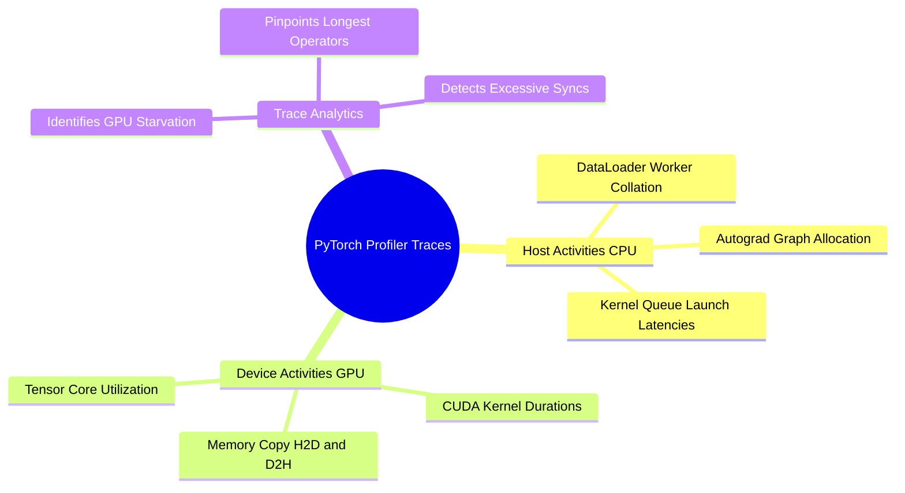

## 17.1. PyTorch Profiler: Tracing GPU Kernels, CPU Overhead, and CUDA Graphs
```text
File: SynPath-3D AI Systems Knowledge System/17. Performance Profiling, Memory Bandwidth, and Kernels/17.1. PyTorch Profiler Tracing GPU Kernels CPU Overhead and CUDA Graphs.md
Tags: #profiling/pytorch #cuda/profiler #systems
```

### 1. Concept Definition & Profiling Workflow
The **PyTorch Profiler (`torch.profiler`)** is a hardware instrumentation tool that records runtime execution across both CPU host threads and GPU device streams, outputting timeline traces viewable in Chrome (`chrome://tracing`) or TensorBoard.

A profiler trace resolves three core questions:
1. Is the GPU idle while waiting for CPU operations? (CPU-bound data loading).
2. Which kernels consume the largest fraction of execution time?
3. What is the ratio between memory transfer time and compute time?



### 2. Production Profiling Harness
In `syntree/utils/profiler.py`:

```python
import torch
from torch.profiler import profile, record_function, ProfilerActivity, schedule

my_schedule = schedule(
    skip_first=5,   # Let warmup complete
    wait=2,         # Profiler idle
    warmup=2,       # Profiler warm up
    active=3,       # Active recording window (traces 3 steps)
    repeat=1
)

with profile(
    activities=[ProfilerActivity.CPU, ProfilerActivity.CUDA],
    schedule=my_schedule,
    on_trace_ready=torch.profiler.tensorboard_trace_handler('./logs/profiler_trace'),
    record_shapes=True,
    profile_memory=True, # Logs tensor memory allocations
    with_stack=True      # Links CUDA kernels to Python source code lines
) as prof:
    for step, batch in enumerate(dataloader):
        # Annotate custom ranges for clear timeline visualization
        with record_function("forward_pass"):
            pred = model(batch)
            loss = criterion(pred, batch.target)
            
        with record_function("backward_pass"):
            loss.backward()
            
        with record_function("optimizer_step"):
            optimizer.step()
            optimizer.zero_grad(set_to_none=True)
            
        prof.step() # Advance profiler schedule
```