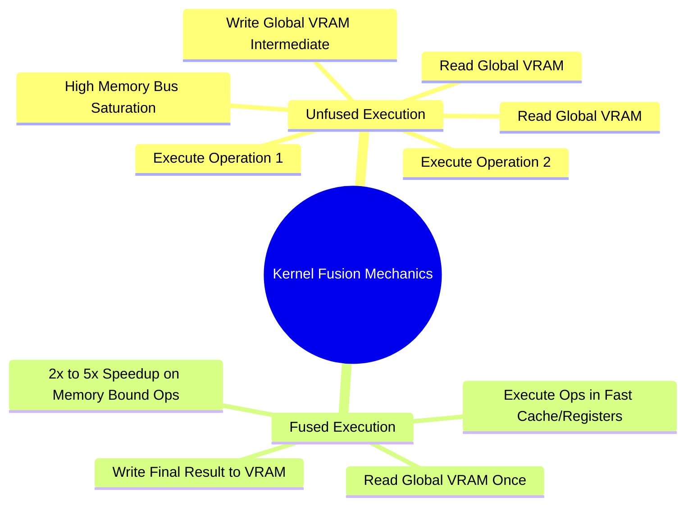

## 17.2. Fused Operations, FlashAttention Tiling, and Memory Bandwidth Limits
```text
File: SynPath-3D AI Systems Knowledge System/17. Performance Profiling, Memory Bandwidth, and Kernels/17.2. Fused Operations FlashAttention Tiling and Memory Bandwidth Limits.md
Tags: #performance/flashattention #cuda/kernel-fusion #memory-bandwidth
```

### 1. Kernel Launch Latency and Kernel Fusion
Every distinct PyTorch operation (e.g., `y = torch.relu(x) + b`) launches an independent CUDA kernel:
1. The CPU dispatches `Kernel_ReLU`.
2. The GPU reads `x` from global VRAM ($960\text{ GB/s}$), applies ReLU on the SM, and writes the result back to global VRAM.
3. The CPU dispatches `Kernel_Add`.
4. The GPU reads the intermediate result from VRAM, reads `b`, applies addition, and writes the output back to VRAM.

Executing operations as separate kernels wastes memory bandwidth reading and writing intermediate tensors to global VRAM. 

**Kernel Fusion** compiles multiple operations into a single GPU kernel. The intermediate values remain in the SM's high-speed local registers / Shared Memory ($19\text{ TB/s}$ bandwidth), eliminating global VRAM round-trips.



### 2. FlashAttention-2 (Dao, 2023)
Standard multi-head attention writes the full $N \times M$ attention matrix to global VRAM:
$$\mathbf{S} = \frac{\mathbf{Q}\mathbf{K}^T}{\sqrt{d_k}} \in \mathbb{R}^{B \times H \times N \times M}$$
$$\mathbf{W} = \text{Softmax}(\mathbf{S}) \in \mathbb{R}^{B \times H \times N \times M} \quad (\text{Materialized in VRAM!})$$
For long sequences, storing $\mathbf{W}$ in VRAM consumes $\mathcal{O}(N^2)$ memory and is bound by memory bandwidth.

**FlashAttention** computes attention without materializing the full $N \times M$ matrix in global VRAM:
1. **SRAM Tiling**: It splits $\mathbf{Q}$, $\mathbf{K}$, and $\mathbf{V}$ into small blocks that fit entirely within the SM's fast on-chip Shared Memory ($100\text{ KB}$ per SM).
2. **Online Softmax (Milakov & Gimelshein, 2018)**: It computes the softmax normalization dynamically across blocks by tracking running row maximums $m(x)$ and normalizers $l(x)$:
   $$m_{\text{new}} = \max(m_{\text{old}}, \, m_{\text{block}}), \quad l_{\text{new}} = l_{\text{old}} e^{m_{\text{old}} - m_{\text{new}}} + l_{\text{block}} e^{m_{\text{block}} - m_{\text{new}}}$$
3. The full $N \times M$ attention matrix is never written to global VRAM, reducing memory footprint from $\mathcal{O}(N^2)$ to $\mathcal{O}(N)$ while providing a **$2\times\text{ to }4\times$ speedup**.

---

# 18. Modern Scaling, Compiling, and Distributed Training