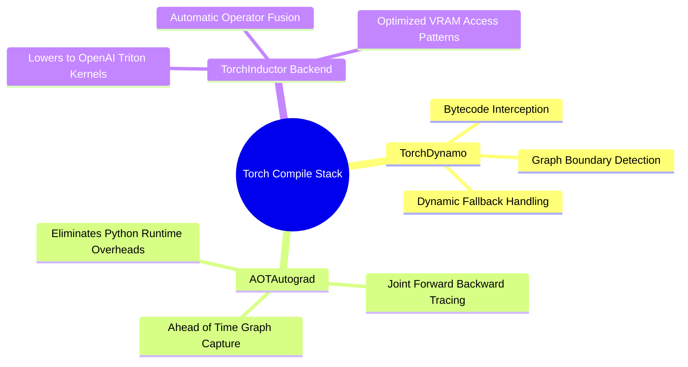

## 18.1. Accelerating Message Passing with Torch Compile and Inductor
```text
File: SynPath-3D AI Systems Knowledge System/18. Modern Scaling, Compiling, and Distributed Training/18.1. Accelerating Message Passing with Torch Compile and Inductor.md
Tags: #pytorch/compile #performance/inductor #optimization
```

### 1. Concept Definition & Compiler Mechanics
Introduced in PyTorch 2.0, `torch.compile` is a just-in-time (JIT) compiler that transforms eager-mode PyTorch code into optimized C++ / CUDA kernels without altering model code.

It operates through three subsystems:
1. **TorchDynamo**: Uses a Python Frame Evaluation API to intercept Python bytecode before execution. It isolates straight-line tensor operations into computational subgraphs while allowing arbitrary Python control flow (loops, conditions) to execute natively without breaking graph capture.
2. **AOTAutograd (Ahead-Of-Time Autograd)**: Traces through both the forward pass and its backward autodiff graph *prior to execution*, generating a joint static computation graph for optimization.
3. **TorchInductor**: The backend compiler that lowers the traced computational graph into optimized GPU kernels using **OpenAI Triton**. Inductor performs horizontal and vertical kernel fusion, memory layout optimizations, and dead-code elimination.



### 2. Practical Application to SynPath-3D
Equivariant message-passing layers execute many small, sequential tensor operations (RBF expansion, cosine cutoffs, gating multiplications, coordinate subtractions). In eager mode, each operation incurs a separate kernel launch latency ($\approx 3\text{--}5\text{ \mu s}$ per launch on the CPU host).

Wrapping the backbone with `torch.compile` fuses these small operations into composite Triton kernels:

```python
import torch

# Instantiate the Equiformer backbone
model = EquiformerLightBackbone(d_model=256, num_layers=6)

# Compile using TorchInductor
# mode="reduce-overhead" uses CUDA Graphs to eliminate CPU kernel launch overheads
compiled_model = torch.compile(model, mode="default", fullgraph=False)

# First forward pass incurs compilation latency (~30-60 seconds)
# Subsequent passes run 20% to 40% faster with reduced memory allocations
out = compiled_model(pocket_batch)
```