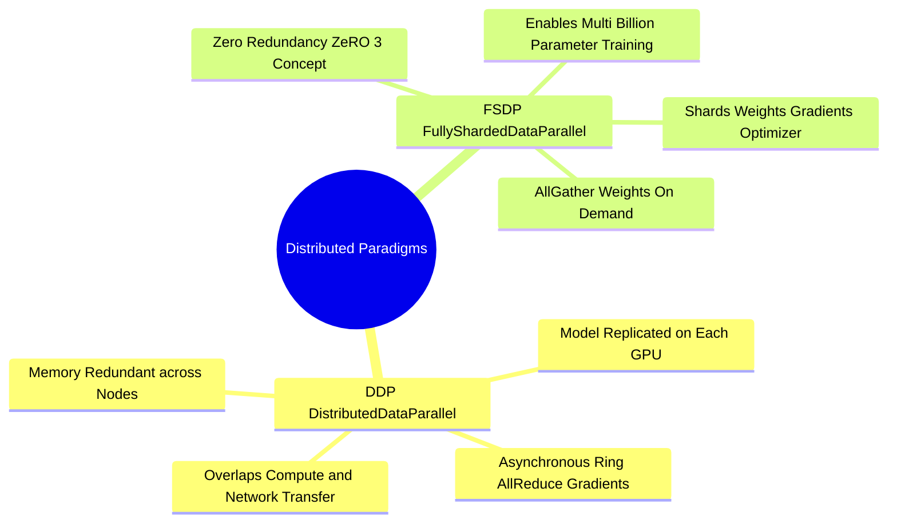

## 18.2. Scaling Beyond a Single GPU: DDP, FSDP, and Sharded Optimizers
```text
File: SynPath-3D AI Systems Knowledge System/18. Modern Scaling, Compiling, and Distributed Training/18.2. Scaling Beyond a Single GPU DDP FSDP and Sharded Optimizers.md
Tags: #distributed/ddp #distributed/fsdp #scaling
```

### 1. Distributed Data Parallel (DDP)
In **Distributed Data Parallel (DDP)**, the model is replicated across $N$ GPUs. Each GPU processes an independent mini-batch of size $B$, yielding an effective batch size of $N \times B$.

Synchronization mechanics:
1. Each GPU runs the forward pass independently on its local mini-batch.
2. During the backward pass, as each layer computes its gradients, DDP asynchronously initiates an **All-Reduce** collective communication operation across GPUs via NCCL:
   $$\mathbf{g}_{\text{synced}} = \frac{1}{N} \sum_{k=1}^N \mathbf{g}_k$$
3. Communication overlaps with computation: gradients for final layers are averaged over the network while earlier layers are still evaluating their backward pass.
4. Each GPU updates its local weights using identical averaged gradients, ensuring model weights remain synchronized.



### 2. Fully Sharded Data Parallel (FSDP / ZeRO-3)
While DDP works well when a model fits within a single GPU, it wastes memory: every GPU stores an identical copy of model parameters, gradients, and optimizer states ($16\text{ bytes per parameter}$).

**FSDP (Fully Sharded Data Parallel)** shards the model across all available GPUs:
* **Optimizer State Sharding**: Each GPU stores only $1/N$ of the AdamW optimizer states.
* **Gradient Sharding**: Each GPU retains only the gradients corresponding to its assigned parameter shard.
* **Parameter Sharding**: Each GPU retains only $1/N$ of the physical model weights. During the forward pass, FSDP executes an all-gather operation to collect missing layer weights on demand, performs the local calculation, and **immediately discards the gathered weights** to free VRAM.

```text
Memory Distribution Comparison (4 GPUs):
DDP:
  GPU 0: [ Full Model W ] [ Full Gradients G ] [ Full Optimizer O ]
  GPU 1: [ Full Model W ] [ Full Gradients G ] [ Full Optimizer O ]
  GPU 2: [ Full Model W ] [ Full Gradients G ] [ Full Optimizer O ]
  GPU 3: [ Full Model W ] [ Full Gradients G ] [ Full Optimizer O ]

FSDP (ZeRO-3):
  GPU 0: [ W / 4 ] [ G / 4 ] [ O / 4 ] ──► Gathers missing weights on demand,
  GPU 1: [ W / 4 ] [ G / 4 ] [ O / 4 ]    then immediately frees them from VRAM!
  GPU 2: [ W / 4 ] [ G / 4 ] [ O / 4 ]
  GPU 3: [ W / 4 ] [ G / 4 ] [ O / 4 ]
```

---

# 19. Empirical Validation, Ablation Design, and Codebase Auditing