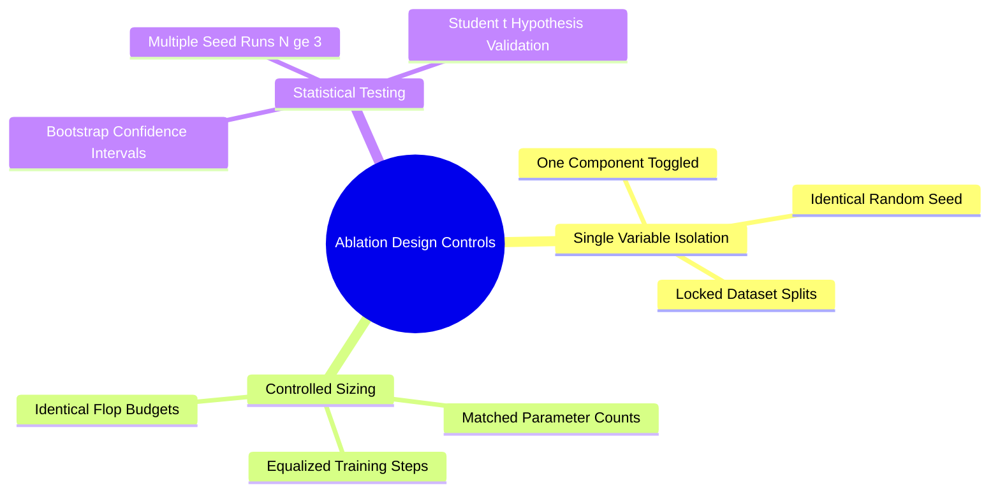

## 19.1. Scientific Ablation Strategy: Proving Component Necessity
```text
File: SynPath-3D AI Systems Knowledge System/19. Empirical Validation, Ablation Design, and Codebase Auditing/19.1. Scientific Ablation Strategy Proving Component Necessity.md
Tags: #research/ablations #methodology #validation
```

### 1. Concept Definition & Rigorous Methodology
An **ablation study** isolates and verifies the causal contribution of individual architectural components. 

To satisfy peer review at top machine learning and computational chemistry venues (NeurIPS, ICLR, *J. Med. Chem.*), ablations must adhere to strict controls:
1. **Isolated Variables**: Only one component is removed or modified per ablation run. All other variables (random seed, training steps, optimizer parameters, learning rate schedule, data splits) remain identical.
2. **Equalized Compute Budgets**: An ablated baseline cannot be trained for fewer steps or with a smaller effective batch size than the full model.
3. **Statistical Significance**: Results must report mean and standard deviation across multiple random seeds ($N \ge 3$) with bootstrap confidence intervals, proving that observed gains do not stem from random variance.



### 2. The SynPath-3D Ablation Suite (ABL-01 Through ABL-05)

```text
The Five Controlled Ablation Experiments:
[ABL-01] Target-Interaction Field (TIF):
  - Setup: Revert TIF conditioning; model grows forward autoregressively from a single seed.
  - Target Metric: Subpocket hit rate in elongated pockets (Length > 15 Å).
  - Hypothesis: TIF distal anchors improve multi-subpocket engagement by ≥ 40%.

[ABL-02] Neural Solvation Field (ENSF):
  - Setup: Set Δμ_excess ≡ 0 (train in vacuum).
  - Target Metric: Pearson R² against experimental binding affinity (PDBbind 2024).
  - Hypothesis: Water displacement free energy improves affinity correlation by ΔR² ≥ 0.20.

[ABL-03] Product of Exponentials (PoE) Kinematics:
  - Setup: Replace PoE Jacobian updates with RDKit post-hoc conformer snapping.
  - Target Metric: PoseBusters v2 steric clash pass rate and internal strain energy.
  - Hypothesis: Analytical Jacobian projections reduce steric clashes by ≥ 50%.

[ABL-04] Coupled Torus Flow Matching:
  - Setup: Replace coupled 𝕋^K flow matching with independent 1D circular von Mises heads.
  - Target Metric: Median angular error on held-out crystal dihedrals.
  - Hypothesis: Coupled flow reduces dihedral prediction error by ≥ 5.0°.

[ABL-05] Sub-Trajectory Balance (SubTB):
  - Setup: Replace SubTB(λ=0.9) with standard global Trajectory Balance (TB).
  - Target Metric: Molecular weight distribution and policy entropy over generation steps.
  - Hypothesis: SubTB prevents length collapse, maintaining mean MW ≥ 350 Da across targets.
```