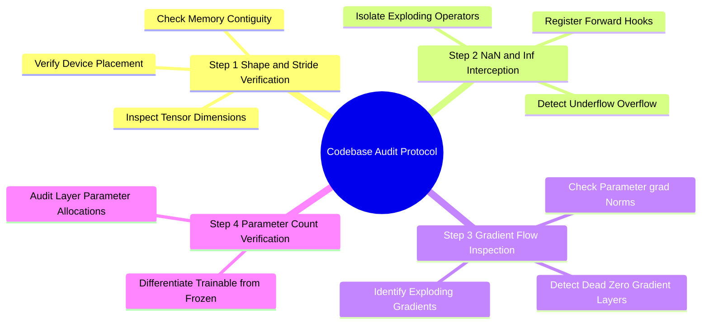

## 19.2. Codebase Auditing Protocol: Inspecting Tensors Without Documentation
```text
File: SynPath-3D AI Systems Knowledge System/19. Empirical Validation, Ablation Design, and Codebase Auditing/19.2. Codebase Auditing Protocol Inspecting Tensors Without Documentation.md
Tags: #debugging/code-audit #tools/inspection #systems
```

### 1. Concept Definition & Auditing Strategy
When inheriting an undocumented research codebase or verifying that an AI agent has not introduced silent bugs, follow this 4-step diagnostic protocol:



### 2. The Diagnostic Toolset

#### Hook 1: Detecting NaN/Inf during the Forward Pass
Attach PyTorch forward hooks to catch numerical bugs at the exact layer where they occur:

```python
def register_nan_hook(model):
    def hook(module, input, output):
        # Inspect outputs (handles tuples or single tensors)
        tensors = [output] if isinstance(output, torch.Tensor) else output
        for idx, t in enumerate(tensors):
            if isinstance(t, torch.Tensor):
                if torch.isnan(t).any() or torch.isinf(t).any():
                    print(f"[ALERT] NaN/Inf detected in module: {module.__class__.__name__} (Output index {idx})")
                    print(f"Shape: {t.shape} | Stride: {t.stride()} | Dtype: {t.dtype}")
                    raise RuntimeError("Aborting execution due to numerical corruption.")
                    
    for name, submodule in model.named_modules():
        submodule.register_forward_hook(hook)
```

#### Hook 2: Inspecting Gradient Norms Across Layers
Identify vanishing or exploding layers by tracking gradient norms:

```python
def audit_gradient_flow(model):
    print("=" * 70)
    print(f"{'Module Layer Name':<45} | {'Weight Shape':<15} | {'Grad Norm':<10}")
    print("=" * 70)
    for name, param in model.named_parameters():
        if param.requires_grad:
            if param.grad is None:
                norm_str = "NONE (DEAD)"
            else:
                norm = param.grad.data.norm(2).item()
                norm_str = f"{norm:.4e}"
            print(f"{name:<45} | {str(list(param.shape)):<15} | {norm_str:<10}")
    print("=" * 70)
```

#### Hook 3: Tracing Intermediate Shapes Dynamically
Use forward pre-hooks to print tensor dimensions without modifying model source code:

```python
def trace_tensor_shapes(model, sample_batch):
    def pre_hook(module, input):
        in_shapes = [list(i.shape) for i in input if isinstance(i, torch.Tensor)]
        print(f"FORWARD: {module.__class__.__name__:<30} Inputs: {in_shapes}")

    hooks = []
    for m in model.modules():
        hooks.append(m.register_forward_pre_hook(pre_hook))
        
    # Execute single forward pass
    with torch.no_grad():
        _ = model(sample_batch)
        
    # Remove hooks
    for h in hooks:
        h.remove()
```

---

# 20. Project-Specific PyTorch Implementation Labs