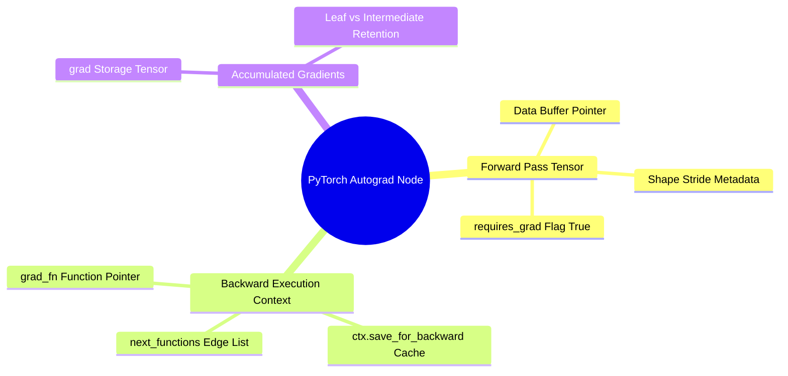

## 2.1. Directed Acyclic Graphs of Tensors and Node History
```text
File: SynPath-3D AI Systems Knowledge System/2. Computational Graphs, Autograd, and Differentiation/2.1. Directed Acyclic Graphs of Tensors and Node History.md
Tags: #pytorch/autograd #math/computational-graphs #internals
```

### 1. Concept Definition & Intuition
PyTorch's automatic differentiation engine (`torch.autograd`) evaluates derivatives dynamically by constructing a **Directed Acyclic Graph (DAG)** of computational operations during the forward pass. Every tensor instance for which `requires_grad=True` acts as a leaf or intermediate node in this graph.

When an operation (such as matrix multiplication, addition, or coordinate distance calculation) transforms one or more tensors, PyTorch:
1. Allocates an output tensor holding the forward evaluation values.
2. Instantiates a private `torch.autograd.Function` object.
3. Assigns this function object to the output tensor's `.grad_fn` attribute.
4. Stores references to the input tensors in the `Function`'s saved context (`ctx.save_for_backward`) if those intermediate states are mathematically required to evaluate the backward chain rule.



### 2. Mathematical Formalism
Let an intermediate tensor $\mathbf{y} \in \mathbb{R}^M$ be computed from input $\mathbf{x} \in \mathbb{R}^N$ through a differentiable mapping $\mathbf{f}: \mathbb{R}^N \to \mathbb{R}^M$. The directional derivative of a scalar loss function $\mathcal{L}$ with respect to $\mathbf{x}$ is defined by the multivariable chain rule:
$$\frac{\partial \mathcal{L}}{\partial x_i} = \sum_{j=1}^M \frac{\partial \mathcal{L}}{\partial y_j} \frac{\partial y_j}{\partial x_i}$$
In matrix notation, this corresponds to the **Vector-Jacobian Product (VJP)**:
$$\nabla_{\mathbf{x}}\mathcal{L} = \mathbf{J}_{\mathbf{f}}(\mathbf{x})^T \nabla_{\mathbf{y}}\mathcal{L}$$
where $\mathbf{J}_{\mathbf{f}}(\mathbf{x}) \in \mathbb{R}^{M \times N}$ is the Jacobian matrix whose elements are $\mathbf{J}_{ji} = \frac{\partial y_j}{\partial x_i}$.

```text
The Autograd Dynamic DAG:
    Tensor X (Leaf) ──────────────────────────┐
    [requires_grad=True, grad_fn=None]        ▼
                                       Node: AddmmBackward0
                                       [ctx.saved_tensors = (W, X)]
    Tensor W (Leaf) ──────────────────────────▲       │
    [requires_grad=True, grad_fn=None]                ▼
                                              Tensor Y (Intermediate)
                                              [grad_fn=<AddmmBackward0>]
                                                      │
                                                      ▼
                                               Node: SiLUBackward0
                                                      │
                                                      ▼
                                              Tensor Z (Intermediate)
                                              [grad_fn=<SiLUBackward0>]
```

### 3. Implementation Blueprint in Project Context
Consider the initial feature projection of a reacting functional handle within `syntree/models/policy.py`:

```python
import torch
import torch.nn as nn

# [Batch Size B=64, Input Features D_in=68] (64 chemical + 4 global features)
handle_features = torch.randn(64, 68, requires_grad=True)

# Weight parameter tensor [Hidden Dim D_out=256, Input D_in=68]
W_h = nn.Parameter(torch.randn(256, 68))
b_h = nn.Parameter(torch.zeros(256))

# Forward pass: y = x @ W.T + b
query_latent = torch.matmul(handle_features, W_h.t()) + b_h
activated_latent = torch.silu(query_latent)

# Inspection of autograd metadata:
print("Leaf Node handle_features grad_fn:", handle_features.grad_fn)  # None (User Leaf)
print("Intermediate query_latent grad_fn:", query_latent.grad_fn)      # <AddBackward0>
print("Activated latent grad_fn:", activated_latent.grad_fn)          # <SiluBackward0>

# Follow the execution graph backward
next_fn = activated_latent.grad_fn.next_functions
print("Next function in backward chain:", next_fn[0][0])               # <AddBackward0>
```

When `.backward()` is called on the terminal scalar loss, the autograd engine traverses this chain in topological reverse order, invoking the backward method associated with each `grad_fn` and accumulating gradients into leaf tensors' `.grad` attributes.