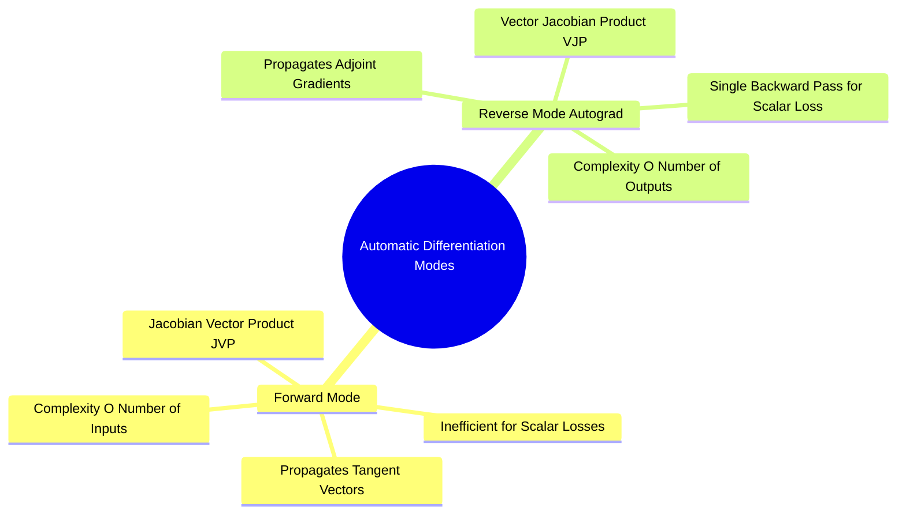

## 2.2. Vector-Jacobian Products and Reverse-Mode Differentiation
```text
File: SynPath-3D AI Systems Knowledge System/2. Computational Graphs, Autograd, and Differentiation/2.2. Vector-Jacobian Products and Reverse-Mode Differentiation.md
Tags: #math/calculus #pytorch/autograd #optimization
```

### 1. Concept Definition & Intuition
Deep learning uses **reverse-mode automatic differentiation** rather than forward-mode automatic differentiation because neural network architectures are asymmetric: they transform millions of input parameters ($\mathbf{W} \in \mathbb{R}^P$, where $P \sim 10^7\text{ to }10^{11}$) into a **single scalar loss** ($\mathcal{L} \in \mathbb{R}^1$).



* **Forward-Mode Differentiation**: Computes Jacobian-Vector Products (JVPs): $\mathbf{J}_{\mathbf{f}}(\mathbf{x})\vec{v}$. Evaluating the complete derivative of a scalar loss with respect to $P$ model parameters requires **$P$ independent forward passes**, which is computationally infeasible when $P \ge 10^6$.
* **Reverse-Mode Differentiation**: Computes Vector-Jacobian Products (VJPs): $\vec{u}^T \mathbf{J}_{\mathbf{f}}(\mathbf{x})$. Evaluating the gradient of a single scalar loss with respect to all $P$ parameters requires **a single backward pass**, running in $\mathcal{O}(1)$ relative to parameter count.

### 2. Mathematical Formalism
Consider an $L$-layer neural network:
$$\mathbf{x}_0 \xrightarrow{\mathbf{f}_1} \mathbf{x}_1 \xrightarrow{\mathbf{f}_2} \mathbf{x}_2 \dots \xrightarrow{\mathbf{f}_L} \mathbf{x}_L = \mathcal{L} \in \mathbb{R}$$
At each layer $l$, the forward evaluation computes:
$$\mathbf{x}_l = \mathbf{f}_l(\mathbf{x}_{l-1}, \mathbf{W}_l)$$
During reverse-mode autodiff, the adjoint state $\vec{\delta}_l = \frac{\partial \mathcal{L}}{\partial \mathbf{x}_l}$ is initialized at the terminal loss node:
$$\vec{\delta}_L = \frac{\partial \mathcal{L}}{\partial \mathcal{L}} = 1.0 \in \mathbb{R}^1$$
The engine then propagates this adjoint backward:
$$\vec{\delta}_{l-1} = \mathbf{J}_{\mathbf{f}_l, \mathbf{x}_{l-1}}^T \vec{\delta}_l$$
The gradient with respect to layer weights $\mathbf{W}_l$ is computed via:
$$\nabla_{\mathbf{W}_l}\mathcal{L} = \mathbf{J}_{\mathbf{f}_l, \mathbf{W}_l}^T \vec{\delta}_l$$

```text
Reverse-Mode Propagation Trace:
Forward:   x₀ ────► [ Layer 1 ] ────► x₁ ────► [ Layer 2 ] ────► x₂ ────► Loss
                         │                          │                      │
Backward:  δ₀ ◄──── [ VJP 1 ]   ◄──── δ₁ ◄──── [ VJP 2 ]   ◄──── δ₂ ◄───── 1.0
                         ▼                          ▼
                   ∇_{W₁} Loss                ∇_{W₂} Loss
```

### 3. Concrete VJP Example: Pairwise Distance Derivative
In our Equiformer pocket backbone (`syntree/models/equivariant_backbone.py`), the layer computes Euclidean distances between all interacting pocket atoms $i$ and $j$:
$$r_{ij} = \|\vec{x}_i - \vec{x}_j\|_2 = \sqrt{\sum_{k=1}^3 (x_{ik} - x_{jk})^2}$$
Let the upstream adjoint from downstream attention layers be $\frac{\partial \mathcal{L}}{\partial r_{ij}} \in \mathbb{R}^1$. The Vector-Jacobian Product evaluating the gradient with respect to atomic coordinates $\vec{x}_i \in \mathbb{R}^3$ is:
$$\frac{\partial \mathcal{L}}{\partial \vec{x}_i} = \frac{\partial \mathcal{L}}{\partial r_{ij}} \frac{\partial r_{ij}}{\partial \vec{x}_i} = \frac{\partial \mathcal{L}}{\partial r_{ij}} \left( \frac{\vec{x}_i - \vec{x}_j}{r_{ij}} \right)$$

```python
# Demonstrating the manual VJP implementation vs PyTorch Autograd
pos_i = torch.tensor([1.0, 2.0, 3.0], requires_grad=True)
pos_j = torch.tensor([4.0, 6.0, 3.0], requires_grad=True)

# Forward pass
diff = pos_i - pos_j
r_ij = torch.norm(diff)  # Length: sqrt(3^2 + 4^2 + 0^2) = 5.0
loss = r_ij ** 2         # Scalar loss

# Autograd backward pass
loss.backward()

# Analytical VJP check: d(r^2)/d(pos_i) = 2 * (pos_i - pos_j) = 2 * [-3, -4, 0] = [-6, -8, 0]
print("Autograd gradient on pos_i:", pos_i.grad) # tensor([-6., -8., 0.])
```