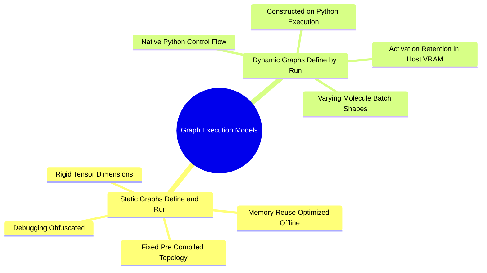

## 2.3. Dynamic Graphs versus Static Intermediate Memory Footprints
```text
File: SynPath-3D AI Systems Knowledge System/2. Computational Graphs, Autograd, and Differentiation/2.3. Dynamic Graphs versus Static Intermediate Memory Footprints.md
Tags: #pytorch/internals #memory/activations #systems
```

### 1. Concept Definition & Intuition
PyTorch uses **dynamic computation graphs (Define-by-Run)**: the execution graph is created from scratch on every iteration as operations run. Unlike static graph engines (such as legacy TensorFlow 1.x), dynamic graphs permit branching, variable-length iteration, and dynamic tensor shapes.



However, dynamic construction requires managing **intermediate activation memory**. In reverse-mode differentiation, any forward tensor used in calculating a local derivative must remain allocated in VRAM until its corresponding backward VJP completes. 

For example, in a linear layer $\mathbf{y} = \mathbf{x}\mathbf{W}^T$, the backward gradient with respect to weights is $\nabla_{\mathbf{W}}\mathcal{L} = \vec{\delta}^T \mathbf{x}$. The input activation $\mathbf{x}$ **must remain in GPU memory throughout the forward and backward passes**, consuming VRAM until the backward pass traverses that layer.

### 2. The Activation Retention Lifespan
```text
Timeline of VRAM Allocation during a Training Step:
Forward Pass ──────────────────────────────────────────────► Backward Pass ─────────────────► Step Done
[Allocates & Saves Activations Layer by Layer]               [Consumes & Frees Activations in Reverse]
VRAM: High ────────────────────────────────────────────── Peak ────────────────────────────── Low
Layer 1 saved ────────► Layer 2 saved ────────► Layer 3 saved ────────► Free Layer 3 ──► Free Layer 2 ──► Free Layer 1
```

If an autograd variable is retained across loop iterations (e.g., appending an intermediate loss tensor to a Python list without calling `.item()`), its entire computational graph remains allocated in VRAM, causing an out-of-memory (OOM) error.

```python
# THE SYSTEM CRASH BUG: Memory Leak via Graph Retention
loss_history = []
for batch in dataloader:
    pred = model(batch)
    loss = criterion(pred, batch.target)
    optimizer.zero_grad()
    loss.backward()
    optimizer.step()
    
    # FATAL ERROR: Appending the tensor retains its entire computational graph in VRAM
    # loss_history.append(loss) 
    
    # CORRECT: Detach and extract primitive float scalar to free the graph buffer
    loss_history.append(loss.item())
```

---

# 3. Optimization Algorithms and Gradient Dynamics