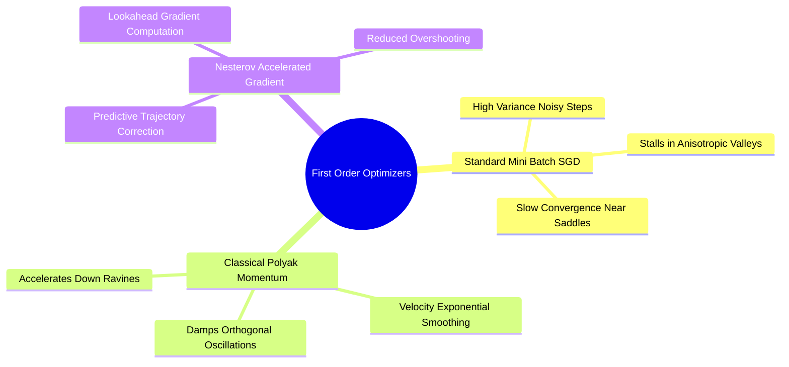

## 3.1. Stochastic Gradient Descent with Momentum and Nesterov Updates
```text
File: SynPath-3D AI Systems Knowledge System/3. Optimization Algorithms and Gradient Dynamics/3.1. Stochastic Gradient Descent with Momentum and Nesterov Updates.md
Tags: #optimization/sgd #optimization/momentum #math
```

### 1. Concept Definition & Intuition
**Stochastic Gradient Descent (SGD)** minimizes an empirical risk objective by updating parameters along the negative direction of a mini-batch gradient estimate:
$$\mathbf{\theta}_{t+1} = \mathbf{\theta}_t - \eta \mathbf{g}_t, \quad \mathbf{g}_t = \nabla_{\mathbf{\theta}} \mathcal{L}(\mathbf{\theta}_t; \mathcal{B}_t)$$
where $\eta$ is the learning rate and $\mathcal{B}_t$ is a randomly sampled mini-batch.



In neural loss surfaces characterized by high anisotropy (long, narrow valleys with steep walls and gentle slopes, common in continuous molecular force fields), vanilla SGD oscillates between the walls while making slow progress along the valley floor.

**Classical Momentum (Polyak, 1964)** introduces a persistent velocity vector $\mathbf{v}_t$ that dampens oscillations and accelerates down persistent gradients:
$$\mathbf{v}_{t+1} = \beta \mathbf{v}_t + \mathbf{g}_t$$
$$\mathbf{\theta}_{t+1} = \mathbf{\theta}_t - \eta \mathbf{v}_{t+1}$$
where $\beta \in [0, 1)$ (typically $0.9$) acts as an exponential decay constant.

**Nesterov Accelerated Gradient (NAG)** computes the gradient step after applying an interim momentum jump, providing anticipatory damping:
$$\mathbf{g}_t^{\text{NAG}} = \nabla_{\mathbf{\theta}} \mathcal{L}(\mathbf{\theta}_t + \beta \mathbf{v}_t)$$
$$\mathbf{v}_{t+1} = \beta \mathbf{v}_t + \mathbf{g}_t^{\text{NAG}}$$
$$\mathbf{\theta}_{t+1} = \mathbf{\theta}_t - \eta \mathbf{v}_{t+1}$$

```text
Momentum vs Nesterov Trajectory Comparison:
Standard Momentum:
Current Position ─────────► Momentum Step ────────► Compute Gradient ─────► Final Step (Overshoots)

Nesterov Momentum:
Current Position ─────────► Momentum Step ────────► Evaluate Lookahead ────► Corrective Gradient (Damped)
```