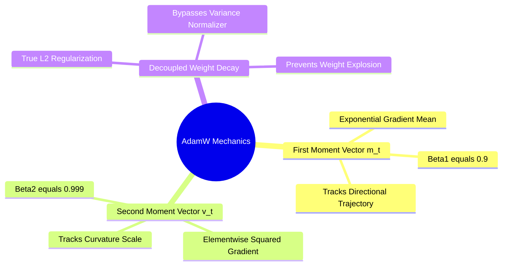

## 3.2. Adam and AdamW: Decoupling Weight Decay from Second Moments
```text
File: SynPath-3D AI Systems Knowledge System/3. Optimization Algorithms and Gradient Dynamics/3.2. Adam and AdamW: Decoupling Weight Decay from Second Moments.md
Tags: #optimization/adamw #optimization/second-moments #systems
```

### 1. Concept Definition & Intuition
**Adam (Adaptive Moment Estimation)** scales individual parameter learning rates inversely proportional to the square root of their historical gradient variance, allowing sparse parameters to receive larger updates than frequently updated ones.

Adam maintains two running exponential moving averages:
1. First moment vector (biased estimate of mean gradient):
   $$\mathbf{m}_t = \beta_1 \mathbf{m}_{t-1} + (1 - \beta_1)\mathbf{g}_t$$
2. Second moment vector (biased estimate of uncentered variance):
   $$\mathbf{v}_t = \beta_2 \mathbf{v}_{t-1} + (1 - \beta_2)\mathbf{g}_t^2$$
where $\beta_1 = 0.9$ and $\beta_2 = 0.999$.

Because $\mathbf{m}_0$ and $\mathbf{v}_0$ are initialized to zero, both vectors are biased toward zero early in training. Adam applies bias-correction terms:
$$\hat{\mathbf{m}}_t = \frac{\mathbf{m}_t}{1 - \beta_1^t}, \quad \hat{\mathbf{v}}_t = \frac{\mathbf{v}_t}{1 - \beta_2^t}$$
The Adam parameter update is:
$$\mathbf{\theta}_{t+1} = \mathbf{\theta}_t - \frac{\eta}{\sqrt{\hat{\mathbf{v}}_t} + \epsilon} \hat{\mathbf{m}}_t$$



### 2. The Weight Decay Problem and the AdamW Fix (Loshchilov & Hutter, 2019)
In standard SGD, an $L_2$ regularization penalty $\frac{1}{2}\lambda \|\mathbf{\theta}\|_2^2$ added to the loss function is mathematically identical to weight decay:
$$\mathbf{g}_t^{\text{reg}} = \mathbf{g}_t + \lambda \mathbf{\theta}_t \implies \mathbf{\theta}_{t+1} = (1 - \eta \lambda)\mathbf{\theta}_t - \eta \mathbf{g}_t$$

In standard Adam, adding $\frac{1}{2}\lambda \|\mathbf{\theta}\|_2^2$ to the loss couples the weight decay term to the second moment accumulator:
$$\mathbf{g}_t \leftarrow \mathbf{g}_t + \lambda \mathbf{\theta}_t \implies \mathbf{v}_t \leftarrow \beta_2 \mathbf{v}_{t-1} + (1 - \beta_2)(\mathbf{g}_t + \lambda \mathbf{\theta}_t)^2$$
When a parameter has large weights but infrequent gradient updates, the regularization penalty increases the second moment $\mathbf{v}_t$, which **divides down the weight decay step size**:
$$\text{Update} \propto \frac{\lambda \mathbf{\theta}_t}{\sqrt{\hat{\mathbf{v}}_t} + \epsilon}$$
Parameters with large historical variance undergo less regularization than parameters with small variance, which can cause weights to grow uncontrolled in large transformer projection matrices.

**AdamW** decouples weight decay from the gradient moments entirely, applying it as an independent decay step:
$$\mathbf{\theta}_{t+1} = (1 - \eta \lambda)\mathbf{\theta}_t - \frac{\eta}{\sqrt{\hat{\mathbf{v}}_t} + \epsilon} \hat{\mathbf{m}}_t$$

### 3. PyTorch Implementation
In `syntree/engine/trainer.py`, AdamW is instantiated across parameter groups:

```python
optimizer = torch.optim.AdamW(
    model.parameters(),
    lr=3e-4,
    betas=(0.9, 0.98),  # beta2=0.98 improves stability on large flow architectures
    eps=1e-8,
    weight_decay=1e-4   # Decoupled decay coefficient
)
```