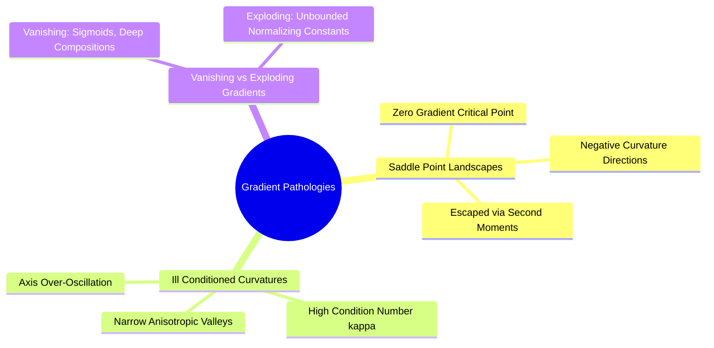

## 3.3. Saddle Points, Ill-Conditioned Curvature, and Gradient Pathology
```text
File: SynPath-3D AI Systems Knowledge System/3. Optimization Algorithms and Gradient Dynamics/3.3. Saddle Points, Ill-Conditioned Curvature, and Gradient Pathology.md
Tags: #optimization/curvature #math/hessian #debugging
```

### 1. Concept Definition & Intuition
The loss landscape of deep networks is dominated by **saddle points** rather than isolated local minima. A saddle point is an equilibrium where the gradient vanishes ($\nabla_{\mathbf{\theta}}\mathcal{L} = \mathbf{0}$), but the **Hessian matrix** $\mathbf{H} = \nabla^2 \mathcal{L} \in \mathbb{R}^{P \times P}$ has both positive and negative eigenvalues:
$$\lambda_{\text{min}}(\mathbf{H}) < 0 < \lambda_{\text{max}}(\mathbf{H})$$



### 2. Hessian Condition Number and Ravines
The geometry of a loss basin is governed by the **condition number** $\kappa$ of the Hessian:
$$\kappa(\mathbf{H}) = \frac{|\lambda_{\text{max}}(\mathbf{H})|}{|\lambda_{\text{min}}(\mathbf{H})|}$$
* When $\kappa(\mathbf{H}) \approx 1$, the loss surface is locally isotropic (spherical). Gradient vectors point directly toward the minimum.
* When $\kappa(\mathbf{H}) \gg 10^4$ (an ill-conditioned ravine, typical in cross-attention cores when handling un-normalized features), the gradient vector is almost orthogonal to the direction of the minimum, causing standard optimizers to bounce between valley walls.

### 3. Diagnostic Tensor Signatures of Gradient Breakdown
* **Vanishing Gradients**: Gradient norms decay exponentially across layers ($\|\mathbf{g}_l\| \to 0$ as $l \to 1$). Early layers stop updating, while final layers overfit.
* **Exploding Gradients**: Gradient norms grow exponentially ($\|\mathbf{g}_l\| \to 10^5 \to \text{NaN}$). The optimizer takes large steps into unconstrained regions, causing arithmetic overflows.

---

# 4. Learning Rate Schedules, Regularization, and Stabilization