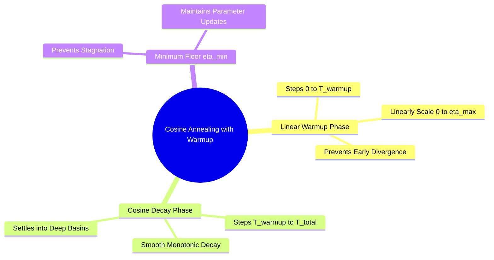

## 4.1. Linear Warmup and Cosine Annealing Dynamics
```text
File: SynPath-3D AI Systems Knowledge System/4. Learning Rate Schedules, Regularization, and Stabilization/4.1. Linear Warmup and Cosine Annealing Dynamics.md
Tags: #training/scheduler #optimization/cosine-annealing #learning-rate
```

### 1. Concept Definition & Intuition
A constant learning rate $\eta$ is poorly suited for training deep models:
* Early in training, weights are randomly initialized. Gradients are large and noisy, meaning high learning rates can destabilize the model.
* Late in training, when the parameters are settling into sharp or narrow basins, a large learning rate will oscillate across the minimum rather than descending into it.



**Cosine Annealing with Linear Warmup** addresses this in two phases:
1. **Linear Warmup Phase ($t \in [0, T_{\text{warmup}}]$)**:
   $$\eta_t = \eta_{\text{max}} \cdot \frac{t}{T_{\text{warmup}}}$$
2. **Cosine Decay Phase ($t \in [T_{\text{warmup}}, T_{\text{total}}]$)**:
   $$\eta_t = \eta_{\text{min}} + \frac{1}{2}(\eta_{\text{max}} - \eta_{\text{min}})\left( 1 + \cos\left( \pi \frac{t - T_{\text{warmup}}}{T_{\text{total}} - T_{\text{warmup}}} \right) \right)$$

```text
Learning Rate Trajectory:
   LR
   ▲
   │        Linear Warmup       Cosine Annealing Phase
ηₘₐₓ───────►      ╭──────────────╮
   │             ╱                ╲
   │            ╱                  ╲
   │           ╱                    ╲
   │          ╱                      ╰───────────────
ηₘᵢₙ───────► ╱                                       ▲
   │        │                                        │
   └────────┴────────────────────────────────────────┴───────► Step
            0  T_warmup                             T_total
```

### 2. Implementation in PyTorch
In `syntree/engine/trainer.py`:

```python
import math
from torch.optim.lr_scheduler import LambdaLR

def get_cosine_schedule_with_warmup(optimizer, num_warmup_steps, num_training_steps, min_lr_ratio=1e-3):
    def lr_lambda(current_step):
        if current_step < num_warmup_steps:
            return float(current_step) / float(max(1, num_warmup_steps))
        progress = float(current_step - num_warmup_steps) / float(max(1, num_training_steps - num_warmup_steps))
        cosine_decay = 0.5 * (1.0 + math.cos(math.pi * progress))
        # Decay between 1.0 and min_lr_ratio
        return min_lr_ratio + (1.0 - min_lr_ratio) * cosine_decay

    return LambdaLR(optimizer, lr_lambda)
```