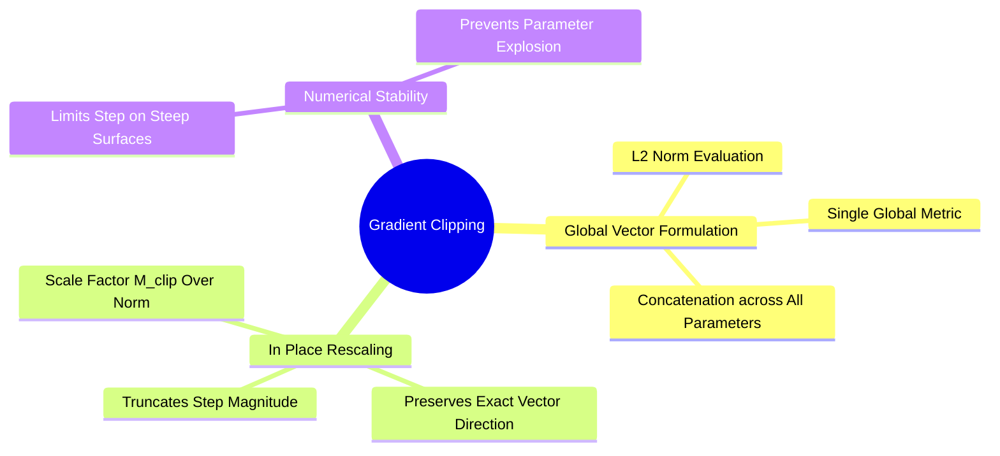

## 4.2. Gradient Norm Clipping Mechanics and Numerical Explosion Protection
```text
File: SynPath-3D AI Systems Knowledge System/4. Learning Rate Schedules, Regularization, and Stabilization/4.2. Gradient Norm Clipping Mechanics and Numerical Explosion Protection.md
Tags: #training/clipping #stability #pytorch/internals
```

### 1. Concept Definition & Intuition
In multi-branch architectures that combine discrete cross-entropy losses with continuous geometric flow matching losses, outlier configurations (such as an atomic coordinate collision where distance $r_{ij} < 0.2\text{ \AA}$) can produce large gradient spikes. 

**Global Gradient Norm Clipping (Pascanu et al., 2013)** rescales the entire parameter gradient vector if its global Euclidean norm exceeds a user-defined threshold $M_{\text{clip}}$:
$$\mathbf{g}_{\text{global}} = \left[ \text{vec}(\mathbf{g}_{\mathbf{W}_1})^T, \, \text{vec}(\mathbf{g}_{\mathbf{W}_2})^T, \dots, \text{vec}(\mathbf{g}_{\mathbf{W}_K})^T \right]^T \in \mathbb{R}^P$$
$$\|\mathbf{g}_{\text{global}}\|_2 = \sqrt{\sum_{k=1}^K \|\mathbf{g}_{\mathbf{W}_k}\|_2^2}$$
If $\|\mathbf{g}_{\text{global}}\|_2 > M_{\text{clip}}$, every parameter gradient tensor is scaled in place:
$$\mathbf{g}_{\mathbf{W}_k} \leftarrow \mathbf{g}_{\mathbf{W}_k} \cdot \frac{M_{\text{clip}}}{\|\mathbf{g}_{\text{global}}\|_2}$$



### 2. Directional Preservation
Gradient clipping **preserves the exact direction of the update vector in $P$-dimensional space**. Unlike element-wise value clipping (which clamps each element independently to $[-C, +C]$, distorting the gradient angle), norm clipping scales the global step size down to a safe magnitude without altering its trajectory.

```python
# Invoked immediately prior to the optimizer step:
torch.nn.utils.clip_grad_norm_(model.parameters(), max_norm=1.0)
optimizer.step()
```