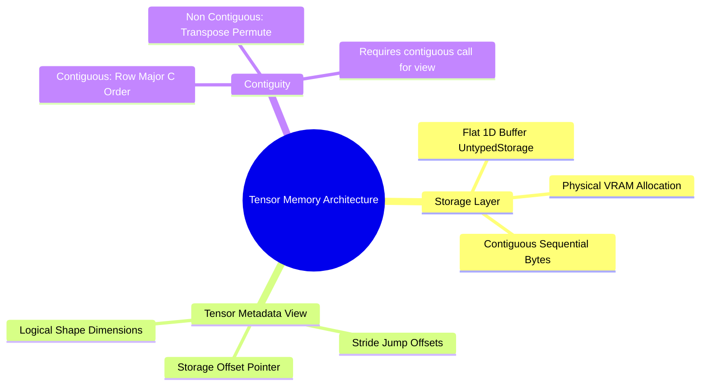

## 5.1. Tensor Storage, Strides, Contiguity, and Memory Views
```text
File: SynPath-3D AI Systems Knowledge System/5. PyTorch Execution Model and Tensor Internals/5.1. Tensor Storage, Strides, Contiguity, and Memory Views.md
Tags: #pytorch/tensors #memory/strides #systems/internals
```

### 1. Concept Definition & Intuition
A PyTorch `torch.Tensor` is a structured metadata view over an underlying continuous, flat block of device memory called a **Storage buffer** (`torch.UntypedStorage`). 

A tensor instance does not directly own a multi-dimensional array; it wraps:
1. `storage()`: Pointer to the base physical memory address in RAM or VRAM.
2. `size()`: Logical dimensions $[d_0, d_1, \dots, d_{k-1}]$.
3. `stride()`: The number of memory elements to skip to advance by one element along each dimension $[s_0, s_1, \dots, s_{k-1}]$.
4. `storage_offset()`: Index in the physical storage buffer where the tensor's first element resides.
5. `dtype`: Data format (e.g., `torch.float32`, `torch.bfloat16`).
6. `device`: Physical device locator (e.g., `cuda:0`).



### 2. Strides and Contiguity Mechanics
For an $N$-dimensional tensor of shape $[D_0, D_1, \dots, D_{k-1}]$, physical memory address indexing follows:
$$\text{MemoryIndex}(\vec{i}) = \text{storage\_offset} + \sum_{j=0}^{k-1} i_j \cdot s_j$$
A tensor is **C-contiguous (row-major)** if its memory layout matches standard row-major ordering, meaning advancing by one element along the last dimension requires stepping by 1 in physical memory:
$$s_{k-1} = 1, \quad s_j = \prod_{m=j+1}^{k-1} D_m$$

```text
Contiguity Breakdown:
Given Tensor A of shape [3, 4]:
Logical Grid:
   Row 0: [ 0,  1,  2,  3]
   Row 1: [ 4,  5,  6,  7]
   Row 2: [ 8,  9, 10, 11]

Underlying Storage: [0, 1, 2, 3, 4, 5, 6, 7, 8, 9, 10, 11]
Shape: [3, 4] | Strides: [4, 1] | Contiguous = True

Applying Transpose: B = A.t()
Shape: [4, 3] | Strides: [1, 4] | Contiguous = False
Underlying Storage is UNCHANGED! (Only strides and metadata view were swapped).
```

### 3. Implementation Consequences: `.view()` versus `.reshape()`
Operations like `.t()`, `.permute()`, and `.transpose()` alter only metadata strides without moving underlying memory buffers, making them $\mathcal{O}(1)$ operations.

However, `.view()` requires the underlying storage to be strictly contiguous. Attempting to call `.view()` on a non-contiguous transposed tensor throws a runtime error:
`RuntimeError: view size is not compatible with input tensor's size and stride`

```python
x = torch.randn(64, 256)
x_trans = x.t() # Transposed: Shape [256, 64], Strides [1, 256] -> Non-contiguous!

# CRASH: x_trans.view(256 * 64) -> Raises RuntimeError

# FIX 1: Copy memory buffer to be contiguous (forces a physical VRAM allocation)
x_flat = x_trans.contiguous().view(-1)

# FIX 2: Use .reshape(), which calls .contiguous() internally only when necessary
x_flat = x_trans.reshape(-1)
```