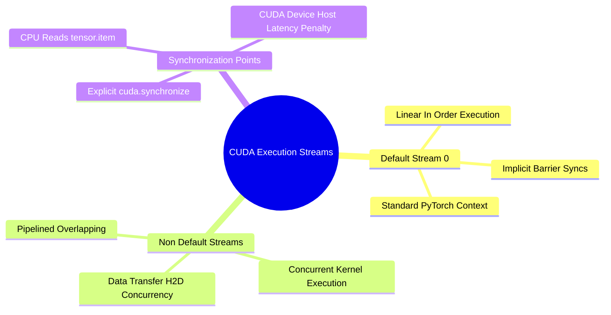

## 5.2. Asynchronous CUDA Streams, Kernel Queues, and Synchronization
```text
File: SynPath-3D AI Systems Knowledge System/5. PyTorch Execution Model and Tensor Internals/5.2. Asynchronous CUDA Streams, Kernel Queues, and Synchronization.md
Tags: #cuda/streams #gpu/async #performance
```

### 1. Concept Definition & Intuition
PyTorch operations executed on a CUDA device are **asynchronous**. When calling `c = torch.matmul(a, b)` on GPU tensors, the CPU does not wait for the GPU to finish the matrix multiplication. Instead:
1. The CPU constructs a GPU command packet and submits it to an in-memory queue called a **CUDA Stream**.
2. The CPU immediately returns execution control to the next line of Python code.
3. The GPU's hardware command processor pulls instructions from the stream and executes them in hardware asynchronously.

```text
CPU Host Thread vs GPU Execution Stream:
CPU: ──[Enqueue Matmul]──[Enqueue SiLU]──[Enqueue Softmax]──► Continues Python code
              │                 │                 │
              ▼                 ▼                 ▼
GPU: ──────►[Kernel: Matmul]──►[Kernel: SiLU]──►[Kernel: Softmax]──► Complete
```



### 2. Synchronization Barriers
The CPU stalls and waits for the GPU only when execution reaches an explicit **synchronization barrier**:
* Calling `.item()` or `.tolist()` to extract a Python scalar.
* Printing a tensor value (`print(tensor)`).
* Copying data back to the host via `.cpu()`.
* Calling `torch.cuda.synchronize()`.

```python
import time

# WRONG: Benchmarking without synchronization (Measures only CPU queue dispatch time!)
t0 = time.time()
y = torch.matmul(a, b)
elapsed = time.time() - t0 # Reports ~0.0001 seconds (FALSE MEASUREMENT!)

# CORRECT: Flush GPU queue and wait for physical completion
torch.cuda.synchronize()
t0 = time.time()
y = torch.matmul(a, b)
torch.cuda.synchronize()
elapsed = time.time() - t0 # Measures true GPU execution duration
```