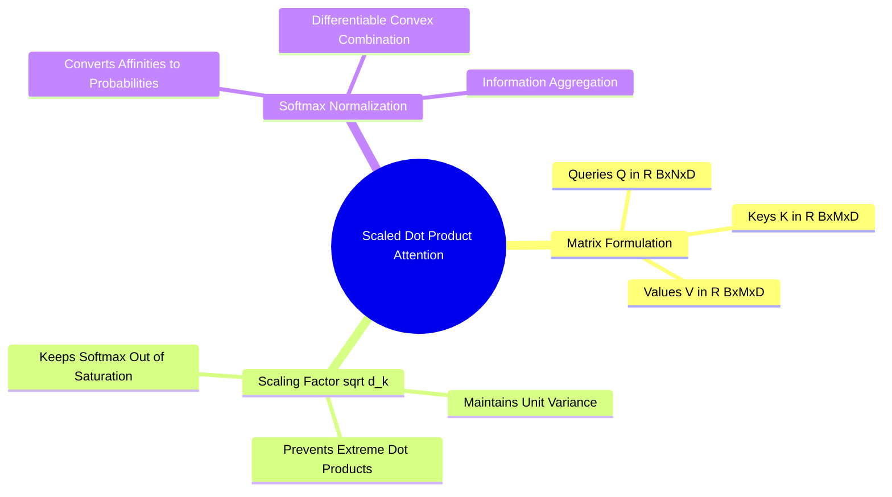

## 6.1. Scaled Dot-Product Attention as Soft Differentiable Addressing
```text
File: SynPath-3D AI Systems Knowledge System/6. Attention Mechanisms from First Principles/6.1. Scaled Dot-Product Attention as Soft Differentiable Addressing.md
Tags: #ml/attention #math/transformers #architecture
```

### 1. Concept Definition & Intuition
Attention is a differentiable information retrieval mechanism based on soft addressing. In computer architecture, associative memory retrieves a value stored at a discrete binary memory address matching a query. In deep learning, attention generalizes this into continuous space:
* A **Query ($\mathbf{q} \in \mathbb{R}^{d_k}$)** represents what the model is looking for.
* A set of **Keys ($\mathbf{k}_i \in \mathbb{R}^{d_k}$)** represents the content descriptors of available information.
* A set of **Values ($\mathbf{v}_i \in \mathbb{R}^{d_v}$)** holds the information payloads to be retrieved.



### 2. Mathematical Formalism
Given query matrix $\mathbf{Q} \in \mathbb{R}^{N \times d_k}$, key matrix $\mathbf{K} \in \mathbb{R}^{M \times d_k}$, and value matrix $\mathbf{V} \in \mathbb{R}^{M \times d_v}$:
$$\text{Attention}(\mathbf{Q}, \mathbf{K}, \mathbf{V}) = \text{Softmax}\left( \frac{\mathbf{Q}\mathbf{K}^T}{\sqrt{d_k}} \right)\mathbf{V}$$

```text
The Matrix Multiply Tensor Flow:
  Q: [Batch B, Queries N, Dim D]
  K: [Batch B, Keys M,    Dim D]
  V: [Batch B, Values M,  Dim D]

  Step 1: Compute Raw Affinities A = Q @ K.T
          [B, N, D] @ [B, D, M] ──► [B, N, M]

  Step 2: Scale by 1 / sqrt(D) and apply Softmax along final dimension
          Softmax([B, N, M], dim=-1) ──► Attention Weights W: [B, N, M]

  Step 3: Weight Values: Out = W @ V
          [B, N, M] @ [B, M, D] ──► Output: [B, N, D]
```

### 3. The Need for the $\sqrt{d_k}$ Scaling Factor
Assume components of $\mathbf{q}$ and $\mathbf{k}$ are independent random variables with zero mean and unit variance:
$$\mathbb{E}[q_i] = 0, \quad \text{Var}(q_i) = 1, \quad \mathbb{E}[k_i] = 0, \quad \text{Var}(k_i) = 1$$
The dot product is the sum of $d_k$ independent terms:
$$S = \mathbf{q} \cdot \mathbf{k} = \sum_{i=1}^{d_k} q_i k_i$$
Evaluating the variance of $S$:
$$\mathbb{E}[S] = 0, \quad \text{Var}(S) = \sum_{i=1}^{d_k} \text{Var}(q_i k_i) = \sum_{i=1}^{d_k} \text{Var}(q_i)\text{Var}(k_i) = d_k$$
For large projection dimensions (e.g., $d_k = 64$), the standard deviation of the dot product is $\sqrt{d_k} = 8.0$. 

Unscaled dot products take large values ($|S| > 15$). Applying the softmax function to large values pushes outputs into saturation regions where gradients vanish ($\nabla \text{Softmax} \approx 0$). Dividing by $\sqrt{d_k}$ scales the dot-product variance back to 1.0, preserving gradient flow through the softmax function.