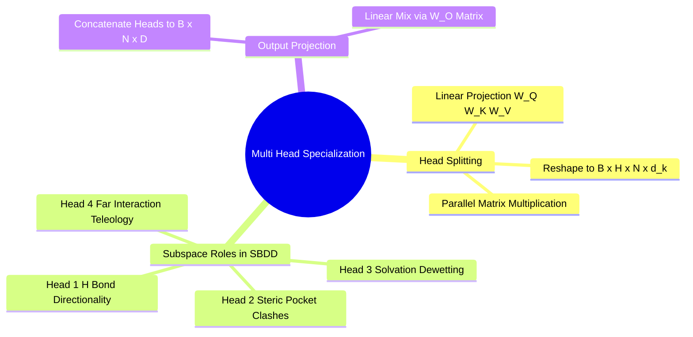

## 6.2. Multi-Head Projections and Subspace Specialization
```text
File: SynPath-3D AI Systems Knowledge System/6. Attention Mechanisms from First Principles/6.2. Multi-Head Projections and Subspace Specialization.md
Tags: #ml/multi-head-attention #architecture #transformers
```

### 1. Concept Definition & Intuition
A single scaled dot-product attention mechanism computes an average across values weighted by scalar compatibility, pulling information along only one relationship axis.

**Multi-Head Attention (Vaswani et al., 2017)** linearly projects queries, keys, and values $H$ times using independently learned parameter matrices. This enables the model to attend to information from different representation subspaces concurrently.



### 2. Mathematical Formalism
Given model dimension $D$:
$$\text{MultiHead}(\mathbf{Q}, \mathbf{K}, \mathbf{V}) = \text{Concat}(\text{head}_1, \dots, \text{head}_H)\mathbf{W}^O$$
$$\text{head}_h = \text{Attention}\left( \mathbf{Q}\mathbf{W}_h^Q, \, \mathbf{K}\mathbf{W}_h^K, \, \mathbf{V}\mathbf{W}_h^V \right)$$
where parameter projections are:
$$\mathbf{W}_h^Q \in \mathbb{R}^{D \times d_k}, \quad \mathbf{W}_h^K \in \mathbb{R}^{D \times d_k}, \quad \mathbf{W}_h^V \in \mathbb{R}^{D \times d_v}, \quad \mathbf{W}^O \in \mathbb{R}^{H d_v \times D}$$
Typically, $d_k = d_v = D / H$.

### 3. Implementation Blueprint in Project Context
In `syntree/models/policy.py`, multi-head cross-attention is implemented using fused tensor operations:

```python
import torch
import torch.nn as nn

class SpatialCrossAttention(nn.Module):
    def __init__(self, d_model=256, num_heads=8):
        super().__init__()
        self.d_model = d_model
        self.num_heads = num_heads
        self.d_k = d_model // num_heads # 256 // 8 = 32
        
        # Fused projection weights for efficiency
        self.q_proj = nn.Linear(d_model, d_model)
        self.k_proj = nn.Linear(d_model, d_model)
        self.v_proj = nn.Linear(d_model, d_model)
        self.out_proj = nn.Linear(d_model, d_model)

    def forward(self, query, keys, values, distance_bias=None):
        # query: [B, 1, 256] (Handle query)
        # keys/values: [B, N_p, 256] (Pocket nodes)
        B, N_p, _ = keys.shape
        
        # 1. Project and reshape into heads: [B, Heads, SequenceLength, d_k]
        Q = self.q_proj(query).view(B, 1, self.num_heads, self.d_k).transpose(1, 2)
        K = self.k_proj(keys).view(B, N_p, self.num_heads, self.d_k).transpose(1, 2)
        V = self.v_proj(values).view(B, N_p, self.num_heads, self.d_k).transpose(1, 2)
        
        # 2. Batched scaled dot product: [B, Heads, 1, d_k] @ [B, Heads, d_k, N_p] -> [B, Heads, 1, N_p]
        scores = torch.matmul(Q, K.transpose(-2, -1)) / (self.d_k ** 0.5)
        
        # 3. Inject continuous physical spatial bias
        if distance_bias is not None:
            # distance_bias: [B, 1, 1, N_p]
            scores = scores - distance_bias
            
        weights = torch.softmax(scores, dim=-1)
        
        # 4. Context aggregation: [B, Heads, 1, N_p] @ [B, Heads, N_p, d_k] -> [B, Heads, 1, d_k]
        context = torch.matmul(weights, V)
        
        # 5. Concatenate heads and project out: [B, 1, D_model]
        context = context.transpose(1, 2).contiguous().view(B, 1, self.d_model)
        return self.out_proj(context)
```