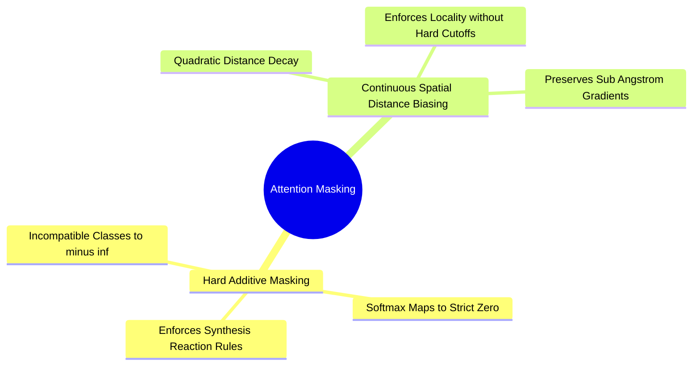

## 6.3. Additive, Multiplicative, and Spatial Distance Bias Masking
```text
File: SynPath-3D AI Systems Knowledge System/6. Attention Mechanisms from First Principles/6.3. Additive, Multiplicative, and Spatial Distance Bias Masking.md
Tags: #ml/attention-masking #geometry/spatial-bias #physics
```

### 1. Concept Definition & Intuition
Attention matrices are dense complete bipartite graphs: every query attends to every key. In physical structural biology, however, interactions are localized; atoms located $25\text{ \AA}$ away have negligible direct physical influence on a local chemical coupling.



To incorporate physical and chemical constraints into the model, attention logits are biased prior to the softmax normalization:
1. **Hard Additive Masking ($M_{ij} \in \{0, -\infty\}$)**:
   Used for discrete constraints, such as masking out incompatible synthons or reaction types:
   $$\text{AttentionWeights} = \text{Softmax}\left( \frac{\mathbf{Q}\mathbf{K}^T}{\sqrt{d_k}} + \mathbf{M} \right)$$
   Setting $M_{ij} = -10^9$ forces $e^{-10^9} \equiv 0.0$ in floating-point representation, completely eliminating gradient flow from that choice.
2. **Continuous Spatial Distance Biasing**:
   Instead of using sharp spatial cutoffs that produce discontinuous gradients, an analytical spatial distance penalty is added directly to the raw attention scores:
   $$A_{ij} = \frac{\mathbf{q}_i^T \mathbf{k}_j}{\sqrt{d_k}} - \gamma_{\text{dist}} \|\vec{x}_i - \vec{x}_j\|^2$$
   This smoothly focuses attention on spatially proximal pocket residues while maintaining gradient continuity.

---

# 7. Transformers and Invariant Point Attention