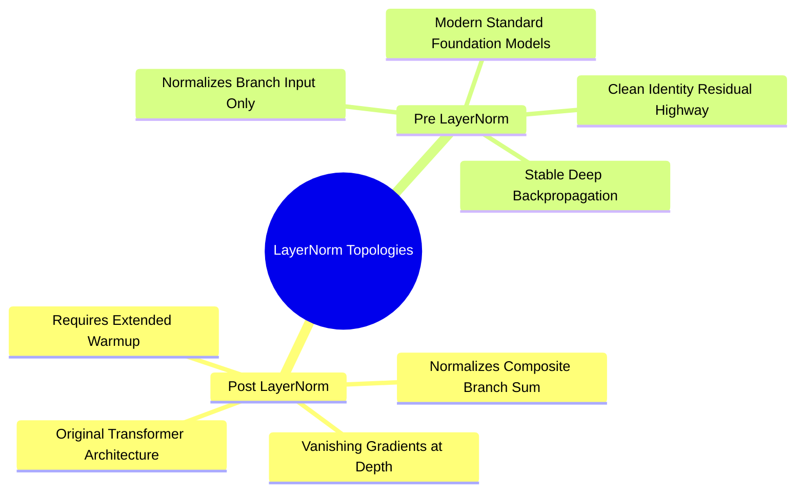

## 7.1. Post-LayerNorm versus Pre-LayerNorm Residual Dynamics
```text
File: SynPath-3D AI Systems Knowledge System/7. Transformers and Invariant Point Attention/7.1. Post-LayerNorm versus Pre-LayerNorm Residual Dynamics.md
Tags: #transformers/layernorm #optimization/stability #deep-learning
```

### 1. Mathematical Mechanics of Layer Normalization
Layer Normalization (Ba, Kiros, Hinton, 2016) normalizes activations across feature channels independently for each sample:
$$\text{LN}(\mathbf{x}) = \frac{\mathbf{x} - \mu}{\sqrt{\sigma^2 + \epsilon}} \odot \mathbf{\gamma} + \mathbf{\beta}$$
where:
$$\mu = \frac{1}{D} \sum_{i=1}^D x_i, \quad \sigma^2 = \frac{1}{D} \sum_{i=1}^D (x_i - \mu)^2$$
$\mathbf{\gamma}, \mathbf{\beta} \in \mathbb{R}^D$ are learnable affine parameters.



### 2. Pre-LN vs. Post-LN Architectures
* **Post-LN (Original Transformer, Vaswani et al., 2017)**:
  $$\mathbf{x}_{l} = \text{LN}\left( \mathbf{x}_{l-1} + \text{SubLayer}(\mathbf{x}_{l-1}) \right)$$
  *Problem*: The residual identity path is scaled by layer normalization at every step. Gradients passing through the residual connection are repeatedly divided by $\sigma_l$, causing gradient vanishing in deep networks ($L > 8$) and necessitating long warmup periods to avoid early divergence.
* **Pre-LN (Modern Standard, Radford et al., 2019)**:
  $$\mathbf{x}_{l} = \mathbf{x}_{l-1} + \text{SubLayer}\left( \text{LN}(\mathbf{x}_{l-1}) \right)$$
  *Advantage*: The residual highway remains unscaled: $\mathbf{x}_L = \mathbf{x}_0 + \sum_{l=1}^L \text{SubLayer}(\text{LN}(\mathbf{x}_{l-1}))$. Gradients propagate directly through the skip connection:
  $$\frac{\partial \mathcal{L}}{\partial \mathbf{x}_0} = \frac{\partial \mathcal{L}}{\partial \mathbf{x}_L} + \sum_{l=1}^L \frac{\partial \mathcal{L}}{\partial \mathbf{x}_l} \dots$$
  This allows deep architectures to train stably without strict learning rate warmup constraints.

```text
Pre-LN vs Post-LN Execution Topologies:
Post-LN:
   x ──► [ SubLayer ] ──► (+) ──► [ LayerNorm ] ──► Output
   └───────────────────────▲
   
Pre-LN:
   x ──► [ LayerNorm ] ──► [ SubLayer ] ──► (+) ──► Output
   └─────────────────────────────────────────▲
```