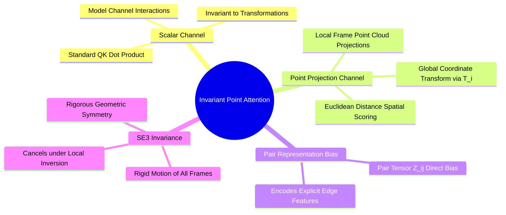

## 7.2. Invariant Point Attention over Rigid Euclidean Coordinate Frames
```text
File: SynPath-3D AI Systems Knowledge System/7. Transformers and Invariant Point Attention/7.2. Invariant Point Attention over Rigid Euclidean Coordinate Frames.md
Tags: #ml/ipa #geometry/se3 #alphafold3 #architecture
```

### 1. Concept Definition & Physical Nature
**Invariant Point Attention (IPA)**, introduced in AlphaFold 2 and used in modern biomolecular foundation architectures (AlphaFold 3, NeuralPLexer), is a multi-head attention mechanism that operates simultaneously on invariant scalar states and 3D coordinate frames $T_i = (\mathbf{R}_i, \vec{t}_i) \in \mathrm{SE}(3)$.

Standard self-attention computes dot products between invariant feature vectors, remaining blind to relative 3D spatial orientations. 

IPA adds spatial projection points: each node projects virtual coordinate points into its local reference frame, which are transformed into global Cartesian space and evaluated via Euclidean distance metrics against target points.



### 2. Mathematical Formalism
For each attention head:
1. Node $i$ projects scalar query, key, and value vectors: $\mathbf{q}_i, \mathbf{k}_i, \mathbf{v}_i \in \mathbb{R}^{d_k}$.
2. Node $i$ projects $P$ 3D spatial query points $\vec{r}_i^{q, p} \in \mathbb{R}^3$ and key points $\vec{r}_i^{k, p} \in \mathbb{R}^3$ defined in its **local reference frame**.
3. Local points are transformed into global space via the residue's $\mathrm{SE}(3)$ frame:
   $$\vec{x}_i^{q, p} = T_i \circ \vec{r}_i^{q, p} = \mathbf{R}_i \vec{r}_i^{q, p} + \vec{t}_i$$
   $$\vec{x}_j^{k, p} = T_j \circ \vec{r}_j^{k, p} = \mathbf{R}_j \vec{r}_j^{k, p} + \vec{t}_j$$
4. The composite attention logit incorporates scalar affinities, spatial point distances, and pairwise edge features $\mathbf{z}_{ij}$:
   $$a_{ij} = \frac{\mathbf{q}_i^T \mathbf{k}_j}{\sqrt{d_k}} + \mathbf{w}_z^T \mathbf{z}_{ij} - \frac{\gamma_{\text{point}}}{2} \sum_{p=1}^P \|\vec{x}_i^{q, p} - \vec{x}_j^{k, p}\|_2^2$$
5. Attention weights are normalized via softmax: $\alpha_{ij} = \text{Softmax}_j(a_{ij})$.

### 3. Proof of SE(3) Invariance
Apply an arbitrary rigid-body transformation $T_{\text{global}} = (\mathbf{R}_{\text{ext}}, \vec{t}_{\text{ext}}) \in \mathrm{SE}(3)$ to all structural frames:
$$T_i \leftarrow T_{\text{global}} \circ T_i \implies \mathbf{R}_i \leftarrow \mathbf{R}_{\text{ext}}\mathbf{R}_i, \quad \vec{t}_i \leftarrow \mathbf{R}_{\text{ext}}\vec{t}_i + \vec{t}_{\text{ext}}$$
The transformed global query point is:
$$\tilde{\mathbf{x}}_i^{q, p} = \mathbf{R}_{\text{ext}}\mathbf{R}_i \vec{r}_i^{q, p} + \mathbf{R}_{\text{ext}}\vec{t}_i + \vec{t}_{\text{ext}} = \mathbf{R}_{\text{ext}}\left(\mathbf{R}_i \vec{r}_i^{q, p} + \vec{t}_i\right) + \vec{t}_{\text{ext}} = \mathbf{R}_{\text{ext}}\vec{x}_i^{q, p} + \vec{t}_{\text{ext}}$$
Evaluating the squared Euclidean distance between query and key points:
$$\|\tilde{\mathbf{x}}_i^{q, p} - \tilde{\mathbf{x}}_j^{k, p}\|_2^2 = \|(\mathbf{R}_{\text{ext}}\vec{x}_i^{q, p} + \vec{t}_{\text{ext}}) - (\mathbf{R}_{\text{ext}}\vec{x}_j^{k, p} + \vec{t}_{\text{ext}})\|_2^2 = \|\mathbf{R}_{\text{ext}}(\vec{x}_i^{q, p} - \vec{x}_j^{k, p})\|_2^2$$
Since $\mathbf{R}_{\text{ext}}$ is an orthogonal matrix ($\mathbf{R}^T\mathbf{R} = \mathbf{I}$), it preserves Euclidean norms:
$$\|\mathbf{R}_{\text{ext}}(\vec{x}_i^{q, p} - \vec{x}_j^{k, p})\|_2^2 = (\vec{x}_i^{q, p} - \vec{x}_j^{k, p})^T \mathbf{R}_{\text{ext}}^T \mathbf{R}_{\text{ext}} (\vec{x}_i^{q, p} - \vec{x}_j^{k, p}) \equiv \|\vec{x}_i^{q, p} - \vec{x}_j^{k, p}\|_2^2$$
The spatial distance term is strictly $\mathrm{SE}(3)$-invariant.

---

# 8. Graph Neural Networks and Message Passing