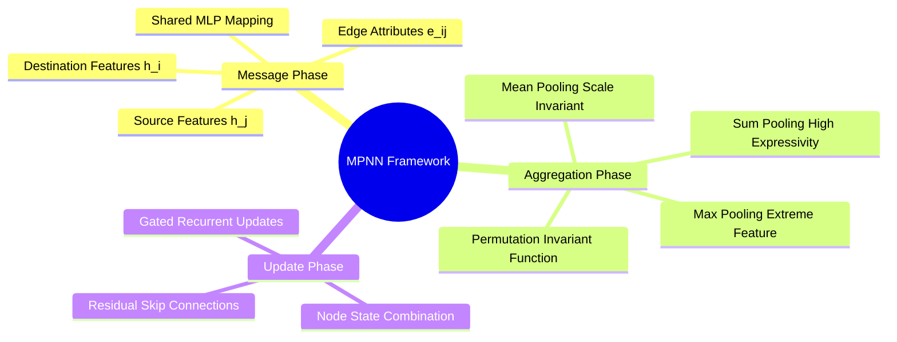

## 8.1. The Message Passing Neural Network Spatial Paradigm
```text
File: SynPath-3D AI Systems Knowledge System/8. Graph Neural Networks and Message Passing/8.1. The Message Passing Neural Network Spatial Paradigm.md
Tags: #gnn/mpnn #ml/graph-theory #systems
```

### 1. Concept Definition & Intuition
The **Message Passing Neural Network (MPNN)** framework (Gilmer et al., 2017) generalizes convolutional operations to arbitrary graph topologies. 

Instead of multiplying fixed grid patches, information propagates across graph edges through three differentiable phases:
1. **Message Generation**: Every directed edge $(j \to i)$ generates a message $\mathbf{m}_{ij}$ by combining source node features, destination node features, and edge attributes.
2. **Aggregation**: Every destination node $i$ aggregates all incoming messages from its local neighborhood $\mathcal{N}(i)$ using a permutation-invariant reduction operator (Sum, Mean, or Max).
3. **Update**: Node $i$ updates its hidden state by combining its current representation with the aggregated message.



### 2. Mathematical Formalism
$$\text{Message:} \quad \mathbf{m}_{ij}^{(l)} = \mathbf{\phi}_{\text{msg}}\left( \mathbf{h}_i^{(l)}, \, \mathbf{h}_j^{(l)}, \, \mathbf{e}_{ij} \right) \in \mathbb{R}^{d_m}$$
$$\text{Aggregation:} \quad \mathbf{a}_i^{(l)} = \bigoplus_{j \in \mathcal{N}(i)} \mathbf{m}_{ij}^{(l)}$$
$$\text{Update:} \quad \mathbf{h}_i^{(l+1)} = \mathbf{\psi}_{\text{up}}\left( \mathbf{h}_i^{(l)}, \, \mathbf{a}_i^{(l)} \right) \in \mathbb{R}^d$$
where $\bigoplus$ represents a permutation-invariant aggregation operator.

```text
Visualizing Message Passing:
Neighbor Nodes (j ∈ N(i)):
    (j₁) ─── e_{j₁ i} ───► ┐
                           │ (Aggregate: Sum)
    (j₂) ─── e_{j₂ i} ───► ┼────────► a_i ──► [ Update MLP ] ──► h_i^(l+1)
                           │                    ▲
    (j₃) ─── e_{j₃ i} ───► ┘                    │
                                           h_i^(l) (Current Node State)
```

### 3. Choice of Aggregation Operator ($\bigoplus$)
* **Sum Aggregation ($\sum$)**: Most expressive operator according to the Weisfeiler-Lehman (1-WL) graph isomorphism test (Xu et al., GIN, 2019). It captures both neighborhood feature distributions and node degrees (structural connectivity).
* **Mean Aggregation ($\frac{1}{|\mathcal{N}|}\sum$)**: Normalizes for degree variation; preferred when learning properties that depend on relative feature proportions rather than absolute atom counts.