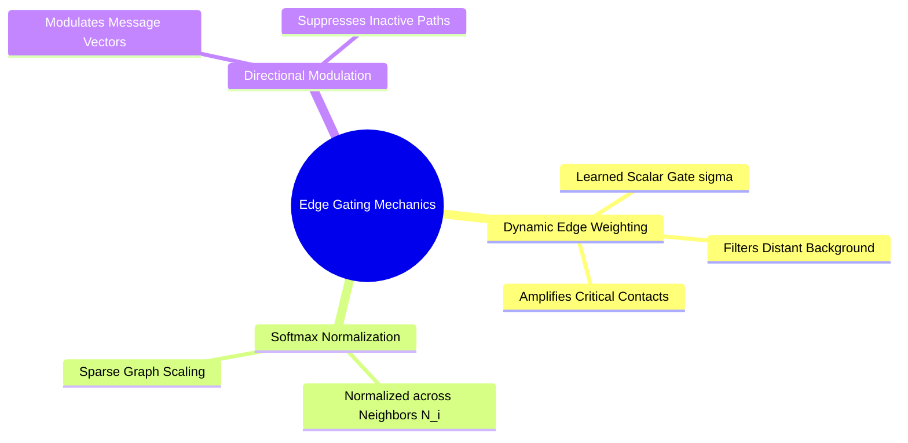

## 8.2. Graph Attention and Edge-Gated Permutation Invariance
```text
File: SynPath-3D AI Systems Knowledge System/8. Graph Neural Networks and Message Passing/8.2. Graph Attention and Edge-Gated Permutation Invariance.md
Tags: #gnn/gat #ml/graph-attention #edge-gating
```

### 1. Concept Definition & Intuition
Standard MPNNs treat all neighbors within a radius cutoff equally during message aggregation. However, in protein active sites, some neighbors are more physically relevant than others:
* An Aspartate oxygen forming a $2.7\text{ \AA}$ salt bridge with a ligand nitrogen is more critical than a Leucine carbon $5.8\text{ \AA}$ away.

**Graph Attention Networks (GAT)** and **Edge-Gated Graph Networks** parameterize edges with learnable dynamic weights, allowing nodes to selectively amplify relevant interactions while filtering out background contacts.



### 2. Mathematical Formalism
In an Edge-Gated GNN, edge features $\mathbf{e}_{ij}$ are updated alongside node representations:
$$\mathbf{e}_{ij}^{(l+1)} = \mathbf{e}_{ij}^{(l)} + \text{MLP}_e\left( [\mathbf{h}_i^{(l)} \mathbin{\Vert} \mathbf{h}_j^{(l)} \mathbin{\Vert} \mathbf{e}_{ij}^{(l)}] \right)$$
A normalized scalar gate $\sigma(\mathbf{e}_{ij}) \in [0, 1]$ modulates the incoming message:
$$\mathbf{m}_{ij}^{(l)} = \text{Sigmoid}\left( \mathbf{W}_{\text{gate}} \mathbf{e}_{ij}^{(l+1)} \right) \odot \text{MLP}_v\left( \mathbf{h}_j^{(l)} \right)$$
$$\mathbf{h}_i^{(l+1)} = \mathbf{h}_i^{(l)} + \text{MLP}_u\left( \sum_{j \in \mathcal{N}(i)} \mathbf{m}_{ij}^{(l)} \right)$$