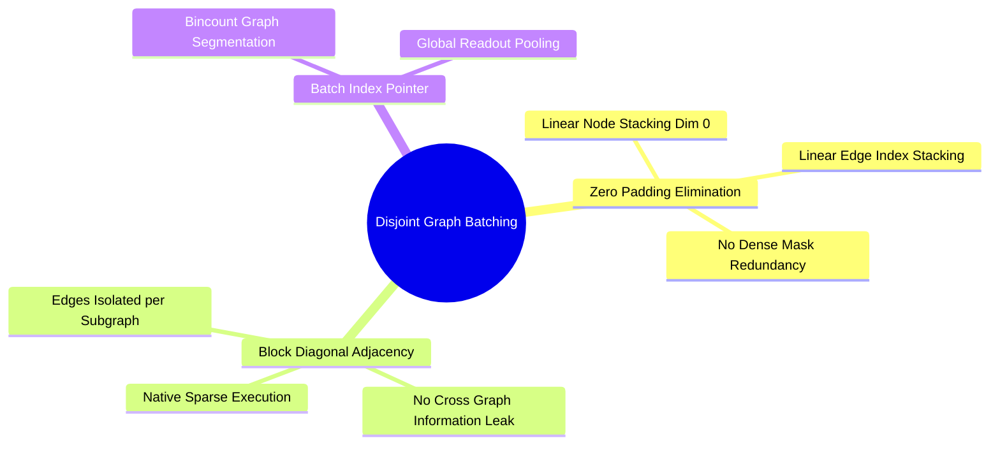

## 8.3. PyG Heterogeneous Mini-Batching via Disjoint Block-Diagonal Graphs
```text
File: SynPath-3D AI Systems Knowledge System/8. Graph Neural Networks and Message Passing/8.3. PyG Heterogeneous Mini Batching via Disjoint Block Diagonal Graphs.md
Tags: #pytorch-geometric #systems/batching #sparse-tensors
```

### 1. Concept Definition & Intuition
In image-based CNNs, mini-batching is straightforward: images are cropped to identical spatial dimensions $[C, H, W]$ and stacked along a leading batch dimension $[B, C, H, W]$. 

Proteins and ligands, however, have variable sizes:
* Pocket A may contain 120 atoms and 850 radius edges.
* Pocket B may contain 180 atoms and 1,420 radius edges.

Padding all graphs with dummy nodes to match the maximum atom count wastes VRAM and computation on padded edge comparisons ($\mathcal{O}(N_{\text{max}}^2)$).

**PyG Disjoint Block-Diagonal Batching** concatenates variable-sized graphs into a single large **disjoint graph**:
* Node feature tensors are concatenated along dimension 0:
  $$\mathbf{H}_{\text{batch}} = \begin{bmatrix} \mathbf{H}_1 \\ \mathbf{H}_2 \\ \vdots \\ \mathbf{H}_B \end{bmatrix} \in \mathbb{R}^{\left(\sum_{b=1}^B N_b\right) \times D}$$
* The adjacency matrix becomes block-diagonal: edges from Graph 1 never connect to nodes in Graph 2.
* A 1D integer tracking array `batch` maps each node to its source graph index:
  $$\text{batch} = [0, 0, \dots, 0, \, 1, 1, \dots, 1, \, \dots, \, B-1]^T \in \{0, \dots, B-1\}^{\sum N_b}$$

```text
Visualizing PyG Disjoint Block-Diagonal Batching:
Individual Graphs:               Batched Block-Diagonal Adjacency:
  Graph 0: (3 nodes)               Nodes: [0, 1, 2 | 3, 4 | 5, 6, 7, 8]
  Graph 1: (2 nodes)               Adjacency Matrix:
  Graph 2: (4 nodes)               ┌────────┬────────┬────────┐
                                   │ A_G0   │ 0      │ 0      │
                                   ├────────┼────────┼────────┤
                                   │ 0      │ A_G1   │ 0      │
                                   ├────────┼────────┼────────┤
                                   │ 0      │ 0      │ A_G2   │
                                   └────────┴────────┴────────┘
                                   batch tensor: [0,0,0, 1,1, 2,2,2,2]
```



### 2. Global Graph-Level Readout Operations
To compute a single pooled representation per graph (e.g., global pocket context $\mathbf{z}_{\text{pocket}} \in \mathbb{R}^{B \times D}$), operations use `index_add_` or `scatter_mean` directed by the `batch` tensor:
```python
# Aggregating node representations into per-graph embeddings
def global_mean_pool(x, batch, num_graphs):
    # x: [Total_Atoms, D], batch: [Total_Atoms]
    out = torch.zeros(num_graphs, x.size(1), device=x.device, dtype=x.dtype)
    # In-place scatter addition
    out.index_add_(0, batch, x)
    # Count nodes per graph to compute the mean
    counts = torch.bincount(batch, minlength=num_graphs).clamp(min=1).unsqueeze(1)
    return out / counts  # [B, D]
```

---

# 9. 3D Geometric Deep Learning and SE(3) Equivariance