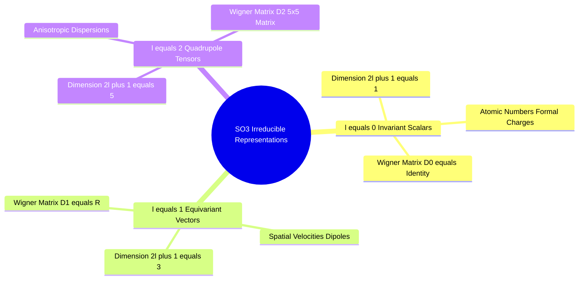

## 9.2. Irreducible Representations and Spherical Harmonics versus Vectors
```text
File: SynPath-3D AI Systems Knowledge System/9. 3D Geometric Deep Learning and SE(3) Equivariance/9.2. Irreducible Representations and Spherical Harmonics versus Vectors.md
Tags: #math/representation-theory #spherical-harmonics #so3
```

### 1. Concept Definition & Intuition
Any linear representation of the 3D rotation group $\mathrm{SO}(3)$ can be decomposed into a direct sum of orthogonal **irreducible representations (irreps)** characterized by integer angular momentum degrees $l \in \{0, 1, 2, \dots\}$ with spatial dimension $2l + 1$:
* **$l=0$ (Scalars, $2(0)+1 = 1\text{ dim}$)**: Rotational invariants ($s \in \mathbb{R}^1$). Unaltered by rotations: $\mathbf{D}^{(0)}(\mathbf{R}) = [1]$.
* **$l=1$ (Vectors, $2(1)+1 = 3\text{ dim}$)**: Spatial vectors ($\vec{v} \in \mathbb{R}^3$). Transform via standard $3\times3$ rotation matrices: $\mathbf{D}^{(1)}(\mathbf{R}) = \mathbf{R}$.
* **$l=2$ (Traceless Symmetric Tensors, $2(2)+1 = 5\text{ dim}$)**: Quadrupole moments, spatial dispersion fields, and stress tensors. Transform via Wigner D-matrices: $\mathbf{D}^{(2)}(\mathbf{R}) \in \mathbb{R}^{5 \times 5}$.



### 2. Clebsch-Gordan Tensor Products
Combining two geometric features of degrees $l_1$ and $l_2$ produces outputs across coupled representations determined by the **Clebsch-Gordan series**:
$$l_1 \otimes l_2 = |l_1 - l_2| \oplus (|l_1 - l_2| + 1) \oplus \dots \oplus (l_1 + l_2)$$
For example, the tensor product of two vector channels ($l=1 \otimes l=1$) decomposes into:
$$1 \otimes 1 = 0 \oplus 1 \oplus 2 \quad (1\text{ scalar} + 3\text{ vector} + 5\text{ tensor} = 9\text{ dimensions})$$
* **Degree 0 Component ($l=0$)**: The scalar dot product $\vec{v}_1 \cdot \vec{v}_2$ (invariant interaction energy).
* **Degree 1 Component ($l=1$)**: The vector cross product $\vec{v}_1 \times \vec{v}_2$ (perpendicular axial torque).
* **Degree 2 Component ($l=2$)**: The symmetric traceless tensor $\frac{1}{2}(\vec{v}_1 \vec{v}_2^T + \vec{v}_2 \vec{v}_1^T) - \frac{1}{3}(\vec{v}_1 \cdot \vec{v}_2)\mathbf{I}$ (quadrupole field).

Full tensor-product architectures (such as `e3nn`) compute interactions across high degrees ($l \ge 3$), which requires evaluating extensive Clebsch-Gordan coupling tables and slows down inference.