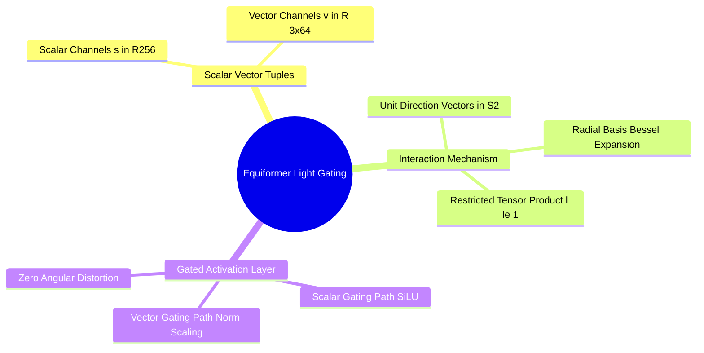

## 9.3. Equiformer and GVP Tensor-Product Channels
```text
File: SynPath-3D AI Systems Knowledge System/9. 3D Geometric Deep Learning and SE(3) Equivariance/9.3. Equiformer and GVP Tensor Product Channels.md
Tags: #ml/equiformer #ml/gvp #equivariant-gnn
```

### 1. Concept Definition & Intuition
To avoid the computational complexity of high-degree Clebsch-Gordan tensor products ($l \ge 3$), modern structural biophysics architectures use simplified vector-scalar frameworks:
1. **Geometric Vector Perceptrons (GVP, Jing et al., 2021)**: Extends standard MLPs to operate directly on tuples of scalars and Euclidean vectors: $(\mathbf{s}, \mathbf{V}) \in \mathbb{R}^s \times \mathbb{R}^{v \times 3}$. GVPs restrict representations to $l=0$ and $l=1$, evaluating non-linear transformations without Clebsch-Gordan decompositions.
2. **Equiformer-Light (Liao et al., 2023)**: Combines $l=0$ scalars and $l=1$ vectors with multi-head attention and gated non-linear activations.



### 2. Gated Non-Linear Activation Mechanics
Standard non-linearities like ReLU or SiLU cannot be applied directly to vector components ($\text{SiLU}(v_x), \text{SiLU}(v_y), \text{SiLU}(v_z)$), as non-linear scaling breaks rotational equivariance.

Equiformer-Light applies **Gated Non-Linearities**: an invariant scalar path gates the magnitude of the vector path while preserving its spatial orientation:
$$\mathbf{s}_{\text{out}} = \text{SiLU}(\mathbf{s}_{\text{in}}) \in \mathbb{R}^{d_s}$$
$$\vec{v}_{\text{out}} = \text{Sigmoid}\left( \mathbf{W}_{\text{gate}}\mathbf{s}_{\text{in}} \right) \odot \vec{v}_{\text{in}} \in \mathbb{R}^{d_v \times 3}$$
Because the vector's orientation is unchanged and its magnitude is scaled by a rotationally invariant scalar, equivariance is strictly maintained.

---

# 10. Continuous-Time Generative Modeling and Flow Matching