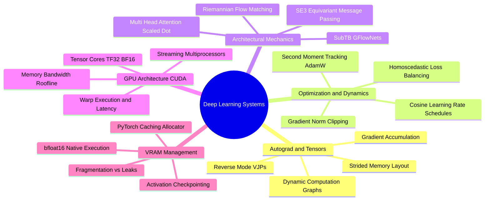

# SynPath-3D Computational Systems & Deep Learning Vault
## Engineering Reference Manual & Technical Foundations

---

### Master Systems Map of Content (MOC)

```text
SynPath-3D AI Systems Knowledge System
├── 0. AI Systems Master Map of Content.md
├── 1. Prerequisites and The Transition Beyond CNNs
│   ├── 1.1. Limitations of Grid Convolutions for Molecular Geometry.md
│   └── 1.2. The Shift from Euclidean Grids to Non-Euclidean Manifolds.md
├── 2. Computational Graphs, Autograd, and Differentiation
│   ├── 2.1. Directed Acyclic Graphs of Tensors and Node History.md
│   ├── 2.2. Vector-Jacobian Products and Reverse-Mode Differentiation.md
│   └── 2.3. Dynamic Graphs versus Static Intermediate Memory Footprints.md
├── 3. Optimization Algorithms and Gradient Dynamics
│   ├── 3.1. Stochastic Gradient Descent with Momentum and Nesterov Updates.md
│   ├── 3.2. Adam and AdamW: Decoupling Weight Decay from Second Moments.md
│   └── 3.3. Saddle Points, Ill-Conditioned Curvature, and Gradient Pathology.md
├── 4. Learning Rate Schedules, Regularization, and Stabilization
│   ├── 4.1. Linear Warmup and Cosine Annealing Dynamics.md
│   ├── 4.2. Gradient Norm Clipping Mechanics and Numerical Explosion Protection.md
│   └── 4.3. Kendall-Gal Homoscedastic Multi-Task Loss Weighting.md
├── 5. PyTorch Execution Model and Tensor Internals
│   ├── 5.1. Tensor Storage, Strides, Contiguity, and Memory Views.md
│   ├── 5.2. Asynchronous CUDA Streams, Kernel Queues, and Synchronization.md
│   └── 5.3. In-Place Modifications, View Invalidations, and Autograd Corruption.md
├── 6. Attention Mechanisms from First Principles
│   ├── 6.1. Scaled Dot-Product Attention as Soft Differentiable Addressing.md
│   ├── 6.2. Multi-Head Projections and Subspace Specialization.md
│   └── 6.3. Additive, Multiplicative, and Spatial Distance Bias Masking.md
├── 7. Transformers and Invariant Point Attention
│   ├── 7.1. Post-LayerNorm versus Pre-LayerNorm Residual Dynamics.md
│   └── 7.2. Invariant Point Attention over Rigid Euclidean Coordinate Frames.md
├── 8. Graph Neural Networks and Message Passing
│   ├── 8.1. The Message Passing Neural Network Spatial Paradigm.md
│   ├── 8.2. Graph Attention and Edge-Gated Permutation Invariance.md
│   └── 8.3. PyG Heterogeneous Mini-Batching via Disjoint Block Diagonal Graphs.md
├── 9. 3D Geometric Deep Learning and SE(3) Equivariance
│   ├── 9.1. Group Actions, Invariance, and Equivariance Formalisms.md
│   ├── 9.2. Irreducible Representations and Spherical Harmonics versus Vectors.md
│   └── 9.3. Equiformer and GVP Tensor-Product Channels.md
├── 10. Continuous-Time Generative Modeling and Flow Matching
│   ├── 10.1. Score-Based Diffusion SDEs versus Continuous Normalizing Flows.md
│   ├── 10.2. Optimal Transport Vector Fields on Bounded Riemannian Tori.md
│   └── 10.3. Numerical Integration Schemes: Euler versus Midpoint ODE Solvers.md
├── 11. The Complete End-to-End System Architecture
│   ├── 11.1. Pocket Backbone: 6-Layer Equiformer-Light Forward Walkthrough.md
│   ├── 11.2. The Teleological Target Interaction Field Anchor Module.md
│   ├── 11.3. Discrete Heads: 24-Class Reaction and 75k-Synthon Selection.md
│   └── 11.4. Continuous Head: Coupled Torus Riemannian Flow Matching.md
├── 12. Complete Tensor Lifecycle and Information Flow
│   ├── 12.1. Exact Input Dimension Manifest: From PyG Batch to Latent Spaces.md
│   ├── 12.2. Tensor Dimension Evolution Table Across Every Forward Layer.md
│   └── 12.3. End-to-End Inter-Module Backpropagation Gradient Propagation Flow.md
├── 13. Loss Formulations, Uncertainty Balancing, and Gradients
│   ├── 13.1. Mathematical Formulation of the Composite Stage-1 Objective.md
│   └── 13.2. Sub-Trajectory Balance Objective for Variable-Length Synthesis Trees.md
├── 14. GPU Hardware Architecture and CUDA Mechanics
│   ├── 14.1. NVIDIA Ada Lovelace Silicon: SMs, Warps, and Thread Scheduling.md
│   ├── 14.2. 4th-Generation Tensor Cores and Accelerated Matrix Arithmetic.md
│   └── 14.3. Compute-Bound versus Memory-Bound Workloads: The Roofline Model.md
├── 15. GPU VRAM Memory Anatomy and OOM Diagnostics
│   ├── 15.1. The Four VRAM Consumers: Parameters, Gradients, Optimizer, Activations.md
│   ├── 15.2. Exact VRAM Sizing Calculation on the 96 GB RTX 6000 Ada.md
│   └── 15.3. CUDA Memory Allocator Mechanics, Fragmentation, and OOM Debugging.md
├── 16. Numerical Precision: FP32, TF32, FP16, BF16, and FP8
│   ├── 16.1. Bit-Level IEEE 754 Floating-Point Anatomy and Dynamic Range.md
│   ├── 16.2. Underflow, Overflow, and Why BF16 Eliminates GradScaler.md
│   └── 16.3. Vector Norm Divergence and FP16 Overflows in Geometric GNNs.md
├── 17. Performance Profiling, Memory Bandwidth, and Kernels
│   ├── 17.1. PyTorch Profiler: Tracing GPU Kernels, CPU Overhead, and CUDA Graphs.md
│   └── 17.2. Fused Operations, FlashAttention Tiling, and Memory Bandwidth Limits.md
├── 18. Modern Scaling, Compiling, and Distributed Training
│   ├── 18.1. Accelerating Message Passing with Torch Compile and Inductor.md
│   └── 18.2. Scaling Beyond a Single GPU: DDP, FSDP, and Sharded Optimizers.md
├── 19. Empirical Validation, Ablation Design, and Codebase Auditing
│   ├── 19.1. Scientific Ablation Strategy: Proving Component Necessity.md
│   └── 19.2. Codebase Auditing Protocol: Inspecting Tensors Without Documentation.md
└── 20. Project-Specific PyTorch Implementation Labs
    ├── 20.1. Lab 1: Equivariant Bessel Embedding Layer with SASA Fusion.md
    ├── 20.2. Lab 2: Spatial Invariant Cross-Attention Core with Distance Bias.md
    └── 20.3. Lab 3: Continuous Coupled Torus Flow Matching Head with Midpoint ODE.md
```

---

### Master Systems Mind Map



---

# 1. Prerequisites and The Transition Beyond CNNs