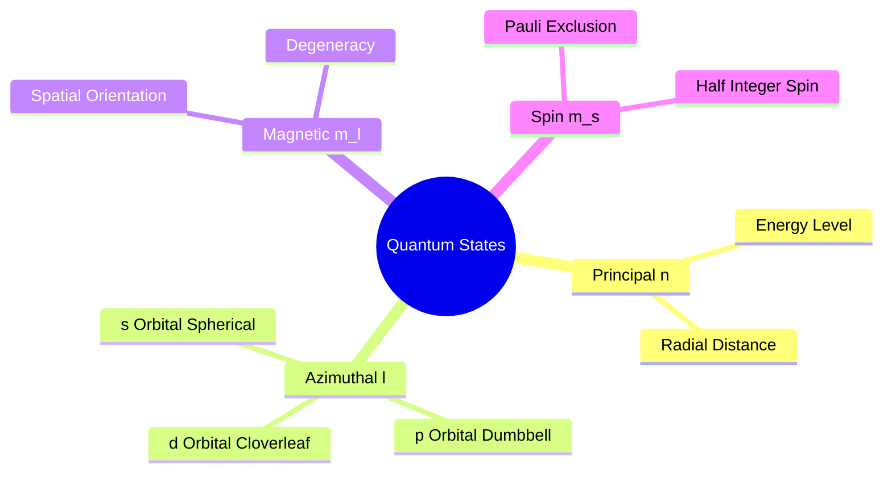
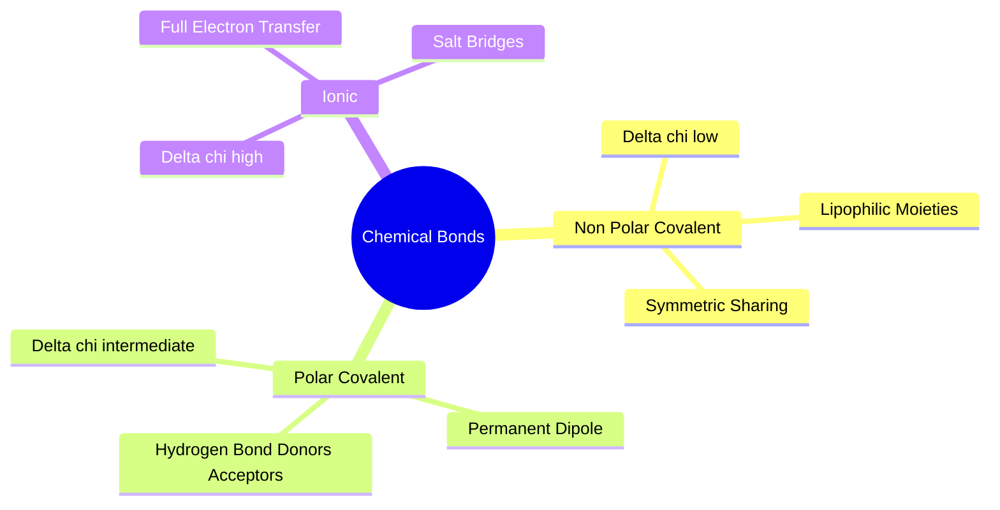
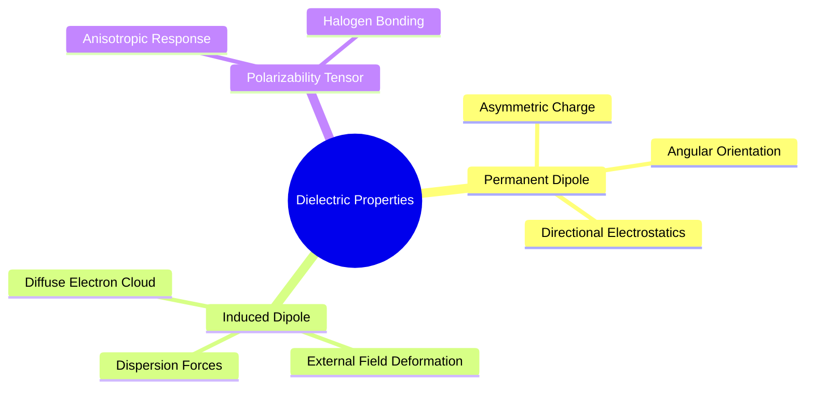

## 1.1. Subatomic Physics and Chemical Bonding

### 1.1.1. Atomic Orbitals and Electronic Configuration

#### 1. Concept Definition & Physical Nature
All chemical matter consists of atoms comprising a dense nucleus (protons and neutrons) surrounded by an electron cloud. In quantum mechanics, an electron does not follow a definite trajectory; its state is described by a wave function $\psi(\mathbf{r})$ obtained by solving the time-independent Schrödinger equation:
$$\hat{H}\psi = E\psi, \quad \hat{H} = -\frac{\hbar^2}{2m_e}\nabla^2 + V(\mathbf{r})$$
The square magnitude $|\psi(\mathbf{r})|^2$ defines the probability density of locating the electron at spatial vector $\mathbf{r}$. Atomic orbitals are stationary quantum states characterized by four quantum numbers:
1. **Principal Quantum Number ($n \in \{1, 2, 3, \dots\}$)**: Governs the radial extent and energy tier of the orbital shell.
2. **Azimuthal/Angular Momentum Quantum Number ($l \in \{0, 1, \dots, n-1\}$)**: Dictates orbital angular momentum and boundary geometry. Designated as $s$ ($l=0$, spherical), $p$ ($l=1$, dumbbell-shaped), $d$ ($l=2$, cloverleaf), and $f$ ($l=3$).
3. **Magnetic Quantum Number ($m_l \in \{-l, \dots, +l\}$)**: Defines the spatial orientation of angular momentum along a reference quantization axis ($z$).
4. **Spin Quantum Number ($m_s \in \{-1/2, +1/2\}$)**: Intrinsic magnetic angular momentum of the electron.



#### 2. Why It Matters in Biological & Chemical Systems
Biological and pharmaceutical chemistry primarily involves lighter elements: Hydrogen ($Z=1$), Carbon ($Z=6$), Nitrogen ($Z=7$), Oxygen ($Z=8$), Fluorine ($Z=9$), Phosphorus ($Z=15$), Sulfur ($Z=16$), and Chlorine ($Z=17$). The chemical reactivity, coordination number, valence limits, and interaction geometry of these elements are governed by their valence electrons—those occupying the outermost electronic shell.

Under Hund's rule, Aufbau's principle, and the Pauli exclusion principle (no two electrons can possess identical quantum number quadruplets), electrons populate lower-energy states first. The configuration of Carbon ($1s^2 2s^2 2p^2$) has four valence electrons ($2s$ and $2p$) available for bonding, permitting the formation of four stable directional covalent bonds upon promotion and hybridization.

#### 3. Quad-Disciplinary Integration
* **Biology**: Enzymes achieve catalytic acceleration by orienting amino acid sidechain orbitals with sub-angstrom precision to interact with the frontier molecular orbitals of substrate transition states.
* **Chemistry**: The availability of empty or half-filled valence orbitals dictates Lewis acidity and basicity, controlling nucleophilic attack and electrophilic aromatic substitution mechanisms.
* **Physics / Thermodynamics**: Overlap of electron clouds generates quantum mechanical exchange interactions and Pauli repulsion forces when electron densities interpenetrate at short distances.
* **Machine Learning Implementation**: In the [[6.1.1. Six-Layer Equiformer-Light GNN Architecture]], continuous atomic numbers $Z$ are mapped into an initial embedding space via an embedding table:
  $$\mathbf{h}_i^{(0)} = \text{EmbeddingTable}(Z_i) \in \mathbb{R}^{128}$$
  This embedding parameterizes the valence state and core charge without hand-coded feature representations, enabling the network to learn smooth chemical relationships across the periodic table.

---

### 1.1.2. Electronegativity and Chemical Bond Types
```text
File: SynPath-3D Knowledge System/1. Foundational Physics and Physical Chemistry/1.1. Subatomic Physics and Chemical Bonding/1.1.2. Electronegativity and Chemical Bond Types.md
Tags: #chemistry/bonding #physics/electronegativity #foundations
```

#### 1. Concept Definition & Physical Nature
**Electronegativity ($\chi$)** measures an atom's tendency to attract shared electron density within a covalent bond. Quantified empirically by Linus Pauling:
$$|\chi_A - \chi_B| = \sqrt{E_d(AB) - \frac{E_d(AA) + E_d(BB)}{2}}$$
where $E_d(AB)$ represents the bond dissociation energy of the heterodiatomic molecule in $\text{eV}$.

Depending on the difference $\Delta\chi = |\chi_A - \chi_B|$, chemical bonds fall into three classes:
1. **Non-Polar Covalent Bonds ($\Delta\chi \lesssim 0.4$)**: Electron density is shared symmetrically between bonded nuclei (e.g., $\text{C}-\text{C}$, $\text{C}-\text{H}$).
2. **Polar Covalent Bonds ($0.4 < \Delta\chi \lesssim 1.7$)**: Electron density shifts toward the more electronegative atom, generating partial charges $\delta^+$ and $\delta^-$ (e.g., $\text{C}-\text{O}$, $\text{N}-\text{H}$, $\text{C}-\text{F}$).
3. **Ionic Bonds ($\Delta\chi > 1.7$)**: Electron transfer occurs, forming isolated electrostatic ions held together by Coulomb forces:
   $$V_{\text{Coulomb}}(r) = \frac{1}{4\pi\varepsilon_0\varepsilon_r}\frac{q_A q_B}{r}$$



#### 2. Why It Matters in Biological & Chemical Systems
Proteins and drug molecules are heteropolymers containing elements with varied electronegativities ($\chi_{\text{H}}=2.20$, $\chi_{\text{C}}=2.55$, $\chi_{\text{N}}=3.04$, $\chi_{\text{O}}=3.44$, $\chi_{\text{F}}=3.98$). Polar covalent bonds create directional, permanent electrostatic fields that govern molecular recognition. 

When a drug molecule enters an active site, its polar groups must align with complementary polar groups in the receptor:
* Carbonyl groups ($\text{C}^{\delta+}=\text{O}^{\delta-}$) interact with amine protons ($\text{N}^{\delta-}-\text{H}^{\delta+}$).
* Negatively polarized fluorines interact with electron-deficient aromatic rings or backbone amide carbons.

#### 3. Quad-Disciplinary Integration
* **Biology**: Protease cleavage relies on polarized carbonyl carbons ($\text{C}^{\delta+}=\text{O}^{\delta-}$) undergoing nucleophilic attack by catalytic serine hydroxyls ($\text{O}^{\delta-}-\text{H}^{\delta+}$) or water molecules.
* **Chemistry**: Bond polarization alters infrared vibrational frequencies, carbon NMR chemical shifts, and thermodynamic leaving group potential in chemical synthesis.
* **Physics / Thermodynamics**: Polarization reduces non-bonded interaction distances below the sum of standard van der Waals radii due to attractive electrostatic monopole and dipole terms.
* **Machine Learning Implementation**: The [[6.1.1. Six-Layer Equiformer-Light GNN Architecture]] avoids predicting discrete formal valences. Instead, it incorporates physiological partial formal charges $q_i \in \{-1.0, -0.5, 0.0, +0.5, +1.0\}$ directly into the node feature vector:
  $$\mathbf{s}_i^{(0)} = \mathbf{W}_{\text{atom}}\mathbf{h}_i^{(0)} + \mathbf{W}_{\text{charge}}\text{MLP}(q_i) \in \mathbb{R}^{256}$$
  This provides the message-passing layers with inductive biases for local electrostatics.

---

### 1.1.3. Molecular Dipoles and Polarizability
```text
File: SynPath-3D Knowledge System/1. Foundational Physics and Physical Chemistry/1.1. Subatomic Physics and Chemical Bonding/1.1.3. Molecular Dipoles and Polarizability.md
Tags: #physics/dipole-moment #physics/polarizability #biophysics
```

#### 1. Concept Definition & Physical Nature
A **molecular dipole moment ($\vec{\mu}$)** represents the first spatial moment of an asymmetric charge distribution:
$$\vec{\mu} = \sum_{i=1}^N q_i \mathbf{r}_i = \int \rho(\mathbf{r})\mathbf{r}\,d^3\mathbf{r}$$
It is measured in Debyes ($1\text{ D} = 3.33564 \times 10^{-30}\text{ C}\cdot\text{m}$).

**Polarizability ($\alpha$)** quantifies the deformability of an electron cloud when subjected to an external electric field $\mathbf{E}_{\text{ext}}$:
$$\vec{\mu}_{\text{ind}} = \alpha \mathbf{E}_{\text{ext}} + \frac{1}{2}\beta \mathbf{E}_{\text{ext}}^2 + \dots$$
where $\alpha$ is a second-rank symmetric tensor. Larger, less electronegative atoms (such as Sulfur, Bromine, and Iodine) possess diffuse, loosely held electron clouds with higher polarizabilities than compact, highly electronegative atoms (such as Fluorine and Oxygen).



#### 2. Why It Matters in Biological & Chemical Systems
Permanent dipoles govern directional electrostatic interactions, while polarizability dictates London dispersion forces, $\pi-\pi$ stacking, and halogen bonding. 

In **halogen bonding**, an anisotropic electron distribution on heavier halogens (Chlorine, Bromine, Iodine) creates an electron-deficient region along the extension of the carbon-halogen covalent bond known as a **$\sigma$-hole**. This electropositive cap interacts with nucleophilic Lewis bases (backbone carbonyl oxygens) at an angle of $\approx 180^\circ$:
$$\text{C}-\text{X}\dots\text{O}=\text{C} \quad (\theta \approx 175^\circ - 180^\circ)$$

#### 3. Quad-Disciplinary Integration
* **Biology**: Anisotropic polarizability allows sulfur atoms in methionine residues to interact favorably with aromatic rings in binding sites through dispersion and sulfur-aromatic interactions.
* **Chemistry**: Introducing fluorine into a lead candidate decreases its polarizability while increasing metabolic stability, lowering the overall lipophilicity ($\log P$) of the compound.
* **Physics / Thermodynamics**: Free energy of interaction between an ion and an induced dipole scales with distance as $V(r) \propto -q^2\alpha / (2\varepsilon r^4)$, which decays faster than charge-dipole forces ($V(r) \propto -q\mu / (\varepsilon r^2)$).
* **Machine Learning Implementation**: In [[2.2. Pretrained 3D Molecular Foundation Synthon Embedder (Uni-Mol2)]], synthon representations are derived from a molecular foundation model pretrained on quantum-mechanical properties (including multipole moments and polarizabilities from PCQM4Mv2). This exposes electrostatic properties directly to the network without hand-crafted heuristics.