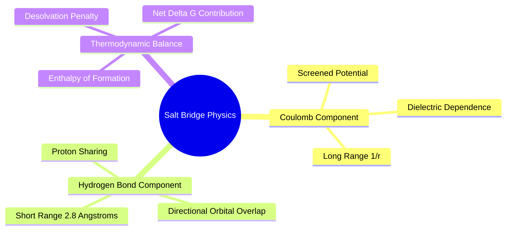
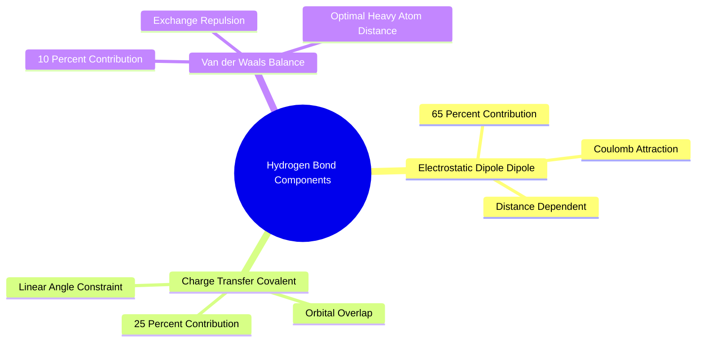
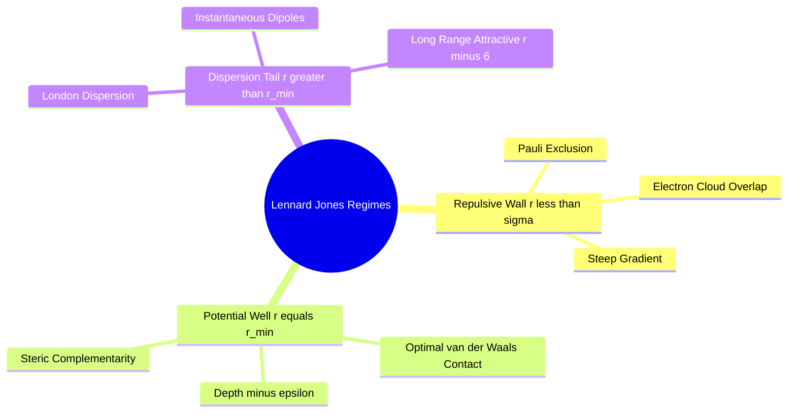
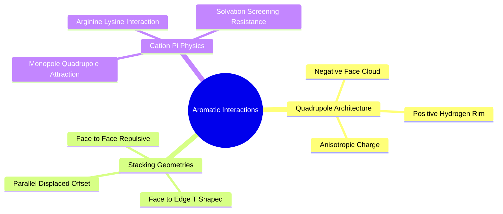

## 1.2. Non-Covalent Intermolecular Forces

### 1.2.1. Electrostatic Interactions and Salt Bridges
```text
File: SynPath-3D Knowledge System/1. Foundational Physics and Physical Chemistry/1.2. Non-Covalent Intermolecular Forces/1.2.1. Electrostatic Interactions and Salt Bridges.md
Tags: #biophysics/salt-bridges #physics/electrostatics #binding-affinity
```

#### 1. Concept Definition & Physical Nature
A **salt bridge** is a non-covalent interaction combining two physical components:
1. Long-range Coulombic attraction between two oppositely charged ionic functional groups.
2. Short-range, directional hydrogen bonding between the donor protons of the cation and the acceptor oxygens of the anion.

In biological proteins at neutral pH, salt bridges form between:
* Anionic carboxylate groups: Aspartate ($\text{Asp}-\text{COO}^-$) and Glutamate ($\text{Glu}-\text{COO}^-$).
* Cationic basic groups: Lysine ($\text{Lys}-\text{NH}_3^+$), Arginine ($\text{Arg}-\text{NH}-\text{C}(\text{NH}_2)_2^+$), and Histidine ($\text{His}-\text{Im}^+$ in its protonated form).

The interaction energy is governed by the dielectric-screened Coulomb potential:
$$\Delta G_{\text{Coulomb}} = \frac{q_1 q_2 e^2}{4\pi\varepsilon_0\varepsilon_{\text{eff}} r_{12}}$$
where $\varepsilon_{\text{eff}}$ is the effective local dielectric constant. In bulk water, $\varepsilon \approx 78.4$, which screens charges heavily. In a buried hydrophobic binding pocket, $\varepsilon \approx 4\text{ to }10$, making a buried, unshielded salt bridge provide a large enthalpic contribution ($\Delta H \approx -3 \text{ to } -8\text{ kcal/mol}$).



#### 2. Why It Matters in Biological & Chemical Systems
While a salt bridge yields a favorable Coulombic enthalpy ($\Delta H_{\text{form}} \ll 0$), forming it requires stripping hydration water from both the cationic and anionic functional groups. The energetic penalty of desolvating two isolated charges is substantial:
$$\Delta G_{\text{net}} = \Delta H_{\text{bridge}} - (\Delta G_{\text{desolv, cation}} + \Delta G_{\text{desolv, anion}})$$
If a salt bridge is formed on the solvent-exposed surface of a protein, the desolvation penalty can match or exceed the Coulombic attraction, rendering the net interaction free energy neutral ($\Delta G_{\text{net}} \approx 0 \pm 1\text{ kcal/mol}$). 

Conversely, if the salt bridge is positioned in a desolvated, sterically occluded subpocket, the desolvation penalty is paid prior to binding or compensated by surrounding structural waters, turning the salt bridge into a key anchor for binding affinity and selectivity.

#### 3. Quad-Disciplinary Integration
* **Biology**: Kinase inhibitors target the catalytic Lysine residue (e.g., Lys745 in EGFR) by placing a carboxylate or heteroaromatic bioisostere to form a salt bridge or hydrogen-bonding network.
* **Chemistry**: Carboxylic acid bioisosteres (e.g., tetrazoles, sulfonamides, acylureas) mimic the charge and hydrogen-bonding capacity of an acid while reducing the desolvation penalty and improving oral bioavailability.
* **Physics / Thermodynamics**: The dielectric constant varies smoothly across the protein-water interface. This effect is captured computationally using the Poisson-Boltzmann equation:
  $$\nabla \cdot \left[ \varepsilon(\mathbf{r})\nabla \Phi(\mathbf{r}) \right] - \kappa^2(\mathbf{r})\Phi(\mathbf{r}) = -\rho(\mathbf{r})$$
* **Machine Learning Implementation**: The [[6.2.2. Target Interaction Field Anchor Prediction]] head explicit models salt bridges. It decodes discrete target anchors $\vec{x}_m$ labeled as `Charge-Positive` or `Charge-Negative` that attract complementary ionic functional groups from the synthon library:
  $$\mathcal{L}_{\text{anchor-type}} = -\sum_{m=1}^M \log P(\tau_m = \text{Ionic} \mid \mathcal{P})$$

---

### 1.2.2. Hydrogen Bonding Physics and Geometry
```text
File: SynPath-3D Knowledge System/1. Foundational Physics and Physical Chemistry/1.2. Non-Covalent Intermolecular Forces/1.2.2. Hydrogen Bonding Physics and Geometry.md
Tags: #biophysics/hydrogen-bonding #chemistry/geometry #physics
```

#### 1. Concept Definition & Physical Nature
A **hydrogen bond (H-bond)** is an attractive interaction of the form $\text{D}-\text{H}\dots\text{A}$, where a hydrogen atom is covalently bound to an electronegative donor atom ($\text{D} \in \{\text{O, N, F, S}\}$), and interacts with a non-bonding lone pair of an electronegative acceptor atom ($\text{A} \in \{\text{O, N, F, Cl}\}$).

The physics of the hydrogen bond involves three distinct components:
1. **Electrostatic Dipole-Dipole Attraction ($\approx 65\%$)**: Mutual attraction between the partial positive charge $\delta^+$ on Hydrogen and the partial negative charge $\delta^-$ on the Acceptor lone pair.
2. **Covalent / Charge-Transfer Character ($\approx 25\%$)**: Orbital overlap involving the mixing of the occupied non-bonding lone pair orbital $n_{\text{A}}$ of the acceptor into the unoccupied antibonding orbital $\sigma^*_{\text{D}-\text{H}}$ of the donor:
   $$\Delta E_{\text{CT}} \propto \frac{|\langle n_{\text{A}} | \hat{H} | \sigma^*_{\text{D}-\text{H}} \rangle|^2}{\varepsilon_{\sigma^*} - \varepsilon_n}$$
   This charge-transfer component requires near-linear geometry ($\theta_{\text{D}-\text{H}\dots\text{A}} \approx 180^\circ$).
3. **Van der Waals Dispersion & Exchange Repulsion ($\approx 10\%$)**: Repulsive forces that dictate an optimal heavy-atom donor-acceptor distance:
   $$d(\text{D}\dots\text{A}) \approx 2.7\text{ \AA} - 3.1\text{ \AA}$$



#### 2. Why It Matters in Biological & Chemical Systems
Hydrogen bonds provide directional specificity in molecular recognition. A deviation of $20^\circ$ from linearity ($\theta < 160^\circ$) can reduce H-bond binding free energy by $50\%$.

```text
Ideal Hydrogen Bond Geometry:
Donor-D ──── H · · · · · · · · · · · Acceptor-A
   │       1.0 Å       1.8 Å            │
   └────────────── 2.8 Å ───────────────┘
          Angle D-H···A ≈ 180°
```

A common failure mode in generative models is satisfying the distance constraint ($d < 3.2\text{ \AA}$) while violating the angular constraint ($\theta \approx 120^\circ$), resulting in an unphysical interaction that incurs an energetic penalty rather than providing affinity.

#### 3. Quad-Disciplinary Integration
* **Biology**: Secondary protein structures ($\alpha$-helices, $\beta$-sheets) are held together by repetitive hydrogen bonds between backbone carbonyls ($\text{C}=\text{O}$) and amides ($\text{N}-\text{H}$).
* **Chemistry**: The presence of intramolecular hydrogen bonds can mask polar groups, promoting passive membrane permeability and improving blood-brain barrier penetration.
* **Physics / Thermodynamics**: Breaking a donor-water hydrogen bond to form a donor-protein hydrogen bond yields a net free energy change of:
  $$\Delta G_{\text{H-bond, net}} = \Delta G(\text{D}-\text{H}\dots\text{A}_{\text{prot}}) + \Delta G(\text{H}_2\text{O}\dots\text{H}_2\text{O}) - \left[ \Delta G(\text{D}-\text{H}\dots\text{H}_2\text{O}) + \Delta G(\text{A}_{\text{prot}}\dots\text{H}_2\text{O}) \right]$$
  Typically, $\Delta G_{\text{net}} \approx -0.5 \text{ to } -1.5\text{ kcal/mol}$ per hydrogen bond.
* **Machine Learning Implementation**: The [[6.2.2. Target Interaction Field Anchor Prediction]] module predicts directional target frames $\mathbf{R}_m \in \mathrm{SO}(3)$ for every H-bond anchor. Its loss penalizes angular misalignment between the donor-hydrogen vector $\vec{u}_{\text{DH}}$ and the target normal:
  $$\mathcal{L}_{\text{angle}} = 1 - \cos(\vec{u}_{\text{DH}}, \vec{v}_{\text{target}})$$

---

### 1.2.3. Van der Waals Dispersion and Repulsive Walls
```text
File: SynPath-3D Knowledge System/1. Foundational Physics and Physical Chemistry/1.2. Non-Covalent Intermolecular Forces/1.2.3. Van der Waals Dispersion and Repulsive Walls.md
Tags: #physics/lennard-jones #biophysics/sterics #force-fields
```

#### 1. Concept Definition & Physical Nature
Van der Waals interactions describe non-bonded, non-electrostatic forces between neutral atoms. They consist of two opposing physical regimes:
1. **London Dispersion ($V_{\text{disp}} \propto -r^{-6}$)**: Quantum electrodynamic fluctuations create instantaneous dipoles in an electron cloud, inducing correlated dipoles in adjacent atoms.
2. **Pauli / Born Exchange Repulsion ($V_{\text{rep}} \propto r^{-12}$)**: Overlap of closed electronic shells violates the Pauli exclusion principle, producing steep quantum mechanical repulsion.

These regimes are conventionally modeled via the **Lennard-Jones 12-6 Potential**:
$$V_{\text{LJ}}(r) = 4\varepsilon \left[ \left(\frac{\sigma}{r}\right)^{12} - \left(\frac{\sigma}{r}\right)^6 \right] = \varepsilon \left[ \left(\frac{r_{\text{min}}}{r}\right)^{12} - 2\left(\frac{r_{\text{min}}}{r}\right)^6 \right]$$
where $\varepsilon$ is the potential well depth, $\sigma$ is the finite distance at which the inter-particle potential is zero ($V(\sigma) = 0$), and $r_{\text{min}} = 2^{1/6}\sigma$ is the distance of the potential minimum with well depth $-\varepsilon$.



#### 2. Why It Matters in Biological & Chemical Systems
The steepness of the repulsive wall ($r^{-12}$) imposes strict boundaries on physical space. An atomic overlap of just $0.3\text{ \AA}$ beyond $r_{\text{min}}$ increases potential energy by tens of $\text{kcal/mol}$, causing numerical explosions in force-field minimizations and triggering failures in structural validation suites like **PoseBusters v2**.

Standard 12-6 potentials present severe challenges in machine learning: as $r \to 0$, $V(r) \to \infty$, causing exploding gradients in low-precision floating point arithmetic (`float16`). 

To address this, SynPath-3D implements a **Buffered 14-7 Potential (Halgren Function)** in its [[7.3.1. Differentiable Thermodynamic Phys-Score]]:
$$V_{14-7}(r) = \varepsilon \left( \frac{1.07 r_{v}}{r + 0.07 r_{v}} \right)^7 \left( \frac{1.12 r_{v}^7}{r^7 + 0.12 r_{v}^7} - 2 \right)$$
This potential has a softer repulsive core that remains numerically stable under gradient descent while preserving the experimental well depth at $r_v$.

#### 3. Quad-Disciplinary Integration
* **Biology**: Surface packing inside an enzyme's hydrophobic core approaches the packing density of crystalline solids (packing coefficient $\gamma \approx 0.74$), requiring high shape complementarity between ligand and protein.
* **Chemistry**: Bulky, branched alkyl substituents (e.g., tert-butyl groups) occupy hydrophobic cavities through London dispersion, but induce severe steric clashes if placed near rigid backbone walls.
* **Physics / Thermodynamics**: The volume occupied by an atom is approximated by its van der Waals radius ($r_{\text{vdW}}$). The sum of atomic volumes directly influences the free energy of cavity formation in solvent.
* **Machine Learning Implementation**: In [[5.3.2. Analytical Jacobian Projected Clash Resolution]], inter-atomic clashes trigger an analytical gradient projection through the Product of Exponentials (PoE) spatial Jacobian:
  $$\nabla_{\vec{\theta}} V_{\text{clash}} = \mathbf{J}(\vec{\theta})^T \left( \frac{\partial V_{\text{clash}}}{\partial \vec{x}} \right) \in \mathbb{R}^K$$
  This directly relieves steric clashes in $<0.5\text{ ms}$ on GPU without unconstrained Cartesian manipulation.

---

### 1.2.4. Pi Systems and Aromatic Interactions
```text
File: SynPath-3D Knowledge System/1. Foundational Physics and Physical Chemistry/1.2. Non-Covalent Intermolecular Forces/1.2.4. Pi Systems and Aromatic Interactions.md
Tags: #chemistry/aromaticity #biophysics/pi-stacking #physics
```

#### 1. Concept Definition & Physical Nature
Aromatic rings contain delocalized $\pi$-electron clouds positioned above and below the planar $\sigma$-framework. This spatial charge separation creates a permanent molecular **quadrupole moment ($\mathbf{\Theta}$)**:
* A partial negative charge ($\delta^-$) concentrated above and below the ring face.
* A compensating partial positive charge ($\delta^+$) located on the peripheral ring hydrogens in the molecular plane.

Interactions between aromatic rings are governed by quadrupole-quadrupole electrostatics, dispersion, and exchange repulsion, adopting two primary geometries:
1. **Face-to-Edge (T-Shaped)**: An electropositive hydrogen atom of one ring points toward the electronegative $\pi$-cloud of another ($\theta \approx 90^\circ$, $d \approx 4.5\text{ \AA}\text{ to }5.0\text{ \AA}$).
2. **Parallel-Displaced (Offset Stacking)**: Rings are parallel but offset by $1.2\text{ \AA}\text{ to }1.8\text{ \AA}$ to avoid direct face-to-face $\pi$-electron overlap ($\theta \approx 0^\circ$, interplanar distance $d \approx 3.3\text{ \AA}\text{ to }3.6\text{ \AA}$). Face-to-face alignment is repulsive due to $\pi-\pi$ electronic clash.



#### 2. Why It Matters in Biological & Chemical Systems
Aromatic interactions provide conformational rigidity and free energy to drug-protein complexes:
* **$\pi-\pi$ Stacking**: Phenylalanine ($\text{Phe}$), Tyrosine ($\text{Tyr}$), and Tryptophan ($\text{Trp}$) sidechains form offset aromatic interactions with drug aromatic rings.
* **Cation-$\pi$ Interactions**: A localized cationic charge (e.g., the guanidinium group of $\text{Arg}$ or the ammonium of $\text{Lys}$) binds to the electron-rich face of an aromatic ring with an interaction energy ($\Delta H \approx -2\text{ to } -5\text{ kcal/mol}$) that often exceeds standard water-mediated hydrogen bonds.

#### 3. Quad-Disciplinary Integration
* **Biology**: Acetylcholinesterase binds its substrate acetylcholine via a cation-$\pi$ interaction between the quaternary trimethylammonium cation and the aromatic face of Trp84.
* **Chemistry**: Fluorinating an aromatic ring inverts its quadrupole moment from negative to positive, converting a face that attracted cations into one that attracts electron lone pairs or forms offset interactions with electron-rich arenes.
* **Physics / Thermodynamics**: The Hunter-Sanders model explains aromatic interaction geometry through competing $\sigma$-framework electrostatics and $\pi$-electron repulsion terms.
* **Machine Learning Implementation**: The [[6.2.2. Target Interaction Field Anchor Prediction]] head models aromatic centroids as directional anchor frames:
  $$\mathbf{R}_{\text{aromatic}} = [\vec{n}_{\text{plane}} \mid \vec{v}_{\text{major}} \mid \vec{v}_{\text{minor}}] \in \mathrm{SO}(3)$$
  This enforces proper parallel-displaced or T-shaped orientations during generative synthon flow, avoiding repulsive face-to-face placements.