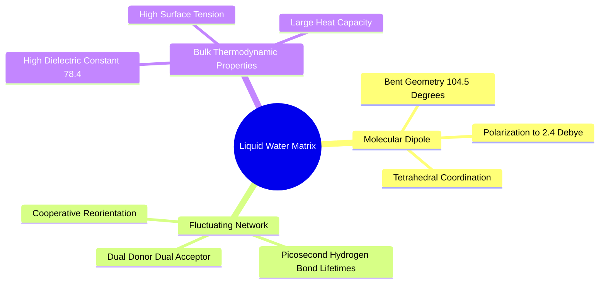
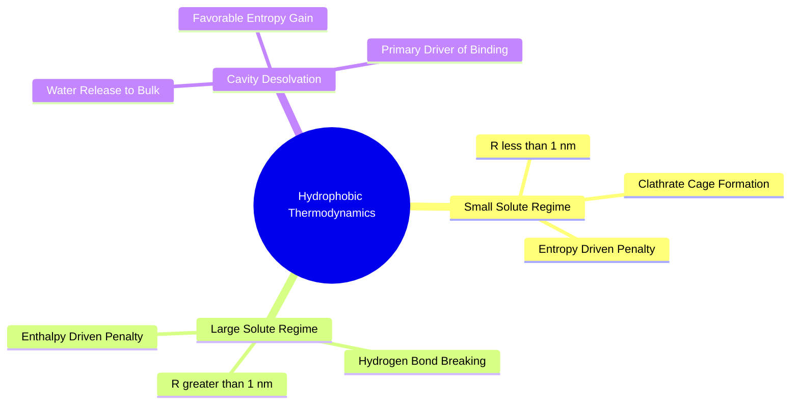
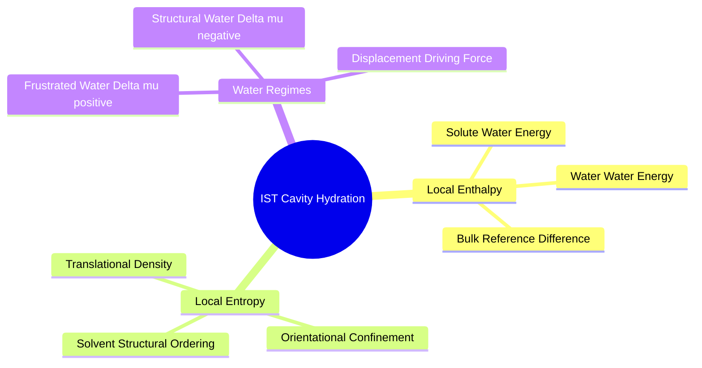

## 1.3. Biological Water and Solvation Thermodynamics

### 1.3.1. Liquid Water Structure and Anomalous Thermodynamics
```text
File: SynPath-3D Knowledge System/1. Foundational Physics and Physical Chemistry/1.3. Biological Water and Solvation Thermodynamics/1.3.1. Liquid Water Structure and Anomalous Thermodynamics.md
Tags: #physics/water #thermodynamics/hydration #biophysics
```

#### 1. Concept Definition & Physical Nature
A water molecule ($\text{H}_2\text{O}$) possesses a bent geometry ($\text{H}-\text{O}-\text{H}$ bond angle of $104.5^\circ$) due to repulsion between oxygen's two non-bonding $sp^3$ lone pairs and two bonding pairs. Oxygen's high electronegativity ($\chi_{\text{O}}=3.44$) creates a strong permanent dipole ($\mu = 1.85\text{ D}$ in the gas phase, increasing to $\mu \approx 2.4\text{--}2.6\text{ D}$ in liquid water due to mutual polarization).

In bulk liquid water, every molecule acts simultaneously as a **two-fold hydrogen bond donor** and a **two-fold hydrogen bond acceptor**, forming a dynamic, transient tetrahedral hydrogen-bond network:
$$\langle N_{\text{H-bonds}} \rangle \approx 3.4 - 3.6 \quad (\text{at } T = 298.15\text{ K})$$
Hydrogen bonds fluctuate on a sub-picosecond timescale ($\tau_{\text{reorient}} \approx 1\text{ to }2\text{ ps}$), giving liquid water high heat capacity, high surface tension, and a large dielectric constant ($\varepsilon \approx 78.4$).



#### 2. Why It Matters in Biological & Chemical Systems
Water is the active thermodynamic medium in all biochemical processes. When a drug molecule binds to a receptor cavity, it does not interact with bare protein atoms in a vacuum. It must compete with and perturb the structured water network inhabiting the pocket. 

The binding free energy $\Delta G_{\text{bind}}$ is the net difference between forming protein-ligand interactions and the free energy consumed to disrupt water-water and water-protein interactions:
$$\Delta G_{\text{bind}} = G_{\text{complex}} + G_{\text{bulk water}} - (G_{\text{solvated protein}} + G_{\text{solvated ligand}})$$

#### 3. Quad-Disciplinary Integration
* **Biology**: Structured water molecules in the active sites of retroviral proteases coordinate symmetric homodimeric flaps to substrate peptides.
* **Chemistry**: Solvatochromism describes changes in chemical absorption spectra based on solvent polarity and dielectric stabilization.
* **Physics / Thermodynamics**: The chemical potential of water in bulk equilibrium is:
  $$\mu_{\text{bulk}} = \left(\frac{\partial G}{\partial N}\right)_{T, P} \approx -5.74\text{ kcal/mol} \quad (\text{relative to ideal gas at standard state})$$
* **Machine Learning Implementation**: The [[4. 3. Equivariant Neural Solvation Field]] head predicts local water density ratios relative to bulk solvent:
  $$g_O(\mathbf{r}) = \frac{\rho_O(\mathbf{r})}{\rho_{\text{bulk}}}, \quad \rho_{\text{bulk}} \approx 0.0334\text{ molecules/\AA}^3$$
  This indicates whether a cavity region is hydrated, dehydrated, or occupied by ordered water.

---

### 1.3.2. The Hydrophobic Effect and Solvation Free Energy
```text
File: SynPath-3D Knowledge System/1. Foundational Physics and Physical Chemistry/1.3. Biological Water and Solvation Thermodynamics/1.3.2. The Hydrophobic Effect and Solvation Free Energy.md
Tags: #thermodynamics/hydrophobic-effect #biophysics/free-energy #entropy
```

#### 1. Concept Definition & Physical Nature
The **hydrophobic effect** describes the thermodynamic tendency of non-polar solutes to aggregate in aqueous solution, minimizing their contact with water. It is not an attractive intermolecular force between non-polar groups, but rather an **entropically driven process governed by water's hydrogen-bonding network**.

Thermodynamic decomposition of solvation free energy:
$$\Delta G_{\text{solv}} = \Delta H_{\text{solv}} - T\Delta S_{\text{solv}}$$

At room temperature ($T \approx 298\text{ K}$), non-polar solute solvation proceeds through two spatial regimes:
1. **Small Solutes ($R < 1\text{ nm}$, e.g., small drug fragments)**: Water molecules form rigid, ice-like clathrate cages around the solute without breaking hydrogen bonds ($\Delta H_{\text{solv}} \approx 0$ or slightly negative). This structural ordering freezes water orientational degrees of freedom, causing a large entropic penalty ($\Delta S_{\text{solv}} \ll 0 \implies -T\Delta S_{\text{solv}} > 0$).
2. **Large Solutes ($R > 1\text{ nm}$, e.g., protein cavities and large drug scaffolds)**: Water cannot hydrogen-bond around the surface without breaking network links. Here, the process becomes **enthalpically unfavorable** ($\Delta H_{\text{solv}} > 0$) as hydrogen bonds are lost, driving dewetting transitions at hydrophobic surfaces.



#### 2. Why It Matters in Biological & Chemical Systems
The hydrophobic effect is the primary driving force for protein folding, membrane formation, and high-affinity ligand binding. 

When a lipophilic fragment is buried in a complementary hydrophobic binding pocket, the structured, entropically constrained water molecules occupying both the pocket and the ligand surface are displaced into bulk solvent. In bulk solvent, these waters regain translational and rotational freedom, producing an entropic gain:
$$\Delta S_{\text{release}} > 0 \implies -T\Delta S_{\text{release}} \ll 0$$
This displacement can provide $\approx -1.0\text{ to } -3.5\text{ kcal/mol}$ of binding free energy per displaced water molecule.

#### 3. Quad-Disciplinary Integration
* **Biology**: Hydrophobic core collapse during protein folding sequesters hydrophobic leucine, isoleucine, and valine sidechains away from water.
* **Chemistry**: The hydrophobic effect can lead to the **"hydrophobic trap"** or **"grease trap"**: adding aromatic rings can artificially inflate in vitro potency while degrading solubility, increasing clearance, and triggering hERG cardiotoxicity.
* **Physics / Thermodynamics**: The Lum-Chandler-Andersen (LCA) theory describes the crossover between entropic, volume-dominated small-length-scale hydration and enthalpic, surface-area-dominated large-length-scale dewetting.
* **Machine Learning Implementation**: In [[7. 3. Multi-Objective Reward and Diversity]], the reward function computes buried solvent-accessible surface area ($\Delta \text{SASA}$) balanced against an $\text{Fsp}^3$ regularizer to prevent the model from generating flat, lipophilic aromatic molecules:
  $$R_{\text{hydrophobic}} = \gamma_{\text{SASA}}\Delta\text{SASA}_{\text{apolar}} - \beta_{\text{grease}}(1 - \text{Fsp}^3)$$

---

### 1.3.3. Inhomogeneous Solvation Theory and Cavity Hydration
```text
File: SynPath-3D Knowledge System/1. Foundational Physics and Physical Chemistry/1.3. Biological Water and Solvation Thermodynamics/1.3.3. Inhomogeneous Solvation Theory and Cavity Hydration.md
Tags: #biophysics/solvation-rism #thermodynamics/water-frustration #computational-chemistry
```

#### 1. Concept Definition & Physical Nature
**Inhomogeneous Solvation Theory (IST)**, introduced by Lazaridis and developed in methodologies such as **WaterMap** and **GIST (Grid Inhomogeneous Solvation Theory)**, provides a statistical mechanical framework to compute the local thermodynamic properties of water molecules in an inhomogeneous environment (such as a protein binding cavity).

The excess chemical potential of water at a continuous spatial position $\mathbf{r}$ relative to bulk solvent is decomposed into local enthalpy and entropy:
$$\Delta \mu_{\text{excess}}(\mathbf{r}) = \Delta H_{\text{excess}}(\mathbf{r}) - T\Delta S_{\text{excess}}(\mathbf{r})$$
1. **Local Solvation Enthalpy ($\Delta H_{\text{excess}}(\mathbf{r})$)**:
   $$\Delta H_{\text{excess}}(\mathbf{r}) = \Delta E_{sw}(\mathbf{r}) + \Delta E_{ww}(\mathbf{r}) - E_{\text{bulk}}$$
   where $\Delta E_{sw}$ is the solute-water interaction energy and $\Delta E_{ww}$ is the water-water interaction energy between the voxel at $\mathbf{r}$ and neighboring waters.
2. **Local Solvation Entropy ($\Delta S_{\text{excess}}(\mathbf{r})$)**:
   $$\Delta S_{\text{excess}}(\mathbf{r}) = \Delta S_{\text{trans}}(\mathbf{r}) + \Delta S_{\text{orient}}(\mathbf{r})$$
   where the translational component depends on local water density $g(\mathbf{r})$:
   $$\Delta S_{\text{trans}}(\mathbf{r}) = -k_B \rho_{\text{bulk}} g(\mathbf{r}) \ln g(\mathbf{r})$$
   and the orientational component depends on the angular distribution of water orientations $\omega = (\phi, \theta, \psi)$:
   $$\Delta S_{\text{orient}}(\mathbf{r}) = -k_B \rho_{\text{bulk}} g(\mathbf{r}) \int g(\omega \mid \mathbf{r}) \ln g(\omega \mid \mathbf{r})\,d\omega$$



#### 2. Why It Matters in Biological & Chemical Systems
Water molecules confined in subpockets fall into two thermodynamic regimes:
1. **Frustrated (High-Energy) Waters ($\Delta \mu_{\text{excess}} > +1.5\text{ kcal/mol}$)**: Confined waters that cannot satisfy their tetrahedral hydrogen bonds due to steric crowding by non-polar pocket walls, while suffering orientational entropy loss. Displacing these waters into bulk solvent releases free energy, serving as a primary driver of drug affinity.
2. **Stable (Structural) Waters ($\Delta \mu_{\text{excess}} < -2.0\text{ kcal/mol}$)**: Waters that form multiple ideal hydrogen bonds with polar protein residues in positions with low steric confinement. Displacing a structural water incurs a severe free energy penalty ($\Delta G > 0$), resulting in loss of binding potency.

```text
The Cavity Hydration Energy Landscape:
Receptor Binding Cavity
┌────────────────────────────────────────────────────────┐
│                                                        │
│   Hydrophobic Groove             Catalytic Dyad        │
│   ┌────────────────────┐         ┌──────────────────┐  │
│   │ Frustrated Water   │         │ Structural Water │  │
│   │ Δμ > +2.5 kcal/mol │         │ Δμ < -3.0 kcal/mol│ │
│   │ [DISPLACE WITH     │         │ [PRESERVE AND    │  │
│   │  LIPOPHILIC GROUP] │         │  H-BOND TO]      │  │
│   └────────────────────┘         └──────────────────┘  │
│                                                        │
└────────────────────────────────────────────────────────┘
```

#### 3. Quad-Disciplinary Integration
* **Biology**: Selective kinase inhibitors (such as Imatinib or Sorafenib) achieve target selectivity over close family members by displacing frustrated waters in the allosteric back-pocket that neighboring kinases cannot accommodate.
* **Chemistry**: Structure-activity relationships (SAR) frequently exhibit **"magic methyl"** effects: adding a single methyl group increases binding affinity by $>100$-fold ($\Delta\Delta G \approx -2.8\text{ kcal/mol}$). This occurs when the methyl group displaces a frustrated water into bulk solvent without altering ligand conformation.
* **Physics / Thermodynamics**: Solving IST through explicit molecular dynamics requires nanosecond simulations to sample water orientations. Within SynPath-3D, repeated runtime hydration queries are handled by HENF. 3D-RISM remains a reference or auxiliary teacher method.
* **Machine Learning Implementation**: The [[4. 3. Equivariant Neural Solvation Field]] integrates the continuous HENF potential over the ligand's atomic positions:
  $$\Delta G_{\text{water,liberation}} = \sum_{a \in \text{ligand}} \text{ReLU}\left( \Psi_\phi(\vec{x}_a)_{\Delta\mu} - 1.5\text{ kcal/mol} \right)$$
  This provides the generative model with analytical guidance toward thermodynamic hotspots.

---

### 1.3.4. Worked Exercise on Cavity Water Displacement
```text
File: SynPath-3D Knowledge System/1. Foundational Physics and Physical Chemistry/1.3. Biological Water and Solvation Thermodynamics/1.3.4. Worked Exercise on Cavity Water Displacement.md
Tags: #exercise #biophysics/solvation #thermodynamics #worked-problem
```

#### 1. Problem Statement
A tight, non-polar subpocket inside the active site of a serine protease contains a single confined water molecule. Molecular simulation and statistical mechanics yield the following thermodynamic parameters for this cavity water relative to bulk water:
* Solute-water interaction enthalpy: $\Delta E_{sw} = -3.20\text{ kcal/mol}$
* Water-water interaction enthalpy in the cavity: $\Delta E_{ww} = -4.10\text{ kcal/mol}$
* Enthalpy of bulk water: $E_{\text{bulk}} = -9.80\text{ kcal/mol}$
* Cavity water density factor: $g(\mathbf{r}) = 3.50$
* Orientational entropy loss: $-T\Delta S_{\text{orient}} = +3.80\text{ kcal/mol}$ at $T = 298.15\text{ K}$

A medicinal chemist proposes synthesizing two drug derivatives:
* **Derivative A (Methyl Substitution)**: Places a neutral $-\text{CH}_3$ group into the subpocket, displacing the confined water into bulk solvent. The methyl group forms non-polar van der Waals contacts with the subpocket: $\Delta H_{\text{vdW}} = -2.10\text{ kcal/mol}$. Its conformational immobilization penalty is $-T\Delta S_{\text{lig}} = +0.80\text{ kcal/mol}$.
* **Derivative B (Hydroxyl Substitution)**: Places an $-\text{OH}$ group that coordinates to the water molecule without displacing it, forming an ideal hydrogen bond with the cavity water ($\Delta H_{\text{H-bond}} = -4.50\text{ kcal/mol}$) with a desolvation cost for the hydroxyl group of $\Delta G_{\text{desolv, OH}} = +3.20\text{ kcal/mol}$.

Calculate:
1. The excess chemical potential $\Delta \mu_{\text{excess}}$ of the cavity water. Is this water "frustrated" or "structural"?
2. The net change in free energy ($\Delta\Delta G_{\text{bind}}$) for Derivative A.
3. The net change in free energy ($\Delta\Delta G_{\text{bind}}$) for Derivative B.
4. Which derivative should be selected to maximize potency, and what is the expected fold-change in inhibition constant ($K_i$)?

---

#### 2. Background Knowledge Required
* First and second laws of thermodynamics: $\Delta G = \Delta H - T\Delta S$.
* Inhomogeneous Solvation Theory (IST) decomposition for water chemical potential.
* The relationship between binding free energy and inhibition constant:
  $$\Delta G = -RT \ln K_i \iff K_i = \exp\left(\frac{\Delta G}{RT}\right), \quad RT \approx 0.593\text{ kcal/mol} \text{ at } 298.15\text{ K}$$

---

#### 3. Terminology Definitions
* **Confined Water**: A water molecule trapped within a protein binding site, restricted in its rotational and translational degrees of freedom by surrounding amino acid walls.
* **Bulk Water**: Liquid water far from any solute, enjoying full tetrahedral hydrogen-bonding coordination and unconstrained entropy.
* **Excess Chemical Potential ($\Delta \mu_{\text{excess}}$)**: The free energy cost of moving a water molecule from bulk liquid water into the specific pocket microenvironment. Positive values indicate an unstable, high-energy ("frustrated") water. Negative values indicate a stable, tightly bound ("structural") water.
* **$K_i$ (Inhibition Constant)**: The thermodynamic equilibrium dissociation constant for the enzyme-inhibitor complex. Smaller values indicate tighter binding.

---

#### 4. Step-by-Step Solution

##### Step 1: Compute the Enthalpy of the Cavity Water ($\Delta H_{\text{excess}}$)
The excess enthalpy is the difference between total interactions in the cavity and the reference interaction energy in bulk solvent:
$$\Delta H_{\text{excess}} = \Delta E_{sw} + \Delta E_{ww} - E_{\text{bulk}}$$
$$\Delta H_{\text{excess}} = (-3.20\text{ kcal/mol}) + (-4.10\text{ kcal/mol}) - (-9.80\text{ kcal/mol})$$
$$\Delta H_{\text{excess}} = -7.30\text{ kcal/mol} + 9.80\text{ kcal/mol} = +2.50\text{ kcal/mol}$$

*Result of Step 1*: The cavity water loses $2.50\text{ kcal/mol}$ of enthalpic stability relative to bulk water because its broken hydrogen bonds are not compensated by interactions with the non-polar subpocket walls.

---

##### Step 2: Compute the Translational Entropy of the Cavity Water ($-T\Delta S_{\text{trans}}$)
Using the IST translational entropy formula:
$$-T\Delta S_{\text{trans}} = k_B T \ln g(\mathbf{r})$$
At $T = 298.15\text{ K}$, $k_B T \approx 0.593\text{ kcal/mol}$:
$$-T\Delta S_{\text{trans}} = (0.593\text{ kcal/mol}) \cdot \ln(3.50)$$
$$\ln(3.50) \approx 1.25276$$
$$-T\Delta S_{\text{trans}} = 0.593 \times 1.25276 = +0.743\text{ kcal/mol}$$

---

##### Step 3: Compute the Total Excess Chemical Potential ($\Delta \mu_{\text{excess}}$)
Sum the enthalpy and the total entropy components:
$$\Delta \mu_{\text{excess}} = \Delta H_{\text{excess}} - T\Delta S_{\text{trans}} - T\Delta S_{\text{orient}}$$
$$\Delta \mu_{\text{excess}} = +2.50\text{ kcal/mol} + 0.743\text{ kcal/mol} + 3.80\text{ kcal/mol}$$
$$\Delta \mu_{\text{excess}} = +7.043\text{ kcal/mol}$$

*Result of Step 3*: The water has an excess chemical potential of $+7.04\text{ kcal/mol}$. Because $\Delta \mu_{\text{excess}} \gg +1.5\text{ kcal/mol}$, this is an unstable, **frustrated water**. Releasing it to bulk water is thermodynamically favorable ($\Delta G_{\text{release}} = -\Delta \mu_{\text{excess}} = -7.043\text{ kcal/mol}$).

---

##### Step 4: Evaluate Derivative A (Methyl Substitution / Water Displacement)
Derivative A displaces the frustrated water into bulk solvent, releasing its excess free energy while contributing van der Waals interaction and paying a ligand conformational immobilization cost:
$$\Delta\Delta G_{\text{bind}}(\text{A}) = -\Delta \mu_{\text{excess}} + \Delta H_{\text{vdW}} - T\Delta S_{\text{lig}}$$
$$\Delta\Delta G_{\text{bind}}(\text{A}) = -7.043\text{ kcal/mol} + (-2.10\text{ kcal/mol}) + 0.80\text{ kcal/mol}$$
$$\Delta\Delta G_{\text{bind}}(\text{A}) = -8.343\text{ kcal/mol}$$

---

##### Step 5: Evaluate Derivative B (Hydroxyl Substitution / Water Retention)
Derivative B leaves the frustrated water in the cavity. It contributes hydrogen-bonding enthalpy with the water, pays its own desolvation penalty, and retains the unstable water in the pocket:
$$\Delta\Delta G_{\text{bind}}(\text{B}) = \Delta H_{\text{H-bond}} + \Delta G_{\text{desolv, OH}}$$
$$\Delta\Delta G_{\text{bind}}(\text{B}) = -4.50\text{ kcal/mol} + 3.20\text{ kcal/mol} = -1.30\text{ kcal/mol}$$
*(Note: Because the frustrated water is not displaced, its $+7.04\text{ kcal/mol}$ penalty remains in the system).*

---

##### Step 6: Compute the Relative Potency and Fold-Change in $K_i$
Compare the free energy difference between Derivative A and Derivative B:
$$\Delta\Delta G_{\text{A vs B}} = \Delta\Delta G_{\text{bind}}(\text{A}) - \Delta\Delta G_{\text{bind}}(\text{B})$$
$$\Delta\Delta G_{\text{A vs B}} = -8.343\text{ kcal/mol} - (-1.30\text{ kcal/mol}) = -7.043\text{ kcal/mol}$$

Compute the ratio of inhibition constants:
$$\frac{K_i(\text{B})}{K_i(\text{A})} = \exp\left( \frac{-\Delta\Delta G_{\text{A vs B}}}{RT} \right) = \exp\left( \frac{7.043}{0.593} \right) = \exp(11.877) \approx 143,900$$

---

#### 5. Why Each Step Is Necessary
* **Step 1**: Isolates the enthalpic cost of disrupted hydrogen bonding in the confined cavity relative to bulk liquid water.
* **Step 2 & 3**: Quantifies the loss of rotational and translational freedom to determine whether the water is frustrated ($\Delta \mu > 0$) or structural ($\Delta \mu < 0$).
* **Step 4**: Accounts for the thermodynamic gain of water displacement alongside the ligand's local van der Waals and conformational terms.
* **Step 5**: Evaluates whether forming a hydrogen bond with a trapped water can compensate for retaining it in an unfavorable subpocket.
* **Step 6**: Translates thermodynamic free energies into a biologically relevant metric (potency fold-change).

---

#### 6. The Correct Answer
1. The cavity water has an excess chemical potential of **$\Delta \mu_{\text{excess}} = +7.04\text{ kcal/mol}$**. It is **highly frustrated**.
2. For Derivative A, **$\Delta\Delta G_{\text{bind}} = -8.34\text{ kcal/mol}$**.
3. For Derivative B, **$\Delta\Delta G_{\text{bind}} = -1.30\text{ kcal/mol}$**.
4. **Derivative A** should be selected. It is expected to be approximately **$\approx 144,000\text{-fold}$ more potent** than Derivative B.

---

#### 7. Theoretical Reasoning
Water displacement free energy is the single largest contributor to ligand affinity in hydrophobic subpockets. Derivative B fails because forming a single neutral hydrogen bond ($\Delta H = -4.5\text{ kcal/mol}$) is insufficient to compensate for the desolvation cost of the hydroxyl group ($+3.2\text{ kcal/mol}$) combined with retaining an unstable water molecule ($+7.04\text{ kcal/mol}$) inside the protein cavity. 

Derivative A succeeds because the non-polar methyl group liberates the high-energy water into bulk solution, gaining $+7.04\text{ kcal/mol}$ of entropic and enthalpic free energy while providing van der Waals stabilization.

---

#### 8. Common Student Mistakes
* **Treating all cavity waters as stabilizing**: Assuming that because a water molecule appears in an active site, it must provide favorable binding interactions.
* **Ignoring the reference state ($E_{\text{bulk}}$)**: Calculating only the solute-water interaction energy ($\Delta E_{sw} = -3.20\text{ kcal/mol}$) and concluding the interaction is favorable, while forgetting that this water gave up $-9.80\text{ kcal/mol}$ of bulk interactions.
* **Confusing Enthalpy with Free Energy**: Focusing exclusively on hydrogen-bonding enthalpy ($\Delta H$) while neglecting orientational and translational entropy ($-T\Delta S$).

---

#### 9. Misleading Traps & False Intuitions
* **The "Polar Hydrogen-Bonding Trap"**: Intuition suggests that placing an $-\text{OH}$ group to form a hydrogen bond will bind more tightly than placing an inert $-\text{CH}_3$ group. In this subpocket, the $-\text{CH}_3$ substitution produces a $100,000$-fold higher affinity because it resolves water frustration.

---

#### 10. Useful Tips & Memory Tricks
* **The "Magic Methyl" Rule**: A single methyl group that displaces a trapped, frustrated water molecule can improve affinity by up to $100$- to $1,000$-fold ($\approx -2.8\text{ to } -4.1\text{ kcal/mol}$).
* **Signs of Water Stability**:
  * Positive $\Delta \mu$: *Frustrated water* $\to$ **Displace it**.
  * Negative $\Delta \mu$: *Structural water* $\to$ **Preserve it or H-bond to it**.

---

#### 11. Details Commonly Forgotten
* Desolvation penalties must be paid for the ligand's polar groups as well as the protein's. Transferring a polar group from bulk water into an active site always incurs an upfront free-energy cost ($\Delta G_{\text{desolv}} > 0$).

---

#### 12. Connection to Broader Disciplines
* **Pharmacology & Structural Biology**: High-affinity kinase inhibitors (e.g., Imatinib in the ABL kinase back-pocket) work by displacing arrays of frustrated water molecules from deep hydrophobic channels.
* **Molecular Modeling**: Docking algorithms like AutoDock Vina that ignore water displacement free energy cannot distinguish between subpockets where polar groups are required versus those where lipophilic groups are favored.

---

#### 13. Direct Application to SynPath-3D
In SynPath-3D, this calculation is performed by the **Equivariant Neural Solvation Field (HENF)** and the **Target-Interaction Field (TIF)**:
```python
# Conceptual execution within SynPath-3D
water_excess_mu = model.henf(pocket_coords) # Returns +7.04 kcal/mol at subpocket
if water_excess_mu > 1.5:
    # CPDF represents this region as a hydrophobic interaction target
    cpdf_target_type = "Hydrophobic"
    # Action space masks out polar synthons (e.g., alcohols) in favor of alkyl/aryl caps
    action_mask = filter_synthon_catalog(preferred_type="apolar")
```
This guides the model's policy to pick Derivative A over Derivative B.

---

# 2. Protein Structure and Binding Pocket Biophysics