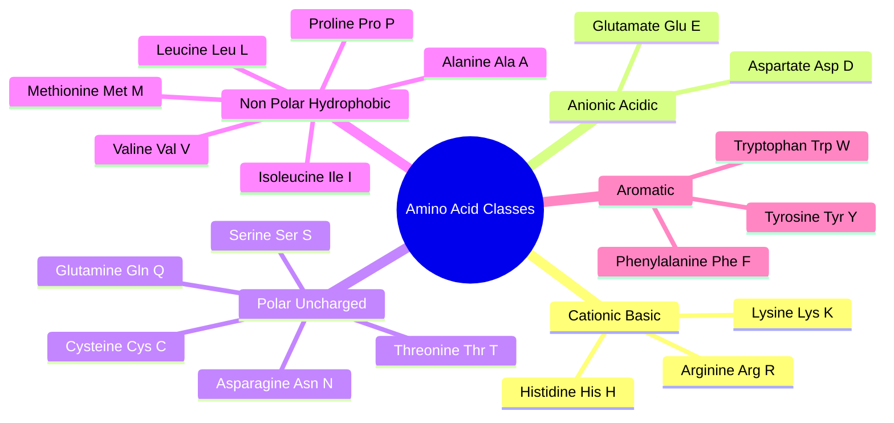
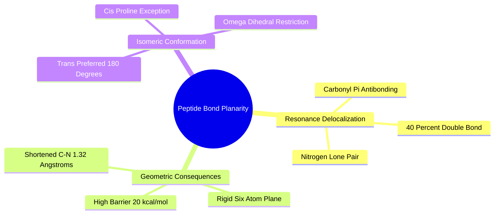
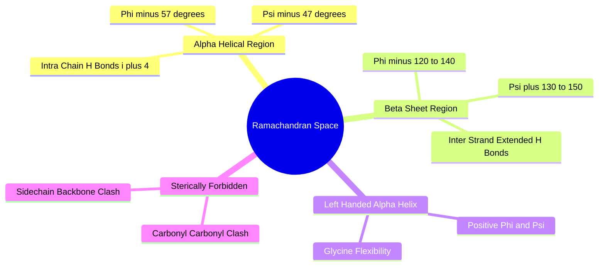
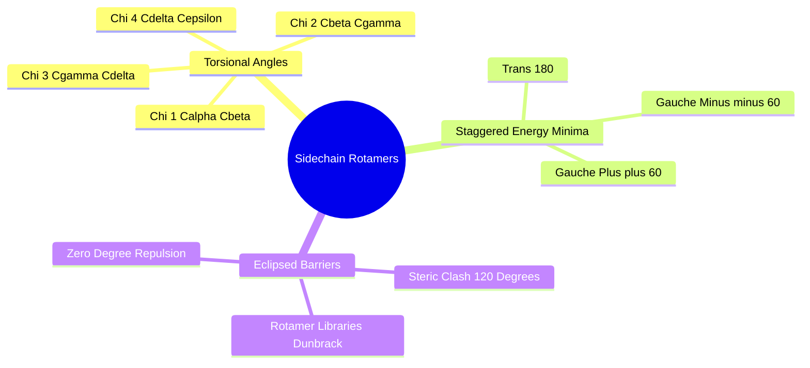

## 2.1. Amino Acid Residues and Polypeptides

### 2.1.1. Canonical Amino Acids and Sidechain Chemistry
```text
File: SynPath-3D Knowledge System/2. Protein Structure and Binding Pocket Biophysics/2.1. Amino Acid Residues and Polypeptides/2.1.1. Canonical Amino Acids and Sidechain Chemistry.md
Tags: #biology/amino-acids #biophysics/sidechains #chemistry
```

#### 1. Concept Definition & Physical Nature
Proteins are linear polymers constructed from 20 canonical L-$\alpha$-amino acids. Each residue shares a common backbone architecture: a central alpha-carbon ($\text{C}_\alpha$) covalently bound to an amino group ($-\text{NH}_2$), a carboxyl group ($-\text{COOH}$), a hydrogen atom ($-\text{H}$), and a distinctive sidechain ($-\text{R}$):

```text
       H   O
       │   ║
  H₂N──C───C──OH
       │
       R  <── Distinctive Sidechain
```

Amino acid sidechains fall into five functional classes based on their physicochemical properties:



1. **Aliphatic Hydrophobic**: Alanine ($\text{Ala, A}$), Valine ($\text{Val, V}$), Leucine ($\text{Leu, L}$), Isoleucine ($\text{Ile, I}$), Methionine ($\text{Met, M}$), and Proline ($\text{Pro, P}$). Characterized by non-polar hydrocarbon chains that drive hydrophobic core collapse.
2. **Aromatic**: Phenylalanine ($\text{Phe, F}$), Tyrosine ($\text{Tyr, Y}$), and Tryptophan ($\text{Trp, W}$). Large $\pi$-electron systems capable of edge-to-face and parallel-displaced $\pi$-stacking as well as cation-$\pi$ interactions.
3. **Polar Neutral**: Serine ($\text{Ser, S}$), Threonine ($\text{Thr, T}$), Asparagine ($\text{Asn, N}$), Glutamine ($\text{Gln, Q}$), and Cysteine ($\text{Cys, C}$). Contain hydroxyl, amide, or thiol groups capable of serving as hydrogen-bond donors and acceptors.
4. **Positively Charged (Basic, at $\text{pH} = 7.4$)**: Lysine ($\text{Lys, K}$, $\text{p}K_a \approx 10.5$), Arginine ($\text{Arg, R}$, $\text{p}K_a \approx 12.5$), and Histidine ($\text{His, H}$, $\text{p}K_a \approx 6.0$, undergoes dynamic proton exchange). Carry a net positive charge ($+1$) for salt bridge formation.
5. **Negatively Charged (Acidic, at $\text{pH} = 7.4$)**: Aspartate ($\text{Asp, D}$, $\text{p}K_a \approx 3.9$) and Glutamate ($\text{Glu, E}$, $\text{p}K_a \approx 4.2$). Deprotonated into carboxylate ions ($-\text{COO}^-$) carrying a net negative charge ($-1$).

#### 2. Why It Matters in Biological & Chemical Systems
The chemical properties of a binding pocket are defined by the spatial arrangement of these amino acid sidechains. The binding cavity creates a specialized chemical microenvironment where effective $\text{p}K_a$ values can shift by up to $\pm 3\text{ pH units}$ relative to aqueous solution due to desolvation and nearby electrostatic fields. 

For instance, an Aspartate positioned adjacent to another Aspartate will often remain protonated and neutral at $\text{pH} = 7.4$ to avoid electrostatic repulsion:
$$\text{Asp}-\text{COO}^- + \text{Asp}-\text{COOH} \implies \text{Single Proton Shared Catalytic Dyad}$$
Machine learning models that assign static formal charges based purely on amino acid identity fail in these catalytic environments.

#### 3. Quad-Disciplinary Integration
* **Biology**: Kinase hinge regions typically contain a conserved spatial triad of backbone amides and carbonyls from residues such as Valine and Methionine that anchor ATP's adenine base.
* **Chemistry**: Cysteine's nucleophilic sulfhydryl group ($-\text{SH}$) can undergo irreversible 1,4-Michael addition with electrophilic acrylamide warheads, forming targeted covalent inhibitors (e.g., Osimertinib targeting Cys797 in EGFR).
* **Physics / Thermodynamics**: The solvent-accessible surface area (SASA) of each sidechain directly scales with its contribution to the hydrophobic hydration free energy ($\Delta G \approx 25\text{--}30\text{ cal/mol}\cdot\text{\AA}^{-2}$).
* **Machine Learning Implementation**: In [[6.1.1. Six-Layer Equiformer-Light GNN Architecture]], amino acid identity is not supplied as a raw string. Instead, each protein node encodes its amino acid type ($d=20$), heavy atom type ($d=128$), physiological charge ($d=32$), and continuous SASA ($d=32$):
  $$\mathbf{x}_{\text{node}} = \text{Concat}(\mathbf{e}_{\text{aa}}, \mathbf{e}_{\text{element}}, \mathbf{e}_{\text{charge}}, \mathbf{e}_{\text{SASA}}) \in \mathbb{R}^{256}$$

---

### 2.1.2. Peptide Bond Resonance and Planarity
```text
File: SynPath-3D Knowledge System/2. Protein Structure and Binding Pocket Biophysics/2.1. Amino Acid Residues and Polypeptides/2.1.2. Peptide Bond Resonance and Planarity.md
Tags: #biology/peptide-bond #chemistry/resonance #biophysics
```

#### 1. Concept Definition & Physical Nature
Amino acids condense via a dehydrating condensation reaction between the $\alpha$-carboxyl group of residue $i$ and the $\alpha$-amino group of residue $i+1$, forming an **amide (peptide) bond** ($-\text{C}(=\text{O})-\text{NH}-$).

The peptide bond exhibits a **partial double-bond character ($\approx 40\%$)** due to resonance delocalization of the nitrogen lone pair into the carbonyl $\pi^*$ antibonding orbital:

```text
Resonance Structure of the Peptide Bond:
        :O:                           :O:⁻
        ║                             │
  ──Cα──C──N──Cα──   ⟷   ──Cα──C══N⁺──Cα──
           │                     │
           H                     H
      (Major ~60%)                  (Minor ~40%)
```

This delocalization produces critical physical consequences:
1. **Planarity**: The six atoms $(\text{C}_{\alpha, i}, \text{C}_i, \text{O}_i, \text{N}_{i+1}, \text{H}_{i+1}, \text{C}_{\alpha, i+1})$ lie in a common rigid plane.
2. **Shortened Bond Length**: The $\text{C}-\text{N}$ peptide bond length is $1.32\text{ \AA}$, significantly shorter than a standard single $\text{C}-\text{N}$ bond ($1.47\text{ \AA}$).
3. **High Rotation Barrier**: Rotation around the peptide bond requires breaking the partial double bond, incurring a significant activation barrier:
   $$\Delta G^\ddagger_{\text{rotation}} \approx 18 - 21\text{ kcal/mol}$$
   Consequently, thermal motion at physiological temperature ($k_B T \approx 0.6\text{ kcal/mol}$) cannot induce isomerization around this bond.
4. **Trans Preference**: The omega dihedral angle ($\omega = \text{C}_{\alpha, i}-\text{C}_i-\text{N}_{i+1}-\text{C}_{\alpha, i+1}$) is restricted almost exclusively to **trans ($\omega = 180^\circ$)** to minimize steric clash between neighboring $\text{C}_\alpha$ sidechains. Cis peptide bonds ($\omega = 0^\circ$) occur rarely ($< 0.1\%$), except preceding Proline residues, where the cyclic sidechain balances the steric penalty ($\approx 5\text{--}7\%$ cis-proline).



#### 2. Why It Matters in Biological & Chemical Systems
Because the peptide backbone is composed of rigid planar plates linked together at flexible $\text{C}_\alpha$ hinges, the backbone conformation can be fully parameterized by two rotational degrees of freedom per residue ($\phi$ and $\psi$).

Furthermore, this resonance planarity extends directly to **amide-containing drug molecules**. Synthetic amides (e.g., in medicinal chemistry linkers or peptide mimetics) possess an identical $\approx 20\text{ kcal/mol}$ barrier. 

Generative models that parameterize bond rotations by treating amides as unconstrained single bonds break this resonance. Rotating an amide dihedral to $90^\circ$ destroys conjugation and forces the nitrogen into an unphysical $sp^3$ pyramidal geometry, invalidating the proposed 3D pose.

#### 3. Quad-Disciplinary Integration
* **Biology**: Ribosomes maintain translational fidelity by enforcing trans-peptide formation through steric complementarity within the peptidyl transferase center.
* **Chemistry**: The planar dipole moment of the amide bond ($\mu \approx 3.7\text{ D}$) generates the macroscopic electrostatic dipole of $\alpha$-helices.
* **Physics / Thermodynamics**: Because internal rotation around $\omega$ is frozen, the configurational entropy of an unfolded protein is drastically lower than that of an unconstrained polymer chain, facilitating spontaneous folding.
* **Machine Learning Implementation**: In [[5.2.1. Spatial Twists and Rodrigues Formula]], the Product of Exponentials (PoE) kinematic tree specifically locks all amide junction twists:
  $$\hat{\xi}_{\text{amide}} \equiv \mathbf{0}, \quad \omega = 180.0^\circ$$
  This removes the peptide bond from the continuous flow matching prediction space and assigns the rotational flow exclusively to adjacent true single bonds ($\mathrm{sp^3}-\mathrm{sp^3}$ or $\mathrm{sp^3}-\mathrm{sp^2}$).

---

### 2.1.3. Ramachandran Angles and Secondary Structures
```text
File: SynPath-3D Knowledge System/2. Protein Structure and Binding Pocket Biophysics/2.1. Amino Acid Residues and Polypeptides/2.1.3. Ramachandran Angles and Secondary Structures.md
Tags: #biology/ramachandran #biophysics/protein-structure #geometry
```

#### 1. Concept Definition & Physical Nature
Because the peptide bond is planarly locked, a polypeptide's backbone geometry is governed by two dihedral angles per residue:
1. **$\phi$ (Phi)**: Rotation around the $\text{N}-\text{C}_\alpha$ bond, defined by the four atoms:
   $$\phi = \text{C}_{i-1} - \text{N}_i - \text{C}_{\alpha, i} - \text{C}_i$$
2. **$\psi$ (Psi)**: Rotation around the $\text{C}_\alpha-\text{C}$ bond, defined by the four atoms:
   $$\psi = \text{N}_i - \text{C}_{\alpha, i} - \text{C}_i - \text{N}_{i+1}$$

The **Ramachandran plot** is a 2D projection of $(\phi, \psi) \in [-\pi, \pi)^2$ that maps sterically permitted conformations. Most of $(\phi, \psi)$ space is sterically forbidden due to clashes between backbone carbonyl oxygens, amides, and $\text{C}_\beta$ sidechain atoms.



The allowed regions define the canonical secondary structures:
* **Right-Handed $\alpha$-Helix**: Centered at $(\phi \approx -57^\circ, \psi \approx -47^\circ)$. Maintained by regular internal hydrogen bonds between the carbonyl oxygen of residue $i$ and the amide proton of residue $i+4$ ($3.6\text{ residues/turn}$, pitch $5.4\text{ \AA}$).
* **$\beta$-Strands / $\beta$-Sheets**: Located in the upper-left quadrant:
  - Antiparallel $\beta$-sheet: $(\phi \approx -139^\circ, \psi \approx +135^\circ)$.
  - Parallel $\beta$-sheet: $(\phi \approx -119^\circ, \psi \approx +113^\circ)$.
  Maintained by inter-strand hydrogen bonds between adjacent polypeptide chains.
* **Left-Handed $\alpha$-Helix**: Located in the upper-right quadrant ($+\phi, +\psi$), populated almost exclusively by Glycine because it lacks a $\text{C}_\beta$ carbon and is exempt from sidechain steric clashes.

#### 2. Why It Matters in Biological & Chemical Systems
Binding pockets located on flexible loop regions can undergo induced-fit rearrangements that shift $(\phi, \psi)$ angles across energy barriers. When a ligand binds, it stabilizes a specific backbone conformation. 

If a structural generative model perturbs protein backbone coordinates in Cartesian space ($\mathbb{R}^3$), it frequently outputs unphysical $(\phi, \psi)$ coordinates that fall into the forbidden regions of the Ramachandran plot, resulting in unrealistic receptor geometries.

#### 3. Quad-Disciplinary Integration
* **Biology**: Proline has its sidechain cyclized back onto its own backbone nitrogen, locking its $\phi$ angle to $\phi \approx -65^\circ \pm 15^\circ$ and acting as an $\alpha$-helix breaker.
* **Chemistry**: Peptide-based therapeutics use $\text{D}$-amino acids or $\alpha,\alpha$-disubstituted amino acids (e.g., Aib, $\alpha$-aminoisobutyric acid) to constrain Ramachandran space, locking peptides into bioactive conformations resistant to proteolytic degradation.
* **Physics / Thermodynamics**: The Ramachandran plot represents a 2D potential of mean force (PMF) landscape:
  $$F(\phi, \psi) = -k_B T \ln P(\phi, \psi)$$
* **Machine Learning Implementation**: In [[2.1. Multi-Scale Protein Backbone Frames & Invariant Point Cloud]], protein residues are represented as rigid rigid-body frames $T_i \in \mathrm{SE}(3)$. The relative transformations between adjacent frames $T_i^{-1}T_{i+1}$ implicitly constrain $(\phi, \psi)$ transitions to sterically allowed Ramachandran basins without requiring Cartesian constraints.

---

### 2.1.4. Sidechain Rotamers and Torsional Angles
```text
File: SynPath-3D Knowledge System/2. Protein Structure and Binding Pocket Biophysics/2.1. Amino Acid Residues and Polypeptides/2.1.4. Sidechain Rotamers and Torsional Angles.md
Tags: #biophysics/rotamers #geometry/torsions #structural-biology
```

#### 1. Concept Definition & Physical Nature
While the backbone is defined by $(\phi, \psi)$, an amino acid's sidechain conformation is dictated by dihedral rotations around its single bonds, designated by **chi angles ($\chi_1, \chi_2, \chi_3, \chi_4$)**:
* $\chi_1$: Rotation around the $\text{C}_\alpha-\text{C}_\beta$ bond ($\text{N}-\text{C}_\alpha-\text{C}_\beta-\text{C}_\gamma$).
* $\chi_2$: Rotation around the $\text{C}_\beta-\text{C}_\gamma$ bond ($\text{C}_\alpha-\text{C}_\beta-\text{C}_\gamma-\text{C}_\delta$).
* $\chi_3$: Rotation around the $\text{C}_\gamma-\text{C}_\delta$ bond (e.g., Lys, Glu, Met).
* $\chi_4$: Rotation around the $\text{C}_\delta-\text{C}_\epsilon$ bond (e.g., Lys).

Because single bonds between $sp^3$ hybridized carbons experience torsional steric barriers (staggered vs. eclipsed conformations), $\chi$ angles populate discrete local energy minima known as **rotamers**, typically centered around three staggered states:
* **Gauche-Plus ($g^+$)**: $\chi \approx +60^\circ$
* **Trans ($t$)**: $\chi \approx 180^\circ$
* **Gauche-Minus ($g^-$)**: $\chi \approx -60^\circ$



#### 2. Why It Matters in Biological & Chemical Systems
Induced-fit binding often involves sidechain rotameric flips. For example, a Tyrosine or Phenylalanine sidechain can rotate around $\chi_1$ and $\chi_2$ by $120^\circ$ to open a deep hydrophobic subpocket that was occluded in the apo (unliganded) state. 

Models that treat pockets as rigid crystal surfaces cannot accommodate ligands that require rotamer rearrangements. Conversely, models that treat sidechain atoms as unconstrained Cartesian point clouds frequently output broken, eclipsed conformations that violate standard rotamer distributions.

#### 3. Quad-Disciplinary Integration
* **Biology**: Kinase inhibitor resistance frequently emerges from single point mutations (e.g., the T315I "gatekeeper" mutation in BCR-ABL) where a small threonine is replaced by a bulky isoleucine whose rotamers block access to the hydrophobic binding pocket.
* **Chemistry**: Designing a ligand with a functional group that occupies the space vacated by a flexible sidechain rotamer can convert a reversible inhibitor into a selective binder.
* **Physics / Thermodynamics**: The free energy cost of freezing a flexible sidechain into a single rotamer upon ligand binding is entropic:
  $$\Delta S_{\text{rot}} \approx -k_B \ln N_{\text{accessible}} \approx -0.5 \text{ to } -1.0\text{ kcal/mol per rotatable bond}$$
* **Machine Learning Implementation**: The [[6.1.1. Six-Layer Equiformer-Light GNN Architecture]] can optionally receive perturbed sidechain dihedral configurations ($\chi_1, \chi_2$) during Stage 1 training, teaching the model to remain invariant to rotamer noise and prevent memorization of pre-opened holo crystal pockets.