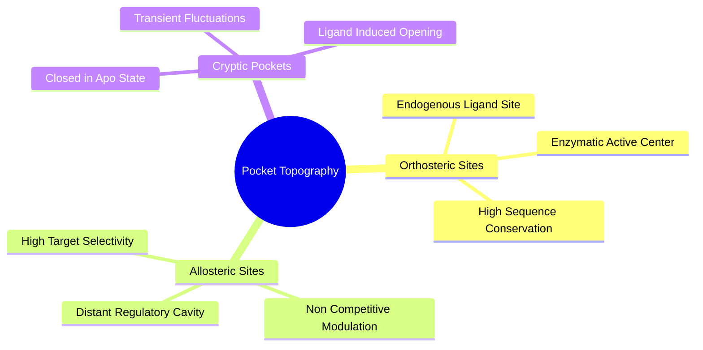
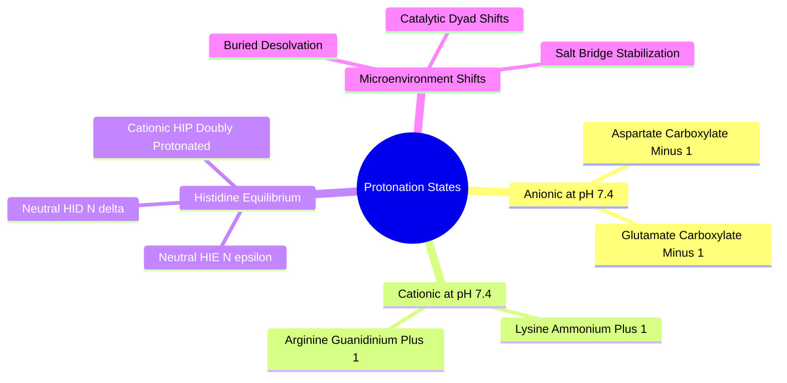

# Canonical Architecture Alignment

> The canonical receptor model uses multi-conformer ensemble conditioning, not isolated Gaussian rotamer perturbations.

## 2.2. Protein Cavities and Binding Sites

### 2.2.1. Pocket Topography and Cryptic Cavities
```text
File: SynPath-3D Knowledge System/2. Protein Structure and Binding Pocket Biophysics/2.2. Protein Cavities and Binding Sites/2.2.1. Pocket Topography and Cryptic Cavities.md
Tags: #biophysics/pockets #cryptic-sites #allostery
```

#### 1. Concept Definition & Physical Nature
A protein binding pocket is a concave surface indentation lined with functional amino acid sidechains that provides a sterically and electrostatically complementary environment for small molecules. Pockets are characterized by geometric parameters:
* **Volume ($V_{\text{pocket}} \approx 300\text{ to }1500\text{ \AA}^3$)**
* **Enclosure / Buriedness ($\text{Fraction}_{\text{buried}} > 0.65$)**
* **Depth ($d > 8.0\text{ \AA}$)**

Pockets fall into three functional categories:
1. **Orthosteric Sites**: The primary cavity where natural substrates, cofactors, or endogenous ligands bind to execute biological function (e.g., the ATP-binding cleft of kinases).
2. **Allosteric Sites**: Geometrically distinct cavities located away from the orthosteric center. Ligand binding to an allosteric pocket induces conformational transitions that modulate protein activity non-competitively.
3. **Cryptic Pockets**: Binding sites that are **invisible, closed, or collapsed in the unliganded (apo) crystal structure**, and open only when a complementary ligand stabilizes the open state via thermal fluctuations.



#### 2. Why It Matters in Biological & Chemical Systems
Targeting cryptic and allosteric pockets is a key strategy for discovering selective drugs against targets with highly conserved orthosteric sites (such as the $>500$ human kinases, which share near-identical ATP-binding clefts). 

However, generative models conditioned strictly on static PDB coordinates struggle with cryptic pockets. If an algorithm is trained on crystal structures where the cryptic pocket is closed, it will never generate molecules that occupy it because the target coordinates appear sterically blocked.

#### 3. Quad-Disciplinary Integration
* **Biology**: KRAS G12C inhibitors (e.g., Sotorasib) bind to a cryptic switch-II pocket that is absent in native wild-type KRAS crystal structures and opens only when the mutant Cysteine 12 is trapped in the GDP-bound state.
* **Chemistry**: Cryptic-pocket binders often display steep structure-activity relationships (SAR) where subtle modifications to a core scaffold either induce pocket opening or lose binding affinity entirely.
* **Physics / Thermodynamics**: The free energy required to open a cryptic pocket must be compensated by the ligand-protein interaction enthalpy:
  $$\Delta G_{\text{net}} = \Delta G_{\text{open}} + \Delta G_{\text{bind}} \quad (\Delta G_{\text{open}} > 0, \, \Delta G_{\text{bind}} \ll 0)$$
* **Machine Learning Implementation**: The [[6.2.2. Target Interaction Field Anchor Prediction]] head evaluates continuous spatial gradients across the pocket walls rather than treating atoms as hard, unyielding barriers. This allows it to place anchor points in regions where transient pocket expansion is thermodynamically accessible.

---

### 2.2.2. Physiological Protonation and Formal Charges
```text
File: SynPath-3D Knowledge System/2. Protein Structure and Binding Pocket Biophysics/2.2. Protein Cavities and Binding Sites/2.2.2. Physiological Protonation and Formal Charges.md
Tags: #biophysics/protonation #chemistry/pka #electrostatics
```

#### 1. Concept Definition & Physical Nature
In aqueous solution at biological $\text{pH} = 7.4$, ionizable amino acid sidechains exist in dynamic protonation equilibrium governed by the Henderson-Hasselbalch equation:
$$\text{pH} = \text{p}K_a + \log_{10}\left( \frac{[\text{A}^-]}{[\text{HA}]} \right) \iff \frac{[\text{A}^-]}{[\text{HA}]} = 10^{\text{pH} - \text{p}K_a}$$

```text
Protonation State of Standard Amino Acids at pH 7.4:
Residue        Isolated pKa     Predominant State at pH 7.4     Net Formal Charge
───────────────────────────────────────────────────────────────────────────────────
Aspartate (Asp)    ~3.9         Deprotonated (-COO⁻)                 -1.0
Glutamate (Glu)    ~4.2         Deprotonated (-COO⁻)                 -1.0
Lysine (Lys)      ~10.5         Protonated (-NH₃⁺)                   +1.0
Arginine (Arg)    ~12.5         Protonated (-NH-C(NH₂)₂⁺)            +1.0
Histidine (His)    ~6.0         Dynamic Tautomers (HID, HIE, HIP)     0.0 to +1.0
Cysteine (Cys)     ~8.3         Protonated (-SH, neutral)             0.0
Tyrosine (Tyr)    ~10.1         Protonated (-OH, neutral)             0.0
```

Histidine is unique: its $\text{p}K_a \approx 6.0$ is close to physiological $\text{pH} = 7.4$, meaning it can exist in three functional states:
1. **$\text{HID}$**: Neutral; protonated at $\text{N}_\delta$, unprotonated at $\text{N}_\epsilon$.
2. **$\text{HIE}$**: Neutral; protonated at $\text{N}_\epsilon$, unprotonated at $\text{N}_\delta$.
3. **$\text{HIP}$**: Doubly protonated imidazolium cation; carries a $+1.0$ formal charge.



#### 2. Why It Matters in Biological & Chemical Systems
Standard X-ray crystallography does not resolve hydrogen atoms. Deposited PDB files typically contain only heavy atoms ($\text{C, N, O, S}$), lacking explicit proton positions or assigned formal charges. 

If a machine-learning model ingests raw PDB files directly, it treats Aspartate and Glutamate as neutral atoms, ignoring their $-1$ charge and missing the electrostatic driving force for salt-bridge formation. 

Conversely, assigning protonation states through naive rules-of-thumb ignores local microenvironment shifts:
* An Aspartate buried in a non-polar pocket with no cationic partner will shift its $\text{p}K_a$ upward by $3\text{--}4$ units ($\text{p}K_a \to 7.5\text{--}8.0$), remaining protonated and neutral ($-\text{COOH}$) at physiological pH.
* A Lysine buried near a metal cofactor can shift its $\text{p}K_a$ downward, acting as a neutral amine ($-\text{NH}_2$).

#### 3. Quad-Disciplinary Integration
* **Biology**: The aspartyl protease catalytic mechanism (e.g., HIV-1 protease, $\text{BACE1}$) relies on an Asp-Asp dyad where one aspartate is deprotonated ($\text{Asp}^-$) and the other is protonated ($\text{Asp}-\text{H}$), activating a water molecule for nucleophilic cleavage.
* **Chemistry**: The ionization state of a drug molecule must match its target. For example, a basic amine drug with $\text{p}K_a = 9.2$ will be $>98\%$ protonated at physiological pH, requiring an anionic or complementary polar pocket residue.
* **Physics / Thermodynamics**: The free energy cost of shifting a residue's $\text{p}K_a$ from its aqueous reference state is given by the thermodynamic cycle of desolvation:
  $$\Delta\Delta G_{\text{p}K_a} = 2.303 R T (\text{p}K_a^{\text{protein}} - \text{p}K_a^{\text{water}})$$
* **Machine Learning Implementation**: The [[8.1.1. Multi-Source Manifest Ingestion and Cleaning]] pipeline executes `PDB2PQR` (AMBER99 force field) and `Protoss` on every pocket, computing explicit formal charges:
  $$\mathbf{q}_{\text{pocket}} = [q_1, q_2, \dots, q_N] \in \mathbb{R}^N, \quad q_i \in \{-1.0, -0.5, 0.0, +0.5, +1.0\}$$
  These formal charges are supplied directly to the message-passing layers of the Equiformer-Light backbone.

---

### 2.2.3. Multi-Conformer Ensemble Conditioning and Induced-Fit Dynamics
\`\`\`text
Tags: #biophysics/induced-fit #structural-biology/conformational-selection #ensembles #canonical
\`\`\`

Proteins populate multiple conformational states. SynPath-3D represents each local pocket with a correlated ensemble of \(K=3\)–\(5\) conformations:

\[
\mathcal P=\{X_P^{(1)},\ldots,X_P^{(K)}\}.
\]

For atom \(i\), ensemble statistics include:

\[
\bar x_i=\frac1K\sum_kx_i^{(k)},
\qquad
\mathrm{RMSF}_i=
\sqrt{\frac1K\sum_k\|x_i^{(k)}-\bar x_i\|^2}.
\]

Conformer pooling is permutation-invariant. The resulting representation lets the backbone distinguish rigid pocket cores from flexible loops and alternate gatekeeper/rotamer states.

Independent Gaussian perturbation of isolated sidechain torsions is not the production receptor model. It may appear only as a controlled training augmentation or ablation.
