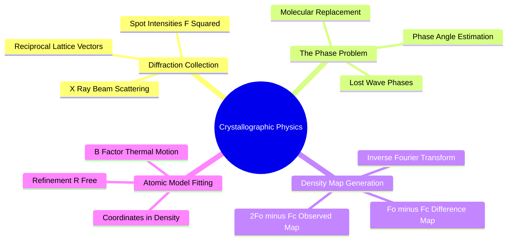
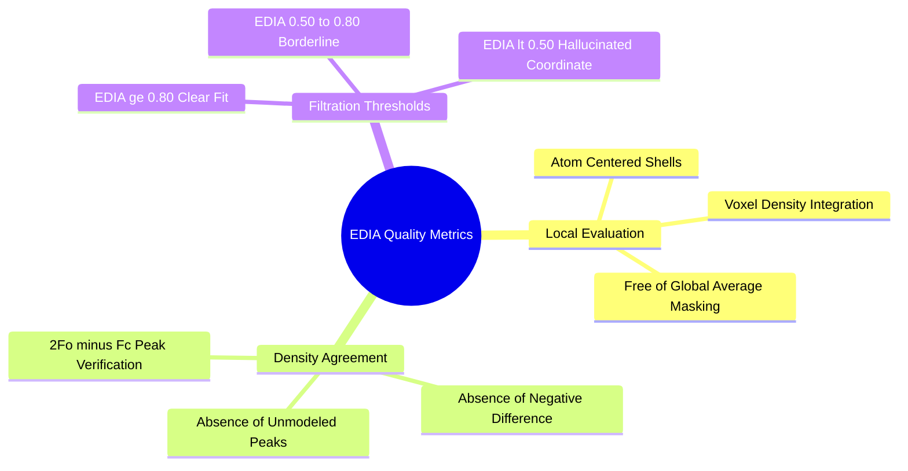

## 2.3. Experimental Structural Biology

### 2.3.1. X-Ray Crystallography and Electron Density Maps
```text
File: SynPath-3D Knowledge System/2. Protein Structure and Binding Pocket Biophysics/2.3. Experimental Structural Biology/2.3.1. X-Ray Crystallography and Electron Density Maps.md
Tags: #structural-biology/crystallography #physics/electron-density #data-qc
```

#### 1. Concept Definition & Physical Nature
**X-ray crystallography** is the primary experimental technique for determining atomic coordinates in protein-ligand complexes. A purified protein crystal is exposed to a monochromatic X-ray beam ($\lambda \approx 0.5\text{--}1.5\text{ \AA}$), producing a diffraction pattern of scattered intensities $|F(\mathbf{h})|^2$.

The electron density distribution $\rho(\mathbf{r})$ is reconstructed via inverse Fourier transform:
$$\rho(\mathbf{r}) = \frac{1}{V}\sum_{\mathbf{h}} F(\mathbf{h}) e^{-i 2\pi \mathbf{h} \cdot \mathbf{r}} = \frac{1}{V}\sum_{\mathbf{h}} |F(\mathbf{h})| e^{i \alpha(\mathbf{h})} e^{-i 2\pi \mathbf{h} \cdot \mathbf{r}}$$
* $|F(\mathbf{h})|$: Structure factor amplitude, derived directly from measured diffraction spot intensities ($I(\mathbf{h}) \propto |F(\mathbf{h})|^2$).
* $\alpha(\mathbf{h})$: Phase angle of the diffracted wave. **The Phase Problem**: detectors record intensities $|F|^2$ while losing the phase angles $\alpha(\mathbf{h})$. Phases must be estimated using molecular replacement, isomorphous replacement, or anomalous dispersion.



Crystallographers compute two primary electron density difference maps during model building:
1. **$2F_o - F_c$ Map**: The primary map showing confirmed features of both the protein and the ligand, used for model building.
2. **$F_o - F_c$ Difference Map**: Highlights discrepancies between the observed diffraction data ($F_o$) and the calculated model ($F_c$). Positive peaks (green) indicate atoms present in the crystal but omitted from the model; negative peaks (red) indicate model atoms placed where no experimental electron density exists.

#### 2. Why It Matters in Biological & Chemical Systems
Atomic coordinates in the Protein Data Bank (PDB) are **models fitted to experimental electron density, not raw experimental measurements**. 

At medium-to-low resolutions ($> 2.5\text{ \AA}$):
* Individual atoms are not resolved; only the collective envelope of functional groups is visible.
* Ligand atoms can be modeled into ambiguous density, resulting in incorrect stereochemistry, flipped rings, or ligands modeled at fractional occupancy ($< 1.0$).
* A low resolution produces high coordinate uncertainty ($\pm 0.4\text{ to } 0.8\text{ \AA}$ atomic position error).

Training machine learning models on coordinates fitted to low-resolution or ambiguous electron density trains them on human fitting errors rather than physical reality.

#### 3. Quad-Disciplinary Integration
* **Biology**: Inflexible active sites often diffract to high resolution ($< 1.5\text{ \AA}$), while flexible, loop-rich regulatory domains yield weak, diffuse diffraction ($> 3.0\text{ \AA}$).
* **Chemistry**: Bond lengths and angles are commonly constrained during crystallographic refinement using Engh and Huber library dictionaries. If the chemical topology dictionary for a novel synthetic ligand is assigned incorrectly, the refined PDB model will preserve those invalid geometries.
* **Physics / Thermodynamics**: Atomic **temperature factors ($B$-factors)** quantify thermal vibration and local disorder:
  $$B_i = 8\pi^2 \langle u_i^2 \rangle$$
  Atoms with $B > 60\text{ \AA}^2$ experience large root-mean-square thermal displacements ($\sqrt{\langle u^2 \rangle} > 0.87\text{ \AA}$), making their exact Cartesian coordinates unreliable as ground-truth targets.
* **Machine Learning Implementation**: The [[8.1.1. Multi-Source Manifest Ingestion and Cleaning]] pipeline sets strict crystallographic inclusion thresholds:
  $$\text{Resolution} \le 2.5\text{ \AA}, \quad R_{\text{free}} \le 0.28, \quad \text{Mean Ligand } B\text{-factor} < 60\text{ \AA}^2$$
  This excludes ambiguous, over-refined structures from the supervised dataset.

---

### 2.3.2. EDIA Scoring and Quality Control Filtration
```text
File: SynPath-3D Knowledge System/2. Protein Structure and Binding Pocket Biophysics/2.3. Experimental Structural Biology/2.3.2. EDIA Scoring and Quality Control Filtration.md
Tags: #data-qc #structural-biology/edia #validation
```

#### 1. Concept Definition & Physical Nature
The **Electron Density Score for Individual Atoms ($\text{EDIA}$)**, developed by Meyder et al., quantifies how well individual atoms in a structural model are supported by the underlying $2F_o - F_c$ and $F_o - F_c$ experimental electron density maps.

Unlike global metrics like resolution or $R_{\text{free}}$ (which average over the entire crystal unit cell), $\text{EDIA}$ evaluates local fit at the atomic level:
$$\text{EDIA}_a = \left( \prod_{p=1}^{N_{\text{sphere}}} w_p \cdot \tilde{\rho}(\mathbf{r}_p) \right)^{1 / \sum w_p}$$
where $\tilde{\rho}(\mathbf{r}_p)$ evaluates density values across concentric spherical shells around atom $a$, checking for:
1. Presence of significant positive $2F_o - F_c$ density matching the atom's van der Waals envelope.
2. Absence of negative $F_o - F_c$ difference density (which indicates the atom is modeled where electrons are absent).
3. Absence of positive $F_o - F_c$ density nearby (which indicates misplaced or unmodeled neighboring atoms).

```text
Interpretation of Atomic EDIA Scores:
  EDIA ≥ 0.80 : Atom is unambiguously supported by clear experimental density.
  0.50 ≤ EDIA < 0.80 : Minor ambiguity, slight disorder, or elevated B-factors.
  EDIA < 0.50 : Atom is NOT supported by electron density (hallucinated or misplaced).
```



#### 2. Why It Matters in Biological & Chemical Systems
In many PDB structures, the protein chain is resolved with high confidence, but the ligand was soaked at low concentration, leaving its electron density poorly defined. Crystallographers, under pressure to deposit a completed complex, often model the ligand into noise or trace density.

Studies show that up to **$20\%$ of small molecules in public structural databases contain regions with $\text{EDIA} < 0.5$**, where functional groups are modeled in reverse orientations, exposed to bulk solvent, or placed in negative density. 

Training a generative network on these unverified coordinates forces it to learn spurious interactions that have no basis in physical chemistry.

#### 3. Quad-Disciplinary Integration
* **Biology**: Active-site cofactors (e.g., heme in cytochrome P450) usually show high $\text{EDIA} > 0.9$, while distal allosteric ligands or flexible tails frequently have low $\text{EDIA} < 0.4$.
* **Chemistry**: Flexible linkers spanning two active moieties in bidentate molecules often exhibit weak electron density due to conformational averaging in the crystal lattice.
* **Physics / Thermodynamics**: True thermodynamic interaction parameters can only be derived from complexes whose bound atomic coordinates have low positional uncertainty ($\sigma_{\text{pos}} < 0.2\text{ \AA}$).
* **Machine Learning Implementation**: The [[8.1.1. Multi-Source Manifest Ingestion and Cleaning]] module integrates Gemmi's EDIA parser to compute per-atom density scores across all candidates. A complex is accepted for supervised trajectory extraction **if and only if**:
  $$\text{Median}(\text{EDIA}_{\text{ligand atoms}}) \ge 0.75 \quad \text{and} \quad \min(\text{EDIA}_{\text{ligand atoms}}) \ge 0.40$$
  This removes unverified or hallucinated ligand poses from the dataset.

---

### 2.3.3. Worked Exercise on Electron Density and Protonation
```text
File: SynPath-3D Knowledge System/2. Protein Structure and Binding Pocket Biophysics/2.3. Experimental Structural Biology/2.3.3. Worked Exercise on Electron Density and Protonation.md
Tags: #exercise #structural-biology #protonation #data-qc #worked-problem
```

#### 1. Problem Statement
An entry from a structural database (PDB ID: 4XYZ) describes a candidate kinase inhibitor co-crystallized with an oncogenic kinase domain. The PDB header and associated files provide the following data:
* Resolution: $2.85\text{ \AA}$
* $R_{\text{work}} = 0.245$, $R_{\text{free}} = 0.310$
* The ligand contains a basic aliphatic tertiary amine and a carboxylic acid.
* The catalytic triad in the binding site contains an Aspartate residue ($\text{Asp}165$) located $2.75\text{ \AA}$ from the ligand's tertiary amine.
* An adjacent Glutamate residue ($\text{Glu}180$) has its carboxylate oxygen $2.60\text{ \AA}$ from the carboxylate oxygen of $\text{Asp}165$.
* Local electron density analysis of the ligand yields:
  - Six aromatic ring carbons: $\text{EDIA} = [0.88, 0.85, 0.91, 0.84, 0.89, 0.86]$
  - Tertiary amine nitrogen and methyl substituents: $\text{EDIA} = [0.78, 0.81, 0.79]$
  - Flexible alkyl carboxylic acid tail: $\text{EDIA} = [0.32, 0.28, 0.25, 0.19]$
  - Associated $B$-factors for the carboxylic acid tail atoms: $B = [88.5, 92.1, 95.4, 99.0]\text{ \AA}^2$

Evaluate:
1. Does this structure pass the SynPath-3D crystallographic quality control threshold? Identify all criteria that fail.
2. What are the expected protonation states of $\text{Asp}165$ and $\text{Glu}180$? Is this a standard or a shifted state?
3. What is the physical origin of the low EDIA scores and high $B$-factors for the ligand's carboxylic acid tail?
4. How should the training pipeline handle this complex to protect model integrity?

---

#### 2. Background Knowledge Required
* Crystallographic quality thresholds: Resolution limits, $R_{\text{free}}$ thresholds, and $B$-factor distributions.
* EDIA electron density validation interpretation.
* Acid-base ionization behavior and electrostatic shifts in proximate carboxylate pairs.

---

#### 3. Terminology Definitions
* **$R_{\text{free}}$**: A cross-validation metric in crystallographic refinement calculated on a randomly omitted subset ($5\text{--}10\%$) of experimental reflections. An $R_{\text{free}} > 0.28$ indicates potential model over-fitting or low data quality.
* **$B$-Factor (Debye-Waller Factor)**: Quantifies the displacement of an atom from its average position due to thermal motion and static lattice disorder.
* **Catalytic Dyad Shift**: A shift in the $\text{p}K_a$ of two neighboring acidic residues that forces one to remain protonated to avoid electrostatic repulsion.

---

#### 4. Step-by-Step Solution

##### Step 1: Evaluate Global Crystallographic QC Metrics
Compare the deposited metrics against the SynPath-3D quality filters:
1. **Resolution Criterion**: Threshold is $\text{Resolution} \le 2.50\text{ \AA}$. 4XYZ has $\text{Resolution} = 2.85\text{ \AA}$. **FAIL**.
2. **$R_{\text{free}}$ Criterion**: Threshold is $R_{\text{free}} \le 0.28$. 4XYZ has $R_{\text{free}} = 0.310$. **FAIL**.

---

##### Step 2: Evaluate Local Ligand Electron Density (EDIA)
Compute the median EDIA for the ligand:
$$\text{EDIA}_{\text{all}} = [0.88, 0.85, 0.91, 0.84, 0.89, 0.86, 0.78, 0.81, 0.79, 0.32, 0.28, 0.25, 0.19]$$
Sorting the 13 values:
$$\text{Sorted} = [0.19, 0.25, 0.28, 0.32, 0.78, 0.79, 0.81, 0.84, 0.85, 0.86, 0.88, 0.89, 0.91]$$
The median is the 7th value:
$$\text{Median}(\text{EDIA}) = 0.81 \ge 0.75 \quad (\text{PASSES median threshold})$$
Now evaluate the minimum atomic threshold:
$$\min(\text{EDIA}) = 0.19 < 0.40 \quad (\text{FAIL})$$

*Result of Step 2*: While the aromatic core and amine are well-supported by electron density ($\text{EDIA} \approx 0.85$), the flexible carboxylic acid tail has $\text{EDIA} < 0.32$, indicating it was modeled into noise with no supporting experimental electron density.

---

##### Step 3: Analyze the Active-Site Protonation States
Analyze the spatial proximity of the two carboxylate residues:
$$d(\text{Asp}165_{\text{OD}} \dots \text{Glu}180_{\text{OE}}) = 2.60\text{ \AA}$$
Two unprotonated carboxylates ($-\text{COO}^-$) cannot approach to within $2.60\text{ \AA}$ without experiencing severe electrostatic repulsion:
$$V_{\text{repulsion}} \propto \frac{(-1)(-1)}{2.60\text{ \AA}} \gg 0$$
To avoid this penalty, one residue must take up a proton, forming a short, low-barrier hydrogen bond ($\text{COO}^-\dots\text{H}-\text{OOC}$).
* The proximity to the ligand's basic tertiary amine ($\text{NH}^+$, located $2.75\text{ \AA}$ from $\text{Asp}165$) stabilizes a negative charge on $\text{Asp}165$ through an attractive salt bridge.
* Therefore, **$\text{Asp}165$ is deprotonated ($\text{Asp}^-$)**, while **$\text{Glu}180$ is protonated and neutral ($\text{Glu}-\text{H}$)**, shifting its $\text{p}K_a$ from its aqueous value of $4.2$ up to $>7.5$.

---

##### Step 4: Determine the Physical Origin of the Artifacts
The low EDIA scores ($\le 0.32$) and high $B$-factors ($> 88\text{ \AA}^2$) on the carboxylic acid tail indicate **conformational disorder**:
* The flexible alkyl tail is exposed to bulk solvent and explores multiple orientations in the crystal lattice.
* The crystallographer fitted a single static conformation into flat, averaged density. The modeled Cartesian coordinates of this tail do not represent a unique, bound physical state.

---

#### 5. Why Each Step Is Necessary
* **Step 1**: Screens out global crystallographic failures before committing compute to atomic evaluations.
* **Step 2**: Identifies local modeling artifacts within an otherwise acceptable structure.
* **Step 3**: Resolves non-trivial protonation shifts that cannot be captured by naive identity-based heuristics.
* **Step 4**: Identifies the physical mechanism underlying local model disorder (thermal motion and conformational averaging).

---

#### 6. The Correct Answer
1. **The structure fails quality control**. It violates three thresholds: Resolution ($2.85\text{ \AA} > 2.50\text{ \AA}$), $R_{\text{free}}$ ($0.310 > 0.28$), and minimum atomic EDIA ($0.19 < 0.40$).
2. **Protonation States**: $\text{Asp}165$ is deprotonated ($-1.0$, anionic, engaged in a salt bridge); $\text{Glu}180$ is protonated ($0.0$, neutral, acting as an H-bond donor to $\text{Asp}165$). This represents a shifted catalytic state.
3. **Physical Origin**: Conformational disorder and thermal mobility of the solvent-exposed tail.
4. **Action**: **Discard this complex completely** from both the Stage 1 supervised imitation dataset and the evaluation benchmark.

---

#### 7. Theoretical Reasoning
Training a neural network on this complex would penalize the model for generating alternative, physically valid conformations of the flexible tail, while teaching it an unphysical ground-truth conformation that has no supporting experimental electron density.

---

#### 8. Common Student Mistakes
* **Assuming all atoms in a PDB file have equal confidence**: Believing that because a coordinate is present, it was experimentally observed with high certainty.
* **Assuming all Asp/Glu residues are negative**: Overlooking microenvironment-induced $\text{p}K_a$ shifts caused by carboxylate crowding.

---

#### 9. Misleading Traps & False Intuitions
* **The "Global Metric Trap"**: A structure can have an acceptable $R_{\text{work}}$ ($0.245$), while the ligand of interest is modeled into uninterpretable noise. Local validation ($\text{EDIA}$) is necessary to verify the binding site.

---

#### 10. Useful Tips & Memory Tricks
* **The EDIA Rule**: Treat atoms with $\text{EDIA} < 0.50$ as unobserved noise. Never use them as supervised loss targets.

---

#### 11. Details Commonly Forgotten
* $B$-factors above $80\text{ \AA}^2$ correspond to a mean spatial vibrational displacement of:
  $$\sqrt{\langle u^2 \rangle} = \sqrt{\frac{80}{8\pi^2}} \approx 1.0\text{ \AA}$$
  At this scale, the atom's position is uncertain over an entire chemical bond length.

---

#### 12. Connection to Broader Disciplines
* **Computational Drug Discovery**: High-throughput virtual screening benchmarks (such as DUD-E) often produce false positives because docking targets are built from low-resolution crystal structures with misassigned residue protonation states.

---

#### 13. Direct Application to SynPath-3D
In SynPath-3D, this filtration is handled in `syntree/data/pipeline/ingest.py`:
```python
# Exact execution inside SynPath-3D pipeline
def filter_complex(complex_record):
    if complex_record.resolution > 2.50 or complex_record.r_free > 0.28:
        return Reject("Global crystallographic QC failure")
    edia_scores = compute_edia(complex_record.density_map, complex_record.ligand)
    if min(edia_scores) < 0.40 or median(edia_scores) < 0.75:
        return Reject("Ligand electron density unsupported (EDIA failure)")
    # Optimize protonation via Protoss/PDB2PQR
    protonated_pocket = run_protoss(complex_record.pocket)
    return Accept(protonated_pocket)
```
This guarantees that 4XYZ is rejected before generating training trajectories.

---

# 3. Medicinal Chemistry Stereochemistry and Synthesis