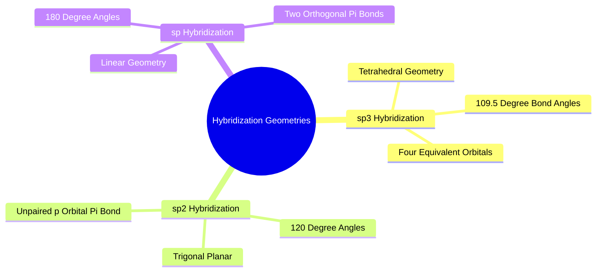
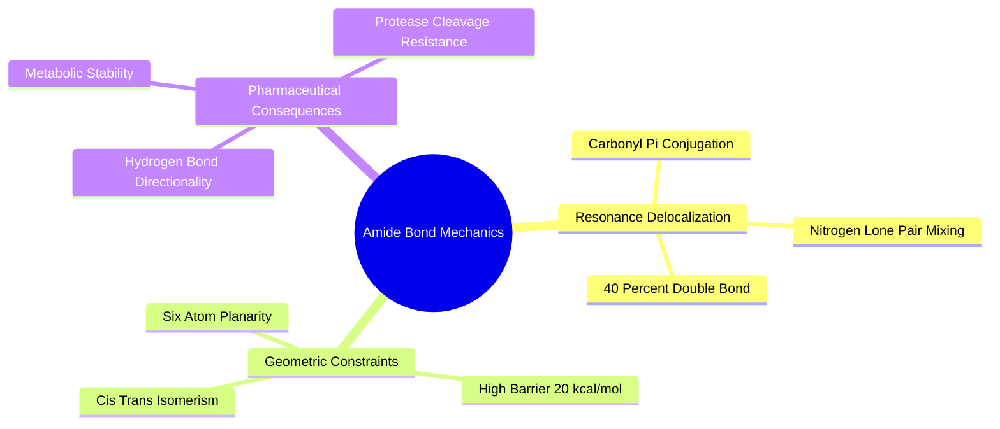
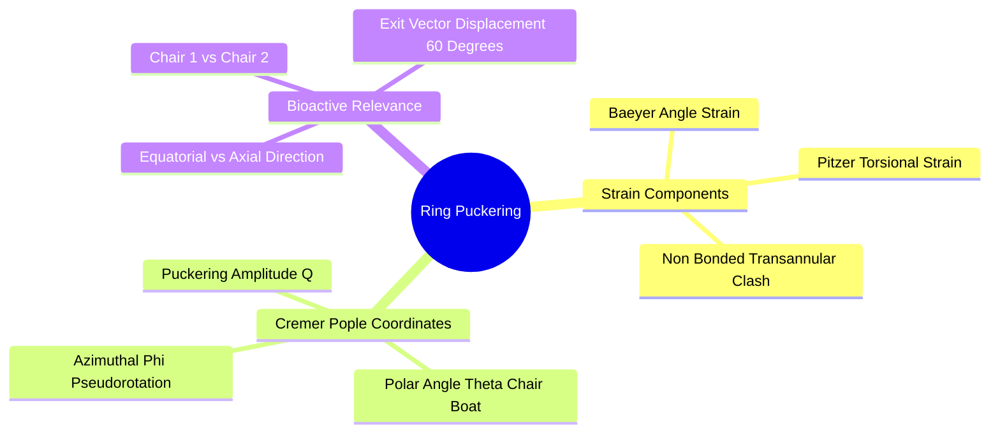

## 3.1. Hybridization and 3D Geometry

### 3.1.1. Orbital Hybridization and Bond Angles
```text
File: SynPath-3D Knowledge System/3. Medicinal Chemistry Stereochemistry and Synthesis/3.1. Hybridization and 3D Geometry/3.1.1. Orbital Hybridization and Bond Angles.md
Tags: #chemistry/hybridization #geometry/bond-angles #stereochemistry
```

#### 1. Concept Definition & Physical Nature
**Orbital hybridization** is a quantum mathematical model describing the mixing of non-equivalent atomic orbitals (such as $s$ and $p$) on an atom to form equivalent directional hybrid orbitals suitable for covalent bonding. The geometry of a hybridized center is governed by Valence Shell Electron Pair Repulsion (VSEPR) theory, which minimizes electrostatic and Pauli repulsion between valence electron pairs.



1. **$\mathrm{sp^3}$ Hybridization**:
   - Linear combination of one $2s$ and three $2p$ orbitals:
     $$\psi_{\mathrm{sp^3}, i} = \frac{1}{2}\left( \psi_{2s} \pm \psi_{2p_x} \pm \psi_{2p_y} \pm \psi_{2p_z} \right)$$
   - Geometry: **Tetrahedral**, ideal bond angle $\theta = \arccos(-1/3) \approx 109.47^\circ$.
   - Characteristics: Saturated carbon backbones, aliphatic amines, quaternary centers. Imparts three-dimensional, out-of-plane architecture.
2. **$\mathrm{sp^2}$ Hybridization**:
   - Linear combination of one $2s$ and two $2p$ orbitals, leaving one unhybridized $p_z$ orbital:
     $$\psi_{\mathrm{sp^2}, i} = \frac{1}{\sqrt{3}}\psi_{2s} + \sqrt{\frac{2}{3}}\psi_{2p}$$
   - Geometry: **Trigonal Planar**, ideal bond angle $\theta = 120.0^\circ$. The unhybridized $p_z$ orbital forms a $\pi$-bond perpendicular to the planar $\sigma$-framework.
   - Characteristics: Aromatic rings, carbonyls ($\text{C}=\text{O}$), alkenes.
3. **$\mathrm{sp}$ Hybridization**:
   - Linear combination of one $2s$ and one $2p$ orbital, leaving two mutually perpendicular unhybridized $p$ orbitals:
     $$\psi_{\mathrm{sp}, i} = \frac{1}{\sqrt{2}}\left( \psi_{2s} \pm \psi_{2p_x} \right)$$
   - Geometry: **Linear**, ideal bond angle $\theta = 180.0^\circ$.
   - Characteristics: Alkynes ($-\text{C}\equiv\text{C}-$), nitriles ($-\text{C}\equiv\text{N}$).

#### 2. Why It Matters in Biological & Chemical Systems
The biological target space is fundamentally three-dimensional. Historical drug discovery campaigns often suffered from high attrition rates because screening libraries were populated with flat, $\mathrm{sp^2}$-dominated aromatic molecules ($\text{Fsp}^3 \approx 0.15\text{--}0.25$). 

These flat molecules display poor aqueous solubility, high lipophilicity, promiscuous off-target binding, and fast CYP450 clearance.

**"Escape from Flatland" (Frank Lovering et al.)** established that increasing the fraction of $\mathrm{sp^3}$ carbons ($\text{Fsp}^3 = N_{\mathrm{sp^3}} / N_{\text{total carbons}}$) correlates with:
* Improved aqueous solubility.
* Lower melting points and reduced crystal lattice energy.
* Higher biological target selectivity.
* Higher clinical progression success from Phase I to launch.

```text
The Fsp3 Geometric Transformation:
   Flat, 2D Aromatic Molecule (Fsp3 = 0.00)       3D Saturated Synthon (Fsp3 = 0.83)
              ┌───┐                                          CH₃
             ╱     ╲                                          │
            │   O   │───[Flat, Inflexible]                ┌───C───┐
             ╲     ╱                                     ╱    │    ╲
              └───┘                                     │   CH₃     │──[3D Architecture]
                                                         ╲         ╱
                                                          └───┬───┘
```

#### 3. Quad-Disciplinary Integration
* **Biology**: Chiral active sites are non-planar environments. An $\mathrm{sp^3}$ stereocenter projects functional groups outward in three dimensions, matching complementary subpockets that flat aromatic systems cannot reach.
* **Chemistry**: The conformational strain of an $\mathrm{sp^3}$ center forced into a distorted angle ($< 100^\circ$ or $> 115^\circ$) is governed by harmonic valence potentials:
  $$E_{\text{angle}}(\theta) = \frac{1}{2} k_\theta (\theta - 109.5^\circ)^2, \quad k_\theta \approx 60\text{--}100\text{ kcal/mol}\cdot\text{rad}^{-2}$$
* **Physics / Thermodynamics**: Saturated hydrocarbons possess conformational entropy due to rotation around $\mathrm{sp^3}-\mathrm{sp^3}$ single bonds between staggered minima ($g^+, t, g^-$).
* **Machine Learning Implementation**: The [[3.3.2. The Stratified 75000 Enamine REAL Synthon Catalog]] enforces a strict physical filter:
  $$\text{Fsp}^3 \ge 0.40 \quad \text{for all building blocks except required aryl cross-coupling partners}$$
  This prevents SynPath-3D from collapsing into flat aromatic libraries.

---

### 3.1.2. Planar Resonance and Amide Isomerism
```text
File: SynPath-3D Knowledge System/3. Medicinal Chemistry Stereochemistry and Synthesis/3.1. Hybridization and 3D Geometry/3.1.2. Planar Resonance and Amide Isomerism.md
Tags: #chemistry/amides #stereochemistry/resonance #biophysics
```

#### 1. Concept Definition & Physical Nature
An **amide linkage** ($-\text{C}(=\text{O})-\text{NRR'}-$) is one of the most common functional groups in pharmaceutical drugs (found in $> 65\%$ of all drug candidates). The nitrogen lone pair undergoes continuous electronic conjugation with the adjacent carbonyl $\pi^*$ antibonding orbital.

```text
Amide Resonance Equilibrium:
         :O:                          :O:⁻
         ║                            │
   ──C───C───N───R'    ⟷       ──C───C═══N⁺───R'
             │                           │
             R                           R
     [Neutral Form ~60%]           [Zwitterionic Form ~40%]
```

The zwitterionic resonance contributor imparts significant double-bond character ($\approx 40\%$) to the $\text{C}-\text{N}$ bond. This creates two distinct planar isomers:
1. **Trans Isomer**: The carbonyl carbon substituent and the nitrogen substituent lie on opposite sides of the $\text{C}-\text{N}$ bond ($\omega = 180^\circ$). Thermodynamically favored by $\approx 2.0\text{--}3.0\text{ kcal/mol}$ in secondary amides due to minimal steric clash.
2. **Cis Isomer**: Substituents lie on the same side of the bond ($\omega = 0^\circ$). Disfavored in acyclic secondary amides, but accessible in tertiary amides (e.g., $N$-methylated amides or proline peptides) where steric differences between cis and trans are small:
   $$\Delta G^\circ_{\text{cis-trans}} \approx 0.5\text{--}1.5\text{ kcal/mol}$$

The rotational activation barrier is substantial:
$$\Delta G^\ddagger_{\text{rotation}} \approx 18 - 22\text{ kcal/mol}$$
This prevents spontaneous room-temperature rotation, fixing the amide group into a rigid, planar geometry.



#### 2. Why It Matters in Biological & Chemical Systems
Amides are common in drug molecules because they provide stability, act as both hydrogen-bond donors ($\text{N}-\text{H}$) and acceptors ($\text{C}=\text{O}$), and reduce conformational flexibility without adding metabolic liabilities.

However, continuous 3D generative diffusion models frequently violate amide geometry:
* They treat the $\text{C}-\text{N}$ bond as an unconstrained rotatable single bond, rotating $\omega$ to intermediate out-of-plane angles ($\omega \approx 60^\circ\text{ to }120^\circ$).
* This out-of-plane distortion breaks the conjugated $\pi$-network, raising the internal potential energy by $15\text{--}20\text{ kcal/mol}$ and creating an unphysical conformation that fails structural validation benchmarks (PoseBusters criterion).

#### 3. Quad-Disciplinary Integration
* **Biology**: HIV-1 protease inhibitors (e.g., Saquinavir, Darunavir) replace the cleavable scissile amide bond of the viral polyprotein substrate with an unreactive hydroxyethylamine transition-state isostere ($-\text{CH}(\text{OH})-\text{CH}_2-\text{N}-$) that preserves the local geometry while resisting enzymatic hydrolysis.
* **Chemistry**: Synthesis of secondary amides via carboxylic acid and amine coupling is the most heavily executed reaction class in medicinal chemistry, accounting for $\approx 28\%$ of all reactions performed in pharmaceutical discovery laboratories.
* **Physics / Thermodynamics**: The dipole moment of an isolated secondary amide group is large ($\mu \approx 3.7\text{ D}$), creating strong electrostatic fields that require complementary orientations within a binding pocket.
* **Machine Learning Implementation**: In [[2.1. Product of Exponentials (PoE) Molecular Screw-Theory Engine]], when an amide bond is formed via `RXN-01`, its internal rotational twist parameter is explicitly zeroed:
  $$\hat{\xi}_{\text{amide}} \equiv \mathbf{0}, \quad \omega_{\text{target}} = 180.0^\circ$$
  The generative flow head is prevented from assigning dihedral updates to this bond, ensuring that all generated amides remain strictly planar throughout the trajectory.

---

### 3.1.3. Saturated Rings and Cremer-Pople Puckering
```text
File: SynPath-3D Knowledge System/3. Medicinal Chemistry Stereochemistry and Synthesis/3.1. Hybridization and 3D Geometry/3.1.3. Saturated Rings and Cremer-Pople Puckering.md
Tags: #chemistry/ring-puckering #geometry/cremer-pople #stereochemistry
```

#### 1. Concept Definition & Physical Nature
Saturated cyclic molecules (such as cyclohexane, piperidine, piperazine, and morpholine) cannot adopt planar conformations without forcing their $\mathrm{sp^3}$ hybridized carbons into $120^\circ$ bond angles (causing severe angle strain) while forcing neighboring $\text{C}-\text{H}$ bonds into eclipsed orientations (causing severe torsional strain). 

To relieve this strain, saturated rings buckle out of plane into non-planar, puckered conformations.

```text
Conformations of a Six-Membered Saturated Ring:
        Chair (Lowest Energy)                 Twist-Boat (High Strain)
          C5──────C6                              C4──────C5
         ╱          ╲                            ╱          ╲
        C4           C1                         C3           C6
          ╲         ╱                            ╲          ╱
           C3──────C2                             C2──────C1
      [Ideal Staggered ~0.0 kcal/mol]        [Eclipsed Strain ~5.5 kcal/mol]
```

**Cremer-Pople Puckering Formalism**:
For any 6-membered ring, the out-of-plane displacement of atom $j \in \{1, \dots, 6\}$ relative to the ring's mean plane is parameterized using spherical coordinates $(Q, \theta_{\text{CP}}, \phi_{\text{CP}})$:
$$z_j = \sqrt{\frac{2}{6}} Q \sin\theta_{\text{CP}} \sin\left( \frac{2\pi (2j)}{6} + \phi_{\text{CP}} \right) + \frac{1}{\sqrt{6}} Q \cos\theta_{\text{CP}} (-1)^j$$
* **Total Puckering Amplitude ($Q \ge 0$)**: Measures the overall degree of out-of-plane deviation (typically $Q \approx 0.50\text{--}0.65\text{ \AA}$ for stable saturated heterocycles).
* **Puckering Polar Angle ($\theta_{\text{CP}} \in [0, \pi]$)**:
  - $\theta_{\text{CP}} = 0^\circ \implies$ **Canonical Chair Conformation ($^4C_1$)** (all adjacent bonds staggered).
  - $\theta_{\text{CP}} = 180^\circ \implies$ **Inverted Chair Conformation ($^1C_4$)**.
  - $\theta_{\text{CP}} = 90^\circ \implies$ **Boat / Twist-Boat Conformations** (destabilized by $\approx 5.5\text{ kcal/mol}$ due to steric and torsional strain).
* **Puckering Azimuthal Angle ($\phi_{\text{CP}} \in [0, 2\pi)$)**: Distinguishes between degenerate boat and twist-boat pseudorotational states.



#### 2. Why It Matters in Biological & Chemical Systems
Six-membered saturated heterocycles (piperazines, morpholines, piperidines) serve as core solubilizing linkers in thousands of clinical drugs. 

A piperidine ring in a chair conformation possesses two classes of substituent positions:
* **Equatorial**: Substituent points outward along the mean plane of the ring (minimal 1,3-diaxial steric clash; preferred by $> 95\%$).
* **Axial**: Substituent points perpendicular to the mean plane, clashing with the two axial hydrogens on the same face ($1,3$-diaxial interaction; destabilized by $\approx 1.8\text{--}2.5\text{ kcal/mol}$).

Flipping a chair from $^4C_1$ to $^1C_4$ inverts an equatorial exit vector into an axial one, rotating its spatial trajectory by **$\approx 60^\circ$**:

```text
Chair Inversion Shifts the Exit Vector by ~60°:
    Equatorial Vector:  ─Ring─► [Target A]
                                  │ (Chair Inversion)
                                  ▼
    Axial Vector:       ─Ring
                          │
                          ▼ [Target B] (~60° Deviation)
```

If a generative model assumes saturated rings are flat discs or single rigid bodies, it will fail to predict the bioactive exit vector direction.

#### 3. Quad-Disciplinary Integration
* **Biology**: Carbohydrate-binding proteins (lectins) recognize specific chair conformations ($^4C_1$) of pyranose sugars; locking a sugar into a non-chair conformation abrogates biological affinity.
* **Chemistry**: Substituted cyclohexanes and piperidines use bulky groups (e.g., tert-butyl) as **"conformational anchors"**, locking the ring into a single chair conformation and fixing all other substituents into defined equatorial or axial orientations.
* **Physics / Thermodynamics**: The energy barrier for chair-to-chair interconversion via a half-chair transition state is $\Delta G^\ddagger \approx 10.5\text{ kcal/mol}$. At room temperature, this inversion occurs $\approx 10^5\text{ times per second}$ in solution.
* **Machine Learning Implementation**: Instead of attempting to model ring puckering through continuous Lie-sphere ODE integration, SynPath-3D pre-embeds all cyclic building blocks in their two lowest-energy chair conformers ($^4C_1$ and $^1C_4$) using RDKit's ETKDGv3 engine:
  $$\text{Conformers}(B_k) = \{ \mathbf{C}_{k, \text{chair1}}, \, \mathbf{C}_{k, \text{chair2}} \}$$
  The discrete policy selects the bioactive chair isomer, and the PoE kinematic engine adjusts the acyclic dihedrals connected to it.