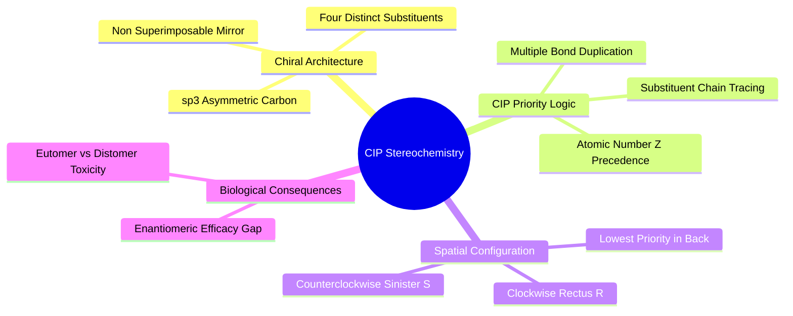
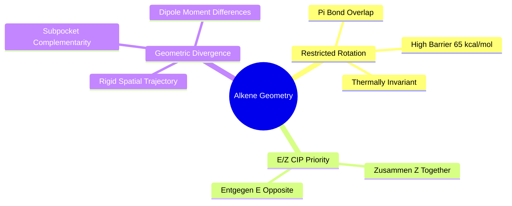
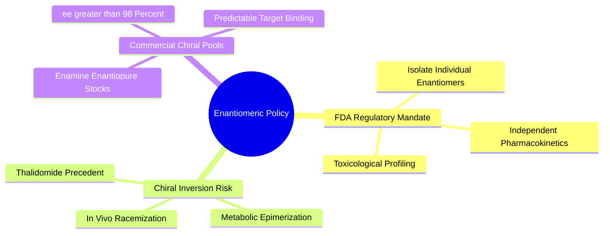

## 3.2. Stereochemistry and Molecular Chirality

### 3.2.1. Chiral Centers and CIP Stereochemical Rules
```text
File: SynPath-3D Knowledge System/3. Medicinal Chemistry Stereochemistry and Synthesis/3.2. Stereochemistry and Molecular Chirality/3.2.1. Chiral Centers and CIP Stereochemical Rules.md
Tags: #chemistry/chirality #stereochemistry/cip #pharmacology
```

#### 1. Concept Definition & Physical Nature
A molecule is **chiral** if it cannot be superimposed onto its mirror image by any combination of rigid translations and rotations. The most common source of molecular chirality in medicinal chemistry is a **stereogenic center (chiral center)**, typically an $sp^3$ hybridized carbon atom bonded to four chemically distinct substituents:
$$\text{C}^*(\text{R}_1, \text{R}_2, \text{R}_3, \text{R}_4) \quad \text{where } \text{R}_1 \neq \text{R}_2 \neq \text{R}_3 \neq \text{R}_4$$

The two non-superimposable mirror images are called **enantiomers**. Enantiomers have identical physical and chemical properties in an achiral environment (same melting point, boiling point, dipole moment, and NMR spectra in achiral solvents), but rotate plane-polarized light in opposite directions and interact differently with chiral environments (such as biological receptors).

```text
Chiral Center Inversion:
      R₁                          R₁
      │                           │
  C*──┼──R₂       ⟷           R₂──┼──C*
 ╱    │                           │    ╲
R₃    R₄                         R₄     R₃
(R)-Enantiomer               (S)-Enantiomer
  [Non-Superimposable Mirror Images]
```

**Cahn-Ingold-Prelog (CIP) Priority Rules**:
1. Assign priority ($1 > 2 > 3 > 4$) to the four substituents based on the **atomic number ($Z$)** of the atom directly attached to the chiral center:
   $$\text{I} (53) > \text{Br} (35) > \text{Cl} (17) > \text{S} (16) > \text{O} (8) > \text{N} (7) > \text{C} (6) > \text{H} (1)$$
2. If there is a tie, compare atoms along the substituent chains step by step until a point of difference is found.
3. Multiple bonds are treated as equivalent numbers of single bonds (e.g., $-\text{CH}=\text{O}$ counts as a carbon bound to two oxygens).
4. Orient the molecule so that the lowest-priority substituent ($4$, often $-\text{H}$) points directly away from the observer.
5. Trace the path from priority $1 \to 2 \to 3$:
   * **Rectus ($R$, Latin for right/clockwise)**: Priority decreases clockwise.
   * **Sinister ($S$, Latin for left/counterclockwise)**: Priority decreases counterclockwise.



#### 2. Why It Matters in Biological & Chemical Systems
Biological receptors are constructed exclusively from L-amino acids, making binding pockets chiral microenvironments. 

The **Pfeiffer's Rule / Three-Point Contact Model** states that high-affinity binding requires a minimum of three distinct spatial interactions between the ligand and the pocket:

```text
The Three-Point Contact Model:
    Active Pocket:      [Site A]     [Site B]     [Site C]
                           ▲            ▲            ▲
                           │            │            │
    (R)-Eutomer:          (A)──────────(B)──────────(C)  ──► [High Affinity]
    
    (S)-Distomer:         (A)──────────(C)──────────(B)  ──► [Mismatch, Clashes]
```

Enantiomers display fundamentally different pharmacological profiles:
* **Eutomer**: The enantiomer with high affinity for the target.
* **Distomer**: The enantiomer with low affinity, which can be inactive, act as an antagonist, or trigger severe off-target toxicity.

```text
Classic Clinical Examples of Enantiomeric Divergence:
Drug             Eutomer Effect                  Distomer Effect
──────────────────────────────────────────────────────────────────────────────────────
Thalidomide      (R): Sedative and anti-nausea   (S): Potent teratogen (birth defects)
Ibuprofen        (S): Active COX-1/2 inhibitor   (R): Inactive anti-inflammatory
Ethambutol       (S,S): Tuberculostatic drug     (R,R): Induces optic neuritis (blindness)
```

Generative algorithms that generate molecules without tracking chirality, or that invert chiral centers during in silico reactions, are medically unviable.

#### 3. Quad-Disciplinary Integration
* **Biology**: Transporter proteins (e.g., L-type amino acid transporter 1, LAT1) selectively import L-enantiomers of amino acids across the blood-brain barrier while excluding D-enantiomers.
* **Chemistry**: Asymmetric chemical synthesis (e.g., Sharpless epoxidation, Noyori asymmetric hydrogenation) relies on chiral catalysts to selectively produce single enantiomers ($\text{ee} > 99\%$).
* **Physics / Thermodynamics**: Enantiomers possess identical thermodynamic enthalpies of formation in vacuum, but their free energy of interaction with a chiral protein active site differs substantially:
  $$\Delta\Delta G_{\text{bind}} = \Delta G_{\text{bind}}(R) - \Delta G_{\text{bind}}(S) = -RT \ln\left( \frac{K_d(S)}{K_d(R)} \right)$$
* **Machine Learning Implementation**: In [[3.3.3. The 24 Certified Medicinal Chemistry Reaction Rules]], every synthon in the 75k catalog retains its explicit CIP chiral flags ($R$ or $S$). RDKit reaction execution enforces chiral parity mapping via isotopic tracking:
  $$\text{Parity}(\text{Product}) \equiv \text{Parity}(\text{Synthon})$$
  Any proposed step that inverts or racemizes an unreacted chiral center is rejected.

---

### 3.2.2. Geometric Isomers and Double Bond Invariance
```text
File: SynPath-3D Knowledge System/3. Medicinal Chemistry Stereochemistry and Synthesis/3.2. Stereochemistry and Molecular Chirality/3.2.2. Geometric Isomers and Double Bond Invariance.md
Tags: #chemistry/alkenes #stereochemistry/cis-trans #geometry
```

#### 1. Concept Definition & Physical Nature
Geometric isomerism occurs when rotation around a chemical bond is restricted by a $\pi$-bond (as in alkenes, $-\text{C}=\text{C}-$) or a ring system. Because breaking the $\pi$-bond requires $\approx 65\text{ kcal/mol}$ of activation energy, geometric isomers cannot interconvert at physiological temperatures.

Alkenes are classified using the **$E/Z$ nomenclature system** based on the CIP priority rules:
1. Identify the two substituents on carbon 1, and assign priority ($1 > 2$).
2. Identify the two substituents on carbon 2, and assign priority ($1 > 2$).
3. Compare the spatial orientation of the two priority-1 substituents across the double-bond axis:
   * **Zusammen ($Z$, German for together)**: The priority-1 substituents lie on the **same side** of the reference plane.
   * **Entgegen ($E$, German for opposite)**: The priority-1 substituents lie on **opposite sides** of the reference plane.

```text
The E/Z Geometric Isomer System:
       (1) R₁       R₃ (1)               (1) R₁       R₄ (2)
            \       /                         \       /
             C ═ C                             C ═ C
            /       \                         /       \
       (2) R₂       R₄ (2)               (2) R₂       R₃ (1)
          (Z)-Alkene                        (E)-Alkene
     [Priority 1 on Same Side]        [Priority 1 on Opposite Sides]
```



#### 2. Why It Matters in Biological & Chemical Systems
$E$ and $Z$ isomers display different spatial trajectories, physical properties, dipole moments, and biological activities:
* An $(E)$-alkene extends substituents outward along a linear, trans-like axis, making it suitable for spanning elongated active site clefts.
* A $(Z)$-alkene introduces a permanent $\approx 60^\circ$ bend in the molecular backbone, projecting substituents into adjacent lateral pockets.

In generative models that operate on continuous Cartesian coordinates, double bonds frequently relax into unphysical non-planar configurations or invert from the synthesizable $(E)$-isomer into the strained $(Z)$-isomer during force-field minimization.

#### 3. Quad-Disciplinary Integration
* **Biology**: Visual phototransduction relies on the light-induced geometric isomerization of retinal bound to rhodopsin: an incoming photon triggers an ultra-fast ($< 200\text{ fs}$) isomerization of $11\text{-cis-retinal}$ into $\text{all-trans-retinal}$, inducing a protein conformational change that triggers neural signaling.
* **Chemistry**: The Horner-Wadsworth-Emmons (HWE) reaction (`RXN-24`) selectively produces $(E)$ -$\alpha,\beta$-unsaturated esters, while the Still-Gennari modification selectively yields $(Z)$-unsaturated esters.
* **Physics / Thermodynamics**: The $(E)$-isomer of a 1,2-disubstituted alkene is typically more thermodynamically stable than the $(Z)$-isomer by $\approx 1.0\text{--}2.0\text{ kcal/mol}$ due to reduced steric clash between substituents.
* **Machine Learning Implementation**: In [[3.3.3. The 24 Certified Medicinal Chemistry Reaction Rules]], reactions producing double bonds (e.g., Heck coupling `RXN-05` and HWE `RXN-24`) encode stereospecific SMARTS templates that generate exclusively $(E)$-configured double bonds:
  $$\text{SMARTS: } [\text{C}:1]=[\text{C}:2] \implies \text{Enforce } \text{Stereo}=\text{STEREOTRANS}$$
  The [[5.2.1. Spatial Twists and Rodrigues Formula]] kinematics engine locks the corresponding dihedral twist to $\xi_{\text{alkene}} \equiv \mathbf{0}$, ensuring strict stereochemical retention.

---

### 3.2.3. Biological Significance of Enantiomeric Purity
```text
File: SynPath-3D Knowledge System/3. Medicinal Chemistry Stereochemistry and Synthesis/3.2. Stereochemistry and Molecular Chirality/3.2.3. Biological Significance of Enantiomeric Purity.md
Tags: #pharmacology/chirality #regulatory/fda #toxicology
```

#### 1. Concept Definition & Physical Nature
**Enantiomeric purity** (or enantiomeric excess, $ee$) measures the optical purity of a chiral compound:
$$ee = \frac{|[R] - [S]|}{[R] + [S]} \times 100\%$$
A 50:50 mixture of two enantiomers is a **racemate (racemic mixture)** ($ee = 0\%$).

Historically, pharmaceuticals were frequently developed and marketed as racemates because separating enantiomers or synthesizing them stereoselectively was chemically challenging. 

However, since the **1992 FDA Policy Statement for the Development of New Stereoisomeric Drugs**, regulatory agencies mandate that for any chiral drug, both enantiomers must be isolated, characterized, and evaluated independently for pharmacology, toxicology, and pharmacokinetics.



#### 2. Why It Matters in Biological & Chemical Systems
Marketing a racemate can lead to clinical failure due to three biological mechanisms:
1. **Antagonism / Reduced Efficacy**: The distomer can competitively bind to the target without activating it, acting as an antagonist that blocks the eutomer.
2. **Off-Target Toxicity**: The distomer can cross-react with off-target receptors, ion channels (e.g., hERG), or metabolic enzymes, triggering side effects.
3. **In Vivo Inversion**: Some chiral centers undergo metabolic racemization in vivo. For example, $(R)$-thalidomide interconverts into the teratogenic $(S)$-enantiomer within 4 to 5 hours in human plasma due to base-catalyzed keto-enol tautomerization at the chiral glutarimide ring, meaning administering an enantiopure formulation does not prevent toxicity.

#### 3. Quad-Disciplinary Integration
* **Biology**: Chiral drugs encounter chiral environments throughout the body: active transport (LAT1), plasma protein binding (human serum albumin binds enantiomers with different affinities), and hepatic clearance (CYP2C19 metabolizes $(S)$-mephenytoin faster than $(R)$-mephenytoin).
* **Chemistry**: The 75,000-synthon vocabulary curated for SynPath-3D uses **enantiopure commercial building blocks** ($ee > 98\%$) from Enamine. The model does not generate racemic mixtures; every synthon carries an explicit, verified chiral center.
* **Physics / Thermodynamics**: Chiral recognition between two molecules requires a differential free energy of binding:
  $$\Delta\Delta G = -RT \ln\left( \frac{K_{d,\text{distomer}}}{K_{d,\text{eutomer}}} \right)$$
  An energy difference of just $\Delta\Delta G = -2.72\text{ kcal/mol}$ yields a $100$-fold selectivity ratio in favor of the active enantiomer at physiological temperature.
* **Machine Learning Implementation**: The evaluation harness in [[8.2.2. AiZynthFinder Retrosynthetic Feasibility]] evaluates every proposed molecule as an explicit chiral entity. If a model generates an $(R)$-enantiomer, the retrosynthetic engine confirms that the specific $(R)$-building block is commercially available and can be coupled without racemization.