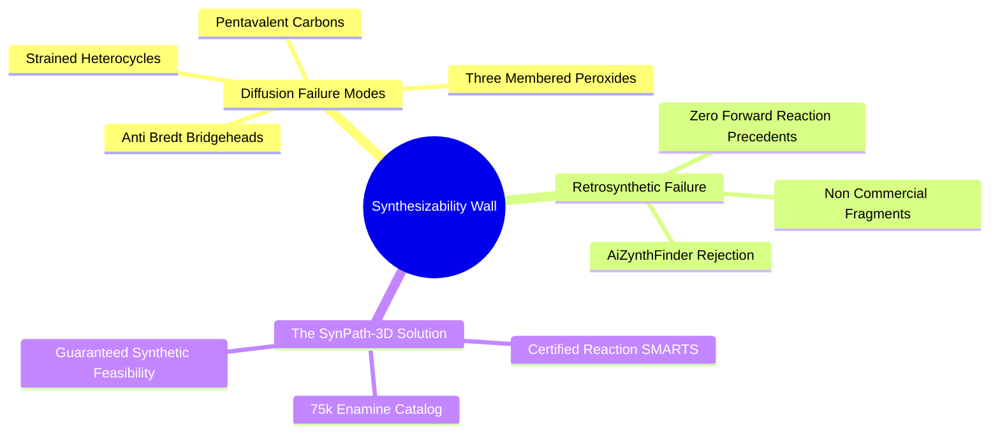
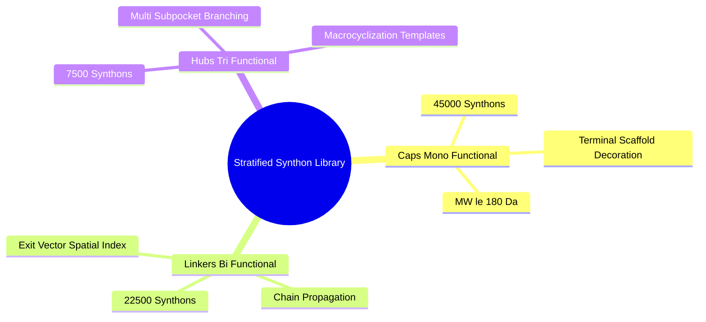
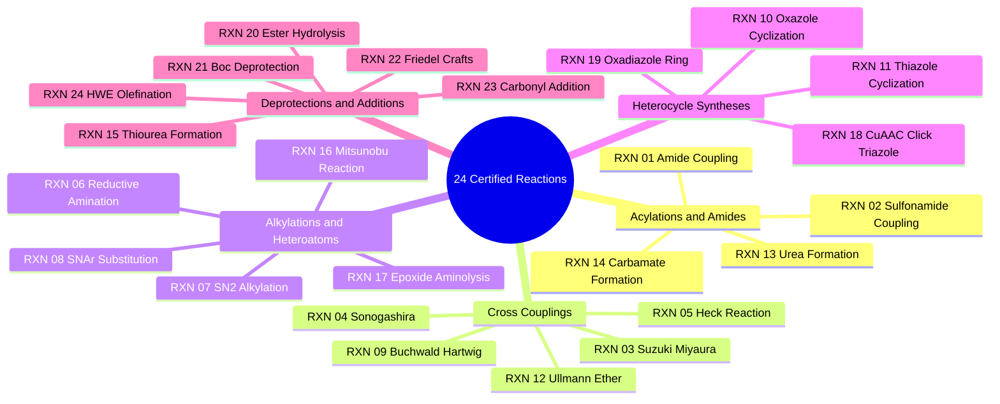

# Canonical Architecture Alignment

> The 24 reaction grammar uses finite-state functional-handle bitsets. DPDA stack execution is not the production state model.

## 3.3. Chemical Synthesis and Reaction Grammars

### 3.3.1. The Synthesizability Wall and Generative Hallucinations
```text
File: SynPath-3D Knowledge System/3. Medicinal Chemistry Stereochemistry and Synthesis/3.3. Chemical Synthesis and Reaction Grammars/3.3.1. The Synthesizability Wall and Generative Hallucinations.md
Tags: #chemistry/synthesizability #ml/hallucination #sbdd
```

#### 1. Concept Definition & Physical Nature
The **"Synthesizability Wall"** describes the failure mode of continuous 3D molecular generative models:
> While models that diffuse Cartesian coordinates inside binding pockets achieve strong computed docking scores, over 80% to 90% of their generated structures **cannot be synthesized in a physical laboratory**.

```text
The Synthesizability Wall:
   3D Continuous Diffusion (TargetDiff, DiffSBDD, Pocket2Mol)
   ┌────────────────────────────────────────────────────────┐
   │ Generates coordinates X ∈ ℝ^(N x 3) inside the cavity  │
   │ Output: Strong computed docking score (-11.5 kcal/mol) │
   └───────────────────────────┬────────────────────────────┘
                               │
                               ▼
   Retrosynthetic Planning Engine (AiZynthFinder / Retro*)
   ┌────────────────────────────────────────────────────────┐
   │ Evaluates whether real chemical reactions from buyable │
   │ building blocks can synthesize the structure.          │
   └───────────────────────────┬────────────────────────────┘
                               │
                               ▼
   FAIL: >85% REJECTED (The Synthesizability Wall)
   • Strained, impossible fused ring bridges
   • Unstable functional groups (peroxides, anti-Bredt alkenes)
   • Zero accessible commercial chemical building blocks
```



#### 2. Why It Matters in Biological & Chemical Systems
Computational drug design serves no purpose if the proposed molecules cannot be synthesized and tested experimentally. Continuous generative diffusion algorithms create invalid chemistry because they optimize for geometric pocket complementarity in Euclidean space ($\mathbb{R}^3$) without incorporating the discrete graph grammar of organic chemistry.

Common structural failures in continuous coordinate diffusion models include:
* **Pentavalent Carbons**: Carbons with five covalent bonds due to unconstrained atom clustering.
* **Peroxides & Multi-Heteroatom Chains**: Sequences like $-\text{O}-\text{O}-\text{O}-$ or $-\text{N}-\text{O}-\text{O}-$ that are thermodynamically unstable and explosive.
* **Anti-Bredt Double Bonds**: Double bonds placed at the bridgehead of small bicyclic systems, violating orbital overlap constraints and inducing extreme angle strain.
* **Complex Fused Rings**: Highly strained, un-synthesizable heterocycles that have no known synthetic pathway.

#### 3. Quad-Disciplinary Integration
* **Biology**: An unphysical molecule that fits an active site in silico cannot be validated in vitro, rendering the computational campaign useless for downstream drug discovery.
* **Chemistry**: Organic synthesis proceeds by assembling pre-existing chemical building blocks via reliable, high-yielding reactions (such as amide couplings, Suzuki-Miyaura reactions, and $\mathrm{S_NAr}$ substitutions).
* **Physics / Thermodynamics**: Unphysical rings and distorted valences carry high internal strain energies ($\Delta E_{\text{strain}} > 20\text{ kcal/mol}$), making their actual physical formation thermodynamically impossible.
* **Machine Learning Implementation**: SynPath-3D avoids this issue entirely by framing generation as an assembly process over **certified reaction operators applied to commercial building blocks**:
  $$a_t = (r_t \in \mathcal{R}_{\text{certified}}, \, B_t \in \mathcal{K}_{\text{Enamine}})$$
  Because every generative action executes a validated chemical reaction using commercial starting materials, **the synthesizability rate is 100% by construction**.

---

### 3.3.2. The Stratified 75000 Enamine REAL Synthon Catalog
```text
File: SynPath-3D Knowledge System/3. Medicinal Chemistry Stereochemistry and Synthesis/3.3. Chemical Synthesis and Reaction Grammars/3.3.2. The Stratified 75000 Enamine REAL Synthon Catalog.md
Tags: #chemistry/catalog #enamine-real #synthons #data-strategy
```

#### 1. Concept Definition & Physical Nature
A **synthon** is a structural building-block fragment possessing one or more reactive functional groups (handles) ready to undergo chemical coupling. The **Enamine REAL (REAdy-to-be-deLivered) Database** is the pharmaceutical industry's largest collection of commercially accessible chemical building blocks and virtual reaction spaces ($> 38\text{ billion}$ compounds, accessible with a $> 80\%$ fulfillment success rate).

SynPath-3D extracts and stratifies a curated **75,000-synthon vocabulary** from the Enamine REAL building-block library:



1. **Mono-Functional Caps ($N = 45,000$, $60\%$)**:
   - Building blocks bearing exactly one reactive functional handle (e.g., a primary amine, a carboxylic acid, an aryl bromide).
   - Function: Terminates growth along a specific vector, capping the molecule and adding final functional interactions.
2. **Bi-Functional Linkers ($N = 22,500$, $30\%$)**:
   - Building blocks bearing two distinct or orthogonal reactive handles (e.g., an amino-carboxylic acid, a bromo-aniline).
   - Function: Propagates chain growth, bridging between subpockets. Pre-indexed in an $\mathrm{SE}(3)$ exit-vector spatial hash table based on their internal length ($d^*$) and vector orientation ($\cos\theta$).
3. **Tri-Functional Hubs ($N = 7,500$, $10\%$)**:
   - Building blocks bearing three distinct handles (e.g., a functionalized piperazine hub, a triazine ring).
   - Function: Enables branching out from a primary binding cleft into multiple lateral sub-cavities simultaneously without requiring fragile bidentate loop closures.

#### 2. Why It Matters in Biological & Chemical Systems
* **Solving the 85-Synthon Starvation Bottleneck**: An 85-synthon toy catalog reconstructs $< 5\%$ of drug-like molecules in structural databases. A 75,000-synthon library increases retrosynthetic trajectory reconstruction on crystal complexes from $< 5\%$ to $> 45\%$, generating over 60,000 training transition states.
* **Physicochemical Filtration**: Every building block in the vocabulary passes strict drug-likeness filters:
  $$M_W \le 220\text{ Da}, \quad 4 \le N_{\text{heavy}} \le 16, \quad \text{Fsp}^3 \ge 0.40, \quad N_{\text{rotatable}} \le 3$$
  *(Note: Aryl halides and boronic acids required for cross-coupling chemistry are exempt from the $\text{Fsp}^3$ threshold, as aromaticity is an inherent chemical feature of those reactions).*

#### 3. Quad-Disciplinary Integration
* **Biology**: The stratified vocabulary provides broad functional diversity (hydrogen bond donors/acceptors, polar solubilizing groups, lipophilic caps, fluorinated bioisosteres) tailored to fit biological targets.
* **Chemistry**: Stratification prevents premature termination: the generative policy masks out mono-functional caps during early steps ($T=1, 2$), forcing the model to select linkers or hubs until the ligand reaches minimum drug-like mass ($M_W \ge 250\text{ Da}$).
* **Physics / Thermodynamics**: Restricting molecular weight ($M_W \le 220\text{ Da}$) and rotatable bonds ($N_{\text{rot}} \le 3$) per synthon limits internal conformational entropy loss upon binding.
* **Machine Learning Implementation**: Precomputing 256-dimensional embeddings for all 75,000 building blocks using a pretrained Uni-Mol2 foundation model produces an embedding table:
  $$\mathbf{E}_B \in \mathbb{R}^{75000 \times 256}$$
  This table is kept resident in GPU VRAM ($76.8\text{ MB}$), allowing batched matrix multiplications for synthon selection:
  $$\mathbf{p}_{\text{synthon}} = \text{Softmax}\left( \frac{\mathbf{q}_u \mathbf{W}_Q \mathbf{E}_B^T}{\sqrt{d}} + \mathbf{M}_{\text{rxn}}(u, r_t) \right)$$

---

### 3.3.3. The 24 Certified Medicinal Chemistry Reaction Rules
```text
File: SynPath-3D Knowledge System/3. Medicinal Chemistry Stereochemistry and Synthesis/3.3. Chemical Synthesis and Reaction Grammars/3.3.3. The 24 Certified Medicinal Chemistry Reaction Rules.md
Tags: #chemistry/reaction-rules #smarts #retrosynthesis #synthesis-grammar
```

#### 1. Concept Definition & Physical Nature
Chemical reactions in SynPath-3D are specified using **reaction SMARTS (Smiles Arbitrary Target Specification)**, which describe the transformation of reactant substructures into products with explicit atom mapping and provenance tracking.

The system compiles 24 robust medicinal chemistry reaction classes:



#### 2. Detailed Technical SMARTS Catalog for the 24 Reactions

```text
The Complete 24 Certified Medicinal Chemistry Reaction Grammar:

[RXN-01] Amide Coupling (Carboxylic Acid + Amine):
  SMARTS: [C:1](=[O:3])[OH].[N;!H0;!H3;!$(NC=O):2] >> [C:1](=[O:3])[N:2]
  Junction: C(carbonyl) - N(amide)
  Characteristics: Rigid, planar trans-preference (barrier ~20 kcal/mol).

[RXN-02] Sulfonamide Coupling (Sulfonyl Chloride + Amine):
  SMARTS: [S:1](=[O:3])(=[O:4])[Cl].[N;!H0;!H3;!$(NC=O):2] >> [S:1](=[O:3])(=[O:4])[N:2]
  Junction: S(sulfonyl) - N(sulfonamide)
  Characteristics: Found in celecoxib, sildenafil. Forms a tetrahedral-like geometry.

[RXN-03] Suzuki-Miyaura Biaryl Cross-Coupling (Aryl Halide + Boronic Acid):
  SMARTS: [c:1][Br,I,Cl].[c:2][B]([OH,O])[OH,O] >> [c:1][c:2]
  Junction: C(aryl) - C(aryl)
  Characteristics: Forms a biaryl single bond with dihedral governed by ortho substituents.

[RXN-04] Sonogashira Cross-Coupling (Aryl Halide + Terminal Alkyne):
  SMARTS: [c:1][Br,I].[C:2]#[CH] >> [c:1][C:2]#[C]
  Junction: C(aryl) - C(alkynyl)
  Characteristics: Rigid, linear rod-like geometry (180°).

[RXN-05] Heck Reaction (Aryl Halide + Alkene):
  SMARTS: [c:1][Br,I].[CH2:2]=[CH:3][C,c:4] >> [c:1]/[CH:2]=[CH:3]/[C,c:4]
  Junction: C(aryl) - C(vinyl)
  Characteristics: Enforces stereoselective (E)-alkene geometry.

[RXN-06] Reductive Amination (Aldehyde/Ketone + Amine):
  SMARTS: [C;H1,H2:1]=[O].[N;!H0;!H3;!$(NC=O):2] >> [C:1][N:2]
  Junction: C(sp3) - N(amine)
  Characteristics: Flexible single bond; adds basicity and aqueous solubility.

[RXN-07] SN2 Alkylation (Primary/Secondary Halide + Amine):
  SMARTS: [CX4;H1,H2:1][Cl,Br,I].[N;!H0;!H3;!$(NC=O):2] >> [C:1][N:2]
  Junction: C(sp3) - N(amine)
  Characteristics: Inverts stereocenter if executed on a chiral secondary carbon.

[RXN-08] SNAr Heteroaryl Substitution (Heteroaryl Halide + Nucleophile):
  SMARTS: [c;$(c1ncccc1),$(c1cnccc1),$(c1ccncc1):1][Cl,F].[N;!H0;!H3:2] >> [c:1][N:2]
  Junction: C(heteroaryl) - N(amine)
  Characteristics: Planar heteroaryl-nitrogen bond with distinct lone pair orientation.

[RXN-09] Buchwald-Hartwig Aryl Amination (Aryl Halide + Amine/Amide):
  SMARTS: [c:1][Cl,Br,I].[N;!H0;!H3:2] >> [c:1][N:2]
  Junction: C(aryl) - N(amine)
  Characteristics: Palladium-catalyzed coupling; tolerates sterically hindered anilines.

[RXN-10] Oxazole Ring Cyclization (Alpha-Halo Ketone + Primary Amide):
  SMARTS: [C:1](=[O:2])[CH2:3][Cl,Br].[C:4](=[O:5])[NH2:6] >> [c:1]1[o:2][c:4][n:6][c:3]1
  Junction: Newly formed five-membered 1,3-oxazole heteroaromatic ring.

[RXN-11] Thiazole Ring Cyclization (Alpha-Halo Ketone + Thioamide):
  SMARTS: [C:1](=[O:2])[CH2:3][Cl,Br].[C:4](=[S:5])[NH2:6] >> [c:1]1[s:5][c:4][n:6][c:3]1
  Junction: Newly formed five-membered 1,3-thiazole heteroaromatic ring.

[RXN-12] Ullmann Diaryl Ether Coupling (Aryl Halide + Phenol):
  SMARTS: [c:1][Br,I].[c:2][OH] >> [c:1][O][c:2]
  Junction: C(aryl) - O - C(aryl)
  Characteristics: Flexible ether bridge; bond angle at Oxygen ≈ 112°.

[RXN-13] Urea Formation (Amine + Isocyanate):
  SMARTS: [N;!H0:1].[N:2]=[C:3]=[O:4] >> [N:1][C:3](=[O:4])[NH:2]
  Junction: Linear bis-amide architecture with two directional hydrogen-bond donors.

[RXN-14] Carbamate Formation (Chloroformate + Amine):
  SMARTS: [C:1][O][C:2](=[O:3])[Cl].[N;!H0:4] >> [C:1][O][C:2](=[O:3])[N:4]
  Junction: C(ester) - N(amine) carbamate link.

[RXN-15] Thiourea Formation (Amine + Isothiocyanate):
  SMARTS: [N;!H0:1].[N:2]=[C:3]=[S:4] >> [N:1][C:3](=[S:4])[NH:2]
  Junction: C(thione) - N(amine) thiourea link.

[RXN-16] Mitsunobu Reaction (Alcohol + Acid/Phenol/Imide):
  SMARTS: [CX4:1][OH].[O,N;H1:2] >> [C:1][O,N:2]
  Junction: C(sp3) - O/N
  Characteristics: Clean inversion of stereochemistry at chiral carbon [C:1].

[RXN-17] Epoxide Ring Aminolysis (Epoxide + Amine):
  SMARTS: [C:1]1[O][C:2]1.[N;!H0:3] >> [C:1]([OH])[C:2][N:3]
  Junction: Beta-amino alcohol functional motif.

[RXN-18] CuAAC Triazole Click (Terminal Alkyne + Azide):
  SMARTS: [C:1]#[CH].[N:2]=[N+]=[N-] >> [C:1]c1cn([N:2])nn1
  Junction: 1,4-disubstituted 1,2,3-triazole rigid heteroaromatic ring.

[RXN-19] 1,3,4-Oxadiazole Formation (Hydrazide + Carboxylic Acid):
  SMARTS: [C:1](=[O])[NH][NH2].[C:2](=[O])[OH] >> [c:1]1[n][n][c:2][o]1
  Junction: Symmetrical planar 1,3,4-oxadiazole ring.

[RXN-20] Ester Hydrolysis (Deprotection Operator):
  SMARTS: [C:1](=[O])[O][CH3,CH2CH3] >> [C:1](=[O])[OH]
  Junction: Converts an inactive ester into a reactive free carboxylic acid handle.

[RXN-21] N-Boc Deprotection (Acid Deprotection Operator):
  SMARTS: [N:1][C](=[O])[O][C](C)(C)C >> [N:1]
  Junction: Deprotects a Boc-protected amine, revealing a reactive primary/secondary amine.

[RXN-22] Friedel-Crafts Acylation (Acyl Chloride + Electron-Rich Arene):
  SMARTS: [C:1](=[O])[Cl].[c;H1:2] >> [C:1](=[O])[c:2]
  Junction: C(carbonyl) - C(aryl) ketone bridge.

[RXN-23] Carbonyl Nucleophilic Addition (Aldehyde/Ketone + Organometallic):
  SMARTS: [C:1]=[O].[c,C;!$(C=O):2][Mg,Zn,Li] >> [C:1]([OH])[c,C:2]
  Junction: C(sp3) - C(sp3/sp2) alcohol formation.

[RXN-24] Horner-Wadsworth-Emmons (HWE) Olefination (Phosphonate + Carbonyl):
  SMARTS: [P:1](=[O])([O][C])([O][C])[CH2:2][C:3](=[O]).[C:4]=[O] >> [C:4]=[CH:2][C:3](=[O])
  Junction: Stereoselective (E)-alpha,beta-unsaturated alkene bridge.
```

#### 3. Quad-Disciplinary Integration
* **Biology**: Kinase and protease active sites have evolved distinct geometries tailored to specific functional linkages (e.g., sulfonamides fit deep into the primary specificity pocket of carbonic anhydrases).
* **Chemistry**: The 24 reactions use **isotopic labeling tracking**: core atoms are labeled with isotope numbers $10000 + i$, while synthon atoms are labeled with $20000 + j$. Because RDKit preserves isotopic labels across transformations, atomic correspondence is maintained even when leaving groups (e.g., $\text{H}_2\text{O}$, $\text{HCl}$) depart:
  $$\text{Isotope}(a_{\text{product}}) \implies \text{Isotope}(a_{\text{reactant}})$$
* **Physics / Thermodynamics**: Each reaction class has an associated activation energy and reaction enthalpy ($\Delta H_{\text{rxn}}$). The 24 reactions in SynPath-3D are all thermodynamically favored ($\Delta G_{\text{rxn}} < 0$) under standard conditions.
* **Machine Learning Implementation**: The [[6.3.1. Twenty-Four-Class Reaction Prediction Head]] predicts reaction class logits using focal cross-entropy loss:
  $$\mathcal{L}_{\text{rxn}} = -\alpha_t (1 - p_t)^\gamma \log(p_t), \quad \gamma = 2.0$$
  This addresses class imbalance (e.g., amide couplings are more frequent in the PDB than Ullmann ethers).

---

### 3.3.4. Vectorized Bitmask Functional-Handle State Tracker
\`\`\`text
Tags: #chemistry/state-machine #bitmask #chemo-selectivity #canonical
\`\`\`

The canonical synthesis-state representation is a finite set of typed functional handles rather than a recursive DPDA stack.

\`\`\`text
Bits  0–7   : functional-handle class
Bits  8–15  : protecting-group state
Bits 16–23  : chemical environment
Bits 24–31  : substitution / steric class
Bits 32–63  : reserved
\`\`\`

Use one-hot semantic bits so bitwise masks encode categories correctly.

For reaction \(k\), with required mask \(R_k\) and forbidden mask \(F_k\):

\[
\operatorname{legal}(u,k)
=
((m_u\&R_k)\neq0)
\land
((m_u\&F_k)=0).
\]

Protection/deprotection are explicit state transitions. Atom provenance and stereochemical parity remain separate tracked properties.

The 24 certified reaction classes are unchanged. DPDA stack execution is not part of the production architecture.
 
---

### 3.3.5. Worked Exercise on Retrosynthetic Inversion and Isotopic Tracking
```text
File: SynPath-3D Knowledge System/3. Medicinal Chemistry Stereochemistry and Synthesis/3.3. Chemical Synthesis and Reaction Grammars/3.3.5. Worked Exercise on Retrosynthetic Inversion and Isotopic Tracking.md
Tags: #exercise #chemistry/retrosynthesis #isotopes #worked-problem
```

#### 1. Problem Statement
A co-crystallized kinase inhibitor (Ligand 501) contains an indazole core linked to an $(R)$-chiral 3-aminopiperidine ring via an amide bond. The carbonyl carbon of the amide is attached to position 5 of the indazole ring.

During dataset extraction, the retrosynthesis module evaluates cutting this amide single bond.
1. Formulate the exact forward and reverse reaction equations using isotopic mapping tags (`10000+i` for Core atoms, `20000+j` for Synthon atoms).
2. Trace the fate of leaving groups during the forward reaction. Show why standard RDKit atom-map numbers fail, while isotopic tracking succeeds.
3. If the starting material $(R)$-3-aminopiperidine has a CIP parity of $+1$ (clockwise), show the mathematical parity calculation before and after the forward reaction to confirm stereochemical retention.
4. If the crystal ligand has a junction dihedral angle $\omega = 178.5^\circ$, formulate the exact training target $\vec{\phi}^* \in \mathbb{T}^1$ emitted for the Riemannian Flow Matching loss.

---

#### 2. Background Knowledge Required
* Reaction SMARTS atom-mapping syntax (`[C:1](=[O:3])[OH]`).
* CIP stereocenter parity mapping via coordinates:
  $$\text{Parity}(v) = \text{sign}\left( \det \begin{bmatrix} \vec{r}_1 - \vec{x}_v & \vec{r}_2 - \vec{x}_v & \vec{r}_3 - \vec{x}_v \end{bmatrix} \right)$$
* The flat 1-torus $\mathbb{T}^1 = [-\pi, \pi)$ coordinate definition.

---

#### 3. Terminology Definitions
* **Scissile Bond**: The covalent single bond targeted for disconnection in retrosynthetic analysis.
* **Leaving Group**: An atom or functional group (e.g., $-\text{OH}$ from a carboxylic acid, $-\text{Cl}$ from an acid chloride) that detaches from the reacting substrate during a coupling reaction.
* **Isotopic Labeling**: Replacing or tagging an atom with an explicit isotopic mass number (e.g., $^{13}\text{C}$, $^{14}\text{C}$, or synthetic integer labels $>10000$) to track its connectivity independently of RDKit's internal atom index renumbering.

---

#### 4. Step-by-Step Solution

##### Step 1: Retrosynthetic Bond Disconnection
Target bond: the amide single bond between the indazole 5-carbonyl carbon and the piperidine 3-nitrogen:
$$\text{Scissile Bond: } \text{C}_{\text{carbonyl}} - \text{N}_{\text{amide}}$$
Applying the reverse of Amide Coupling (`RXN-01`):
* Fragment A (Core precursor): Indazole-5-carboxylic acid.
* Fragment B (Synthon precursor): $(R)$-3-aminopiperidine.

---

##### Step 2: Assign Isotopic Provenance Tags
Let the Core (indazole-5-carboxylic acid) contain $N_C = 11$ heavy atoms, indexed $i \in \{0, \dots, 10\}$:
$$\text{Isotope}(a_i) = 10000 + i$$
Let the Synthon ($(R)$-3-aminopiperidine) contain $N_S = 6$ heavy atoms, indexed $j \in \{0, \dots, 5\}$:
$$\text{Isotope}(b_j) = 20000 + j$$
* $\text{C}_{\text{carbonyl}}$ is atom $i=5$, tagged as $^{10005}\text{C}$.
* The carboxylic acid leaving oxygen is atom $i=10$, tagged as $^{10010}\text{O}$.
* The piperidine amino nitrogen is atom $j=0$, tagged as $^{20000}\text{N}$.
* The chiral $\text{C}_\alpha$ carbon (C3 of piperidine) is atom $j=1$, tagged as $^{20001}\text{C}$.

---

##### Step 3: Execute Forward Coupling and Trace Leaving Group Departure
Apply the forward reaction template:
$$\text{Core-C}(=\text{O})-\text{OH} + \text{H}_2\text{N}-\text{Synthon} \longrightarrow \text{Core-C}(=\text{O})-\text{NH}-\text{Synthon} + \text{H}_2\text{O}$$
In the product molecule:
* The water leaving group ($^{10010}\text{O}$) detaches into a separate disconnected fragment.
* RDKit renumbers all heavy atoms in the product from $0$ to $N_{\text{total}}-1$.
* **Why Atom-Map Numbers Fail**: RDKit's `ChemicalReaction.RunReactants` overwrites atom-map numbers ($:\!1, :\!2$) based on the template definitions, destroying input tracking.
* **Why Isotopes Succeed**: RDKit preserves isotopic masses without alteration:
  $$\text{AtomWithIsotope}(10005) \implies \text{C}_{\text{carbonyl}}$$
  $$\text{AtomWithIsotope}(20000) \implies \text{N}_{\text{amide}}$$
  $$\text{AtomWithIsotope}(20001) \implies \text{C3}_{\text{chiral}}$$
The junction bond is identified as:
$$\text{Junction Bond} = \left( \text{Index}(^{10005}\text{C}), \, \text{Index}(^{20000}\text{N}) \right)$$

---

##### Step 4: Verify Stereochemical Parity Conservation
Evaluate the chiral parity of $^{20001}\text{C}$ in the $(R)$-3-aminopiperidine synthon using coordinates:
Substituents on C3:
1. $-\text{NH}_2$ ($^{20000}\text{N}$, Priority 1)
2. $-\text{CH}_2-\text{CH}_2-$ (C2, Priority 2)
3. $-\text{CH}_2-\text{CH}_2-$ (C4, Priority 3)
4. $-\text{H}$ (Hydrogen, Priority 4)

Let vectors from C3 to substituents $1, 2, 3$ be $\vec{v}_1, \vec{v}_2, \vec{v}_3$:
$$\text{Parity}_{\text{initial}} = \text{sign}\left( \det \begin{bmatrix} \vec{v}_1 & \vec{v}_2 & \vec{v}_3 \end{bmatrix} \right) = +1 \quad ((R)\text{-configuration})$$
In the coupled product, the amino group has been converted into an amide ($-\text{NH}-\text{C}(=\text{O})-\text{Indazole}$). The priority order remains:
1. $-\text{NH}-\text{Acyl}$ (Priority 1)
2. C2 (Priority 2)
3. C4 (Priority 3)
4. $-\text{H}$ (Priority 4)
Because the reaction occurred at $^{20000}\text{N}$, no bonds to the chiral carbon $^{20001}\text{C}$ were broken:
$$\text{Parity}_{\text{final}} = \text{sign}\left( \det \begin{bmatrix} \vec{v}_1' & \vec{v}_2' & \vec{v}_3' \end{bmatrix} \right) = +1 \quad ((R)\text{-configuration})$$
Stereochemical configuration is conserved.

---

##### Step 5: Formulate the Target Dihedral Angle $\vec{\phi}^*$
The crystal ligand exhibits an amide junction dihedral of $\omega = 178.5^\circ$.
Convert to radians:
$$\omega_{\text{rad}} = 178.5^\circ \times \left(\frac{\pi}{180^\circ}\right) = +3.11541\text{ rad}$$
Map to $[-\pi, \pi)$:
$$\vec{\phi}^* = 3.11541\text{ rad} \in \mathbb{T}^1$$
Because this is an amide bond, it is planarly resonance-locked to $180^\circ$ ($\pi\text{ rad}$). The active rotational degree of freedom is assigned to the adjacent single bond ($\text{N}_{\text{amide}}-\text{C3}_{\text{piperidine}}$), with its target dihedral extracted directly from the co-crystallized coordinates:
$$\phi_{\text{adj}}^* = \text{Dihedral}(\text{C}_{\text{carbonyl}}, \text{N}_{\text{amide}}, \text{C3}, \text{C2}) = -64.2^\circ = -1.1205\text{ rad}$$

---

#### 5. Why Each Step Is Necessary
* **Step 1**: Identifies the chemical precursors for catalog retrieval.
* **Step 2**: Sets up unique, non-overwriting tracking tags prior to RDKit reaction processing.
* **Step 3**: Re-establishes atom-to-atom correspondence after leaving group departure and atom renumbering.
* **Step 4**: Confirms that reaction execution does not invert or racemize chiral centers.
* **Step 5**: Extracts ground-truth continuous geometric labels for flow matching.

---

#### 6. The Correct Answer
1. **Reaction Equations**:
   * Reverse: $\text{Ligand} \xrightarrow{\text{Retro Amide}} \text{Indazole-5-COOH} + (R)\text{-3-aminopiperidine}$.
   * Forward: $^{10005}\text{C}(=\text{O})-^{10010}\text{OH} + ^{20000}\text{NH}_2-\text{Synthon} \to ^{10005}\text{C}(=\text{O})-^{20000}\text{NH}-\text{Synthon} + \text{H}_2^{10010}\text{O}$.
2. Leaving group $^{10010}\text{O}$ is eliminated; isotopic tags survive RDKit renumbering while atom-map numbers are overwritten.
3. Parity is conserved: $\text{Parity}_{\text{initial}} = +1 \implies \text{Parity}_{\text{final}} = +1$.
4. Target continuous dihedral: $\vec{\phi}^* = -1.1205\text{ rad}$ applied to the adjacent $\text{N}-\text{C3}$ bond on $\mathbb{T}^1$.

---

#### 7. Theoretical Reasoning
Isotopic labels act as invariant chemical markers because they do not participate in reaction substructure matching but are retained by RDKit's internal graph algorithms, preserving coordinate traceability across multi-step synthesis trajectories.

---

#### 8. Common Student Mistakes
* **Assuming RDKit preserves atom indices**: RDKit renumbers all atoms in a product starting from 0. Without isotopic tagging, coordinate lookup maps to incorrect atoms.
* **Applying rotation directly to the amide bond**: Trying to rotate the $\text{C}-\text{N}$ bond away from $180^\circ$, which breaks the $20\text{ kcal/mol}$ resonance stabilization.

---

#### 9. Misleading Traps & False Intuitions
* **The "Atom-Map Number Trap"**: Using standard SMARTS atom-map numbers ($:\!1, :\!2$) to track atoms through `ChemicalReaction.RunReactants`. RDKit overwrites these maps with the numbers defined in the product template.

---

#### 10. Useful Tips & Memory Tricks
* **The Isotope Rule**:
  * Core: $10000 + \text{idx}$
  * Synthon: $20000 + \text{idx}$
  * Any product atom with $\text{isotope} < 20000$ belongs to the core; any atom with $\text{isotope} \ge 20000$ belongs to the synthon.

---

#### 11. Details Commonly Forgotten
* Converting an amine into an amide changes the CIP priority of neighboring groups if the acyl moiety introduces higher-atomic-number branches. Priority order must be re-evaluated after coupling.

---

#### 12. Connection to Broader Disciplines
* **High-Throughput Synthesis & Combinatorial Chemistry**: Parallel robotic synthesizers use automated barcoding to track starting material pools through split-and-pool synthesis, mirroring isotopic tracking in silico.

---

#### 13. Direct Application to SynPath-3D
This logic is implemented in `syntree/chemistry/reactions.py`:
```python
# Exact implementation inside SynPath-3D
def apply_reaction_with_provenance(core_mol, synthon_mol, reaction_smarts):
    # 1. Tag isotopes
    for atom in core_mol.GetAtoms():
        atom.SetIsotope(10000 + atom.GetIdx())
    for atom in synthon_mol.GetAtoms():
        atom.SetIsotope(20000 + atom.GetIdx())
    # 2. Run reaction
    rxn = rdChemReactions.ReactionFromSmarts(reaction_smarts)
    products = rxn.RunReactants((core_mol, synthon_mol))
    product = products[0][0]
    Chem.SanitizeMol(product)
    # 3. Locate junction bond using isotope boundaries
    junction_bond = find_junction_by_isotopes(product, threshold=20000)
    return product, junction_bond
```

---

# 4. Computational Thermodynamics and Solvation Modeling