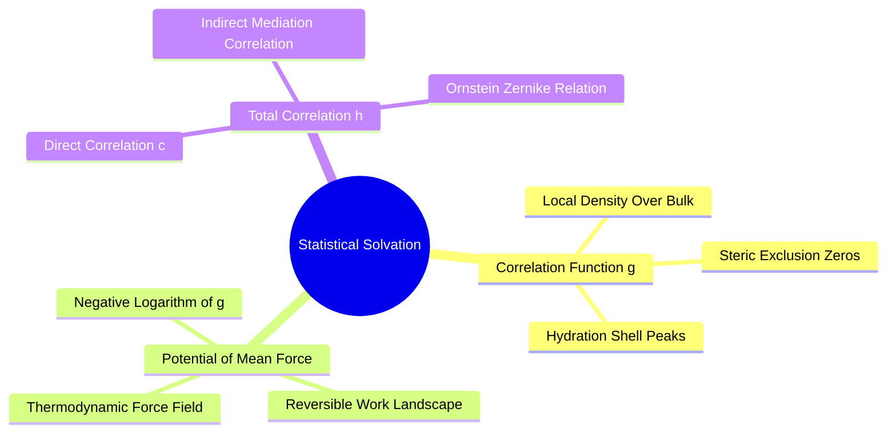
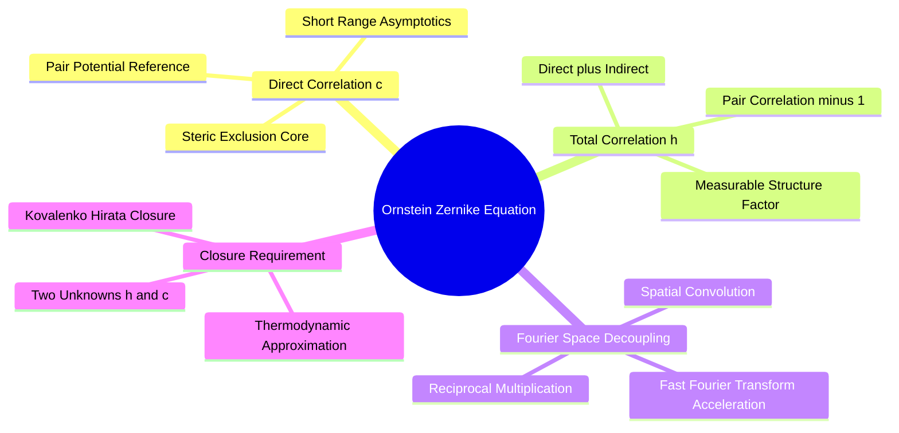
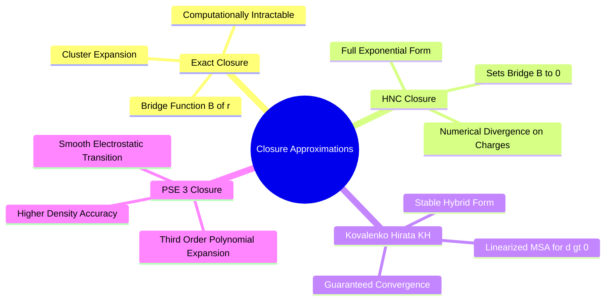

# Canonical Architecture Alignment

> HENF is the production hydration representation; 3D-RISM remains reference/teacher theory.

## 4.1. Statistical Mechanics of Molecular Solvation

### 4.1.1. Potential of Mean Force and Distribution Functions
```text
File: SynPath-3D Knowledge System/4. Computational Thermodynamics and Solvation Modeling/4.1. Statistical Mechanics of Molecular Solvation/4.1.1. Potential of Mean Force and Distribution Functions.md
Tags: #thermodynamics/statistical-mechanics #physics/pmf #solvation
```

#### 1. Concept Definition & Physical Nature
In statistical mechanics, the spatial distribution of liquid solvent particles around a solute (protein) is described by **molecular distribution functions**.

For an ensemble of $N$ solvent particles at equilibrium, the probability of observing a solvent molecule at position $\mathbf{r}$ relative to the protein is given by the **pair correlation function $g(\mathbf{r})$**:
$$g(\mathbf{r}) = \frac{\rho(\mathbf{r})}{\rho_{\text{bulk}}} = \frac{V}{N} \left\langle \sum_{i=1}^N \delta(\mathbf{r} - \mathbf{r}_i) \right\rangle$$
* $g(\mathbf{r}) = 1$: Local density matches bulk solvent (uncorrelated).
* $g(\mathbf{r}) > 1$: Local solvent concentration is enriched (hydration shells, structured water).
* $g(\mathbf{r}) \to 0$: Sterically excluded volume (occupied by protein atoms).

The **Potential of Mean Force (PMF), $W(\mathbf{r})$**, is the effective free-energy landscape experienced by a solvent particle at position $\mathbf{r}$, averaged over all thermal fluctuations and orientations of all other solvent molecules:
$$W(\mathbf{r}) = -k_B T \ln g(\mathbf{r})$$
The gradient $-\nabla W(\mathbf{r})$ gives the total average force exerted on a solvent particle at $\mathbf{r}$, incorporating both direct solute-solvent interactions and average solvent-solvent structural forces.



#### 2. Why It Matters in Biological & Chemical Systems
The PMF defines the free-energy landscape for water molecules in a binding cavity. When a ligand enters the cavity, it does not push water away against pure vacuum forces; it must perform work against the local Potential of Mean Force:
$$\Delta W = W(\mathbf{r}_{\text{final}}) - W(\mathbf{r}_{\text{initial}})$$
If a subpocket exhibits a high-energy PMF peak ($W(\mathbf{r}) > 0 \implies g(\mathbf{r}) < 1$), water molecules reside there under thermodynamic strain, favoring displacement by complementary drug fragments.

#### 3. Quad-Disciplinary Integration
* **Biology**: Ion channels (e.g., the KcsA potassium channel) use carbonyl oxygens arranged with sub-angstrom precision to match the PMF of a hydrated potassium ion, allowing ions to shed their hydration shells without paying an energetic barrier.
* **Chemistry**: Osmotic pressure and colligative properties are macroscopic manifestations of solvent chemical potentials described by the integral of $g(\mathbf{r})$.
* **Physics / Thermodynamics**: The PMF relates directly to the reversible work required to bring two particles from infinite separation to distance $r$:
  $$W(r) = \int_\infty^r \langle \mathbf{F}(r') \rangle \, dr'$$
* **Machine Learning Implementation**: The [[4.3.1. Neural Implicit Solvation Field Distillation]] head models $W(\mathbf{r})$ directly:
  $$\Psi_\phi(\mathbf{r} \mid \mathcal{P}) \approx W(\mathbf{r}) = -k_B T \ln g_O(\mathbf{r})$$
  This gives the neural policy access to the analytical potential of mean force for water displacement.

---

### 4.1.2. The Ornstein-Zernike Integral Equation
```text
File: SynPath-3D Knowledge System/4. Computational Thermodynamics and Solvation Modeling/4.1. Statistical Mechanics of Molecular Solvation/4.1.2. The Ornstein Zernike Integral Equation.md
Tags: #physics/ornstein-zernike #math/integral-equations #solvation-rism
```

#### 1. Concept Definition & Physical Nature
Leonard Ornstein and Frits Zernike (1914) proposed that the total correlation between two particles in a fluid, $h(\mathbf{r}) = g(\mathbf{r}) - 1$, can be decomposed into two physical contributions:
1. **Direct Correlation ($c(\mathbf{r})$)**: The direct, short-range interaction between particle 1 and particle 2.
2. **Indirect Correlation**: The correlation mediated through all intervening solvent particles ($3, 4, \dots$).

```text
The Ornstein-Zernike Decomposition:
   Total Correlation h(r₁₂)  =  Direct c(r₁₂)  +  Indirect [c * h]
         (1) ──────── (2)    =    (1) ── (2)   +   (1) ── (3) ──── (2)
                                                       Intervening Solvent
```

In continuous three-dimensional space, this is expressed as the **Ornstein-Zernike (OZ) Integral Equation**:
$$h(\mathbf{r}) = c(\mathbf{r}) + \rho \int_{\mathbb{R}^3} c(\mathbf{r}') h(\mathbf{r} - \mathbf{r}')\,d\mathbf{r}'$$
where $\rho$ is the average number density of the bulk fluid, and the integral represents a spatial convolution:
$$h(\mathbf{r}) = c(\mathbf{r}) + \rho (c * h)(\mathbf{r})$$

In reciprocal space (Fourier space), spatial convolution becomes multiplication, simplifying the equation:
$$\hat{h}(\mathbf{k}) = \hat{c}(\mathbf{k}) + \rho \hat{c}(\mathbf{k}) \hat{h}(\mathbf{k}) \implies \hat{h}(\mathbf{k}) = \frac{\hat{c}(\mathbf{k})}{1 - \rho \hat{c}(\mathbf{k})}$$
where $\hat{h}(\mathbf{k}) = \mathcal{F}\{h(\mathbf{r})\}$ and $\hat{c}(\mathbf{k}) = \mathcal{F}\{c(\mathbf{r})\}$.



#### 2. Why It Matters in Biological & Chemical Systems
The Ornstein-Zernike equation provides a path to compute the exact spatial hydration density $g(\mathbf{r})$ around a biological macro-molecule **without running molecular dynamics simulations**.

However, the OZ equation has two unknown functions ($h(\mathbf{r})$ and $c(\mathbf{r})$) for a single equation. To solve it, we require a second, independent relationship between $h(\mathbf{r})$, $c(\mathbf{r})$, and the inter-atomic potential $u(\mathbf{r})$: an **integral equation closure**.

#### 3. Quad-Disciplinary Integration
* **Biology**: Critical fluctuations in lipid membranes near phase transitions are characterized by diverging correlation lengths ($\xi \to \infty$) governed by the long-wavelength limit ($\mathbf{k} \to 0$) of the Ornstein-Zernike equation.
* **Chemistry**: Small-angle X-ray scattering (SAXS) and neutron scattering curves $I(\mathbf{q})$ measure the static structure factor $S(\mathbf{k}) = 1 + \rho \hat{h}(\mathbf{k})$.
* **Physics / Thermodynamics**: The isothermal compressibility of a solvent $\kappa_T$ is related to the integral of the total correlation function:
  $$k_B T \rho \kappa_T = 1 + \rho \int h(\mathbf{r})\,d^3\mathbf{r} = \hat{S}(0)$$
* **Machine Learning Implementation**: 3D-RISM is retained as a reference or auxiliary teacher method. HENF is the production runtime hydration representation.

---

### 4.1.3. Integral Equation Closures KH and PSE-3
```text
File: SynPath-3D Knowledge System/4. Computational Thermodynamics and Solvation Modeling/4.1. Statistical Mechanics of Molecular Solvation/4.1.3. Integral Equation Closures KH and PSE-3.md
Tags: #math/closures #physics/rism #thermodynamics/kovalenko-hirata
```

#### 1. Concept Definition & Physical Nature
An **integral equation closure** is an approximation relating the total correlation function $h(\mathbf{r})$, the direct correlation function $c(\mathbf{r})$, and the pair potential $u(\mathbf{r})$.

The formally exact closure relation is:
$$g(\mathbf{r}) = \exp\left( -\beta u(\mathbf{r}) + h(\mathbf{r}) - c(\mathbf{r}) + B(\mathbf{r}) \right)$$
where $\beta = 1 / (k_B T)$, and $B(\mathbf{r})$ represents the sum of all higher-order irreducible cluster diagrams (the **bridge function**). Because $B(\mathbf{r})$ cannot be computed analytically, closures introduce approximations:

1. **Hypernetted-Chain (HNC) Closure**: Sets $B(\mathbf{r}) \equiv 0$:
   $$g_{\text{HNC}}(\mathbf{r}) = \exp\left( d(\mathbf{r}) \right), \quad d(\mathbf{r}) = -\beta u(\mathbf{r}) + h(\mathbf{r}) - c(\mathbf{r})$$
   *Failure Mode*: HNC suffers from numerical divergence when applied to charged macromolecules (proteins). In regions of high electrostatic attraction, $d(\mathbf{r}) \gg 0$, causing $\exp(d(\mathbf{r}))$ to explode and destabilizing numerical convergence.
2. **Kovalenko-Hirata (KH) Closure**: Couples the HNC exponential closure in low-density/repulsive regions with a stable linearized Mean Spherical Approximation (MSA) in high-density regions:
   $$g_{\text{KH}}(\mathbf{r}) = \begin{cases} \exp(d(\mathbf{r})) & \text{for } d(\mathbf{r}) \le 0 \\ 1 + d(\mathbf{r}) & \text{for } d(\mathbf{r}) > 0 \end{cases}$$
   $$c_{\text{KH}}(\mathbf{r}) = \begin{cases} \exp(d(\mathbf{r})) - 1 - d(\mathbf{r}) + h(\mathbf{r}) - c(\mathbf{r}) & \text{for } d(\mathbf{r}) \le 0 \\ h(\mathbf{r}) - c(\mathbf{r}) & \text{for } d(\mathbf{r}) > 0 \end{cases}$$
   The KH closure is guaranteed to converge for arbitrary macromolecular geometries and formal charge distributions.
3. **Partial Series Expansion of Order $n$ (PSE-$n$) Closure**: Expands the exponential beyond the linear term up to order $n$ (e.g., $n=3$):
   $$g_{\text{PSE-3}}(\mathbf{r}) = \begin{cases} \exp(d(\mathbf{r})) & \text{for } d(\mathbf{r}) \le 0 \\ 1 + d(\mathbf{r}) + \frac{1}{2!}d(\mathbf{r})^2 + \frac{1}{3!}d(\mathbf{r})^3 & \text{for } d(\mathbf{r}) > 0 \end{cases}$$
   PSE-3 provides higher accuracy for local hydration shell densities near charged residues while maintaining numerical stability.



#### 2. Why It Matters in Biological & Chemical Systems
Biological pockets contain charged residues ($\text{Asp}^-, \text{Glu}^-, \text{Lys}^+, \text{Arg}^+$) where the local electrostatic potential is large. Using an unstable closure like HNC causes the numerical solver to crash. 

The Kovalenko-Hirata (KH) closure guarantees stable convergence across all protein cavities in the PDB, providing a robust path to automated dataset preparation.

#### 3. Quad-Disciplinary Integration
* **Biology**: Predicting whether an active-site metal ion ($\text{Zn}^{2+}, \text{Mg}^{2+}$) retains an inner-shell coordinated water requires a closure that handles strong electrostatic fields without divergence.
* **Chemistry**: The Singer-Chandler theory extends integral equation closures to molecular fluids where sites interact via multi-center Lennard-Jones and Coulomb potentials.
* **Physics / Thermodynamics**: The closed-form analytical expression for excess chemical potential under the KH closure is:
  $$\Delta \mu_{\text{excess}}^{\text{KH}} = k_B T \rho \int_{\mathbb{R}^3} \left[ \frac{1}{2}h^2(\mathbf{r})\Theta(-d(\mathbf{r})) - c(\mathbf{r}) - \frac{1}{2}h(\mathbf{r})c(\mathbf{r}) \right] \, d^3\mathbf{r}$$
  where $\Theta$ is the Heaviside step function. This allows direct evaluation of water free energy without running thermodynamic integration paths.
* **Machine Learning Implementation**: The automated solvation ingestion script in [[8.1.1. Multi-Source Manifest Ingestion and Cleaning]] executes `rism3d.snglpnt` with parameters:
  ```text
  --closure kh --tolerance 1e-5 --buffer 14.0 --maxiter 10000
  ```
  If convergence stalls on unusual multi-metal sites, the pipeline automatically falls back to `--closure pse3`.