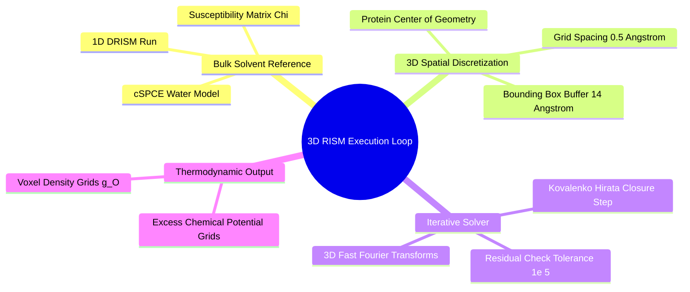
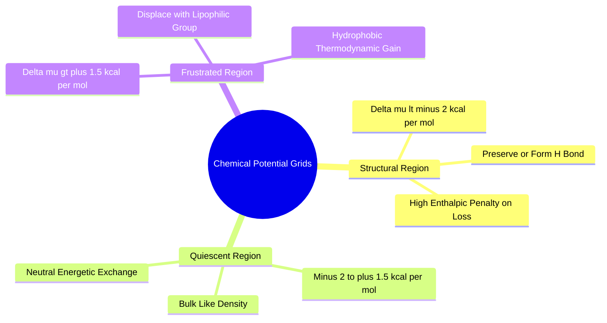

## 4.2. 3D-RISM Theory and Numerical Solvers

### 4.2.1. Numerical Implementation of 3D-RISM via AmberTools
```text
File: SynPath-3D Knowledge System/4. Computational Thermodynamics and Solvation Modeling/4.2. 3D-RISM Theory and Numerical Solvers/4.2.1. Numerical Implementation of 3D-RISM via AmberTools.md
Tags: #ambertools #physics/numerical-rism #data-pipeline
```

#### 1. Concept Definition & Physical Nature
**3D Reference Interaction Site Model (3D-RISM)** is an integral equation theory of molecular solvation that calculates the steady-state, three-dimensional correlation functions of solvent sites around a rigid solute.

The system of equations solved on a discrete 3D spatial grid is:
$$h_\gamma(\mathbf{r}) = \sum_{\alpha} \int_{\mathbb{R}^3} c_\alpha(\mathbf{r}') \chi_{\alpha\gamma}(|\mathbf{r} - \mathbf{r}'|)\,d^3\mathbf{r}'$$
* $h_\gamma(\mathbf{r})$: 3D total correlation function for solvent site $\gamma$ (e.g., water Oxygen or Hydrogen) at position $\mathbf{r}$ relative to the protein.
* $c_\alpha(\mathbf{r})$: 3D direct correlation function of solvent site $\alpha$.
* $\chi_{\alpha\gamma}(r)$: Site-site susceptibility function of bulk solvent, precomputed via 1D-RISM / Dielectric Consistent RISM (DRISM).



#### 2. Why It Matters in Biological & Chemical Systems
Unlike explicit-solvent molecular dynamics (which samples water configurations sequentially over nanoseconds), 3D-RISM solves the equilibrium distribution function over the entire grid simultaneously via spatial Fast Fourier Transforms (3D-FFT). 

A complete 3D-RISM calculation on a 2,000-atom protein pocket converges in **60 to 90 seconds** on a single CPU core. This makes processing 2,500 diverse pockets computationally practical:
$$2,500 \times 75\text{ s} \approx 52\text{ CPU-hours} \quad (\approx 1\text{ hour on a 64-core node})$$
This bypasses the multi-year explicit MD simulation wall while retaining analytical thermodynamic rigor.

#### 3. Quad-Disciplinary Integration
* **Biology**: 3D-RISM maps low-density hydrophobic cavities that facilitate ion and substrate transit in trans-membrane channels.
* **Chemistry**: The cSPCE (dielectric-corrected simple point charge) water model used in 3D-RISM reproduces bulk water dielectric screening ($\varepsilon \approx 78.4$) without requiring polarizable force fields.
* **Physics / Thermodynamics**: The solvent-solvent susceptibility $\chi_{\alpha\gamma}(k)$ incorporates intramolecular geometry constraints (via intra-molecular distribution functions $w_{\alpha\gamma}(k)$) and bulk liquid pair correlations ($h_{\alpha\gamma}(k)$):
  $$\hat{\chi}_{\alpha\gamma}(k) = \rho \left( w_{\alpha\gamma}(k) + \rho \hat{h}_{\alpha\gamma}(k) \right)$$
* **Machine Learning Implementation**: The preprocessing task in [[8.1.1. Multi-Source Manifest Ingestion and Cleaning]] launches 3D-RISM via AmberTools:
  ```bash
  rism3d.snglpnt --pdb pocket.pdb --prmtop pocket.prmtop \
                 --closure kh --xvv water.xvv \
                 --grdsp 0.5,0.5,0.5 --tolerance 1e-5
  ```
  The resulting volumetric grid files (`.dx` format) are converted into compressed HDF5 arrays for neural field distillation.

---

### 4.2.2. Chemical Potential Grids and Water Frustration
```text
File: SynPath-3D Knowledge System/4. Computational Thermodynamics and Solvation Modeling/4.2. 3D-RISM Theory and Numerical Solvers/4.2.2. Chemical Potential Grids and Water Frustration.md
Tags: #thermodynamics/chemical-potential #water-frustration #data-strategy
```

#### 1. Concept Definition & Physical Nature
A **Chemical Potential Grid** is a discrete 3D spatial scalar field $\Delta \mu_{\text{excess}}(\mathbf{r})$ defining the reversible work required to transfer a water molecule from bulk solvent into voxel $\mathbf{r} = (x, y, z)$ in the pocket.

Under the Kovalenko-Hirata closure, the free energy of hydration at each voxel is computed from the direct and total correlation grids:
$$\Delta \mu_{\text{excess}}(\mathbf{r}) = k_B T \rho_{\text{bulk}} \int_{\text{voxel}} \left[ \frac{1}{2}h_O^2(\mathbf{r}')\Theta(-d(\mathbf{r}')) - c_O(\mathbf{r}') - \frac{1}{2}h_O(\mathbf{r}')c_O(\mathbf{r}') \right] \, d^3\mathbf{r}'$$
Regions in the pocket fall into three thermodynamic regimes:

```text
Voxel Classification in Chemical Potential Grids:
      Δμ_excess(r) < -2.0 kcal/mol  ──► Enthalpically Stabilized Structural Water
-2.0 ≤ Δμ_excess(r) ≤ +1.5 kcal/mol  ──► Quiescent Displaceable Bulk-Like Solvent
      Δμ_excess(r) > +1.5 kcal/mol  ──► Thermodynamically Frustrated Water Site
```



#### 2. Why It Matters in Biological & Chemical Systems
Frustrated water sites mark the **thermodynamic binding hotspots** of a receptor:
* When an active site contains a cluster of voxels where $\Delta \mu > +2.5\text{ kcal/mol}$, placing a complementary hydrophobic group to displace those waters provides an immediate affinity boost.
* Conversely, voxels with $\Delta \mu < -3.0\text{ kcal/mol}$ identify essential structural waters. An algorithm that attempts to place a non-polar carbon atom over these voxels incurs a severe desolvation penalty, lowering binding affinity.

#### 3. Quad-Disciplinary Integration
* **Biology**: Selective binding to cyclophilin A requires forming hydrogen bonds with a conserved structural water trapped in the active-site floor.
* **Chemistry**: Water chemical potential grids provide quantitative guidelines for lead optimization, turning qualitative "magic methyl" hunts into targeted structural modifications.
* **Physics / Thermodynamics**: The total thermodynamic work of cavity desolvation by a small molecule of arbitrary shape $\Omega_{\text{ligand}}$ is computed via the spatial volume integral:
  $$\Delta G_{\text{dewetting}} = -\int_{\Omega_{\text{ligand}}} \Delta \mu_{\text{excess}}(\mathbf{r})\,d^3\mathbf{r}$$
* **Machine Learning Implementation**: In [[6.2.2. Target Interaction Field Anchor Prediction]], the model uses the chemical potential grid to initialize target anchors:
  $$\vec{x}_{\text{hydrophobic}}^* = \arg\max_{\vec{r}} \Delta \mu_{\text{excess}}(\vec{r})$$
  This directly directs the downstream synthon assembly toward high-energy water displacement sites.