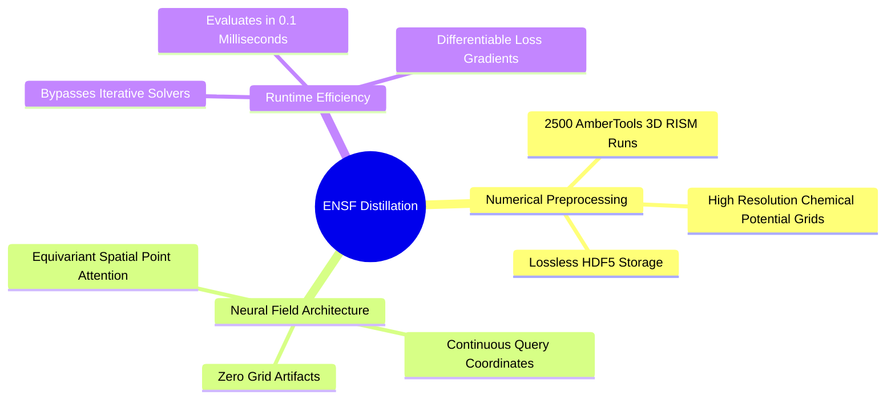
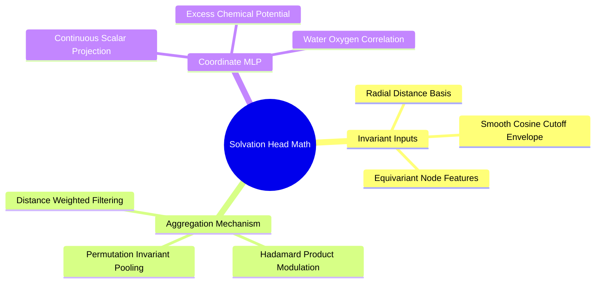

## 4.3. Equivariant Neural Solvation Field

### 4.3.1. Neural Implicit Solvation Field Distillation
```text
File: SynPath-3D Knowledge System/4. Computational Thermodynamics and Solvation Modeling/4.3. Equivariant Neural Solvation Field/4.3.1. Neural Implicit Solvation Field Distillation.md
Tags: #ml/neural-fields #physics/solvation #distillation
```

#### 1. Concept Definition & Physical Nature
An **Equivariant Neural Solvation Field (ENSF)** is a continuous coordinate-based neural network that acts as a neural surrogate for 3D-RISM. 

Rather than running a numerical integral equation solver for every generated candidate pose, the ENSF distills 3D-RISM thermodynamics across training pockets into an analytical neural field:
$$\Psi_\phi: \left( \mathcal{P}, \mathbf{r} \right) \longrightarrow \left[ \Delta \mu_{\text{excess}}(\mathbf{r}), \, g_O(\mathbf{r}) \right]$$
* Input: The protein pocket representation $\mathcal{P} = \{(\mathbf{x}_j, \mathbf{s}_j)\}_{j=1}^{N_p}$ and an arbitrary spatial query coordinate $\mathbf{r} \in \mathbb{R}^3$.
* Output: The continuous water chemical potential $\Delta \mu_{\text{excess}}$ and oxygen correlation ratio $g_O$ at position $\mathbf{r}$.



#### 2. Why It Matters in Biological & Chemical Systems
* **Sub-Millisecond Evaluation**: Numerical 3D-RISM takes $60\text{--}90\text{ seconds}$ per pocket, which is too slow to evaluate inside a generative model's sampling loop. The distilled ENSF network evaluates arbitrary coordinates in **$< 0.1\text{ ms}$ on GPU**.
* **Differentiability**: Because $\Psi_\phi(\mathbf{r} \mid \mathcal{P})$ is parameterized as a smooth neural network, its spatial gradient $\nabla_{\mathbf{r}} \Psi_\phi$ is analytically accessible via backpropagation. This enables the model to push ligand atoms toward favorable water-displacement positions using gradient-based kinematic updates.
* **Continuity**: Discarding fixed $0.5\text{ \AA}$ Cartesian grids avoids interpolation errors and boundary artifacts when evaluating non-grid points.

#### 3. Quad-Disciplinary Integration
* **Biology**: The distilled neural field models hydration surfaces around flexible loops and sidechains without requiring full solvent re-equilibration.
* **Chemistry**: The network learns that regions adjacent to basic amino acid nitrogens have negative chemical potentials, while hydrophobic pockets bounded by branched aliphatic chains have positive potentials.
* **Physics / Thermodynamics**: The distillation loss minimizes the mean squared error against ground-truth 3D-RISM grids:
  $$\mathcal{L}_{\text{distill}}(\phi) = \frac{1}{|\mathcal{B}_{\text{grid}}|} \sum_{\mathbf{r} \in \mathcal{B}_{\text{grid}}} \left| \Psi_\phi(\mathbf{r} \mid \mathcal{P}) - \Delta \mu_{\text{3D-RISM}}(\mathbf{r}) \right|^2$$
* **Machine Learning Implementation**: The ENSF module is implemented in `syntree/models/ensf.py` and trained during Stage 0 (Task 4.1). Its weights are frozen during subsequent downstream generative training.

---

### 4.3.2. Mathematical Formulation of the Solvation Head
```text
File: SynPath-3D Knowledge System/4. Computational Thermodynamics and Solvation Modeling/4.3. Equivariant Neural Solvation Field/4.3.2. Mathematical Formulation of the Solvation Head.md
Tags: #ml/architecture #physics/solvation-head #math
```

#### 1. Concept Definition & Physical Nature
The **Solvation Head** maps arbitrary query positions $\mathbf{r} \in \mathbb{R}^3$ to their local solvation thermodynamic properties while preserving global roto-translational equivariance:
$$\Psi_\phi(\mathbf{R}\mathbf{r} + \vec{t} \mid \mathbf{R}\mathcal{P} + \vec{t}) \equiv \Psi_\phi(\mathbf{r} \mid \mathcal{P})$$
Because excess chemical potential $\Delta \mu$ is a physical scalar, it must be **invariant** under rigid-body transformations of the reference frame.

Mathematical architecture of the forward evaluation:
1. For query coordinate $\mathbf{r} \in \mathbb{R}^3$, compute invariant Euclidean distances to all pocket atoms $j \in \mathcal{P}$:
   $$d_j(\mathbf{r}) = \|\mathbf{x}_j - \mathbf{r}\| \in \mathbb{R}^+$$
2. Expand distances through a high-frequency Gaussian radial basis ($N_{\text{rbf}} = 32$, cutoff $r_{\text{cut}} = 6.0\text{ \AA}$):
   $$\mathbf{e}_j(\mathbf{r}) = \text{RBF}(d_j(\mathbf{r})) \cdot f_{\text{cosine}}(d_j(\mathbf{r})) \in \mathbb{R}^{32}$$
3. Aggregate pocket node features $\mathbf{s}_j \in \mathbb{R}^{256}$ using distance-weighted attention:
   $$\mathbf{z}(\mathbf{r}) = \sum_{j \in \mathcal{P}, d_j < r_{\text{cut}}} \text{MLP}_{\text{filter}}(\mathbf{e}_j(\mathbf{r})) \odot \mathbf{s}_j \in \mathbb{R}^{256}$$
4. Project aggregated latent features through a SIREN / Fourier-feature MLP:
   $$\left[ \Delta \mu_{\text{excess}}(\mathbf{r}), \, g_O(\mathbf{r}) \right] = \mathbf{W}_2 \text{SiLU}\left( \mathbf{W}_1 \mathbf{z}(\mathbf{r}) + \mathbf{b}_1 \right) + \mathbf{b}_2 \in \mathbb{R}^2$$



#### 2. Why It Matters in Biological & Chemical Systems
By ensuring exact SE(3) invariance, the predicted water displacement free energy remains identical regardless of how the protein-ligand complex is oriented or translated in the simulation box. 

This enables the model to score conformations during flow integration without artifacts introduced by arbitrary coordinate system rotations.

#### 3. Quad-Disciplinary Integration
* **Biology**: Solvation forces govern the hydrophobic collapse that drives small molecules into enzymatic pockets.
* **Chemistry**: The solvation head computes the thermodynamic difference between displacing neutral water and retaining charged ions.
* **Physics / Thermodynamics**: The thermodynamic reward functional integrates the solvation field over the ligand's heavy-atom van der Waals spheres $\Omega_a$:
  $$\Delta G_{\text{dewetting}} = \sum_{a \in \text{ligand}} \int_{\Omega_a} \max(0, \Psi_\phi(\mathbf{r})_{\Delta \mu} - 1.5) \, d^3\mathbf{r}$$
* **Machine Learning Implementation**: The forward pass is vectorized in `syntree/models/ensf.py` to evaluate batches of thousands of ligand coordinates simultaneously in $< 1\text{ ms}$:
  ```python
  # PyTorch implementation of the ENSF forward query
  dists = torch.cdist(query_coords, pocket_coords) # [B, N_query, N_pocket]
  rbf = compute_bessel_rbf(dists, r_cut=6.0)       # [B, N_query, N_pocket, 32]
  weights = mlp_filter(rbf) * pocket_scalars.unsqueeze(1)
  latent_field = weights.sum(dim=2)                 # [B, N_query, 256]
  solvation_pred = mlp_out(latent_field)            # [B, N_query, 2]
  ```

---

### 4.3.3. Worked Exercise on 3D-RISM Thermodynamic Integration
```text
File: SynPath-3D Knowledge System/4. Computational Thermodynamics and Solvation Modeling/4.3. Equivariant Neural Solvation Field/4.3.3. Worked Exercise on 3D-RISM Thermodynamic Integration.md
Tags: #exercise #math/rism #thermodynamics #worked-problem
```

#### 1. Problem Statement
The ENSF solvation network evaluates a small, deep subpocket lined with three leucine residues. The network predicts the continuous total correlation function $h_O(\mathbf{r})$ and direct correlation function $c_O(\mathbf{r})$ of water oxygen on a localized $3 \times 3 \times 3$ grid of voxels ($V_{\text{voxel}} = 0.5^3\text{ \AA}^3 = 0.125\text{ \AA}^3$) centered on an un-displaced water site.

At the central voxel $\mathbf{r}_0$:
* Pair potential energy: $u(\mathbf{r}_0) = +1.20\text{ kcal/mol}$ (steric clash with leucine methyl groups)
* Total correlation function: $h_O(\mathbf{r}_0) = -0.65$
* Direct correlation function: $c_O(\mathbf{r}_0) = -2.45$
* Temperature: $T = 298.15\text{ K}$ ($k_B T \approx 0.593\text{ kcal/mol}$)
* Bulk water density: $\rho_{\text{bulk}} = 0.0334\text{ molecules/\AA}^3$

1. Compute the intermediate variable $d(\mathbf{r}_0) = -\beta u(\mathbf{r}_0) + h_O(\mathbf{r}_0) - c_O(\mathbf{r}_0)$.
2. Determine whether the Kovalenko-Hirata closure evaluates under the exponential or the linearized branch at $\mathbf{r}_0$.
3. Compute the local water density ratio $g_O(\mathbf{r}_0)$.
4. Compute the exact excess chemical potential $\Delta \mu_{\text{excess}}(\mathbf{r}_0)$ in $\text{kcal/mol}$ using the analytical KH formula.
5. Explain what generative action SynPath-3D should execute at this position.

---

#### 2. Background Knowledge Required
* Statistical mechanics definitions: $g(\mathbf{r}) = h(\mathbf{r}) + 1$.
* The Kovalenko-Hirata (KH) closure equations and branching conditions.
* The KH excess chemical potential analytical formula.

---

#### 3. Terminology Definitions
* **$\beta$**: Inverse thermal energy, $\beta = 1 / (k_B T) \approx 1 / 0.593\text{ kcal/mol} \approx 1.686\text{ kcal}^{-1}\cdot\text{mol}$.
* **$d(\mathbf{r})$**: The closure coupling field. When $d(\mathbf{r}) \le 0$, water behaves like an exponential fluid (HNC regime). When $d(\mathbf{r}) > 0$, water is linearly regularized to prevent numerical divergence.

---

#### 4. Step-by-Step Solution

##### Step 1: Compute the Coupling Field $d(\mathbf{r}_0)$
$$\beta = \frac{1}{0.593\text{ kcal/mol}} \approx 1.6863\text{ kcal}^{-1}\cdot\text{mol}$$
$$-\beta u(\mathbf{r}_0) = -(1.6863) \times (+1.20) = -2.0236$$
$$d(\mathbf{r}_0) = -\beta u(\mathbf{r}_0) + h_O(\mathbf{r}_0) - c_O(\mathbf{r}_0)$$
$$d(\mathbf{r}_0) = -2.0236 + (-0.65) - (-2.45)$$
$$d(\mathbf{r}_0) = -2.0236 - 0.65 + 2.45 = -0.2236$$

---

##### Step 2: Determine the Closure Branch
Evaluate the branching criterion for the Kovalenko-Hirata closure:
$$\text{Criterion: } d(\mathbf{r}_0) \le 0 \implies \text{Exponential (HNC) Branch}$$
Since $d(\mathbf{r}_0) = -0.2236 \le 0$, the closure evaluates under the **exponential regime**.

---

##### Step 3: Compute the Water Oxygen Density Ratio $g_O(\mathbf{r}_0)$
Under the exponential branch of the KH closure:
$$g_O(\mathbf{r}_0) = \exp(d(\mathbf{r}_0))$$
$$g_O(\mathbf{r}_0) = \exp(-0.2236) \approx 0.7996$$

*Result of Step 3*: The local water density is $\approx 80\%$ of bulk water density ($g_O < 1.0$), indicating a partially dewetted, sterically crowded pocket volume.

---

##### Step 4: Compute the Excess Chemical Potential $\Delta \mu_{\text{excess}}(\mathbf{r}_0)$
The analytical formula for the KH chemical potential density is:
$$\Delta \mu_{\text{excess}}^{\text{KH}}(\mathbf{r}_0) = k_B T \left[ \frac{1}{2}h_O^2(\mathbf{r}_0)\Theta(-d(\mathbf{r}_0)) - c_O(\mathbf{r}_0) - \frac{1}{2}h_O(\mathbf{r}_0)c_O(\mathbf{r}_0) \right]$$
Since $d(\mathbf{r}_0) \le 0$, the Heaviside step function $\Theta(-d(\mathbf{r}_0)) = 1$.

Evaluate each term inside the bracket:
1. First term:
   $$\frac{1}{2}h_O^2(\mathbf{r}_0) = \frac{1}{2}(-0.65)^2 = \frac{1}{2}(0.4225) = 0.21125$$
2. Second term:
   $$-c_O(\mathbf{r}_0) = -(-2.45) = +2.45$$
3. Third term:
   $$-\frac{1}{2}h_O(\mathbf{r}_0)c_O(\mathbf{r}_0) = -\frac{1}{2}(-0.65)(-2.45) = -\frac{1}{2}(1.5925) = -0.79625$$

Sum the terms inside the bracket:
$$\text{Bracket Sum} = 0.21125 + 2.45 - 0.79625 = 1.865$$

Multiply by thermal energy $k_B T = 0.593\text{ kcal/mol}$:
$$\Delta \mu_{\text{excess}}(\mathbf{r}_0) = (0.593\text{ kcal/mol}) \times 1.865 = +1.106\text{ kcal/mol}$$

---

##### Step 5: Determine the Generative Action
Evaluate the thermodynamic classification:
$$\Delta \mu_{\text{excess}} = +1.11\text{ kcal/mol} > 0$$
While this water is not extremely frustrated ($\Delta \mu < +1.5\text{ kcal/mol}$), it is unstable relative to bulk water ($\Delta \mu > 0$). 
* The positive potential is driven by repulsive steric overlap ($u = +1.20\text{ kcal/mol}$) with the leucine sidechains.
* **Generative Policy Decision**: SynPath-3D's TIF head places a hydrophobic anchor near $\mathbf{r}_0$, and the synthon selection policy chooses a small non-polar group (e.g., an ethyl or cyclopropyl fragment) to displace this water, gaining $\approx -1.1\text{ kcal/mol}$ in desolvation free energy.

---

#### 5. Why Each Step Is Necessary
* **Step 1**: Calculates the net effective field combining direct intermolecular repulsion and collective solvent reorganization.
* **Step 2**: Identifies whether the closure behaves as an exponential fluid or requires linear stabilization.
* **Step 3**: Converts the coupling field into an observable physical water density ratio.
* **Step 4**: Applies the analytical statistical mechanics formula to calculate thermodynamic work.
* **Step 5**: Translates free energy into a discrete generative design action.

---

#### 6. The Correct Answer
1. $d(\mathbf{r}_0) = -0.2236$.
2. The closure evaluates under the **exponential (HNC) branch** ($\Theta = 1$).
3. The local water density ratio is **$g_O(\mathbf{r}_0) \approx 0.80$**.
4. The excess chemical potential is **$\Delta \mu_{\text{excess}} = +1.11\text{ kcal/mol}$**.
5. SynPath-3D should **displace this water molecule** by placing a complementary hydrophobic synthon.

---

#### 7. Theoretical Reasoning
The water molecule is held at lower density than bulk water ($g_O = 0.80$) because the non-polar leucine methyl groups crowd its van der Waals volume. Displacing this water releases it to bulk solvent, providing a thermodynamic gain.

---

#### 8. Common Student Mistakes
* **Sign errors in the direct correlation term**: $c_O$ is negative ($-2.45$), so $-c_O$ becomes positive ($+2.45$). Forgetting this inversion leads to unphysical negative chemical potentials.
* **Using degrees instead of radians**: Not applicable here, but common when evaluating angular terms.

---

#### 9. Misleading Traps & False Intuitions
* **The "Zero Density Trap"**: Assuming that because $u(\mathbf{r}_0) > 0$ (repulsive), no water can exist there ($g_O = 0$). In liquid water, collective multi-body solvent pressure forces water molecules into unfavorable regions, creating frustrated sites.

---

#### 10. Useful Tips & Memory Tricks
* Remember that in 3D-RISM closures:
  $$d \le 0 \implies \text{Exponential}$$
  $$d > 0 \implies \text{Linear (Kovalenko-Hirata Cut)}$$

---

#### 11. Details Commonly Forgotten
* The KH excess chemical potential formula calculates the excess free energy density. To find the total free energy across a subpocket, this density must be integrated over the subpocket's spatial volume.

---

#### 12. Connection to Broader Disciplines
* **Physical Chemistry**: Kirkwood-Buff theory of solutions links local volume integrals of correlation functions to macroscopic thermodynamic quantities like partial molar volumes and chemical potentials.

---

#### 13. Direct Application to SynPath-3D
In SynPath-3D, the loss function for Stage 0 training evaluates this exact formula across thousands of voxels:
```python
# Objective function for training ENSF
def kh_excess_chemical_potential(h_O, c_O, d_field, kBT=0.593):
    theta_mask = (d_field <= 0).float()
    bracket = 0.5 * (h_O ** 2) * theta_mask - c_O - 0.5 * h_O * c_O
    return kBT * bracket # Targets for ENSF distillation
```

---

# 5. Lie-Algebraic Geometry and Robotics Kinematics