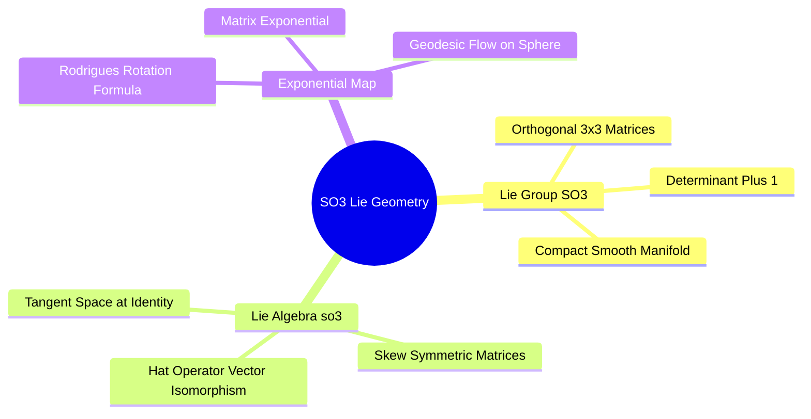
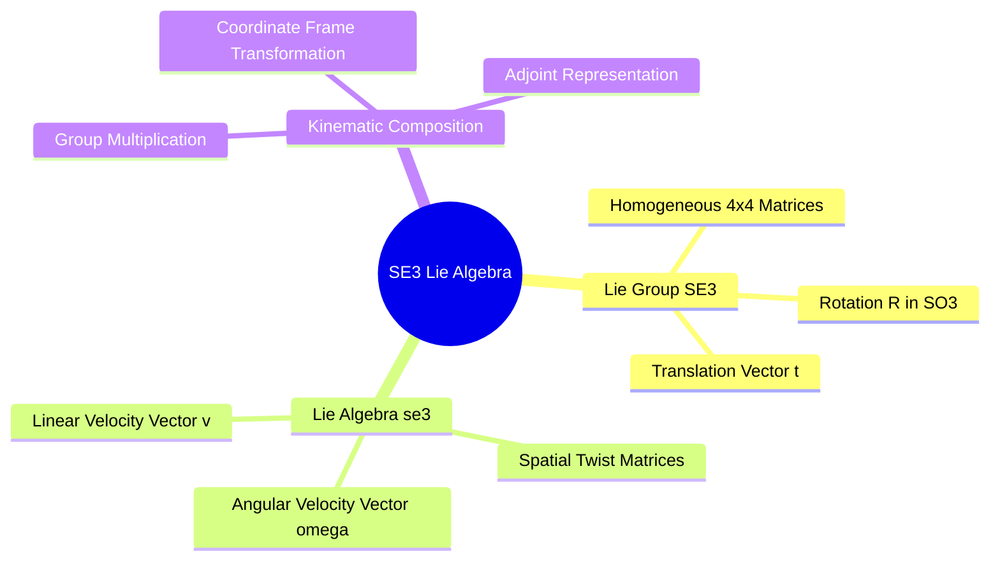
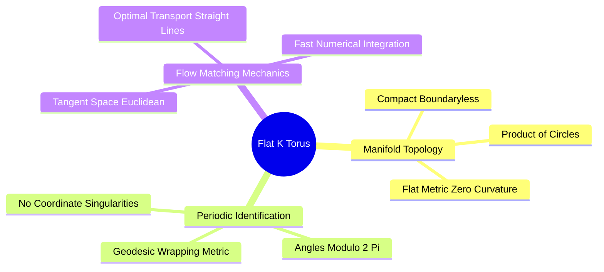

## 5.1. Foundations of Lie Groups and Lie Algebras

### 5.1.1. The Special Orthogonal Group SO(3) and Rotation Frames
```text
File: SynPath-3D Knowledge System/5. Lie-Algebraic Geometry and Robotics Kinematics/5.1. Foundations of Lie Groups and Lie Algebras/5.1.1. The Special Orthogonal Group SO3 and Rotation Frames.md
Tags: #math/lie-groups #geometry/so3 #physics/rotations
```

#### 1. Concept Definition & Physical Nature
The **Special Orthogonal Group $\mathrm{SO}(3)$** is the continuous Lie group representing all rigid, orientation-preserving rotations in three-dimensional Euclidean space $\mathbb{R}^3$:
$$\mathrm{SO}(3) = \left\{ \mathbf{R} \in \mathbb{R}^{3 \times 3} \;\middle|\; \mathbf{R}^T \mathbf{R} = \mathbf{I}, \, \det(\mathbf{R}) = +1 \right\}$$
$\mathrm{SO}(3)$ is a 3-dimensional, non-commutative (non-Abelian) compact smooth manifold.

The associated **Lie Algebra $\mathfrak{so}(3)$** is the tangent space to the Lie group at the identity matrix ($\mathbf{I}$). It comprises all real $3 \times 3$ skew-symmetric matrices:
$$\mathfrak{so}(3) = \left\{ \mathbf{A} \in \mathbb{R}^{3 \times 3} \;\middle|\; \mathbf{A}^T = -\mathbf{A} \right\}$$
Any skew-symmetric matrix $\mathbf{A} \in \mathfrak{so}(3)$ can be mapped to an angular velocity vector $\vec{\omega} = (\omega_x, \omega_y, \omega_z)^T \in \mathbb{R}^3$ via the "hat operator" $[\,\cdot\,]_\times$:
$$[\vec{\omega}]_\times = \begin{bmatrix} 0 & -\omega_z & \omega_y \\ \omega_z & 0 & -\omega_x \\ -\omega_y & \omega_x & 0 \end{bmatrix} \in \mathfrak{so}(3)$$
The Lie bracket is defined by the matrix commutator:
$$[ [\vec{\omega}_1]_\times, [\vec{\omega}_2]_\times ] = [\vec{\omega}_1]_\times [\vec{\omega}_2]_\times - [\vec{\omega}_2]_\times [\vec{\omega}_1]_\times = [\vec{\omega}_1 \times \vec{\omega}_2]_\times$$



The **Exponential Map ($\exp: \mathfrak{so}(3) \to \mathrm{SO}(3)$)** maps an angular velocity vector $\vec{\omega} \theta$ (axis $\vec{u} = \vec{\omega}/\|\vec{\omega}\|$, angle $\theta = \|\vec{\omega}\theta\|$) to its corresponding rotation matrix via **Rodrigues' Rotation Formula**:
$$\exp([\vec{\omega}]_\times \theta) = \mathbf{I} + \sin\theta [\vec{u}]_\times + (1 - \cos\theta) [\vec{u}]_\times^2$$
The **Logarithmic Map ($\log: \mathrm{SO}(3) \to \mathfrak{so}(3)$)** inverts this transformation:
$$\theta = \arccos\left( \frac{\text{Tr}(\mathbf{R}) - 1}{2} \right), \quad [\vec{u}]_\times = \frac{1}{2\sin\theta}(\mathbf{R} - \mathbf{R}^T)$$

#### 2. Why It Matters in Biological & Chemical Systems
Proteins and small molecules are assemblies of directional vectors (hydrogen bonds, covalent bonds, lone pairs). Parameterizing orientations using unconstrained $3 \times 3$ matrices breaks orthogonality ($\mathbf{R}^T\mathbf{R} \neq \mathbf{I}$), causing artificial bond stretching or shearing. 

Conversely, parameterizing rotations via Euler angles ($\alpha, \beta, \gamma$) introduces **Gimbal Lock** (loss of a degree of freedom when rotation axes align) and coordinate singularities. 

Formulating rotations natively on the Lie group $\mathrm{SO}(3)$ preserves exact, un-distorted rigid-body geometry without coordinate singularities.

#### 3. Quad-Disciplinary Integration
* **Biology**: Cryo-EM single-particle reconstruction estimates particle orientations as elements of $\mathrm{SO}(3)$ to reconstruct 3D electron density from 2D projections.
* **Chemistry**: The rotation of an $sp^3-sp^3$ covalent single bond corresponds to a 1D subgroup of $\mathrm{SO}(3)$ whose rotation axis is fixed along the bond vector.
* **Physics / Thermodynamics**: The Haar measure on $\mathrm{SO}(3)$ defines the uniform, unbiased distribution over spatial orientations:
  $$d\mathbf{R} = \frac{1}{8\pi^2} \sin\theta \, d\theta \, d\phi \, d\psi$$
* **Machine Learning Implementation**: In [[6.2.2. Target Interaction Field Anchor Prediction]], target interaction frames $\mathbf{R}_m \in \mathrm{SO}(3)$ are parameterized via continuous 6D representations (Zhou et al., 2019):
  $$\mathbf{R} = \text{GramSchmidt}\left( \mathbf{W}_{\text{frame}}\mathbf{z}_m \in \mathbb{R}^{3 \times 2} \right) \in \mathrm{SO}(3)$$
  This guarantees that predicted reference frames remain strictly orthogonal.

---

### 5.1.2. The Special Euclidean Group SE(3) and Rigid Transforms
```text
File: SynPath-3D Knowledge System/5. Lie-Algebraic Geometry and Robotics Kinematics/5.1. Foundations of Lie Groups and Lie Algebras/5.1.2. The Special Euclidean Group SE3 and Rigid Transforms.md
Tags: #math/lie-groups #geometry/se3 #physics/rigid-body
```

#### 1. Concept Definition & Physical Nature
The **Special Euclidean Group $\mathrm{SE}(3)$** is the Lie group of all rigid-body transformations (rotations and translations) in three-dimensional space:
$$\mathrm{SE}(3) = \left\{ T = \begin{bmatrix} \mathbf{R} & \vec{t} \\ \mathbf{0}_{1 \times 3} & 1 \end{bmatrix} \in \mathbb{R}^{4 \times 4} \;\middle|\; \mathbf{R} \in \mathrm{SO}(3), \, \vec{t} \in \mathbb{R}^3 \right\}$$
$\mathrm{SE}(3)$ is a 6-dimensional non-compact Lie group formed by the semidirect product:
$$\mathrm{SE}(3) = \mathbb{R}^3 \rtimes \mathrm{SO}(3)$$
The action of $T \in \mathrm{SE}(3)$ on a homogeneous coordinate point $\mathbf{x} = [x, y, z, 1]^T$ is:
$$T \begin{bmatrix} \vec{x} \\ 1 \end{bmatrix} = \begin{bmatrix} \mathbf{R}\vec{x} + \vec{t} \\ 1 \end{bmatrix}$$

The associated **Lie Algebra $\mathfrak{se}(3)$** is the space of spatial twists:
$$\mathfrak{se}(3) = \left\{ \hat{\xi} = \begin{bmatrix} [\vec{\omega}]_\times & \vec{v} \\ \mathbf{0}_{1 \times 3} & 0 \end{bmatrix} \in \mathbb{R}^{4 \times 4} \;\middle|\; [\vec{\omega}]_\times \in \mathfrak{so}(3), \, \vec{v} \in \mathbb{R}^3 \right\}$$
A twist vector in coordinates is represented as $\xi = (\vec{\omega}, \vec{v}) \in \mathbb{R}^6$, where $\vec{\omega}$ is the angular velocity vector and $\vec{v}$ is the linear velocity vector.



The **Adjoint Representation ($\text{Ad}_T$)** transforms twist vectors between different coordinate frames:
$$\text{Ad}_T = \begin{bmatrix} \mathbf{R} & \mathbf{0}_{3 \times 3} \\ [\vec{t}]_\times \mathbf{R} & \mathbf{R} \end{bmatrix} \in \mathbb{R}^{6 \times 6}, \quad \hat{\xi}' = T \hat{\xi} T^{-1} \iff \xi' = \text{Ad}_T \xi$$

#### 2. Why It Matters in Biological & Chemical Systems
* **Protein Backbone Parameterization**: Each amino acid residue's peptide plane can be represented as an element $T_i = (\mathbf{R}_i, \vec{t}_i) \in \mathrm{SE}(3)$, where $\vec{t}_i = \vec{x}_{\text{C}\alpha}$ is the translation and $\mathbf{R}_i$ is the orientation frame derived from $(\text{N}, \text{C}_\alpha, \text{C})$.
* **Docking / Rigid Fragment Placement**: Placing a rigid fragment into a binding subpocket is parameterized by an action $T \in \mathrm{SE}(3)$.

#### 3. Quad-Disciplinary Integration
* **Biology**: Structural alignment algorithms (e.g., TM-align) find the optimal $T^* \in \mathrm{SE}(3)$ that minimizes the root-mean-square deviation (RMSD) between homologous protein backbones.
* **Chemistry**: Rigid-body docking engines (AutoDock, Glide) sample from $\mathrm{SE}(3)$ space to position a ligand scaffold into an active site before optimizing internal dihedrals.
* **Physics / Thermodynamics**: Rigid-body motion preserves distances between all internal points:
  $$\|T\mathbf{x}_1 - T\mathbf{x}_2\| \equiv \|\mathbf{x}_1 - \mathbf{x}_2\| \quad \forall \mathbf{x}_1, \mathbf{x}_2 \in \mathbb{R}^3$$
* **Machine Learning Implementation**: In [[2.1. Multi-Scale Protein Backbone Frames & Invariant Point Cloud]], protein backbones are embedded as $\mathrm{SE}(3)$ frames. Pocket node attention uses Invariant Point Attention (IPA), computing spatial interactions directly across frames:
  $$\Delta \vec{x}_{ij} = T_i^{-1} \circ \vec{x}_j = \mathbf{R}_i^T (\vec{x}_j - \vec{t}_i)$$

---

### 5.1.3. The Flat K-Torus and Torsional Manifolds
```text
File: SynPath-3D Knowledge System/5. Lie-Algebraic Geometry and Robotics Kinematics/5.1. Foundations of Lie Groups and Lie Algebras/5.1.3. The Flat K Torus and Torsional Manifolds.md
Tags: #math/torus #geometry/riemannian #dihedrals
```

#### 1. Concept Definition & Physical Nature
When an assembled molecule contains $K$ rotatable covalent single bonds, its internal conformational flexibility (holding bond lengths and valence angles fixed) is described by the **flat $K$-torus**:
$$\mathbb{T}^K = \underbrace{\mathbb{S}^1 \times \mathbb{S}^1 \times \dots \times \mathbb{S}^1}_{K \text{ times}} \cong \mathrm{SO}(2)^K \cong [-\pi, \pi)^K$$
$\mathbb{T}^K$ is a compact, boundaryless Riemannian manifold with intrinsic dimension $K$.

Because $\mathbb{T}^K$ is a flat manifold (Riemann curvature tensor $R^a{}_{bcd} \equiv 0$), its local Riemannian metric is the standard Euclidean metric with periodic identification:
$$\vec{\theta} \sim \vec{\theta} + 2\pi \mathbf{n}, \quad \mathbf{n} \in \mathbb{Z}^K$$
The geodesic distance between two torsional configurations $\vec{\theta}_a, \vec{\theta}_b \in \mathbb{T}^K$ is the shortest path across periodic boundaries:
$$d_{\mathbb{T}^K}(\vec{\theta}_a, \vec{\theta}_b) = \sqrt{\sum_{k=1}^K \min\left( |\theta_{a, k} - \theta_{b, k}|, \, 2\pi - |\theta_{a, k} - \theta_{b, k}| \right)^2}$$

```text
The Flat 2-Torus Periodic Domain:
       +π ┌─────────────────────────┐
          │      ● (θa)             │  Shortest geodesic wraps
          │                         │  around periodic boundary!
        θ₂│                         │
          │                         │
          │             ● (θb)      │
       -π └─────────────────────────┘
         -π           θ₁           +π
```



#### 2. Why It Matters in Biological & Chemical Systems
* **Elimination of Metric Distortions**: Parameterizing dihedrals as unconstrained continuous scalars in $\mathbb{R}^K$ introduces artificial boundaries at $\pm \pi$: an angle of $+179^\circ$ and an angle of $-179^\circ$ appear $358^\circ$ apart in $\mathbb{R}^1$, even though they are separated by only $2^\circ$ on the circular manifold.
* **Torsional Riemannian Flow Matching**: Because the metric tensor on $\mathbb{T}^K$ is Euclidean ($\mathbf{g}_{ij} = \delta_{ij}$), the optimal transport probability path between noise $\vec{\phi}_0 \sim \mathcal{U}(\mathbb{T}^K)$ and target dihedrals $\vec{\phi}_1$ is a straight line on the unwrapped tangent space:
  $$\vec{\phi}_t = \vec{\phi}_0 + t \cdot \text{wrap}(\vec{\phi}_1 - \vec{\phi}_0) \pmod{2\pi}$$
  This makes Riemannian Flow Matching on $\mathbb{T}^K$ as fast and stable as Euclidean flow matching, avoiding the spherical harmonic projections required by curved manifolds like $\mathbb{S}^2$.

#### 3. Quad-Disciplinary Integration
* **Biology**: The energy landscape of a flexible loop containing $K$ residues is a potential surface on $\mathbb{T}^{2K}$ (the product space of all $(\phi, \psi)$ pairs).
* **Chemistry**: Dihedral transitions between staggered energy minima ($g^+, t, g^-$) correspond to hopping between local basins on the $\mathbb{T}^K$ potential energy surface.
* **Physics / Thermodynamics**: The partition function for internal molecular rotations is:
  $$Z_{\text{torsion}} = \int_{\mathbb{T}^K} \exp\left( -\frac{V(\vec{\theta})}{k_B T} \right) \, d^K\vec{\theta}$$
* **Machine Learning Implementation**: The [[7.1.2. Vector Field Regression on Flat Tori]] module regresses vector fields on $\mathbb{T}^K$ using the wrapped loss:
  $$\mathcal{L}_{\text{torus}} = \sum_{k=1}^K \min\left( |v_k - \Delta_k^*|, \, 2\pi - |v_k - \Delta_k^*| \right)^2$$
  This removes boundary artifacts from gradient updates.