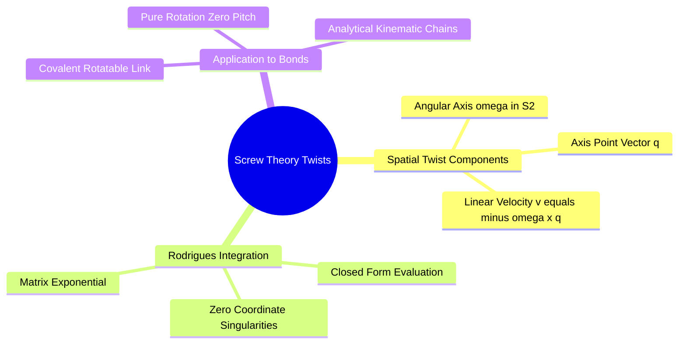
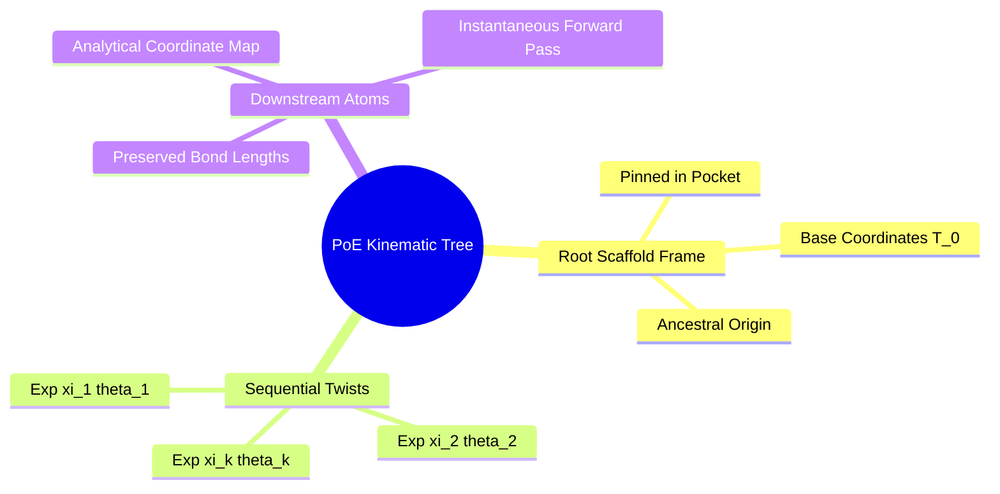
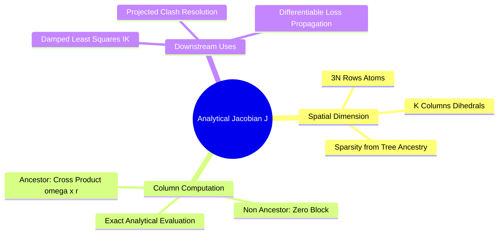

## 5.2. Robotics Screw Theory and Kinematics

### 5.2.1. Spatial Twists and Rodrigues' Formula
```text
File: SynPath-3D Knowledge System/5. Lie-Algebraic Geometry and Robotics Kinematics/5.2. Robotics Screw Theory and Kinematics/5.2.1. Spatial Twists and Rodrigues Formula.md
Tags: #robotics/screw-theory #math/rodrigues #kinematics
```

#### 1. Concept Definition & Physical Nature
In Mozzi-Chasles screw theory, any rigid-body displacement in three dimensions can be realized as a rotation around an axis accompanied by a simultaneous translation along that same axis: a **screw motion**.

A **spatial twist $\xi \in \mathbb{R}^6$** parameterizes this screw motion:
$$\xi = \begin{bmatrix} \vec{\omega} \\ \vec{v} \end{bmatrix}, \quad \hat{\xi} = \begin{bmatrix} [\vec{\omega}]_\times & \vec{v} \\ \mathbf{0}_{1 \times 3} & 0 \end{bmatrix} \in \mathfrak{se}(3)$$
For a pure rotation around a covalent bond:
* $\vec{\omega} \in \mathbb{S}^2$: Unit direction vector of the bond axis ($\|\vec{\omega}\| = 1$).
* $\vec{q} \in \mathbb{R}^3$: Any point located on the bond axis.
* The linear velocity component is:
  $$\vec{v} = -\vec{\omega} \times \vec{q}$$
* Pitch $h = 0$ (pure rotation, zero translation along the bond axis).



The matrix exponential of a pure rotational twist $\hat{\xi}\theta$ evaluates analytically via **Rodrigues' Extended Formula**:
$$\exp(\hat{\xi}\theta) = \begin{bmatrix} \exp([\vec{\omega}]_\times\theta) & \left( \mathbf{I}\theta + (1 - \cos\theta)[\vec{\omega}]_\times + (\theta - \sin\theta)[\vec{\omega}]_\times^2 \right)\vec{v} \\ \mathbf{0}_{1 \times 3} & 1 \end{bmatrix}$$
where:
$$\exp([\vec{\omega}]_\times\theta) = \mathbf{I} + \sin\theta [\vec{\omega}]_\times + (1 - \cos\theta) [\vec{\omega}]_\times^2$$
This formula computes the exact, closed-form 3D transformation matrix for any bond rotation without evaluating numerical series expansions.

#### 2. Why It Matters in Biological & Chemical Systems
Applying screw-theory twists guarantees that **covalent bond lengths and valence angles are conserved to machine precision**. 

When a bond rotates:
* The distance between bonded atoms is invariant: $d(a, b) \equiv \text{const}$.
* The angle between adjacent bonds is invariant: $\theta(a, b, c) \equiv \text{const}$.
* The operation is differentiable with respect to $\theta$.

#### 3. Quad-Disciplinary Integration
* **Biology**: Conformational transitions in motor proteins (e.g., the rotating $\gamma$-subunit of $\text{F}_1\text{F}_0$-ATP synthase) are screw motions parameterized by twists in $\mathfrak{se}(3)$.
* **Chemistry**: The rotation of an attached synthon around a single junction bond is a twist whose axis $\vec{\omega}$ is defined by the coordinates of the two junction atoms:
  $$\vec{\omega} = \frac{\vec{x}_{\text{core}} - \vec{x}_{\text{synthon}}}{\|\vec{x}_{\text{core}} - \vec{x}_{\text{synthon}}\|}$$
* **Physics / Thermodynamics**: The kinetic energy of an articulated molecular chain can be formulated using screw theory via the spatial inertia matrix $\mathbf{M} \in \mathbb{R}^{6 \times 6}$.
* **Machine Learning Implementation**: The [[2.1. Product of Exponentials (PoE) Molecular Screw-Theory Engine]] evaluates Rodrigues' formula in a GPU kernel:
  ```python
  # PyTorch batch evaluation of Rodrigues formula
  def rodrigues_twist_exp(omega, v, theta):
      # omega: [B, 3], v: [B, 3], theta: [B, 1]
      omega_cross = get_skew_symmetric(omega)
      R = I + torch.sin(theta)*omega_cross + (1 - torch.cos(theta))*(omega_cross @ omega_cross)
      trans = (I*theta + (1 - torch.cos(theta))*omega_cross + (theta - torch.sin(theta))*(omega_cross @ omega_cross)) @ v
      return construct_se3_matrix(R, trans)
  ```

---

### 5.2.2. Product of Exponentials Forward Kinematic Chains
```text
File: SynPath-3D Knowledge System/5. Lie-Algebraic Geometry and Robotics Kinematics/5.2. Robotics Screw Theory and Kinematics/5.2.2. Product of Exponentials Forward Kinematic Chains.md
Tags: #kinematics/poe #robotics/forward-kinematics #geometry
```

#### 1. Concept Definition & Physical Nature
The **Product of Exponentials (PoE)** formula, developed by Brockett (1984), calculates the forward kinematics of an articulated chain of rigid bodies connected by single-degree-of-freedom joints.

For a molecule rooted at a base scaffold (Anchor) with $K$ rotatable bonds, let:
* $T_a(0) \in \mathrm{SE}(3)$: Initial 3D pose of atom $a$ at reference configuration $\vec{\theta} = \mathbf{0}$.
* $\hat{\xi}_k \in \mathfrak{se}(3)$: Spatial twist of rotatable bond $k$, defined in the base reference frame.
* $\text{anc}(a) \subseteq \{1, \dots, K\}$: Ordered sequence of ancestral bonds connecting the root scaffold to atom $a$.

The 3D pose of atom $a$ at any arbitrary torsional configuration $\vec{\theta} = (\theta_1, \dots, \theta_K)$ is given by:
$$T_a(\vec{\theta}) = \exp(\hat{\xi}_1 \theta_1) \exp(\hat{\xi}_2 \theta_2) \dots \exp(\hat{\xi}_k \theta_k) T_a(0) = \left( \prod_{k \in \text{anc}(a)} \exp(\hat{\xi}_k \theta_k) \right) T_a(0)$$
The Cartesian coordinates $\vec{x}_a(\vec{\theta}) \in \mathbb{R}^3$ are extracted from the first three elements of the fourth column:
$$\begin{bmatrix} \vec{x}_a(\vec{\theta}) \\ 1 \end{bmatrix} = T_a(\vec{\theta}) \begin{bmatrix} \vec{x}_a(0) \\ 1 \end{bmatrix}$$



#### 2. Why It Matters in Biological & Chemical Systems
* **Zero Accumulation of Coordinate Drift**: Denavit-Hartenberg (D-H) parameters and sequential Cartesian translations accumulate numerical round-off error over long chains, causing bond stretching. The PoE formula evaluates each atom's position as a product of matrix exponentials, maintaining bond length conservation across arbitrary chain lengths.
* **Global Reference Frame Formulation**: All twists $\hat{\xi}_k$ can be defined in a **single common base coordinate frame** (the pocket frame) at reference configuration $\vec{\theta} = \mathbf{0}$, avoiding the need to establish local moving coordinate frames at every single bond.

#### 3. Quad-Disciplinary Integration
* **Biology**: Modeling the conformational flexibility of protein loops during homology modeling and refinement uses forward kinematic chains.
* **Chemistry**: An assembled multi-synthon molecule forms a branched kinematic tree where synthon attachments define new sub-branches.
* **Physics / Thermodynamics**: Because the PoE chain is an analytical function of dihedrals, the kinetic energy metric tensor (mass matrix $\mathbf{M}(\vec{\theta})$) can be derived analytically for molecular dynamics simulations.
* **Machine Learning Implementation**: Implemented in `syntree/models/geometry/poe_kinematics.py`. The tree structure is represented as an adjacency matrix of ancestral relationships, and the product of exponentials is evaluated in parallel across all atoms on GPU in **$< 0.1\text{ ms}$**.

---

### 5.2.3. The Analytical Manipulator Jacobian
```text
File: SynPath-3D Knowledge System/5. Lie-Algebraic Geometry and Robotics Kinematics/5.2. Robotics Screw Theory and Kinematics/5.2.3. The Analytical Manipulator Jacobian.md
Tags: #robotics/jacobian #math/derivatives #kinematics
```

#### 1. Concept Definition & Physical Nature
The **Manipulator Jacobian $\mathbf{J}(\vec{\theta})$** is the matrix of partial derivatives relating the velocity of joint coordinates ($\dot{\vec{\theta}} \in \mathbb{R}^K$) to the linear velocity of atoms ($\dot{\vec{x}} \in \mathbb{R}^{3N}$):
$$\dot{\vec{x}} = \mathbf{J}(\vec{\theta}) \dot{\vec{\theta}}, \quad \mathbf{J}(\vec{\theta}) = \frac{\partial \vec{x}}{\partial \vec{\theta}} \in \mathbb{R}^{3N \times K}$$

Using the Product of Exponentials formulation, the $k$-th column of the spatial Jacobian for atom $a$ is derived analytically:
$$\mathbf{J}_{a, k}(\vec{\theta}) = \frac{\partial \vec{x}_a(\vec{\theta})}{\partial \theta_k}$$
1. If bond $k$ is **not an ancestor** of atom $a$ ($k \notin \text{anc}(a)$), rotating bond $k$ does not displace atom $a$:
   $$\mathbf{J}_{a, k}(\vec{\theta}) = \mathbf{0}_{3 \times 1}$$
2. If bond $k$ is an **ancestor** of atom $a$ ($k \in \text{anc}(a)$), rotating bond $k$ induces a tangential velocity perpendicular to the current rotation axis:
   $$\mathbf{J}_{a, k}(\vec{\theta}) = \vec{\omega}_k'(\vec{\theta}) \times \left( \vec{x}_a(\vec{\theta}) - \vec{q}_k'(\vec{\theta}) \right)$$
   where $\vec{\omega}_k'(\vec{\theta})$ and $\vec{q}_k'(\vec{\theta})$ are the transformed axis direction and origin point of bond $k$ under the action of all preceding ancestral bonds:
   $$\begin{bmatrix} [\vec{\omega}_k']_\times & -\vec{\omega}_k' \times \vec{q}_k' \\ \mathbf{0} & 0 \end{bmatrix} = \left( \prod_{j \in \text{anc}(k)} \exp(\hat{\xi}_j \theta_j) \right) \hat{\xi}_k \left( \prod_{j \in \text{anc}(k)} \exp(\hat{\xi}_j \theta_j) \right)^{-1}$$



#### 2. Why It Matters in Biological & Chemical Systems
The Jacobian provides the mathematical link between internal torsional space ($\mathbb{T}^K$) and external Cartesian space ($\mathbb{R}^3$). 

If an external force (such as a steric clash with a protein wall, $\vec{F}_{\text{clash}} \in \mathbb{R}^{3N}$) acts on the molecule, the equivalent internal generalized torque $\vec{\tau} \in \mathbb{R}^K$ tending to rotate the internal single bonds is computed via the **Jacobian Transpose**:
$$\vec{\tau} = \mathbf{J}(\vec{\theta})^T \vec{F}_{\text{clash}}$$
This allows the network to calculate how to adjust dihedrals to relieve clashes analytically on GPU without running numerical finite differences or force-field loops.

#### 3. Quad-Disciplinary Integration
* **Biology**: Protein allostery can be modeled as force propagation through an internal kinematic Jacobian network, where binding at an allosteric site transmits torque to distal active-site residues.
* **Chemistry**: Ring-closure reactions require bringing two distant reactive ends together; the Jacobian defines the velocity path that minimizes closing strain.
* **Physics / Thermodynamics**: The volume element conversion between internal coordinates and Cartesian coordinates involves the Jacobian determinant:
  $$d^{3N}\vec{x} = \sqrt{\det(\mathbf{J}^T \mathbf{J})} \, d^K\vec{\theta} \, d^6 T_{\text{base}}$$
* **Machine Learning Implementation**: Implemented in `syntree/models/geometry/poe_kinematics.py`. The full Jacobian matrix $\mathbf{J} \in \mathbb{R}^{3N \times K}$ is evaluated in parallel using PyTorch cross products:
  ```python
  # PyTorch batch evaluation of analytical spatial Jacobian
  omega_current = transform_axes(omega_base, ancestral_transforms) # [K, 3]
  q_current = transform_points(q_base, ancestral_transforms