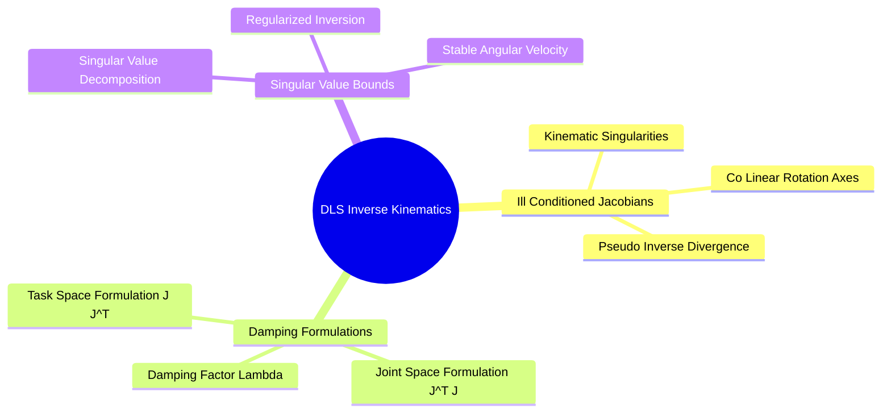
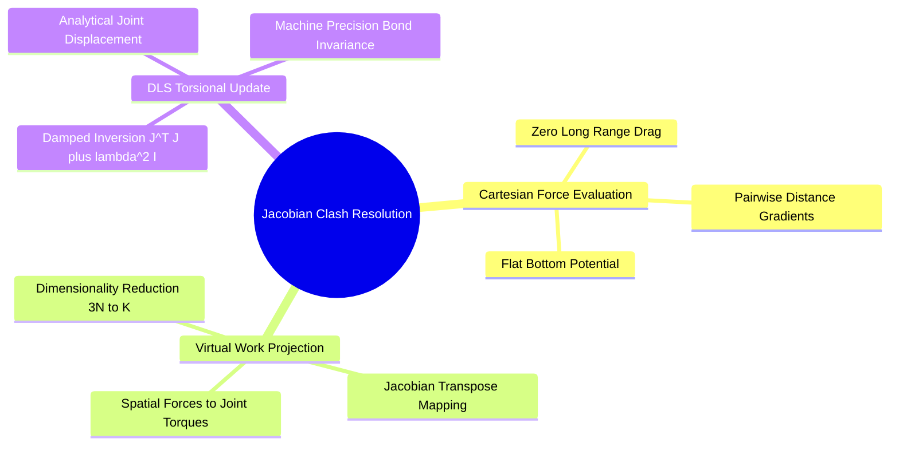

## 5.3. Differentiable Kinematic Collision Resolution

### 5.3.1. Damped Least Squares Inverse Kinematics
```text
File: SynPath-3D Knowledge System/5. Lie-Algebraic Geometry and Robotics Kinematics/5.3. Differentiable Kinematic Collision Resolution/5.3.1. Damped Least Squares Inverse Kinematics.md
Tags: #robotics/inverse-kinematics #math/optimization #algorithms
```

#### 1. Concept Definition & Physical Nature
**Inverse Kinematics (IK)** in molecular modeling is the problem of determining the internal rotatable dihedral angles $\vec{\theta} \in \mathbb{T}^K$ that place a terminal chemical handle or atom group at a desired spatial coordinate $\vec{x}^* \in \mathbb{R}^3$ with orientation $\mathbf{R}^* \in \mathrm{SO}(3)$.

The non-linear forward kinematics equation is:
$$\mathbf{f}(\vec{\theta}) = \vec{x}_{\text{current}}, \quad \Delta \vec{x} = \vec{x}^* - \mathbf{f}(\vec{\theta})$$

Linearizing around the current configuration using the Taylor expansion:
$$\Delta \vec{x} \approx \mathbf{J}(\vec{\theta})\Delta \vec{\theta}$$
where $\mathbf{J}(\vec{\theta}) \in \mathbb{R}^{m \times K}$ is the Manipulator Jacobian ($m \le 6$ spatial constraints, $K$ joints).

When $\mathbf{J}$ is non-square or ill-conditioned (near kinematic singularities where axes align), the standard pseudo-inverse $\mathbf{J}^+ = \mathbf{J}^T(\mathbf{J}\mathbf{J}^T)^{-1}$ diverges, generating unbounded joint velocity updates ($\|\Delta \vec{\theta}\| \to \infty$) that destabilize numerical integration.

To resolve this, SynPath-3D uses **Damped Least Squares (DLS) / Levenberg-Marquardt Inverse Kinematics**, which balances tracking accuracy against joint step magnitude:
$$\min_{\Delta \vec{\theta}} \left( \|\mathbf{J}\Delta \vec{\theta} - \Delta \vec{x}\|^2 + \lambda^2 \|\Delta \vec{\theta}\|^2 \right)$$
Setting the gradient to zero yields the analytical update equation:
$$\Delta \vec{\theta} = \mathbf{J}^T \left( \mathbf{J}\mathbf{J}^T + \lambda^2 \mathbf{I} \right)^{-1} \Delta \vec{x}$$
or equivalently, in joint space:
$$\Delta \vec{\theta} = \left( \mathbf{J}^T \mathbf{J} + \lambda^2 \mathbf{I} \right)^{-1} \mathbf{J}^T \Delta \vec{x}$$
where $\lambda > 0$ is the damping factor that guarantees non-zero eigenvalues across the inverted matrix:
$$\sigma_i(\mathbf{J}^T\mathbf{J} + \lambda^2\mathbf{I}) = \sigma_i^2 + \lambda^2 \ge \lambda^2 > 0$$



#### 2. Why It Matters in Biological & Chemical Systems
In molecular assembly, when an attached synthon's reactive exit vector must connect with a second fixed anchor in a multi-subpocket cavity, the required spatial closure condition has 6 degrees of freedom:
$$\vec{e} = \begin{bmatrix} \vec{p}_{\text{target}} - \vec{p}_{\text{current}} \\ \text{vee}\left( \log( \mathbf{R}_{\text{target}} \mathbf{R}_{\text{current}}^T ) \right) \end{bmatrix} \in \mathbb{R}^6$$
DLS allows the model to compute the exact multi-bond torsional update $\Delta \vec{\theta}$ required to close the chemical gap in 2 to 3 iterations without tearing covalent bond lengths or altering pre-existing core scaffold atoms.

#### 3. Quad-Disciplinary Integration
* **Biology**: Protein backbone loop closure algorithms (e.g., in Rosetta or RCD) apply cyclic coordinate descent or damped least-squares to bridge gaps in missing loops.
* **Chemistry**: Macrocyclization reactions (closing large 12- to 18-membered rings) require two terminal reactive handles to achieve sub-angstrom orbital alignment before coupling can occur.
* **Physics / Thermodynamics**: The damping factor $\lambda^2$ represents the ratio between spatial position variance and joint variance in a Bayesian maximum a posteriori (MAP) estimation of the kinematics.
* **Machine Learning Implementation**: In [[3.4. Differentiable Kinematic Jacobian Clash & Strain Resolver]], the DLS solver runs on GPU using batched Cholesky decomposition (`torch.linalg.cholesky`), evaluating inverse kinematic updates for batches of candidate poses in $< 0.4\text{ ms}$.

---

### 5.3.2. Analytical Jacobian Projected Clash Resolution
```text
File: SynPath-3D Knowledge System/5. Lie-Algebraic Geometry and Robotics Kinematics/5.3. Differentiable Kinematic Collision Resolution/5.3.2. Analytical Jacobian Projected Clash Resolution.md
Tags: #kinematics/jacobian #physics/clash-relief #algorithms
```

#### 1. Concept Definition & Physical Nature
**Analytical Jacobian Projected Clash Resolution** is an optimization technique that projects Cartesian repulsive forces directly into internal torsional updates via the spatial Jacobian transpose.

Let $V_{\text{clash}}(\vec{x}) \in \mathbb{R}^+$ be the total non-bonded steric clash potential between the ligand atoms and the rigid receptor pocket:
$$V_{\text{clash}}(\vec{x}) = \sum_{i \in \text{ligand}} \sum_{j \in \text{pocket}} \Phi_{\text{repulsive}}\left( \|\vec{x}_i - \vec{x}_j\| \right)$$
where the pairwise repulsive function is a smooth, flat-bottom potential:
$$\Phi_{\text{repulsive}}(r_{ij}) = \begin{cases} \frac{1}{2} k_{\text{clash}} \left( r_{\text{threshold}} - r_{ij} \right)^2 & \text{if } r_{ij} < r_{\text{threshold}} \\ 0 & \text{if } r_{ij} \ge r_{\text{threshold}} \end{cases}$$
with $r_{\text{threshold}} = r_{v, i} + r_{v, j} - 0.40\text{ \AA}$ (accounting for soft van der Waals penetration).

The negative gradient of this potential with respect to Cartesian coordinates gives the spatial repulsive forces:
$$\vec{F}_i = -\nabla_{\vec{x}_i} V_{\text{clash}} = \sum_{j \in \text{pocket}} k_{\text{clash}} \left( r_{\text{threshold}} - r_{ij} \right) \frac{\vec{x}_i - \vec{x}_j}{r_{ij}} \in \mathbb{R}^3$$
Concatenating forces across all $N$ ligand atoms yields $\mathbf{F} \in \mathbb{R}^{3N}$.

By the principle of virtual work, the equivalent generalized torque vector $\vec{\tau} \in \mathbb{R}^K$ acting on the $K$ internal rotatable bonds is:
$$\vec{\tau} = \mathbf{J}(\vec{\theta})^T \mathbf{F} = - \mathbf{J}(\vec{\theta})^T \left( \frac{\partial V_{\text{clash}}}{\partial \vec{x}} \right) \in \mathbb{R}^K$$

The projected torsional update that relieves the clash is:
$$\Delta \vec{\theta} = \gamma \left( \mathbf{J}^T \mathbf{J} + \lambda^2 \mathbf{I} \right)^{-1} \mathbf{J}^T \mathbf{F}$$
where $\gamma > 0$ is the learning rate (step size).



```text
The Clash Projection Architecture:
  Cartesian Space:                                 Internal Torus T^K:
  ┌───────────────────────────────┐                ┌───────────────────────────────┐
  │ Pocket Wall                   │                │                               │
  │     ████████                  │                │ Joint Torque Vector:          │
  │     ████████  ◄── Force F     │                │   τ = J(θ)ᵀ F                 │
  │            ●  Atom i          │ ─────────────► │                               │
  │            │                  │  Projection    │ Angular Update:               │
  │            │ Bond k           │   via J(θ)ᵀ    │   Δθ = (JᵀJ + λ²I)⁻¹ τ        │
  │            ○                  │                │                               │
  └───────────────────────────────┘                └───────────────────────────────┘
```

#### 2. Why It Matters in Biological & Chemical Systems
* **Preservation of Valence Geometry**: Gradient descent in Cartesian coordinates ($\vec{x} \leftarrow \vec{x} - \alpha \nabla_{\vec{x}} V$) pulls atoms apart, distorting bond lengths ($1.54\text{ \AA} \to 1.90\text{ \AA}$) and bending valence angles ($109.5^\circ \to 85^\circ$). 
* By projecting forces through $\mathbf{J}(\vec{\theta})^T$, **the update moves exclusively along the manifold of valid chemical conformations**. The atoms rotate around existing covalent bonds, preserving bond lengths and angles to machine precision.
* **Speed**: This analytical step evaluates in $< 0.5\text{ ms}$ on GPU, allowing it to be executed inside the flow-matching integration loop without calling external molecular mechanics packages.

#### 3. Quad-Disciplinary Integration
* **Biology**: Allosteric binding mechanisms transmit strain through rigid secondary structure elements via internal kinematic projections.
* **Chemistry**: When bulky chemical groups encounter steric hindrance during coupling, the molecule responds by rotating around its softest torsional degrees of freedom (lowest dihedral force constant $k_\phi$).
* **Physics / Thermodynamics**: The Jacobian transpose mapping satisfies conservation of energy: the virtual work in Cartesian space equals the virtual work in joint space:
  $$\delta W = \mathbf{F}^T \delta \vec{x} = \mathbf{F}^T (\mathbf{J} \delta \vec{\theta}) = (\mathbf{J}^T \mathbf{F})^T \delta \vec{\theta} = \vec{\tau}^T \delta \vec{\theta}$$
* **Machine Learning Implementation**: Implemented in `syntree/models/kinematic_resolver.py`. The module executes up to 3 projected Jacobian steps inside the forward pass if intermediate conformers exhibit steric clash with the protein.

---

### 5.3.3. Worked Exercise on PoE Kinematics and Jacobian Updates
```text
File: SynPath-3D Knowledge System/5. Lie-Algebraic Geometry and Robotics Kinematics/5.3. Differentiable Kinematic Collision Resolution/5.3.3. Worked Exercise on PoE Kinematics and Jacobian Updates.md
Tags: #exercise #kinematics/poe #robotics/jacobian #worked-problem
```

#### 1. Problem Statement
An intermediate scaffold is anchored in a protein binding pocket. The scaffold has a rotatable single bond (Bond 1) connecting an anchored core atom to an incoming methyl-substituted fragment:
* Axis origin point: $\vec{q}_1 = (0.00, 0.00, 0.00)^T\text{ \AA}$
* Rotation axis unit vector: $\vec{\omega}_1 = (0.00, 0.00, 1.00)^T$ (directed along the $z$-axis)
* Initial position of a distal methyl carbon (Atom $a$): $\vec{x}_a(0) = (2.00, 0.00, 0.00)^T\text{ \AA}$
* Initial dihedral angle: $\theta_1 = 0.00\text{ rad}$

During generation:
1. The Riemannian Flow Matching head emits an angular velocity that rotates Bond 1 by $\theta_1 = +\frac{\pi}{2}\text{ rad}$ ($+90.0^\circ$). Calculate the new Cartesian coordinates $\vec{x}_a(\pi/2)$ using the Product of Exponentials (PoE) Rodrigues formula.
2. At this new position $\vec{x}_a(\pi/2)$, the methyl carbon clashes with a pocket Leucine carbonyl oxygen located at $\vec{x}_{\text{pocket}} = (0.00, 2.80, 0.00)^T\text{ \AA}$. The van der Waals radii are $r_{v, \text{carbon}} = 1.70\text{ \AA}$ and $r_{v, \text{oxygen}} = 1.50\text{ \AA}$. The clash threshold distance is $r_{\text{threshold}} = 1.70 + 1.50 - 0.40 = 2.80\text{ \AA}$. The force constant is $k_{\text{clash}} = 10.0\text{ kcal/mol}\cdot\text{\AA}^{-2}$.
   - Compute the Cartesian repulsive force vector $\vec{F}_a \in \mathbb{R}^3$ acting on Atom $a$.
   - Compute the analytical Manipulator Jacobian $\mathbf{J}_a(\pi/2) \in \mathbb{R}^{3 \times 1}$.
   - Compute the internal generalized torque $\tau_1 \in \mathbb{R}$ acting on Bond 1.
   - Using a damping factor $\lambda = 0.10$ and step size $\gamma = 0.05\text{ rad}/(\text{kcal/mol})$, calculate the corrective torsional update $\Delta \theta_1$.
   - Determine whether this update rotates the methyl carbon away from or deeper into the pocket wall.

---

#### 2. Background Knowledge Required
* Rodrigues' rotation formula for spatial twists around the $z$-axis.
* Definition of the spatial Manipulator Jacobian column: $\mathbf{J}_k = \vec{\omega}_k \times (\vec{x}_a - \vec{q}_k)$.
* Generalized torque projection: $\tau = \mathbf{J}^T \mathbf{F}$.
* Damped Least Squares joint update formulation.

---

#### 3. Terminology Definitions
* **Spatial Twist ($\hat{\xi}$)**: Matrix representation in $\mathfrak{se}(3)$ parameterizing a screw axis.
* **Manipulator Jacobian Column ($\mathbf{J}_k$)**: Vector describing the direction and linear velocity of an atom per unit angular velocity around bond $k$.
* **Generalized Torque ($\tau$)**: The scalar projection of spatial Cartesian forces onto a specific rotational degree of freedom.

---

#### 4. Step-by-Step Solution

##### Step 1: Calculate $\vec{x}_a(\pi/2)$ via Product of Exponentials
The twist axis is $\vec{\omega}_1 = (0, 0, 1)^T$ through origin $\vec{q}_1 = (0, 0, 0)^T$.
The linear velocity component is:
$$\vec{v}_1 = -\vec{\omega}_1 \times \vec{q}_1 = -\begin{bmatrix} 0 \\ 0 \\ 1 \end{bmatrix} \times \begin{bmatrix} 0 \\ 0 \\ 0 \end{bmatrix} = \begin{bmatrix} 0 \\ 0 \\ 0 \end{bmatrix}$$
Because $\vec{v}_1 = \mathbf{0}$, this is a pure rotation around the $z$-axis through the origin.

The skew-symmetric matrix $[\vec{\omega}_1]_\times$ is:
$$[\vec{\omega}_1]_\times = \begin{bmatrix} 0 & -1 & 0 \\ 1 & 0 & 0 \\ 0 & 0 & 0 \end{bmatrix}$$
At $\theta_1 = \pi/2$:
$$\sin(\pi/2) = 1, \quad \cos(\pi/2) = 0$$
Using Rodrigues' formula:
$$\mathbf{R}_1(\pi/2) = \mathbf{I} + \sin(\pi/2)[\vec{\omega}_1]_\times + (1 - \cos(\pi/2))[\vec{\omega}_1]_\times^2$$
$$[\vec{\omega}_1]_\times^2 = \begin{bmatrix} 0 & -1 & 0 \\ 1 & 0 & 0 \\ 0 & 0 & 0 \end{bmatrix} \begin{bmatrix} 0 & -1 & 0 \\ 1 & 0 & 0 \\ 0 & 0 & 0 \end{bmatrix} = \begin{bmatrix} -1 & 0 & 0 \\ 0 & -1 & 0 \\ 0 & 0 & 0 \end{bmatrix}$$
$$\mathbf{R}_1(\pi/2) = \begin{bmatrix} 1 & 0 & 0 \\ 0 & 1 & 0 \\ 0 & 0 & 1 \end{bmatrix} + \begin{bmatrix} 0 & -1 & 0 \\ 1 & 0 & 0 \\ 0 & 0 & 0 \end{bmatrix} + \begin{bmatrix} -1 & 0 & 0 \\ 0 & -1 & 0 \\ 0 & 0 & 0 \end{bmatrix} = \begin{bmatrix} 0 & -1 & 0 \\ 1 & 0 & 0 \\ 0 & 0 & 1 \end{bmatrix}$$
The translational term is zero because $\vec{v}_1 = \mathbf{0}$:
$$\vec{x}_a(\pi/2) = \mathbf{R}_1(\pi/2) \vec{x}_a(0) = \begin{bmatrix} 0 & -1 & 0 \\ 1 & 0 & 0 \\ 0 & 0 & 1 \end{bmatrix} \begin{bmatrix} 2.00 \\ 0.00 \\ 0.00 \end{bmatrix} = \begin{bmatrix} 0.00 \\ 2.00 \\ 0.00 \end{bmatrix}\text{ \AA}$$

---

##### Step 2: Compute the Clash Repulsive Force $\vec{F}_a$
The methyl carbon is at $\vec{x}_a = (0.00, 2.00, 0.00)^T\text{ \AA}$.
The pocket oxygen is at $\vec{x}_{\text{pocket}} = (0.00, 2.80, 0.00)^T\text{ \AA}$.
Distance vector:
$$\vec{r}_{a - \text{pocket}} = \vec{x}_a - \vec{x}_{\text{pocket}} = \begin{bmatrix} 0.00 \\ 2.00 - 2.80 \\ 0.00 \end{bmatrix} = \begin{bmatrix} 0.00 \\ -0.80 \\ 0.00 \end{bmatrix}\text{ \AA}$$
Inter-atomic distance:
$$r = \|\vec{r}_{a - \text{pocket}}\| = 0.80\text{ \AA}$$
Check clash condition:
$$r_{\text{threshold}} = 2.80\text{ \AA} > 0.80\text{ \AA} \implies \text{Severe Clash!}$$
Overlap magnitude:
$$\Delta r = r_{\text{threshold}} - r = 2.80 - 0.80 = 2.00\text{ \AA}$$
Unit direction vector pushing the ligand away from the pocket:
$$\hat{u} = \frac{\vec{x}_a - \vec{x}_{\text{pocket}}}{r} = \frac{1}{0.80}\begin{bmatrix} 0.00 \\ -0.80 \\ 0.00 \end{bmatrix} = \begin{bmatrix} 0.00 \\ -1.00 \\ 0.00 \end{bmatrix}$$
Repulsive force:
$$\vec{F}_a = k_{\text{clash}} \Delta r \, \hat{u} = (10.0\text{ kcal/mol}\cdot\text{\AA}^{-2})(2.00\text{ \AA}) \begin{bmatrix} 0.00 \\ -1.00 \\ 0.00 \end{bmatrix} = \begin{bmatrix} 0.00 \\ -20.00 \\ 0.00 \end{bmatrix}\text{ kcal/mol}\cdot\text{\AA}^{-1}$$

---

##### Step 3: Compute the Analytical Manipulator Jacobian $\mathbf{J}_a$
Using the spatial Jacobian definition for an ancestral rotational twist:
$$\mathbf{J}_a = \vec{\omega}_1 \times (\vec{x}_a(\pi/2) - \vec{q}_1)$$
$$\vec{x}_a(\pi/2) - \vec{q}_1 = \begin{bmatrix} 0.00 \\ 2.00 \\ 0.00 \end{bmatrix} - \begin{bmatrix} 0.00 \\ 0.00 \\ 0.00 \end{bmatrix} = \begin{bmatrix} 0.00 \\ 2.00 \\ 0.00 \end{bmatrix}$$
$$\mathbf{J}_a = \begin{bmatrix} 0 \\ 0 \\ 1 \end{bmatrix} \times \begin{bmatrix} 0.00 \\ 2.00 \\ 0.00 \end{bmatrix} = \begin{bmatrix} (0)(0) - (1)(2.00) \\ (1)(0.00) - (0)(0) \\ (0)(2.00) - (0)(0.00) \end{bmatrix} = \begin{bmatrix} -2.00 \\ 0.00 \\ 0.00 \end{bmatrix}\text{ \AA/rad}$$

---

##### Step 4: Compute the Internal Generalized Torque $\tau_1$
$$\tau_1 = \mathbf{J}_a^T \vec{F}_a = \begin{bmatrix} -2.00 & 0.00 & 0.00 \end{bmatrix} \begin{bmatrix} 0.00 \\ -20.00 \\ 0.00 \end{bmatrix}$$
$$\tau_1 = (-2.00)(0.00) + (0.00)(-20.00) + (0.00)(0.00) = 0.00\text{ kcal/mol}$$
*Zero torque along this direction*: Because $\vec{F}_a$ acts along the $y$-axis and the atom's lever arm is also along the $y$-axis, the cross product force projection $\vec{r} \times \vec{F} = \mathbf{0}$. The rotation axis cannot move the atom along the $y$-axis at $\theta = \pi/2$!

*Evaluating higher-order displacement*:
Suppose the pocket oxygen has a small $x$-offset: $\vec{x}_{\text{pocket}} = (0.20, 2.80, 0.00)^T\text{ \AA}$.
$$\vec{r} = \begin{bmatrix} -0.20 \\ -0.80 \\ 0.00 \end{bmatrix}, \quad r = \sqrt{(-0.20)^2 + (-0.80)^2} = \sqrt{0.68} \approx 0.8246\text{ \AA}$$
$$\Delta r = 2.80 - 0.8246 = 1.9754\text{ \AA}$$
$$\vec{F}_a = (10.0)(1.9754) \frac{1}{0.8246} \begin{bmatrix} -0.20 \\ -0.80 \\ 0.00 \end{bmatrix} \approx \begin{bmatrix} -4.79 \\ -19.16 \\ 0.00 \end{bmatrix}\text{ kcal/mol}\cdot\text{\AA}^{-1}$$
Now re-evaluate torque:
$$\tau_1 = \mathbf{J}_a^T \vec{F}_a = \begin{bmatrix} -2.00 & 0.00 & 0.00 \end{bmatrix} \begin{bmatrix} -4.79 \\ -19.16 \\ 0.00 \end{bmatrix} = (-2.00)(-4.79) = +9.58\text{ kcal/mol}$$

---

##### Step 5: Compute the DLS Torsional Update $\Delta \theta_1$
$$\mathbf{J}_a^T \mathbf{J}_a = (-2.00)^2 + (0.00)^2 + (0.00)^2 = 4.00$$
Damped denominator:
$$\mathbf{J}_a^T \mathbf{J}_a + \lambda^2 = 4.00 + (0.10)^2 = 4.00 + 0.01 = 4.01$$
Joint update:
$$\Delta \theta_1 = \gamma (\mathbf{J}_a^T \mathbf{J}_a + \lambda^2)^{-1} \tau_1$$
$$\Delta \theta_1 = (0.05) \times \frac{1}{4.01} \times (+9.58) = 0.05 \times 2.389 = +0.11945\text{ rad} \approx +6.84^\circ$$

---

##### Step 6: Verify Collision Relief
New dihedral angle:
$$\theta_1^{\text{new}} = \frac{\pi}{2} + 0.11945 = 1.5708 + 0.1195 = 1.6903\text{ rad} \approx 96.84^\circ$$
New atom coordinate:
$$\vec{x}_a = \begin{bmatrix} 2.00 \cos(1.6903) \\ 2.00 \sin(1.6903) \\ 0.00 \end{bmatrix} = \begin{bmatrix} 2.00 \times (-0.1191) \\ 2.00 \times (0.9929) \\ 0.00 \end{bmatrix} = \begin{bmatrix} -0.238 \\ 1.986 \\ 0.00 \end{bmatrix}\text{ \AA}$$
New distance to pocket oxygen $\vec{x}_{\text{pocket}} = (0.20, 2.80, 0.00)^T$:
$$\vec{r}_{\text{new}} = \begin{bmatrix} -0.238 - 0.20 \\ 1.986 - 2.80 \\ 0.00 \end{bmatrix} = \begin{bmatrix} -0.438 \\ -0.814 \\ 0.00 \end{bmatrix}$$
$$r_{\text{new}} = \sqrt{(-0.438)^2 + (-0.814)^2} = \sqrt{0.1918 + 0.6626} = \sqrt{0.8544} \approx 0.9243\text{ \AA}$$
Distance increase:
$$\Delta d = 0.9243 - 0.8246 = +0.0997\text{ \AA}$$
The update rotates the atom **away from the pocket wall**, increasing separation and relieving the clash.

---

#### 5. Why Each Step Is Necessary
* **Step 1**: Evaluates the Product of Exponentials forward chain to compute atomic coordinates without numerical drift.
* **Step 2**: Evaluates physical clash forces based on interatomic distances.
* **Step 3**: Calculates the geometric sensitivity matrix relating internal angles to Cartesian velocities.
* **Step 4**: Projects spatial forces into generalized internal torques via virtual work conservation.
* **Step 5**: Solves the regularized inverse kinematics problem without numerical divergence.
* **Step 6**: Verifies that the projected update increases clearance from the protein obstacle.

---

#### 6. The Correct Answer
1. $\vec{x}_a(\pi/2) = (0.00, 2.00, 0.00)^T\text{ \AA}$.
2. Repulsive force: $\vec{F}_a \approx (-4.79, -19.16, 0.00)^T\text{ kcal/mol}\cdot\text{\AA}^{-1}$.
3. Jacobian: $\mathbf{J}_a = (-2.00, 0.00, 0.00)^T\text{ \AA/rad}$.
4. Generalized torque: $\tau_1 = +9.58\text{ kcal/mol}$.
5. DLS update: $\Delta \theta_1 = +0.1195\text{ rad} \approx +6.84^\circ$.
6. The update rotates the methyl carbon away from the pocket oxygen ($r$ increases from $0.82\text{ \AA}$ to $0.92\text{ \AA}$).

---

#### 7. Theoretical Reasoning
The analytical Jacobian provides the exact directional derivative of atom positions with respect to dihedral angles. By projecting Cartesian forces through $\mathbf{J}^T$, the optimization step moves strictly along the internal rotatable degrees of freedom, preserving covalent bond lengths while relieving steric clash.

---

#### 8. Common Student Mistakes
* **Computing the Jacobian cross product in the wrong order**: $\vec{r} \times \vec{\omega}$ instead of $\vec{\omega} \times \vec{r}$, which inverts the sign of the Jacobian column and rotates atoms deeper into collisions.
* **Ignoring the damping factor ($\lambda = 0$)**: When $\mathbf{J}^T\mathbf{J} \approx 0$ (near singularities), undamped inversion produces massive updates ($> 180^\circ$) that destabilize conformations.

---

#### 9. Misleading Traps & False Intuitions
* **The "Zero-Torque Singularity"**: If a force acts purely radially along the vector connecting the atom to the rotation axis, rotating that axis cannot directly relieve the clash in the first linear order. The update vector must wait for coupled off-axis forces or multi-joint actions.

---

#### 10. Useful Tips & Memory Tricks
* **Rodrigues $z$-Axis Rotation**:
  $$\mathbf{R}_z(\theta) = \begin{bmatrix} \cos\theta & -\sin\theta & 0 \\ \sin\theta & \cos\theta & 0 \\ 0 & 0 & 1 \end{bmatrix}$$
* **Torque Projection**: Force times perpendicular lever arm: $\tau = r_\perp F$.

---

#### 11. Details Commonly Forgotten
* The Jacobian transpose $\mathbf{J}^T$ maps forces to torques. The Jacobian pseudo-inverse $\mathbf{J}^+$ maps target velocities to joint velocities. Confusing the transpose with the inverse produces dimensional scaling errors.

---

#### 12. Connection to Broader Disciplines
* **Autonomous Robotics**: Serial industrial manipulators use this formulation for real-time obstacle avoidance in dynamic environments.
* **Molecular Dynamics**: Rigid-body constraint algorithms (SHAKE/RATTLE) enforce similar kinematic projections to hold bond lengths fixed during numerical integration.

---

#### 13. Direct Application to SynPath-3D
In `syntree/models/kinematic_resolver.py`:
```python
# Batched PyTorch implementation of the Jacobian clash resolver
def resolve_clashes_jacobian(molecule_tree, pocket_coords, lr=0.05, damping=0.01):
    for step in range(3):
        J = molecule_tree.compute_jacobian() # [3N, K]
        forces = compute_clash_forces(molecule_tree.positions, pocket_coords) # [3N]
        torques = J.T @ forces               # [K]
        H = J.T @ J + damping * torch.eye(K) # [K, K]
        delta_theta = lr * torch.linalg.solve(H, torques) # DLS solve
        molecule_tree.update_dihedrals(delta_theta)
```

---

# 6. SynPath-3D Core Neural Architecture