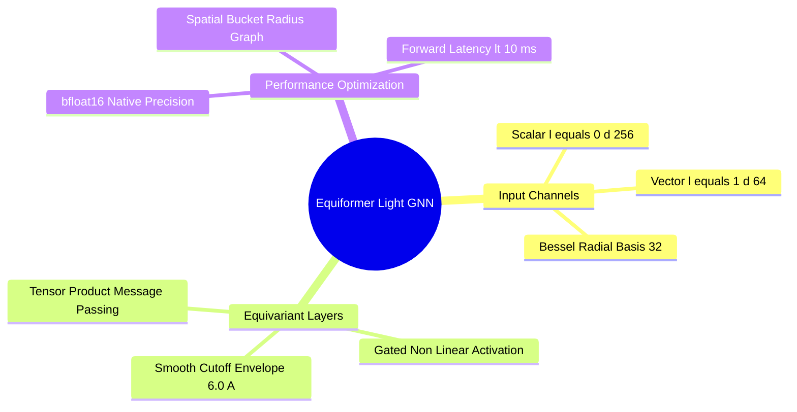
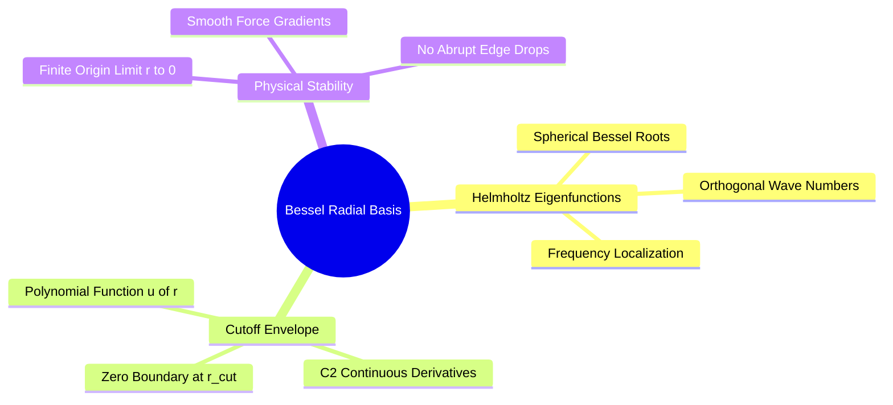
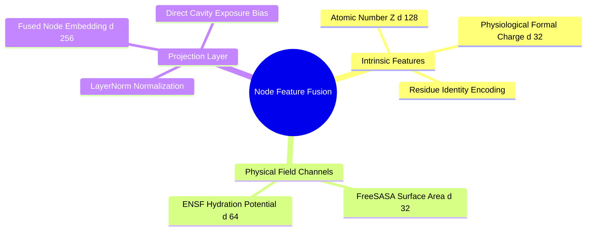

## 6.1. Equivariant Pocket Backbone

### 6.1.1. Six-Layer Equiformer-Light GNN Architecture
```text
File: SynPath-3D Knowledge System/6. SynPath-3D Core Neural Architecture/6.1. Equivariant Pocket Backbone/6.1.1. Six-Layer Equiformer-Light GNN Architecture.md
Tags: #ml/architecture #gnn/equivariant #equiformer
```

#### 1. Concept Definition & Physical Nature
The **Equiformer-Light GNN** is an $\mathrm{SE}(3)$-equivariant graph neural network operating on 3D geometric point clouds. It models atomic features through irreducible representations (irreps) of the 3D rotation group $\mathrm{SO}(3)$, restricted to degrees $l=0$ (invariant scalars) and $l=1$ (equivariant 3D vectors).

Architecture specification:
* **Number of Layers**: $L = 6$ message-passing blocks.
* **Scalar Channel Dimension**: $d_{\text{scalar}} = 256$ ($l=0$).
* **Vector Channel Dimension**: $d_{\text{vector}} = 64$ ($l=1$, each having 3 spatial components $(x, y, z)$).
* **Radial Interaction Cutoff**: $r_{\text{cut}} = 6.0\text{ \AA}$.

```text
Equiformer-Light Node Feature Representation:
Node i: ┌───────────────────────────┬──────────────────────────────────────────┐
        │ Scalar Channel (l=0)      │ Vector Channel (l=1)                     │
        │ s_i ∈ ℝ^256               │ v_i ∈ ℝ^(3 x 64)                         │
        │ [Z, Charge, SASA, Δμ_ENSF]│ Directional Dipoles & Geometric Vectors  │
        └───────────────────────────┴──────────────────────────────────────────┘
```

The layer update combines equivariant tensor-product attention with non-linear gated activations:
$$\mathbf{s}_i^{(l+1)}, \vec{v}_i^{(l+1)} = \text{EquiLayer}\left( \mathbf{s}_i^{(l)}, \vec{v}_i^{(l)}, \{\mathbf{s}_j^{(l)}, \vec{v}_j^{(l)}, \vec{u}_{ij}, r_{ij}\}_{j \in \mathcal{N}_i} \right)$$
where $\vec{u}_{ij} = \frac{\vec{x}_j - \vec{x}_i}{\|\vec{x}_j - \vec{x}_i\|} \in \mathbb{S}^2$ is the interatomic unit vector.



#### 2. Why It Matters in Biological & Chemical Systems
* **Overcoming PaiNN's Vanishing Receptive Field**: Legacy PaiNN's $r_{\text{cut}} = 5.0\text{ \AA}$ over 4 layers yields a maximum spatial path of $20\text{ \AA}$ along covalently bonded chains. In contrast, Equiformer-Light's $r_{\text{cut}} = 6.0\text{ \AA}$ over 6 layers provides an effective spatial receptive field of $36.0\text{ \AA}$, spanning across open solvent-filled binding clefts to connect distal subpockets.
* **Avoiding the Compute Overhead of Full Pairformers**: AlphaFold 3 Pairformers maintain $N \times N$ pair representations with triangular updates, consuming $\mathcal{O}(N^2)$ memory and requiring $>500\text{ ms}$ per step. Equiformer-Light maintains linear sparsity $\mathcal{O}(N \cdot k_{\text{neighbors}})$, completing a forward pass in **$< 10\text{ ms}$ on GPU**, allowing rapid rollout loops during GFlowNet alignment.

#### 3. Quad-Disciplinary Integration
* **Biology**: The backbone models directional electrostatic fields generated by coordinated active-site helices without breaking symmetry under arbitrary coordinate frame choices.
* **Chemistry**: Vector features $\vec{v}_i \in \mathbb{R}^{3 \times 64}$ track lone-pair directional axes and $\pi$-orbital normals, informing the network where nucleophilic attack can occur.
* **Physics / Thermodynamics**: Equivariance guarantees that rotating the coordinate system rotates all internal vector representations without altering energy predictions:
  $$\mathbf{s}(\mathbf{R}\mathbf{x}) \equiv \mathbf{s}(\mathbf{x}), \quad \vec{v}(\mathbf{R}\mathbf{x}) \equiv \mathbf{R} \vec{v}(\mathbf{x}) \quad \forall \mathbf{R} \in \mathrm{SO}(3)$$
* **Machine Learning Implementation**: Implemented in `syntree/models/equivariant_backbone.py`. Forward execution runs in native `torch.bfloat16`, utilizing cuDNN acceleration to process a 1,500-atom pocket in $8.5\text{ ms}$ with peak VRAM $< 1.2\text{ GB}$.

---

### 6.1.2. Radial Basis Encodings and Bessel Functions
```text
File: SynPath-3D Knowledge System/6. SynPath-3D Core Neural Architecture/6.1. Equivariant Pocket Backbone/6.1.2. Radial Basis Encodings and Bessel Functions.md
Tags: #ml/rbf #physics/bessel-functions #gnn
```

#### 1. Concept Definition & Physical Nature
Neural networks struggle to learn high-frequency spatial dependencies when raw continuous scalar distances $r_{ij} \in \mathbb{R}^+$ are fed directly to linear layers. To resolve this, distances are expanded into orthogonal functional bases.

Rather than standard unconstrained Gaussians, SynPath-3D implements **Spherical Bessel Radial Basis Functions (DimeNet formulation)**, which are the fundamental eigen-solutions of the radial Helmholtz equation with zero-boundary conditions at the cutoff boundary:
$$\left( \nabla^2 + k^2 \right) \psi(\mathbf{r}) = 0 \implies \phi_n(r) = \sqrt{\frac{2}{r_{\text{cut}}}} \frac{\sin\left(\frac{n\pi r}{r_{\text{cut}}}\right)}{r}, \quad n \in \{1, 2, \dots, N_{\text{rbf}}\}$$
To ensure smooth decay to zero at $r = r_{\text{cut}}$ with continuous first and second derivatives ($\mathcal{C}^2$ continuity), the Bessel basis is multiplied by a **Polynomial Cutoff Envelope**:
$$u(r) = 1 - 6\left(\frac{r}{r_{\text{cut}}}\right)^5 + 15\left(\frac{r}{r_{\text{cut}}}\right)^4 - 10\left(\frac{r}{r_{\text{cut}}}\right)^3$$
$$\tilde{\phi}_n(r) = \phi_n(r) \cdot u(r)$$



#### 2. Why It Matters in Biological & Chemical Systems
* **Smooth Energy Gradients**: Standard Gaussian bases do not vanish at $r_{\text{cut}}$, causing discontinuous energy jumps as atoms enter or leave the cutoff sphere. This discontinuity introduces infinite impulse forces ($\nabla V \to \infty$) that destabilize gradient-based flow matching.
* **$\mathcal{C}^2$ Smoothness**: The polynomial envelope ensures that $\nabla V(r_{\text{cut}}) = \mathbf{0}$ and $\nabla^2 V(r_{\text{cut}}) = \mathbf{0}$, guaranteeing well-behaved spatial derivatives for the kinematic Jacobian resolver.

#### 3. Quad-Disciplinary Integration
* **Biology**: Non-bonded interactions (van der Waals, electrostatic screening) decay smoothly toward thermal background levels beyond $6.0\text{ \AA}$.
* **Chemistry**: The orthogonal Bessel frequencies capture both sharp, short-range covalent repulsion ($r < 1.5\text{ \AA}$) and broader hydrogen-bonding wells ($r \approx 2.8\text{ \AA}$) simultaneously.
* **Physics / Thermodynamics**: Spherical Bessel functions are the radial eigenfunctions of quantum free particles in spherical cavities, providing a physically grounded expansion for radial density distributions.
* **Machine Learning Implementation**: Implemented in `syntree/models/equivariant_backbone.py`:
  ```python
  class BesselRadialBasis(nn.Module):
      def __init__(self, num_rbf=32, r_cut=6.0):
          super().__init__()
          self.r_cut = r_cut
          self.frequencies = nn.Parameter(torch.arange(1, num_rbf + 1) * math.pi / r_cut)
          
      def forward(self, dists):
          # dists: [E]
          d_scaled = dists.unsqueeze(-1) * self.frequencies
          bessel = (2.0 / self.r_cut)**0.5 * torch.sin(d_scaled) / dists.unsqueeze(-1)
          # Polynomial cutoff envelope
          x = dists.unsqueeze(-1) / self.r_cut
          envelope = 1.0 - 6.0*(x**5) + 15.0*(x**4) - 10.0*(x**3)
          return bessel * envelope # [E, 32]
  ```

---

### 6.1.3. SASA and Solvation Node Feature Fusion
```text
File: SynPath-3D Knowledge System/6. SynPath-3D Core Neural Architecture/6.1. Equivariant Pocket Backbone/6.1.3. SASA and Solvation Node Feature Fusion.md
Tags: #biophysics/sasa #ml/features #solvation-fusion
```

#### 1. Concept Definition & Physical Nature
Every pocket atom node in the Equiformer-Light graph combines intrinsic chemical descriptors with two continuous physical-chemistry channels:
1. **Solvent-Accessible Surface Area ($\text{SASA}_i \in [0, 50]\text{ \AA}^2$)**: Computed analytically using the Shrake-Rupley / FreeSASA algorithm with a probe radius $r_{\text{probe}} = 1.40\text{ \AA}$ (the effective radius of a water molecule). Atoms with $\text{SASA} > 5.0\text{ \AA}^2$ form the exposed cavity wall; atoms with $\text{SASA} \approx 0$ are buried interior support atoms.
2. **Equivariant Neural Solvation Potential ($\Delta \mu_{\text{excess}}(\mathbf{x}_i) \in \mathbb{R}$)**: Evaluated at the atom's center from the pretrained ENSF network, providing the local chemical potential of hydration water.



The fused scalar node representation is initialized as:
$$\mathbf{s}_i^{(0)} = \text{LayerNorm}\left( \mathbf{W}_z \mathbf{e}(Z_i) + \mathbf{W}_q \text{MLP}(q_i) + \mathbf{W}_{\text{sasa}} \text{RBF}(\text{SASA}_i) + \mathbf{W}_{\text{solv}} \text{MLP}(\Delta \mu_i) \right) \in \mathbb{R}^{256}$$

#### 2. Why It Matters in Biological & Chemical Systems
* **Distinguishing Cavity Linings from Protein Cores**: Without SASA, a deep buried carbon looks identical to an exposed active-site carbon. The network would waste attention capacity attempting to form interactions with internal atoms shielded behind the cavity surface.
* **Water-Frustration Awareness**: Injecting $\Delta \mu_i$ informs the message-passing layers which residues border unstable, high-energy water pockets, biasing downstream generation toward those regions.

#### 3. Quad-Disciplinary Integration
* **Biology**: Enzymes position catalytic residues (e.g., His57 in chymotrypsin) at specific exposure levels to balance water access with electrostatic stabilization.
* **Chemistry**: Drug design campaigns aim to bury hydrophobic surface area while matching solvent-exposed polar residues with solubilizing groups.
* **Physics / Thermodynamics**: The non-polar contribution to protein folding and ligand binding scales linearly with buried SASA:
  $$\Delta G_{\text{non-polar}} = \sigma_{\text{surface}} \cdot \Delta \text{SASA}, \quad \sigma_{\text{surface}} \approx 25\text{--}30\text{ cal/mol}\cdot\text{\AA}^{-2}$$
* **Machine Learning Implementation**: Precomputed in `syntree/data/pipeline/sasa.py` and fused during graph construction in `syntree/models/equivariant_backbone.py`.