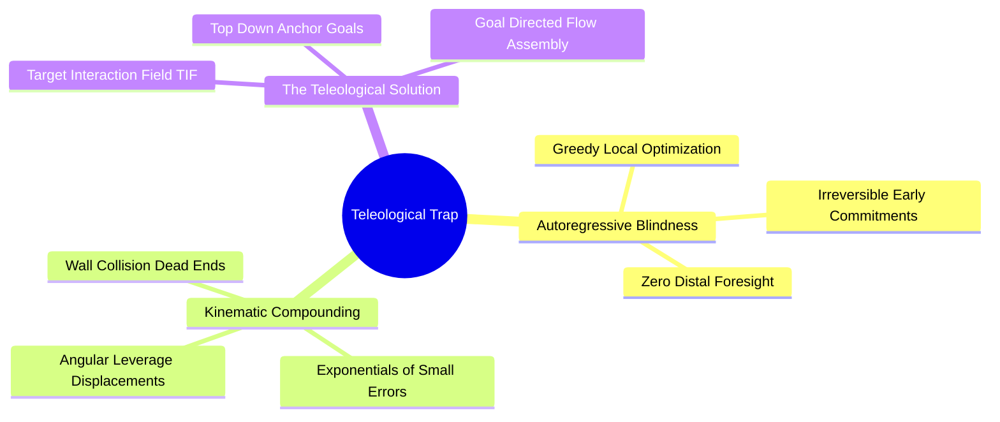
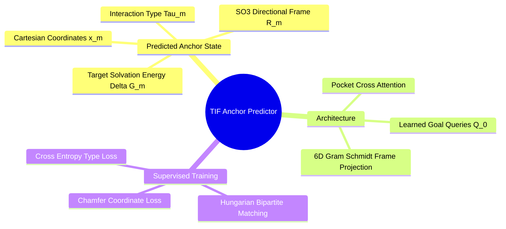
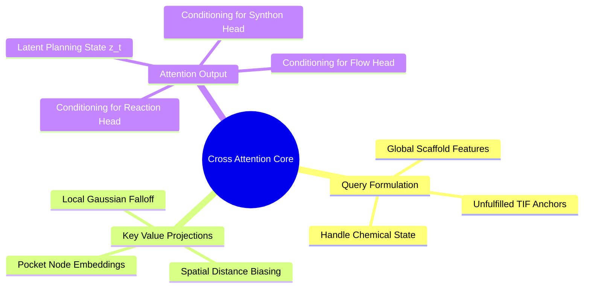

## 6.2. Teleological Target Interaction Field

### 6.2.1. The Teleological Horizon Trap in SBDD
```text
File: SynPath-3D Knowledge System/6. SynPath-3D Core Neural Architecture/6.2. Teleological Target Interaction Field/6.2.1. The Teleological Horizon Trap in SBDD.md
Tags: #sbdd/teleology #generative-models #algorithms #planning
```

#### 1. Concept Definition & Physical Nature
The **Teleological Horizon Trap** is a failure mode inherent to forward-growing autoregressive molecular generative models:
> An algorithm growing a molecule outward step-by-step from an initial fragment must make binding decisions with no mathematical guarantee that subsequent steps can reach or satisfy distal functional targets.

```text
The Teleological Horizon Trap:
  Step 0: Choose Seed Anchor ──► [Hinge Binder]
  Step 1: Choose Linker       ──► Makes local discrete decision; blind to distal site.
  Step 2: Choose Synthon      ──► Reaches into narrow channel, but orientation is off.
  Step 3: Attempt Coupling    ──► FAILS! Misses Catalytic Dyad by 2.5 Å or clashes.
  RESULT: Trajectory pruned, emergency STOP emitted, or broken chemistry generated.
```

In structural biology, drug molecules are **teleological**: their bioactive conformation is selected by the requirement to satisfy multiple, mutually constrained subpockets simultaneously. 

A linear MDP growing outward from a single seed makes irreversible topological choices at Step 1 that often close off viable paths to distal binding regions, causing the search tree to stall in local minima.



#### 2. Why It Matters in Biological & Chemical Systems
Most pharmaceutical targets have elongated or branched binding clefts:
* **Kinases**: Span from the hinge donor-acceptor site ($x_1$) through the gatekeeper into the deep hydrophobic back-pocket ($x_2$), requiring a span of $12\text{ to }16\text{ \AA}$.
* **Proteases**: Span catalytic subpockets ($S_1, S_2, S_1', S_2'$) arranged symmetrically across an active center.

A generative model that does not plan for distal interaction sites fails to bridge these multi-subpocket architectures.

#### 3. Quad-Disciplinary Integration
* **Biology**: Evolution optimizes multi-domain proteins through cooperative allosteric networks that stabilize multiple binding interfaces simultaneously.
* **Chemistry**: Fragment-based lead discovery (FBLD) uses **fragment linking**: researchers identify two distinct chemical fragments binding to adjacent subpockets, then synthesize a linker to connect them.
* **Physics / Thermodynamics**: Free energy additivity in bidentate binding exhibits chelate cooperativity:
  $$\Delta G_{\text{bidentate}} = \Delta G_A + \Delta G_B + \Delta G_{\text{linker}} \quad (\text{where } \Delta G_{\text{linker}} \approx -T\Delta S_{\text{trans/rot}} \approx -3 \text{ to } -5\text{ kcal/mol})$$
  Connecting two separate binders with an unstrained linker yields affinities in the low nanomolar range.
* **Machine Learning Implementation**: SynPath-3D resolves the teleological trap through the **Target-Interaction Field (TIF)** module in `syntree/models/tif_head.py`. The model decodes distal target anchors before forward synthon assembly begins, using them as guidance targets for the downstream flow matching heads.

---

### 6.2.2. Target Interaction Field Anchor Prediction
```text
File: SynPath-3D Knowledge System/6. SynPath-3D Core Neural Architecture/6.2. Teleological Target Interaction Field/6.2.2. Target Interaction Field Anchor Prediction.md
Tags: #ml/architecture #pharmacophore #anchors #tif-head
```

#### 1. Concept Definition & Physical Nature
The **Target-Interaction Field (TIF) Anchor Predictor** is an invariant transformer module that processes the pocket representations $\mathbf{h}_p$ and predicts up to $M=5$ target interaction anchors:
$$\mathcal{Y}^* = \{(\vec{x}_m, \mathbf{R}_m, \vec{\tau}_m, \Delta G_m)\}_{m=1}^M$$
* $\vec{x}_m \in \mathbb{R}^3$: Cartesian location where a ligand functional group must be placed.
* $\mathbf{R}_m \in \mathrm{SO}(3)$: Orthonormal orientation frame defining the directional vector of interaction (e.g., hydrogen-bond axis, aromatic ring normal).
* $\vec{\tau}_m \in \Delta^6$: Categorical interaction type distribution:
  $$\vec{\tau}_m \in \{\text{H-Donor}, \, \text{H-Acceptor}, \, \text{Aromatic}, \, \text{Hydrophobic}, \, \text{Cationic}, \, \text{Anionic}\}$$
* $\Delta G_m \in \mathbb{R}$: Estimated free energy benefit of satisfying this interaction, derived from the local ENSF potential.



Architecture mechanics:
1. Initialize $M=5$ learned query tokens $\mathbf{Q}_0 \in \mathbb{R}^{M \times 256}$.
2. Cross-attend to pocket node embeddings $\mathbf{h}_p \in \mathbb{R}^{N_p \times 256}$:
   $$\mathbf{Q} = \text{TransformerDecoderBlocks}(\mathbf{Q}_0, \mathbf{h}_p)$$
3. Head outputs:
   - Coordinates: $\vec{x}_m = \vec{x}_{\text{pocket center}} + \text{MLP}_{\text{coord}}(\mathbf{q}_m) \in \mathbb{R}^3$.
   - Direction frame: compute 6D continuous representation, then apply Gram-Schmidt orthogonalization:
     $$\mathbf{R}_m = \text{GramSchmidt}\left( \mathbf{W}_{\text{frame}}\mathbf{q}_m \in \mathbb{R}^{3 \times 2} \right) \in \mathrm{SO}(3)$$
   - Type logits: $\vec{\tau}_m = \text{Softmax}(\mathbf{W}_{\text{type}}\mathbf{q}_m) \in \Delta^6$.

#### 2. Why It Matters in Biological & Chemical Systems
The predicted anchor set $\mathcal{Y}^*$ functions as an internal target pharmacophore. 

During subsequent synthon assembly steps, the model selects building blocks and adjusts dihedrals to minimize the distance between the growing ligand's functional groups and these target anchors. This provides the policy with **distal foresight**, preventing early-stage dead ends.

#### 3. Quad-Disciplinary Integration
* **Biology**: Pharmacophore modeling in classical computational chemistry identifies structural features essential for biological activity across multiple ligands.
* **Chemistry**: Medicinal chemists design linkers to hold functional pharmacophores in defined spatial arrangements matching the receptor.
* **Physics / Thermodynamics**: Anchors correspond to local minima in the grand-canonical free-energy landscape of the receptor cavity.
* **Machine Learning Implementation**: In `syntree/models/tif_head.py`, the anchor head is trained during Stage 1 using **Hungarian matching loss** against ground-truth ligand pharmacophores extracted via RDKit `rdMolChemicalFeatures`:
  $$\mathcal{L}_{\text{TIF}} = \min_{\sigma \in \mathcal{S}_M} \sum_{m=1}^M \left[ \|\vec{x}_m - \vec{x}_{\sigma(m)}^*\|^2 + \text{CE}(\vec{\tau}_m, \vec{\tau}_{\sigma(m)}^*) \right]$$

---

### 6.2.3. Spatial Invariant Cross-Attention Core
```text
File: SynPath-3D Knowledge System/6. SynPath-3D Core Neural Architecture/6.2. Teleological Target Interaction Field/6.2.3. Spatial Invariant Cross-Attention Core.md
Tags: #ml/attention #spatial-cross-attention #architecture
```

#### 1. Concept Definition & Physical Nature
The **Spatial Invariant Cross-Attention Core** integrates information across three structural components during forward molecular assembly:
1. The **current reacting handle ($u$)** on the growing scaffold.
2. The **SE(3)-equivariant pocket nodes ($\mathbf{h}_p$)**.
3. The **unfulfilled target anchors ($\mathcal{Y}^*$)** from the TIF head.

```text
Information Flow in the Cross-Attention Core:
   Reacting Handle State (q_u) ────┐
   Global Scaffold Features ───────┼──► Fused Query Q ∈ ℝ^(1 x 256)
   Unfulfilled TIF Anchors ────────┘           │
                                               ▼
                         Multi-Head Attention (H=8, d_k=32)
                                   ▲           ▲
                                   │           │
       Pocket Nodes (h_p) ─────────┴───────────┘ ◄── Spatial Distance Bias RBF(||x_j - x_u||)
                                   │
                                   ▼
                         Latent Planning State z_t ∈ ℝ^256
```

Mathematical Formulation:
1. Query vector construction:
   $$\mathbf{q}_u = \text{LayerNorm}\left( \mathbf{W}_h [\mathbf{h}_{\text{chem}, u} \mathbin{\Vert} \text{GlobalFeatures}(\mathcal{M}_t)] + \sum_{m \in \text{unfulfilled}} \mathbf{W}_{\text{anc}} [\mathbf{a}_m \mathbin{\Vert} \text{RBF}(\|\vec{x}_m - \vec{x}_u\|)] \right)$$
2. Key and Value vectors from pocket nodes $j \in \mathcal{P}$:
   $$\mathbf{k}_j = \mathbf{h}_{p, j} + \text{MLP}_{\text{dist}}(\text{RBF}(\|\vec{x}_j - \vec{x}_u\|)), \quad \mathbf{v}_j = \mathbf{h}_{p, j}$$
3. Multi-head cross-attention ($H=8$ heads, head dimension $d_k = 32$):
   $$\alpha_{uj} = \frac{\exp\left( \frac{\mathbf{q}_u^T \mathbf{k}_j}{\sqrt{d_k}} - \gamma_{\text{dist}} \|\vec{x}_j - \vec{x}_u\|^2 \right)}{\sum_{j'} \exp\left( \frac{\mathbf{q}_u^T \mathbf{k}_{j'}}{\sqrt{d_k}} - \gamma_{\text{dist}} \|\vec{x}_{j'} - \vec{x}_u\|^2 \right)}$$
   $$\mathbf{z}_t = \sum_{j \in \mathcal{P}} \alpha_{uj} \mathbf{v}_j \in \mathbb{R}^{256}$$



#### 2. Why It Matters in Biological & Chemical Systems
This attention mechanism couples spatial and chemical context:
* **Spatial Distance Bias ($- \gamma_{\text{dist}} \|\vec{x}_j - \vec{x}_u\|^2$)**: Enforces local geometric focus, preventing the reacting handle from attending to residues on the opposite side of the protein.
* **TIF Anchor Bias**: Pulls attention toward unfulfilled distal anchors, encouraging the policy to choose synthons that advance toward those targets.

#### 3. Quad-Disciplinary Integration
* **Biology**: Enzymatic assembly cascades organize substrate intermediates by channeling them along functional electro-static gradients between sub-active sites.
* **Chemistry**: The reactivity of a functional group is modulated by the electrostatic potential and steric accessibility of its local microenvironment.
* **Physics / Thermodynamics**: Invariant point attention preserves rotational and translational symmetry: rotating the entire system leaves the attention weights $\alpha_{uj}$ invariant.
* **Machine Learning Implementation**: Implemented in `syntree/models/policy.py`. Operates in native `bfloat16`, evaluating attention in $< 2.0\text{ ms}$ on GPU.